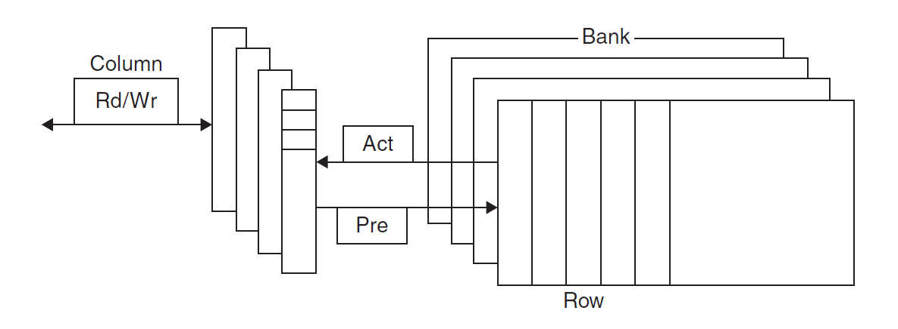
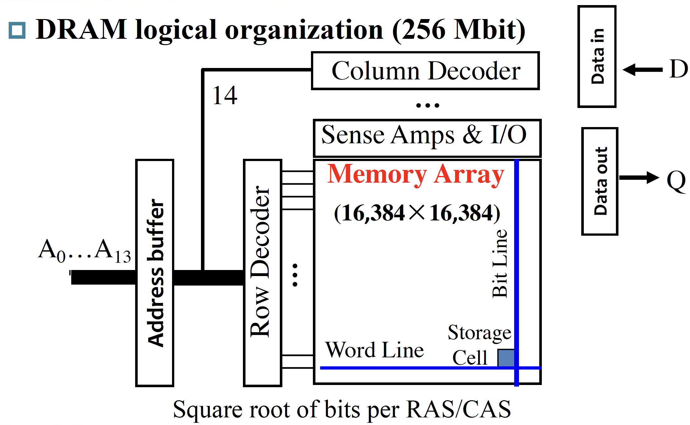
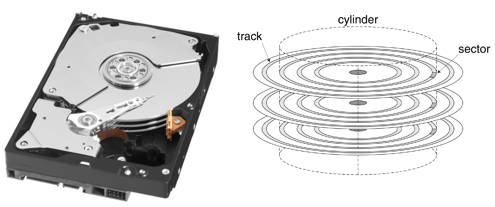

---
hide:
  #- navigation # 显示右
  #- toc #显示左
  - footer
  - feedback
comments: true
---

# Chapter 5 : Memory Hierarchy

## Memory Technologies

内存中常用的四大工艺如下：

!!! note "四大工艺"

	=== "SRAM"
	
		SRAM（静态随机访问存储器）具有如下特性：
		
		- 它只有一个访问端口，具备读和写的能力
	    - 数据以一对反相门（Inverting Gates）来存储
		- 尽管读和写的访问时间不同，访问任何数据所需的时间是固定的
		- 由于无需刷新 (Refresh)，因此访问时间接近于处理器的周期时间，读写非常快
		- 通常用 6-8 个晶体管表示一个位，用于防止读取对存储信息的干扰，也因此比 DRAM 占用更多空间
		- 耗电少
		
		=== "Transistor"
		
			
		
		=== "Invertor(CMOS)"
		
			
	
	=== "DRAM"
	
		DRAM（动态随机访问存储器）具有如下特性：
		
		- 1 位数据以电荷的形式被存储在 1 个电容中
	        - 因此需要周期性地对电容**刷新**（Refresh）以长时间保存电荷，具体做法就是读取并且写回该数据
		- 比较小型，但是因为要不断刷新所以比 SRAM 慢很多（大概能慢 5 到 10 倍）
			- 为了减少刷新对访问时间的占用，DRAM 通过两级译码结构实现一次性刷新一整行的数据（这种行结构也有助于提升性能）
		- 用 1 个晶体管对数据（电荷）进行访问（读 / 写）（晶体管用比 SRAM 少，因此更便宜）
	    - DRAM 内部被划分为多个**存储体**（Memory Bank），每个存储体都有一些**行缓冲器**（Row Buffer），这样可以实现对同一地址的同步访问
		    - 假如有 n 个存储体，在一个访问时间内便能轮换访问 n 个存储体，使得带宽提升了 n 倍，这种轮换访问方法被称为地址交错 (Address Interleaving)
			
			
		
		其读写操作如下所示：
		
		
		
		=== "Write"
		
			根据输入数据（0/1）将当前位线（Bit line）设置为高/低电平，并将当前字线（Word Line）设置为高电平对电容充电
		
		=== "Read"
		
			现将每一条位线都预充电（Precharge）到一个中间状态（即介于高电平和低电平之间），然后将字线设置为高电平对电容充电，每个电容或是向位线放电，或是由位线充电。放电位线电压就上升一点，充电位线电压就下降一点，由放大器（Sence Amplifier）检测到电压波动并输出结果（即原来电容存储的是 0 还是 1）
		
		DRAM 的架构如下图所示：
		
		
		
		DRAM 有如下类别：
		
		- SDRAM（同步 DRAM）：通过一个时钟来消除同步内存和寄存器所需的时间
		- DDR（Double Data Rate）DRAM：能在时钟的上升沿和下降沿中进行数据传输，从而提升了一倍的带宽 (Bandwidth)
		- QDR（Quad Data Rate）DRAM：将 DDR DRAM 的输入和输出分开
		- 双内联内存模块 (Dual Inline Memory Module)
	
	=== "Flash"
	
		闪存（Flash Storage）具有如下特性：
		
		- 是一种非易失性（即断电数据也不会丢失）、电子可擦除、可编程只读的半导体存储器 (EEPROM)
		- 比磁盘快百倍到千倍
		- 更小型、耗电更小，但也更贵（介于地盘和 DRAM）
		- 写操作可能会磨损存储器内的数据
			- 为减缓磨损，闪存会用一个控制器来分散 (Spread) 写操作到被更少使用的区域，这称为**磨损均衡**(Wear Leveling)
		
		闪存有如下几类：
		
		- 或非闪存：每一个 cell 像是一个或非门
			- 随机读写更快
			- 通常用于存储嵌入式系统的指令
		- 与非闪存：每一个 cell 像是一个与非门
			- 更为密集，但是以块为单位进行操作
			- 更为便宜
			- 通常用于存储 USB 密钥、媒体数据等
	
	=== "Disk"
	
		磁盘（Disk）是一个非易失性、利用磁技术的存储器，由一组绕轴旋转的金属盘片（Platter）构成，盘片上覆有磁记录材料，通过一个读写头（Read-Write Head）来读写信息，整个驱动器被密封在磁盘内部
		
		- 迹（Track）：磁盘表面上的同心圆
		- 区（Sector）：构成迹的某个片段，是能够被读写的最小单位的信息
			- 每个区记录了区的 ID、数据和纠错码（Error Correcting Code, ECC，用于隐藏和记录错误）
		- 柱面（Cylinder）：读写头下所有的迹（形成一个柱面）
		- 磁材料上记录的序列：区号、间隔、包含纠错码的区信息、间隔、下个区的编号 ...
		- 寻找（Seek）：定位读写头到要被访问的迹的过程
		- 旋转时延（Rotation Latency）：将要访问的区旋转至读写头下所需的时间，通常假设为旋转时间的一半
		- 传输时间（Transfer Time）
		
		
		
		如果要访问其中的一个区，其大致步骤如下：
		
		- 等待前一个访问
		- 通过移动读写头寻找被访问的迹
		- 旋转时延
		- 数据传输
***
## Memory Hierarchy Introduction

