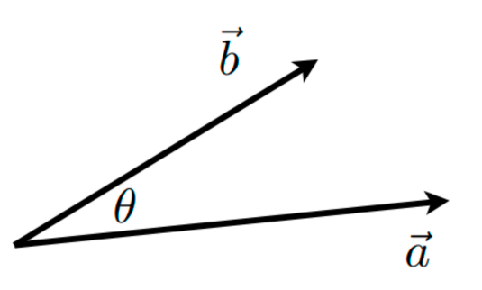
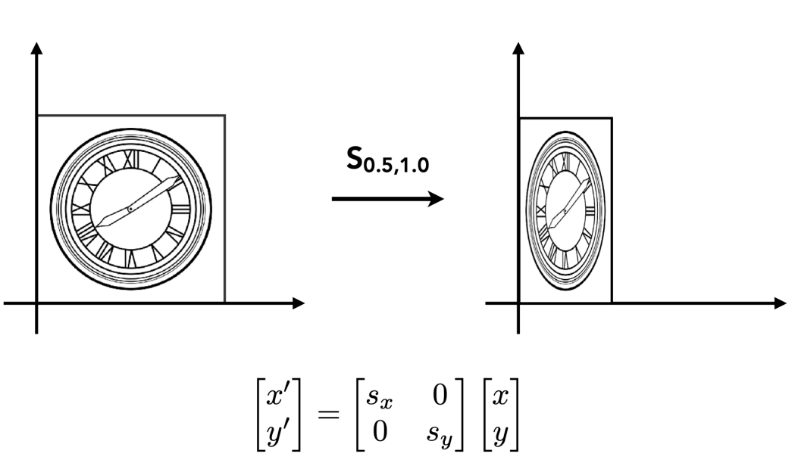
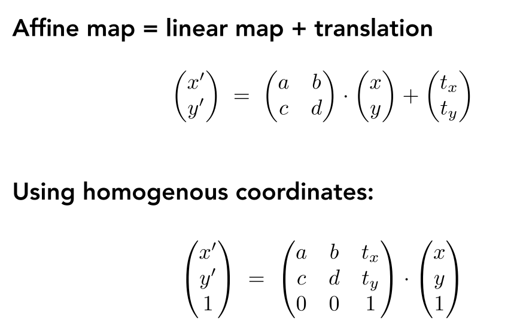
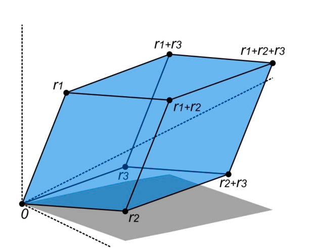
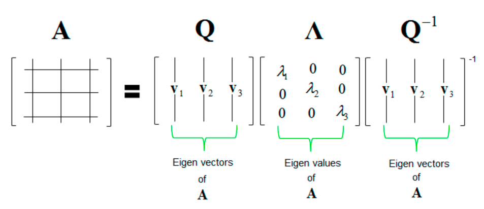

# Chapter 01: Introduction

## Review of Linear Algebra

### Vectors

向量通常写作 $\vec{a}$，粗体 $\mathbf{a}$，或用起始和终止断点表示 $\overrightarrow{AB} = B - A$

- 能同时表示方向和长度
- 没有绝对的起始位置

***

#### Normalization

- 向量的大小/长度（Magnitude）记为 $\|\mathbf{a}\|$
- 单位向量（Unit Vector）：大小为 1 的向量
    - 计算任意非零向量的单位向量：$\hat{a} = \mathbf{a} / \|\mathbf{a}\|$
    - 一般用于表示方向

***

#### Addition

- 几何上，平行四边形法则或三角形法则

- 代数上，就是坐标的相加

***

#### Dot Product

- $\mathbf{a} \cdot \mathbf{b} = \|\mathbf{a}\|\|\mathbf{b}\| \cos \theta$
- $\cos \theta = \dfrac{\mathbf{a} \cdot \mathbf{b}}{\|\mathbf{a}\|\|\mathbf{b}\|}$
- 对于单位向量，$\cos \theta = \hat{a} \cdot \hat{b}$

点积可以用于计算一个向量在另一个向量上的投影（Projection）：

- $\mathbf{b}_\perp$：$\mathbf{b}$ 在 $\mathbf{a}$ 上的投影
	- $\mathbf{b}_\perp$ 必须和 $\mathbf{a}$（或 $\hat{a}$）在同一直线上，$\mathbf{b}_\perp=k\mathbf{a}$
		- 大小 $k = \|\mathbf{b}_\perp\| = \|\mathbf{b}\| \cos \theta$

***

### Matrix

- 矩阵是一个 $m \times n$（$m$ 行 $n$ 列）的数组
- 带标量的加法和乘法是逐元素做的

***

#### Multiplication

- 矩阵-矩阵乘法：$A \times B$ 中，$A$（大小为 $M \times N$）的列数必须和 $B$（大小为 $N \times P$）的行数相等（结果大小为 $M \times P$）

    $$
    \begin{pmatrix}1 & 3 \\ 5 & 2 \\ 0 & 4\end{pmatrix} \begin{pmatrix}3 & 6 & 9 & 4 \\ 2 & 7 & 8 & 3\end{pmatrix} = \begin{pmatrix}9 & 27 & 33 & 13 \\ 19 & 44 & 61 & 26 \\ 8 & 28 & 32 & 12\end{pmatrix}
    $$

    - 乘积中元素 $(i, j)$ 是 $A$ 的第 $i$ 行和 $B$ 的第 $j$ 列的点积
    - 性质：
        - 无交换律，$AB$ 和 $BA$ 一般是不同的
        - 结合律和分配律
            - $(AB)C = A(BC)$
            - $A(B+C) = AB + AC$
            - $(A+B)C = AC + BC$

- 矩阵-向量乘法：将向量看作是一个只有一列的矩阵（$m \times 1$），乘法的结果也是一个向量

	$$
	\begin{pmatrix}-1 & 0 \\ 0 & 1\end{pmatrix} \begin{pmatrix}x \\ y\end{pmatrix} = \begin{pmatrix}-x \\ y\end{pmatrix}
	$$

- 每一个矩阵都可以被视为一个几何变换

!!! note "Geometric Transformation"

	=== "Scale Matrix"
	
		
	
	=== "Reflection Matrix"
	
		
	
	=== "Shear Matrix"
	
		
	
	=== "Rotation Matrix"
	
		
	
	=== "Affine Transformation"
	
		

***

#### Inverse

- $AA^{-1} = A^{-1}A = I$
- $(AB)^{-1} = B^{-1} A^{-1}$

***

#### Determinant

- 计算公式：$\det(A) = \sum\limits_{\sigma \in S_n} \left(\text{sgn} (\sigma) \prod\limits_{i=1}^n a_{i, \sigma_i}\right)$，其中 $S_n$ 是集合 $\{1, 2, \dots, n\}$ 的全排列

    

    - 几何意义：行列式是 n 维平行体的体积

    

    ***

#### Eigenvalue and Eigenvector

- $Ax = \lambda x\ (A\in \mathbb{R}^{n \times n}, x \neq 0)$，其中 $x$ 是 $A$ 的特征向量，对应的特征值为 $\lambda$

- 几何意义：假如矩阵乘上某个向量后只改变这个向量的大小，方向没变（可以是相反方向），那么这个向量就是矩阵的特征向量，对应的缩放比例就是特征值

- 特征分解（Eigen Decomposition）：

    

- 应用——主成分分析（Principal Component Analysis）：找到数据的主方向

    

    - 主成分 = $A^T A$ 的特征向量

		