# Chapter 2: Image Formation

## Camera and lens

### Image Formation

成像的第一步就是理解相机的原理，一种最简单的方法就是直接把一片薄膜（Film）放在物体面前，但是，由于我们没法做到物体上一点和薄膜上的点一一映射，因此这样的方法是不可行的。

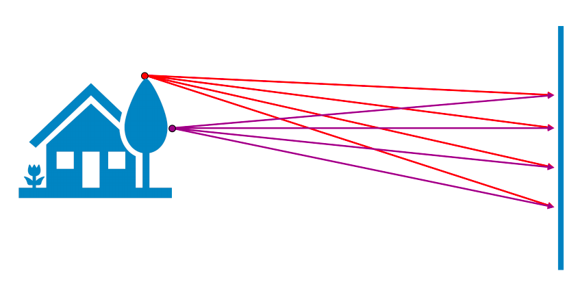

***

### Pinhole Camera

由于直接把一片薄膜放在物体面前的方法不可行，我们在物体和薄膜之间加一块挡板，以阻挡大多数的光线，由此得到了一台简陋的**针孔相机**（Pinhole Camera），中间的开口被称为**光圈**（Aperture）。

***

### Shrinking the Aperture

由物理常识可得，**光圈越小，成像就越清晰**。但这并不代表着光圈越小越好，这是因为：

- 光圈越小，通过的光也就越少，成像就会变得很暗
- **衍射**（Diffraction）效应：当光圈尺寸和光的波长相当甚至更小时，通过光圈后会偏离直线传播路径并发生弯曲扩散，自然难以形成清晰的像

***

### Lens

**透镜**（Lens）（或镜头）有着和针孔相同的投影原理，但是它能让更多的光进来，并让这些光汇聚起来。

成像公式：$\frac{1}{i}+\frac{1}{o}=\frac{1}{f}$，其中 $i,o,f$ 分别为像距、物距和**焦距**（Focal Length）

- 当 $o\rightarrow\infty,f=i$

  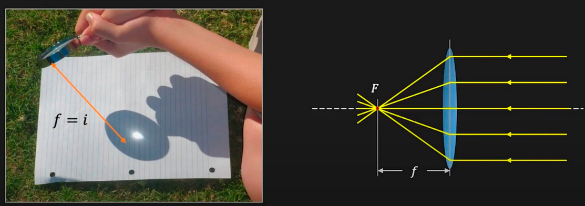

- 透镜可用于**图像放大**（Image Magnification），放大率为 $m=\frac{h_i}{h_0}=\frac{i}{o}$

  ![[image-20260102110723288]](../../../assets/image-20260102110723288.png)

- 相机通过改变焦距来实现图像放大，因为 $\frac{1}{i}+\frac{1}{o}=\frac{1}{f}\Rightarrow i=\frac{of}{o-f}\Rightarrow m=\frac{i}{o}=\frac{f}{o-f}$，因此 $f$ 越大，分子越大，分母越小，$m$ 显然会变大

	

	- 从另一个角度看，调整焦距的同时也改变了**视场**（Field of View, **FOV**)：焦距越长，视角更窄；焦距越短，视角越宽。当然，除焦距外，FOV 还取决于传感器的大小
	
		

- 在相机中，**光圈**是指镜头的受光区域，一般用**镜头直径**区分。可通过增减光圈大小来控制图像亮度。一种更方便的表示光圈的方法是使用一个关于焦距的分数，即 $D=\frac{f}{N}$，其中 $N$ 为**焦比**（F-number）。比如对于 50mm 的焦距，当光圈完全打开时，焦比为 1.8（此时光圈直径为 27.8mm）。

	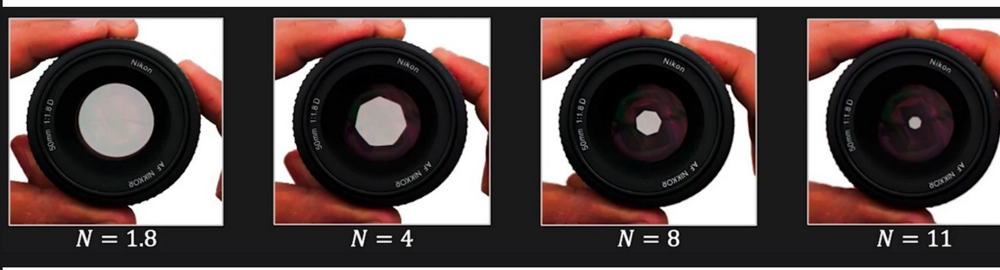

***

#### Lens Defocus

- 假设物体位于黄色虚线处时，物体的光线进入透镜后正好在底片处汇聚成一点，因此成像很清晰

	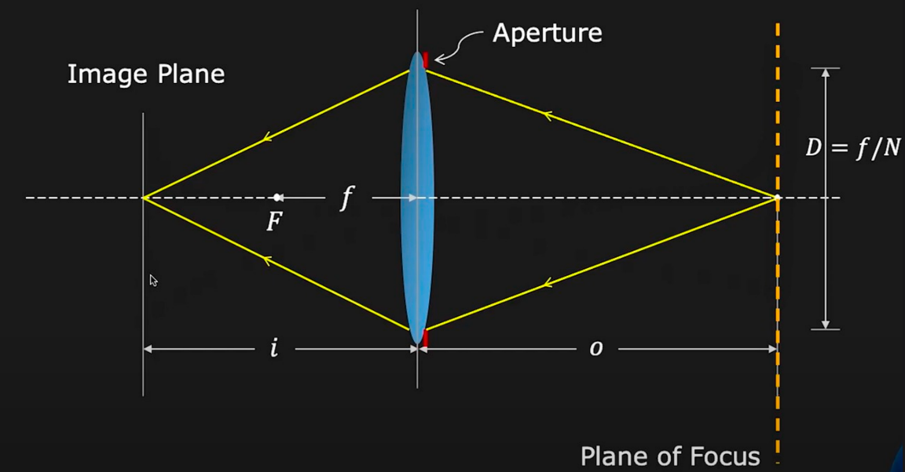

- 但如果稍微改变物体的位置，比如靠近些，那么对应的像就会远离镜头（同时也远离底片，符合高斯成像公式的约束），来自物体的光在底片处就会形成一片光斑（**模糊圈**（Blue Circle）或**弥散圈**（Circle of Confusion）），如图中加粗的橙色实线部分所示

	
	
	- 利用相似三角形能解出 $b$：$\dfrac{b}{D} = \dfrac{|i' - i|}{i'} \Rightarrow b = \dfrac{D}{i'}|i' - i|, b \propto D \propto \dfrac{1}{N}$

当物体位置不动时，要想对好焦，可以从以下几方面考虑：

- 只移动底片（右上）
- 只移动镜头位置（左下）
- 两者也可同时移动（右下）

**景深**（Depth of Field, **DoF**）：一种物体距离范围，在范围内（即模糊度 b 小于像素尺寸的范围）的图像能够对好焦。其原理图如下：

- $c = \dfrac{f^2(o - o_1)}{No_1(o - f)} = \dfrac{f^2(o_2 - o)}{No_2(o - f)}$
- DoF = $o_2 - o_1 = \dfrac{2of^2cN(o - f)}{f^4 - c^2N^2(o - f)^2}$
- **减小光圈直径（增大焦比）会增加 DoF**

??? question "How to blur the background?"

	- 更大的光圈
	- 更长的焦距
	- 前景要近
	- 背景要远

***

## Geometric Image Formation

相机模型描述了三维世界和二维图像之间的几何关系。

两类投影模型：

- **正射投影**（Orthographic Projection）
- **透视投影**（Perspective Projection）

***

### Perspective Projection

**透视投影**（Perspective Projection）：三维世界坐标 $\rightarrow$ 二维图像坐标

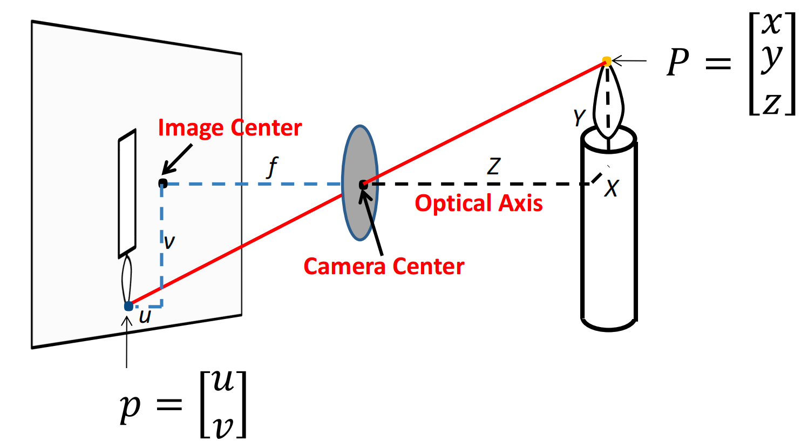

$$
p = \begin{bmatrix}u \\ v\end{bmatrix} = \begin{bmatrix}\dfrac{fx}{z} \\ \dfrac{fy}{z}\end{bmatrix}
$$

!!! note "Homogeneous Coordinates"

	- 非齐次坐标 $\mathbf{x}$ $\rightarrow$ 齐次坐标 $\tilde{\mathbf{x}}$
	
		$$
		\begin{aligned}
		\tilde{\mathbf{x}} = \begin{pmatrix}\tilde{x} \\ \tilde{y} \\ \tilde{w}\end{pmatrix} = \begin{pmatrix}x \\ y \\ 1\end{pmatrix} = \begin{pmatrix}\mathbf{x} \\ 1\end{pmatrix} = \bar{\mathbf{x}} \\
		\tilde{\mathbf{x}} = \begin{pmatrix}\tilde{x} \\ \tilde{y} \\ \tilde{z} \\ \tilde{w}\end{pmatrix} = \begin{pmatrix}x \\ y \\ z \\ 1\end{pmatrix} = \begin{pmatrix}\mathbf{x} \\ 1\end{pmatrix} = \bar{\mathbf{x}}
		\end{aligned}
		$$
	
		- 其中 $\bar{\mathbf{x}}$ 为**增广向量**（Augmented Vector）
	
	- 齐次坐标 $\rightarrow$ 非齐次坐标
	
		$$
		\begin{aligned}
		\bar{\mathbf{x}} = \begin{pmatrix}\mathbf{x} \\ 1\end{pmatrix} = \begin{pmatrix}x \\ y \\ 1\end{pmatrix} = \dfrac{1}{\tilde{w}} \tilde{\mathbf{x}} = \dfrac{1}{\tilde{w}} \begin{pmatrix}\tilde{x} \\ \tilde{y} \\ \tilde{w}\end{pmatrix} = \begin{pmatrix}\tilde{x} / \tilde{w}\\ \tilde{y} / \tilde{w}\\ 1\end{pmatrix} \\
		\bar{\mathbf{x}} = \begin{pmatrix}\mathbf{x} \\ 1\end{pmatrix} = \begin{pmatrix}x \\ y \\ z \\1\end{pmatrix} = \dfrac{1}{\tilde{w}} \tilde{\mathbf{x}} = \dfrac{1}{\tilde{w}} \begin{pmatrix}\tilde{x} \\ \tilde{y} \\ \tilde{z} \\ \tilde{w}\end{pmatrix} = \begin{pmatrix}\tilde{x} / \tilde{w}\\ \tilde{y} / \tilde{w}\\ \tilde{z} / \tilde{w} \\ 1\end{pmatrix}
		\end{aligned}
		$$

在齐次坐标表示中，透视投影就是一个简单的线性变换（矩阵乘法）：

$$
\begin{bmatrix}f & 0 & 0 & 0 \\ 0 & f & 0 & 0 \\ 0 & 0 & 1 & 0\end{bmatrix} \begin{bmatrix}x \\ y \\ z \\ 1\end{bmatrix} = \begin{bmatrix}fx \\ fy \\ z\end{bmatrix} \cong \begin{bmatrix}\frac{fx}{z} \\ \frac{fy}{z} \\ 1\end{bmatrix}
$$

物体上两点在像平面上的透视投影：

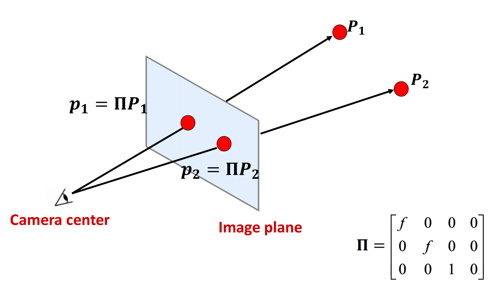

!!! example "Example"

	=== "投影"
	
		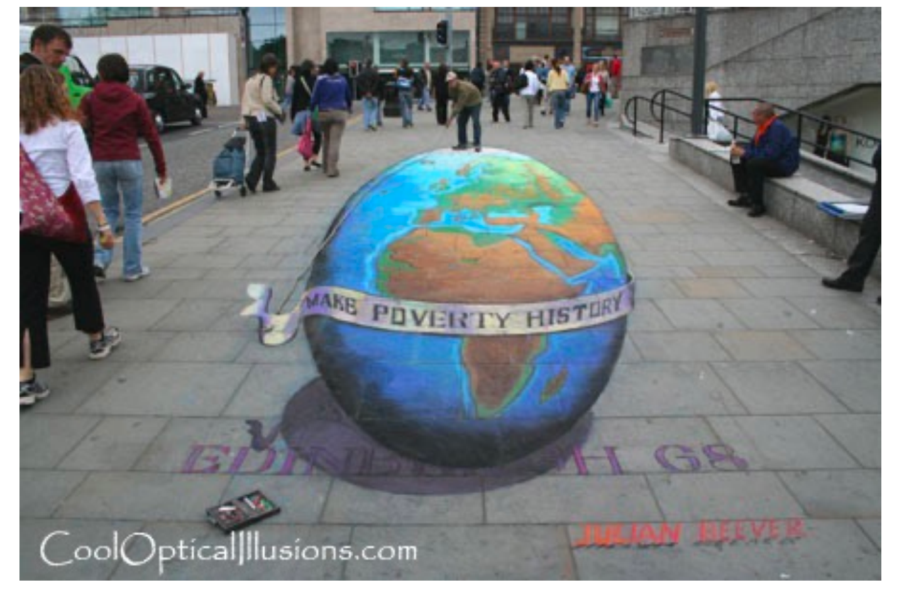
	
	=== "从另一个角度看"
	
		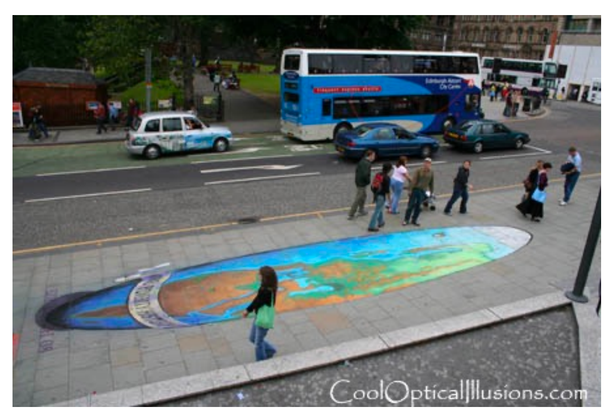

一个投影可能对应无数种不同的物体形状：

透视投影的性质：

- 保留了直线“**直**”的性质

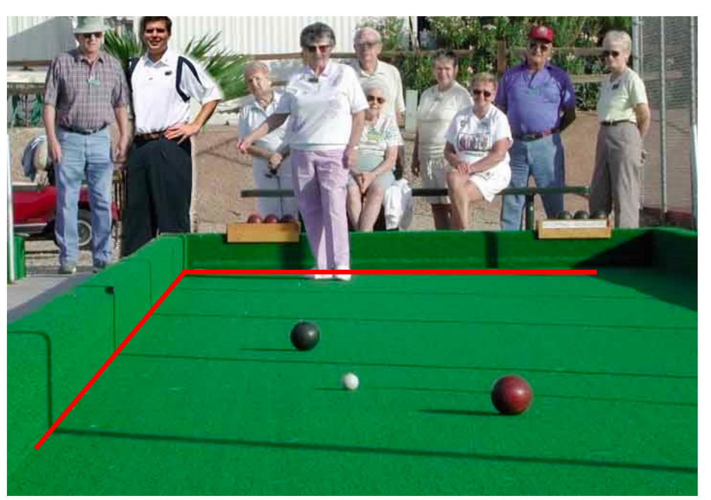

- 但是**长度**和**角度**关系却被丢失了

	- 长度

		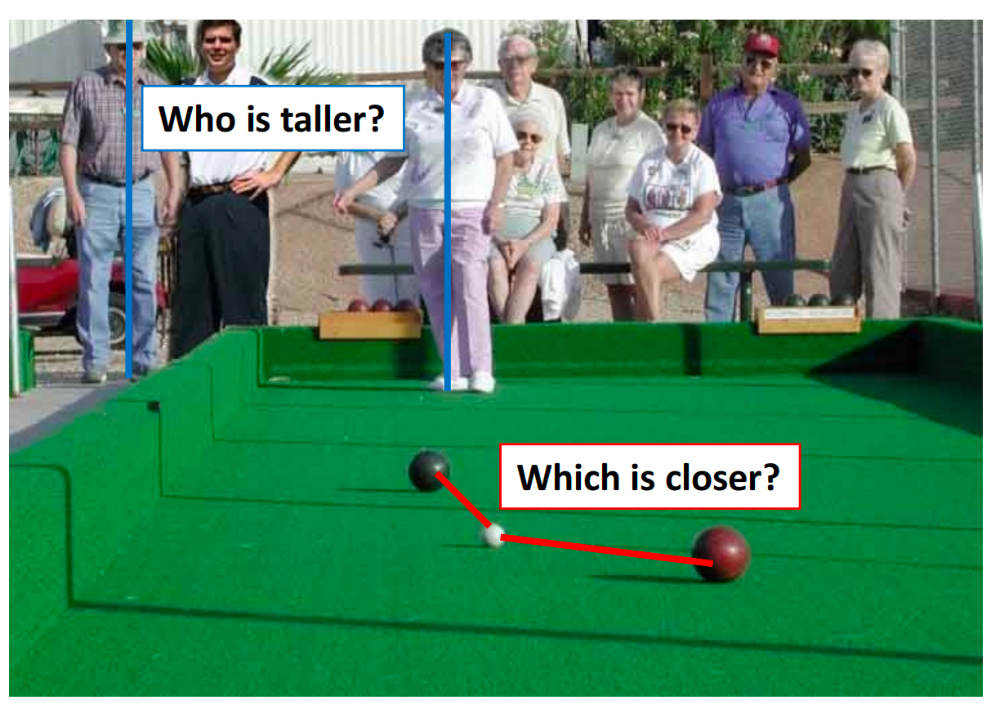

	- 角度
  
		

由于角度变化，两条在物理世界平行的线会在图像中汇聚于一点（即**消失点**，Vanishing Point）

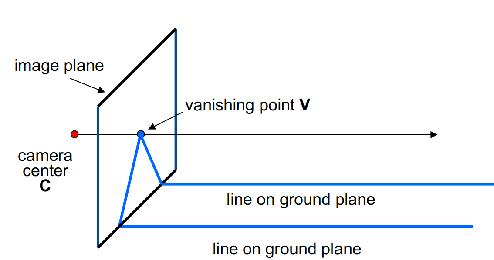

性质：

- 任意两条平行线之间都有一个共同的消失点 v
- 来自相机上一点 C 的通过 v 的射线与直线平行
  - 因此 v 能够反映**直线的方向**
  - v 可能在图像外，甚至无穷远处

由于平面上任意两条平行线定义了一个消失点，这些消失点的并集就构成了一条**消失线**（Vanishing Line）

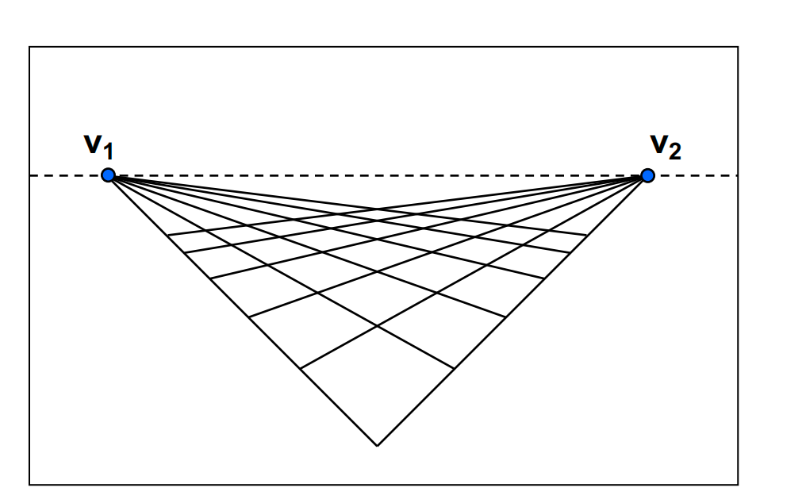

不同的平面会产生不同的消失线，因此消失线包含了**平面朝向**的信息：

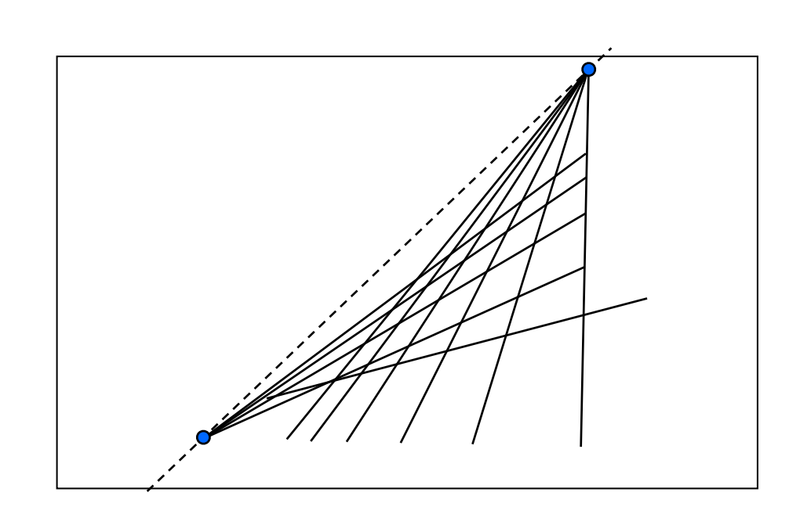

!!! example "Example"

	=== "地平线"
	
		地平线就是“地面（或水平地平面）的消失线”。透视投影下，地面上任意一组平行线（道路、铁轨、地砖缝）在图像中都会收敛到某个消失点；所有这些消失点共同落在一条直线上，这条直线就是地平线（消失线）
	
		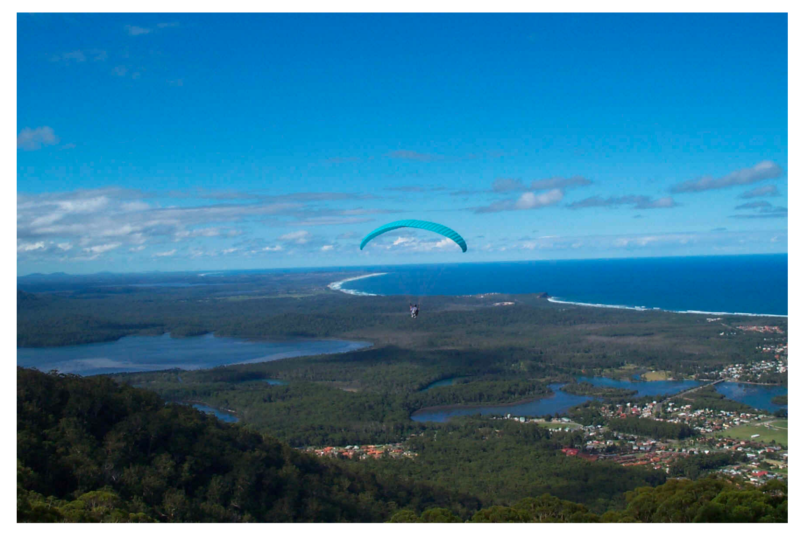
	
	=== "透视效应"
	
		透视效应：平行于地面的线条在图像中会向远处“汇聚”，看起来越远越小
	
		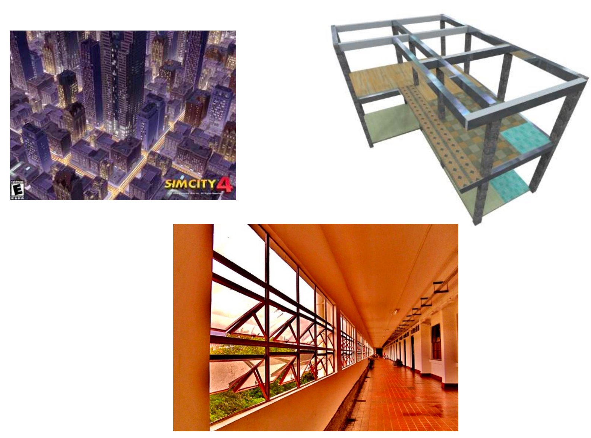

***

### Perspective distortion

!!! example "Example"

	观察下图，不难发现建筑物的垂线是歪斜的，延伸后可汇聚于一点。
	
	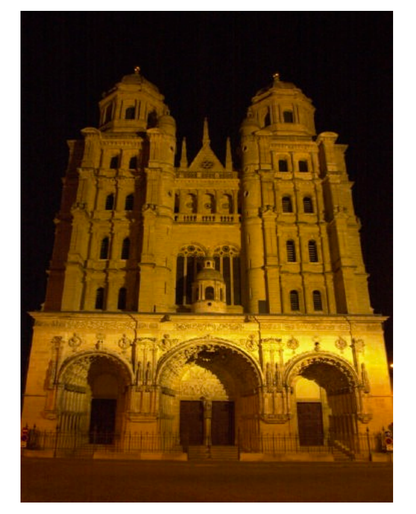

上面的例子是一种**透视畸变**（Perspective Distortion）现象，顾名思义是由透视投影引起的。原因便是透视投影会改变物体原有的长度和角度的性质。

解决方案就是使用**移轴相机**（View Camera）（镜头相对于胶片移动）

- 越远离相机中心，物体在图像上的畸变越明显
- 这一类畸变并**不是**由镜头的瑕疵引起的

***

### Radial Distortion

**径向畸变**（Radial Distortion）是另一类畸变。和透视畸变明显不同的一点在于物体的直线性质也没在图像上保持，被扭曲成了各种曲线。径向畸变大致可分为：

- **枕形**（Pin Cushion）畸变 $\leftarrow$ **长焦**镜头
- **桶形**（Barrel）畸变 $\leftarrow$ **广角**镜头

- 这类畸变由镜头瑕疵引起
- 对于通过透镜边缘的光线更明显

公式表示：

$$
\begin{aligned}
r^2 &= {x'_n}^2 + {y'_n}^2 \\
x'_d &= x'_n(1 + \kappa_1 r^2 + \kappa_2 r^4) \\
y'_d &= y'_n(1 + \kappa_1 r^2 + \kappa_2 r^4)
\end{aligned}
$$

其中：

- $x'_n, y'_n$：理想情况下透视投影的坐标
- $r$：该点离图像中心的距离
- $\kappa_1, \kappa_2$：和镜头相关的（导致图像畸变的）参数，可以利用标定板计算出来
	- 可以利用这些参数实现对畸变图像的校正

!!! example "Example"

	=== "Example 01"
	
		照片中的地平线是圆的，不是因为地球是圆的，其实只是因为广角镜头发生了径向畸变（这里是桶形畸变）。
	
		
	
	=== "Example 02"
	
		下图用长焦镜头拍摄，导致枕形畸变发生。
	
		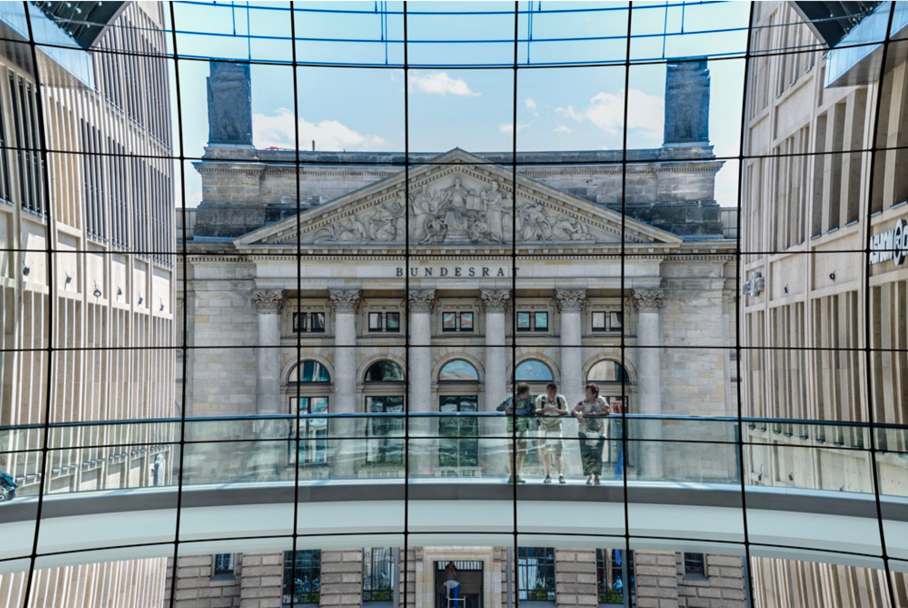
		
	=== "Example 03"
	
		长焦镜头的枕形畸变自带“瘦脸”效果。
	
		
	
	=== "Example 04"
	
		矫正径向扭曲：
	
		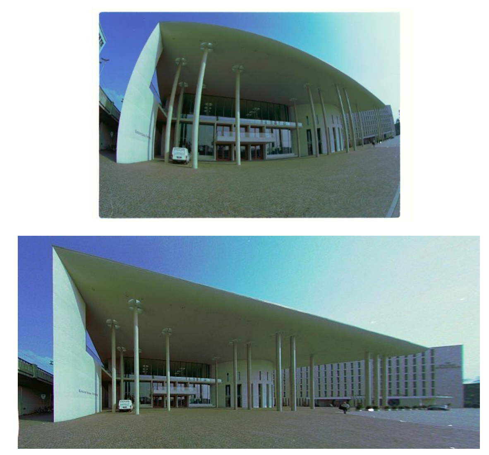

***

## Photometric Image Formation

**光度成像**（Photometric Image Formation）描述了三维世界的物理性质和二维图像的颜色之间的关系。

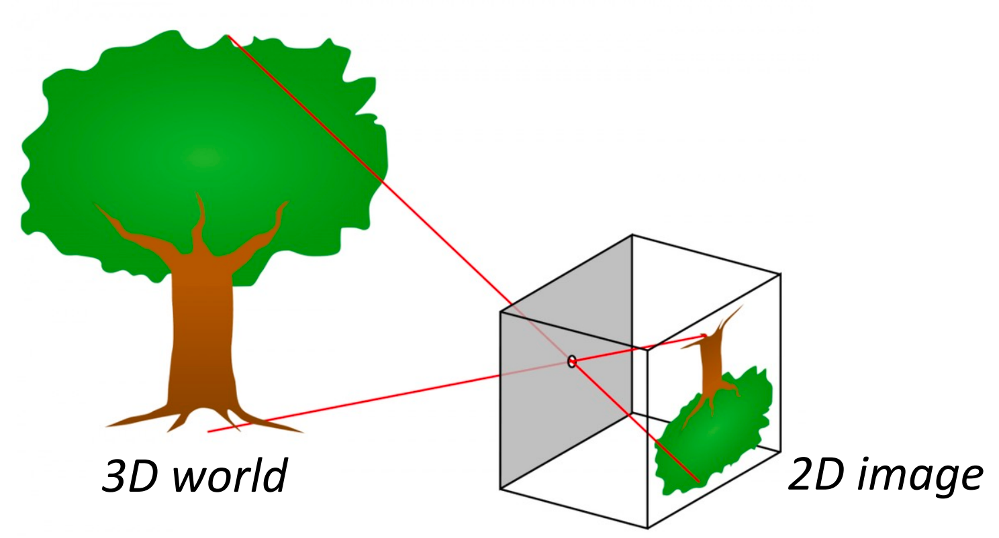

***

### Shutter

**快门**（Shutter）：

- **焦平面快门**（Focal Plane Shutter）位于图像传感器 / 胶片正前方
- 多数数码相机采用机械与电子快门相结合的方式
- 快门速度通过控制曝光时间来改变到达传感器的光量
  - 像素值 = 光强在曝光时间内的积分
- 它决定图像是否过曝、欠曝、模糊或出现噪点

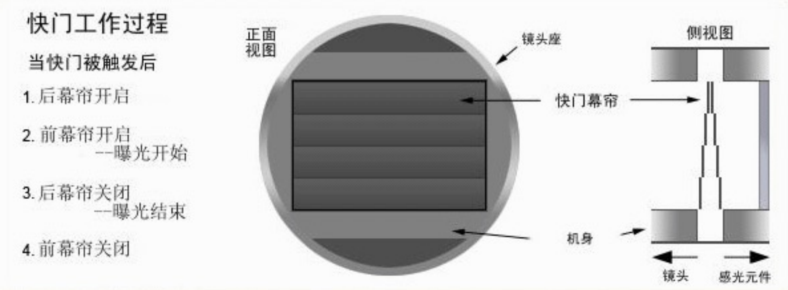

**卷帘快门效应**（Rolling Shutter Effect）：拍摄扇叶或螺旋桨等高速运动的物体时产生的一种图像畸变现象。

***

### Color Space

**色彩空间**（Color Space）的表示方法有如下：

- RGB：

- HSV：

***

### Images in Python

Python 中的图像：

- 用矩阵表示一个图像
- 假设有一个 NxM 的图像叫做 `im`
    - `im(0, 0, 0)`：左上角的像素在 R 通道的值
    - `im(y-1, x-1, b-1)`：向下 y 个像素，向右 x 个像素的像素在第 b 个通道上的值
    - `im(N-1, M-1, 2)`：右下角的像素在 B 通道的值

***

### Practical Color Sensing: Bayer Filter

使用**拜耳滤色镜**（Bayer Filter）实现在单个芯片上的 RGB 感知。

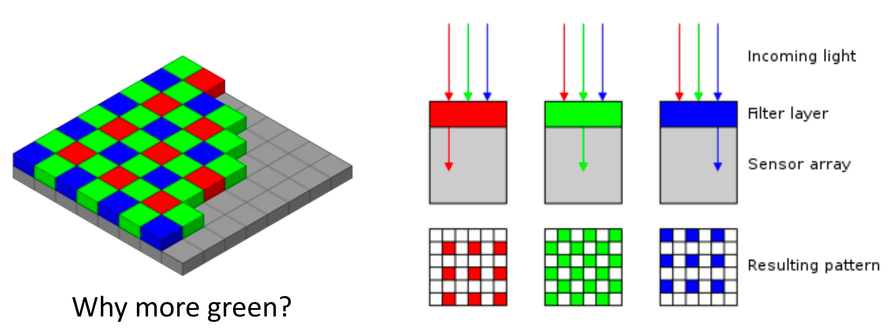

可以看到，在一个 2x2 的单元中包含 1 个红色、1 个蓝色和 2 个绿色像素。之所以绿色更多一些，是因为人眼对绿色（所在波长的光）更敏感，因此用更多的绿色就能让人觉得图像更明亮清晰

***

### Shading

之前所讲的都是单束光线在空间中的传播，这一部分从像素强度和色彩的角度来看图像是如何形成的。光线由一个或多个光源**发出**（Emit），并在场景中物体（或介质）的表面**反射**（Reflect）或**折射**（Refract）（一次或多次）。

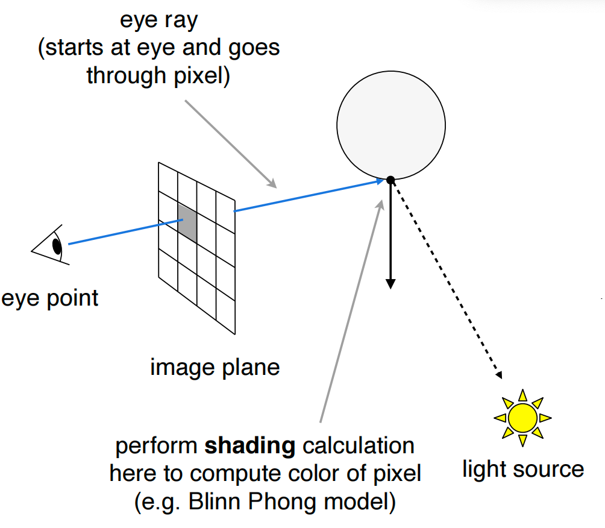

着色要做的就是计算在特定**着色点**（Shading Point）上反射到相机的光线。在计算前，我们需要定义一些输入量：

- **观测方向**（Viewer Direction）：$v$
- **表面法线**（Surface Normal）：$n$
- **光照方向**（Light Direction）：$I$
- **表面参数**（Surface Parameters）：包括颜色、反光度（Shininess）等

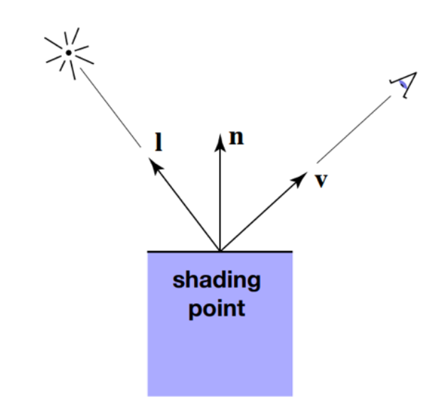

***

#### Diffuse Reflection

- **朗伯余弦定律**（Lambert's Cosine Law）：着色点上单位面积接收的光照和光照方向与法线夹角的余弦值（即 $\cos \theta = I \cdot n$）成正比

- 材料的外观/光在表面是如何反射的可以用 BRDF（Bidirectional Reflectance Distribution Function） 来描述：

计算漫反射光照的计算公式：

$$
L_d = k_d (I / r^2) \max(0, \mathbf{n} \cdot \mathbf{l})
$$

- $L_d$：漫反射光照
- $k_d$：漫反射系数（颜色）

	

- $I / r^2$：到达着色点的能量
- $\max(0, \mathbf{n} \cdot \mathbf{l})$：着色点吸收的能量

***

#### Specular Reflection

高亮强度取决于观测方向——观测方向和镜面反射光线方向越接近，高光就越亮。

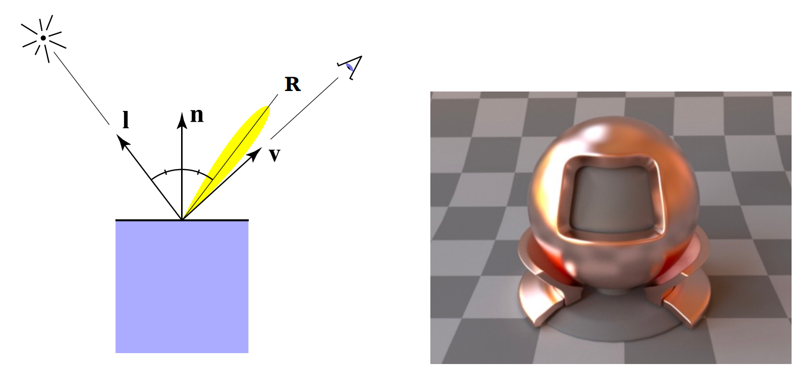

我们将“观测方向和镜面反射光线方向之间的距离”转化到“表面法线和半程向量（Half Vector）（即入射光和反射光之间的角平分线）的夹角”。由于两个向量都是单位向量，所以通过点乘就能计算夹角的余弦值。半程向量的计算公式为：

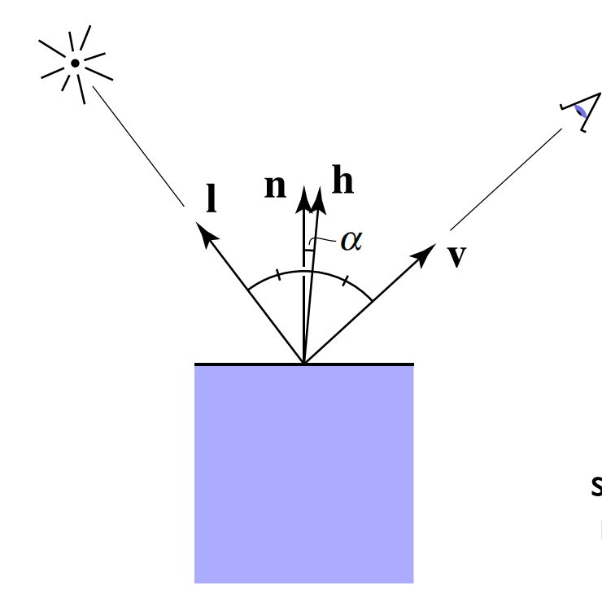

$$
\mathbf{h} = \text{bisector}(\mathbf{v}, \mathbf{l}) = \dfrac{\mathbf{v} + \mathbf{l}}{\|\mathbf{v} + \mathbf{l}\|}
$$

高光强度的计算公式和漫反射光强类似：

$$
\begin{align*}
L_s & = k_s (I / r^2) \max(0, \cos \alpha)^p \\
& = k_s (I / r^2) \max(0, \mathbf{n} \cdot \mathbf{h})^p
\end{align*}
$$

- $k_s$ 为高光系数

- 做 $p$ 次幂的原因：
    - 如果不加的话（即 $p = 1$），当夹角变大时，余弦值的下降速度并不快
    - 但我们知道对于真实世界下的高光，只要偏的度数稍多，高光就看不到了
    - 对余弦函数做 $p$ 次幂，发现只要度数比 0 稍大一些，余弦值就会下降很多，符合现实情况
    - 实际使用中 $p$ 的值在 100-200 左右

		

***

#### Ambient Lighting

由于环境光的产生过于复杂，所以我们可以直接认为环境光不依赖于着色模型中的任何参数，直接用常量颜色来表示环境光（但是这只是一个估计并非真实情况）

环境光强的公式为：$L_a = k_a I_a$，其中 $k_a$ 为环境光系数。

将漫反射、高光和环境光组合起来，就能得到完整的光强公式了：

$$
\begin{align*}
L & = L_a + L_d + L_s \\
& = k_a I_a + k_d (I / r^2) \max(0, \mathbf{n} \cdot \mathbf{I}) + k_s (I / r^2) \max(0, \mathbf{n} \cdot \mathbf{h})^p
\end{align*}
$$

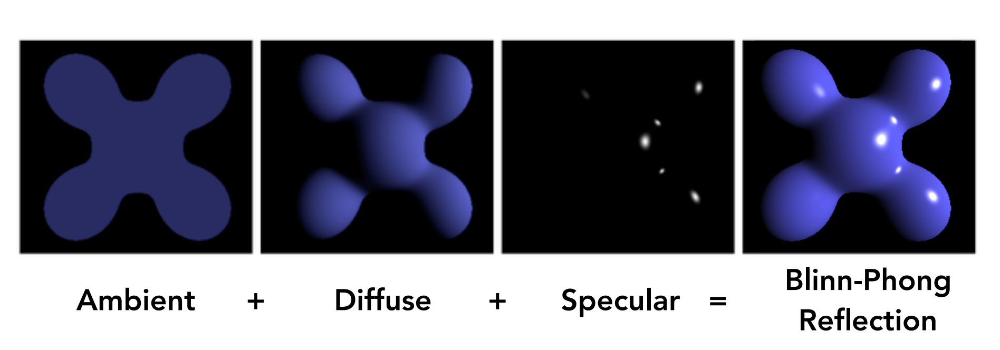
