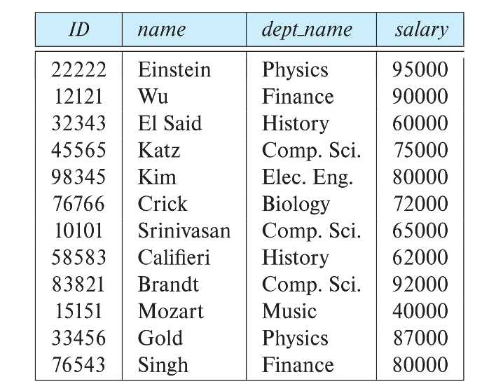
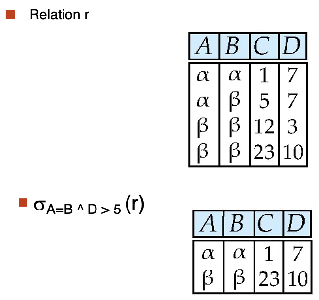
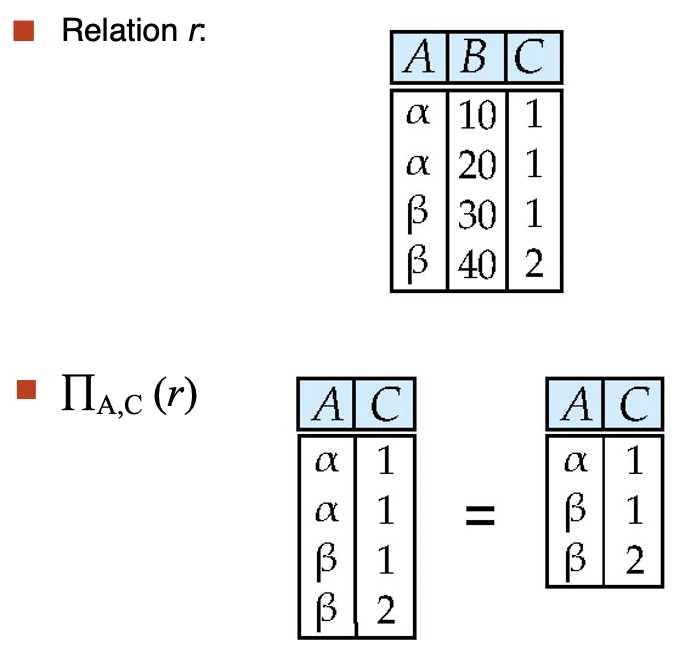
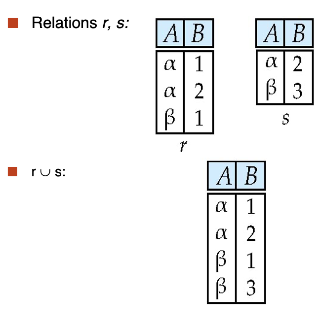
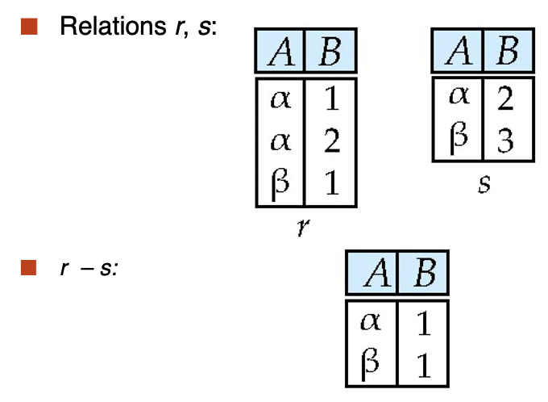
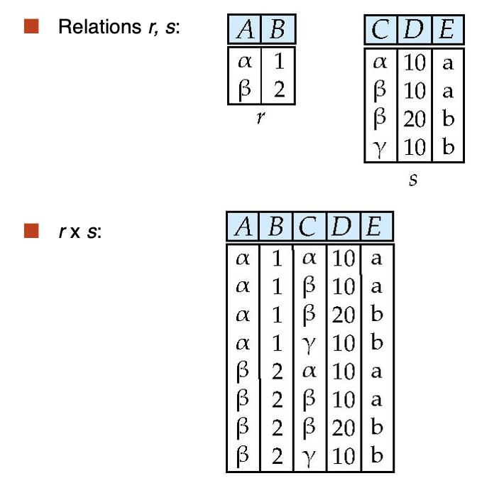

---
hide:
  #- navigation # 显示右
  #- toc #显示左
  - footer
  - feedback
comments: true
--- 

# Chapter 02 : The Relational Model

## Structure of Relational Databases

### Basic Structure

形式上，给定集合 $D_1,D_2,...,D_n$，关系 $r$ 是笛卡尔积 $D_1\times D_2\times ...\times D_n$ 的子集，因此，关系是 n 元组 $(a_1,a_2,...,a_n),a_i\in D_i$ 所组成的集合
***
### Relation Schema and Instance

- $A_1,A_2,...,A_n$ 为属性（Attributes）
- $R=(A_1,A_2,...,A_n)$ 是一个关系模式（Relation Schema）
	- e.g. $\text{instructor} = (\text{ID}, \text{name}, \text{dept\_name}, \text{salary})$
- 基于关系模式 $R$ 所定义的关系实例（Relation Instance）$r$ 记为 $r(R)$
- 关系上的当前值（即关系实例）会在表格中具体指明
- 关系 $r$ 当中的元素 $t$ 被称为元组（Tuple），它在表格中以行展示
***
### Attributes

- 每一个属性可取的值所组成的集合为该属性的域（Domain）
- 属性值（通常）要求为原子的（Atomic）/不可分割的（Indivisible）
- 特殊值 null（空值）是所有域的成员，它会导致许多操作的定义复杂化
***
### Relations are Unordered

- 元组的顺序没有意义（它们可按任意顺序被存储）
- 同一个关系内，不能存在重复的元组
***
## Database Schema

- 数据库模式（Database Schema）是一个数据库的逻辑结构
- 数据库实例（Database Instance）是数据库中数据在给定时刻的快照（Snapshot）

!!! example "Example"

	- 数据库模式：$\text{instructor}(\text{ID}, \text{name}, \text{dept\_name}, \text{salary})$
	- 数据库实例：
	
	
***
## Keys

令 $K\subseteq R$，有以下几类键：

- **超键**（Superkey）：如果对于每个可能的关系 $r(R)$，$K$ 能识别出唯一的元组，则 $K$ 为 $R$ 的超键
	- e.g. $\{ID\}$ 和 $\{ID, name\}$ 都是 instructor 的超键
- **候选键**（Candidate Key）：含字段最少的超键
	- e.g. $\{ID\}$ 是 instructor 的候选键
- **主键**（Primary Key）：是一种候选键，且由用户显式定义的键（通常用下划线标出）
- **外键**（Foreign Key）：假设存在关系 $r(A,B,C),s(B,D)$，关系 $r$ 的属性 $B$ 是参照 $s$ 的外键，其中 $r$ 是参照关系（Referencing Relation），$s$ 是被参照关系（Referenced Relation）
	- 从关系 $r_1$ 的属性 $A$ 到关系 $r_2$ 的主键 $B$ 的外键约束规定，在任何数据库实例上，$r_1$ 中每个元组的 $A$ 值也必须是 $r_2$ 中某个元组的 $B$ 值
		- 类似于指针，外键约束就是关系 $r_1$ 引用的主键必须在关系 $r_2$ 中出现
		- e.g. 左侧表的老师 ID 必须出现在右侧表中，下面黄色的 ID 是不可能出现的
		
		
	
	- 参照完整性（Referential Integrity）约束要求引用关系 $r_1$ 中任何元组的指定属性 $A$ 中出现的值也出现在引用关系 $r_2$ 中至少一个元组的指定属性 $B$ 中
		- 类似于外键限制，但不局限于主键
		- e.g. 下面 time_slot_id 并不是关系 $r_2$ 的主键，所以这里不是外键约束
		
		
		
***
## Schema Diagrams

对于一个数据库来说，它包含许多关系，它能将一个组织的信息拆分为多个部分，例如一个大学的数据库（划下划线为主键）：

它的模式图如下：

- course 指课程信息，无论是否开课，都会有其定义。
- section 表示教学班，真正开课时就有相应的实例。（类比于高铁的列车号，和每天对应的班次）
- teachers 具体教哪个教学班的老师
- takes 表示学生注册课程
- time_slot 表示一门课的具体上课时间段
***
## Relational Query Languages

- 查询语言：用户用来请求数据库信息的语言
    - “纯”语言：查询语言的基础
        - **关系代数**（Relational Algebra）：SQL 的基础
        - **元组关系演算**（Tuple Relational Calculus）
        - **域关系演算**（Domain Relational Calculus）
	- 以上三个纯语言在算力上相当
***
## Relational Algebra

- 关系代数是一种过程语言（Procedural Language），由一组操作组成，这些操作将一个或两个关系作为输入，并生成一个新关系作为其结果
- 六种基本运算符
    - **选择**（Select）$\sigma$
    - **投影**（Project）$\prod$
    - **并**（Union）$\cup$
    - **差**（Difference）$-$
    - **笛卡尔积**（Cartesian Product）$\times$
    - **重命名**（Rename）$\rho$
***
### Select

- 选择操作选择满足谓词的元组，记为 $\sigma_p(r)$，满足 $\sigma_p(r)=\{t|t\in r\text{ and } p(t)\}$
	- 其中 $p$ 为选择谓词（Selection Predicate），它是一个关于命题演算的公式（用 $\land,\lor,\neg$ 等符号连接的项）
	- 每个**项**的格式为：$<\text{attribute}> \text{op} <\text{attribute}>/<\text{constant}>$，其中 op 是比较运算符（$=,\not=,>,\geq,<,\leq$ 中的其中一种）

!!! example "Example"

	
***
### Project

- 投影操作是一个一元操作，它返回其参数 relation，但省略了某些属性，记为 $\prod_{A_1,A_2,...,A_k}(r)$
	- 其中 $A_1,…,A_k$​ 是属性名称，$r$ 为关系名称
	- 运算结果为包含指定的 $k$ 列关系，那些没有指定的列会被删掉
	- 由于关系本质上是一种集合，所以投影结果中重复的行也要删去

!!! example "Example"

	
***
### Union

- 并操作允许我们合并两个关系，记为 $r\cup s$，满足 $r\cup s=\{t|t\in r\text{ or }t\in s\}$
	- 上述运算的合法条件为：两个关系必须是可兼容的，具体指
	    - $r,s$ 必须具备相同的**元数**（Arity）（即相同数量的属性）
	    - 两者的属性域必须是**可兼容的**（Compatible），即当属性有关联类型时，对于每个输入 $i$, 两个输入关系的第 $i$ 个属性的类型必须相同

!!! example "Example"

	
***
### Difference

- 差操作允许我们找到在一个关系中但不在另一个关系中的元组，记为 $r-s$，满足 $r-s=\{t|t\in r\text{ and }t\not\in s\}$
	- 和并操作同样地，差操作的两个关系必须是可兼容的

!!! example "Example"

	
***
### Cartesian-Product

- 笛卡尔积运算允许我们组合来自任意两个关系的信息，记为 $r\times s$，满足 $r\times s=\{tq|t\in r\text{ and }q\in s\}$
	- 理想情况下，假设 $r(R)$ 和 $s(S)$ 的属性是**不相交的**，即 $R\cap S=\phi$
	- 若两者是相交的，那么首先要对重叠的属性进行**重命名**操作

!!! example "Example"

	

!!! example "Composition of Operations"

	=== "Example 1"
	
		查找物理系中所有教师的姓名，以及他们教授的所有课程的 course_id
		
		- $\prod_{\text{instructor.name, course\_id}}(\sigma_{\text{dept\_name}=\text{“Physics”}}(\sigma_{\text{instructor.ID}=\text{teaches.ID}}(\text{instructor}\times\text{teaches})))$
		- $\prod_{\text{instructor.name, course\_id}}(\sigma_{\text{instructor.ID}=\text{teaches.ID}}(\sigma_{\text{dept\_name}=\text{“Physics”}}(\text{instructor})\times\text{teaches}))$
		- 上面这两句话是等价的，但第二条我们先进行了一次 select（关注括号的位置），条目少了更高效
	
	=== "Example 2"
	
		查找物理系中所有教师的姓名，以及他们教授的所有课程的 course_id 和标题
		
		- $\prod_{\text{instructor.name, course.course\_id, course.title}}(\sigma_{\text{dept\_name}=\text{“Physics”}\land\text{instructor.ID}=\text{teaches.ID}\land\text{teaches.course\_id=course.course\_id}}(\text{instructor}\times\text{teaches}\times\text{course}))$
***
### Rename

- 重命名操作允许我们命名，从而引用关系代数表达式的结果，允许我们用多个名称来引用一个关系，记为 $\rho_X(E)$，返回在名称 $X$ 下的表达式 $E$
	- 如果 $E$ 的元数为 $n$，那么 $\rho_X(A_1,A_2,...,A_n)(E)$ 返回在名称 $X$ 下的表达式 $E$，并且属性名改为 $A_1,A_2,...,A_n$

!!! example "Example"

	我们要在表格中寻找大学中薪资最高的记录
	
	首先，我们需要获得所有不是最大值的薪资（即存在其他老师的薪资比当前薪资大）：
	
	- $\prod_{\text{instructor.salary}}(\sigma_{\text{instructor.salary}<d.\text{salary}}(\text{instructor}\times\rho_d(\text{instructor})))$
		- 这句话是因为任何不是最大值的薪水都会在笛卡尔积 select 后至少存在一个元组，这样投影之后仍会存在。但最大值就不会有元组存在
	
	然后我们用全集减掉就可以找到最大值：
	
	- $\prod_{\text{instructor}}−\prod{\text{instructor.salary}}(\sigma_{\text{instructor.salary}<d.\text{salary}}(\text{instructor}\times\rho_d(\text{instructor})))$
***
### Additional Operations

- 交（Set Intersection）： $r\cap s$
- 自然连接（Natural Join）： $r\bowtie s$
- 赋值（Assignment）： $\leftarrow$
- 外连接（Outer Join）： $r\rtimes s, r \ltimes s, r$⟗$s$
- 除法（Division Operator）：$r\div s$

!!! note "Additional Operations"

	=== "Set Intersection"
	
		 - 交操作允许我们找到两个关系中共同的元组，记为 $r\cap s$，满足 $r\cap s=\{t|t\in r\text{ and }t\in s\}$
			 - 和并操作同样地，交操作的两个关系必须是可兼容的
			 - $r\cap s = r - (r - s)$
		
		!!! example "Example"
		
			
	
	=== "Natural Join"
	
		- 令 $r,s$ 的模式分别为 $R,S$，那么自然连接（记为 $r\Join s$）的结果为一个在模式 $R\cup S$ 上的关系，按照以下方法获得：
			- 考虑分别来自 $r,s$ 的每一对元组 $t_r,t_s$
			- 如果 $t_r,t_s$ 在 $R\cap S$ 的每个属性上的取值相同，则将元组 $t$ 加入到结果中，其中 $t$ 有与 $t_r$​ 在 $r$ 上，以及 $t_s​$ 在 $s$ 上相同的值
			- 简单来说，自然连接就是连接两个关系中同名属性值相等的元组，结果属性是二者属性集的并集
		- 自然连接操作满足 $r,s$ 必须有共同属性（名称、域对应相同）
		- 扩展：**Theta 连接**，记作：$r\Join_theta=\sigma_\theta(r\times s)$，其中 $\theta$ 是关于模式上属性的谓词