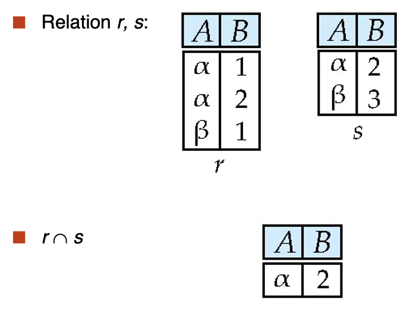
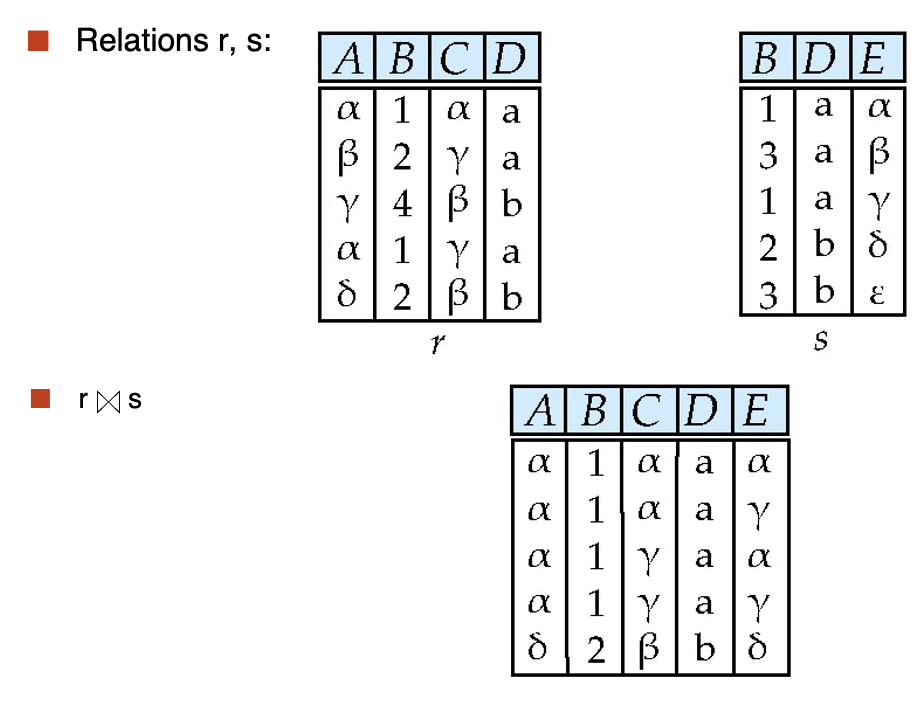
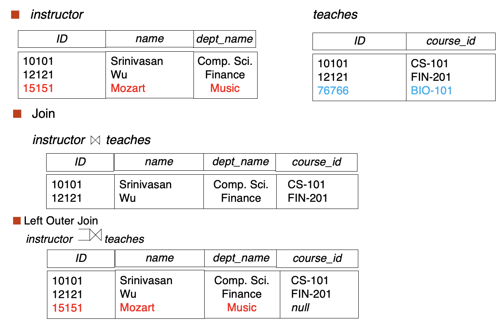
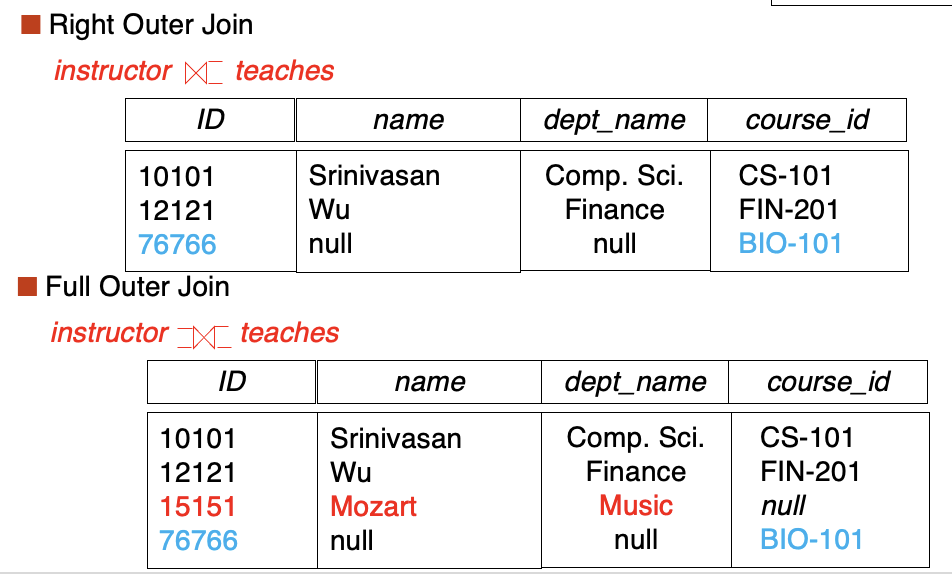
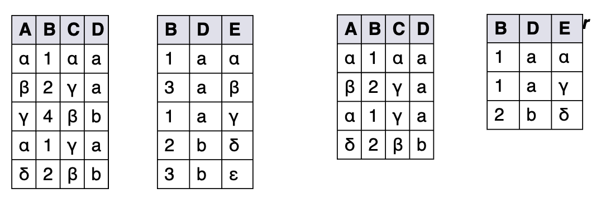
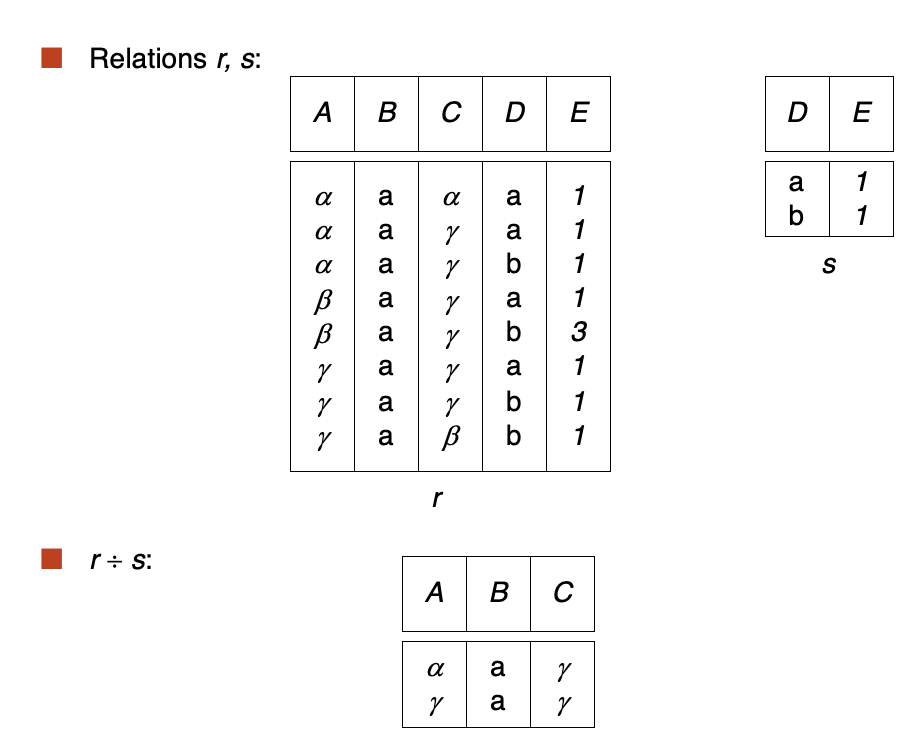
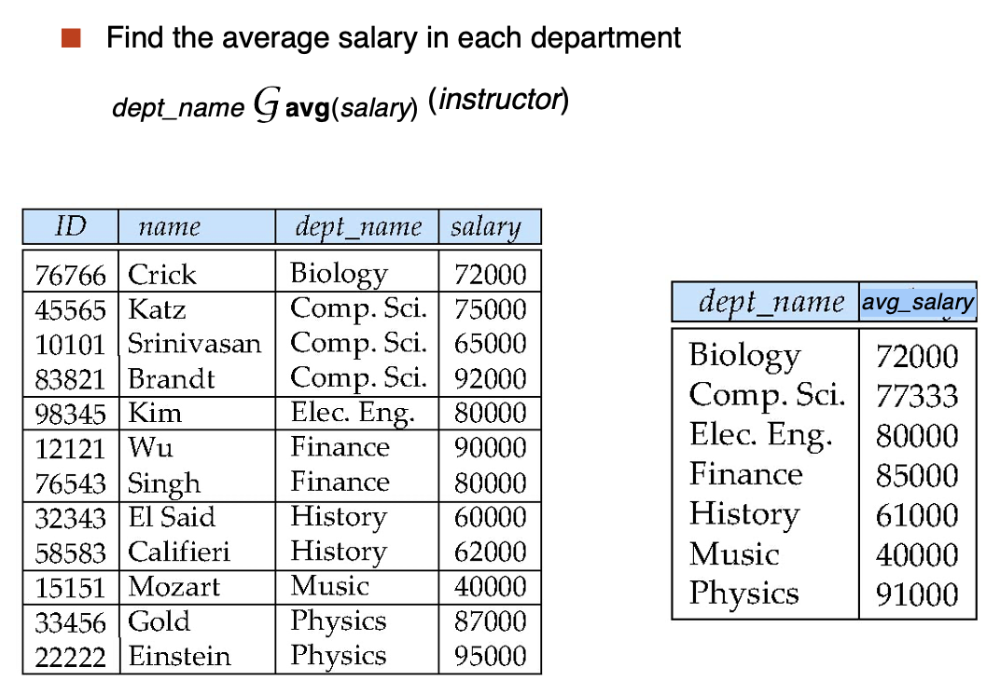

---
hide:
  #- navigation # 显示右
  #- toc #显示左
  - footer
  - feedback
comments: true
--- 

# Chapter 02 : The Relational Model

## Structure of Relational Databases

### Basic Structure

形式上，给定集合 $D_1,D_2,...,D_n$，关系 $r$ 是笛卡尔积 $D_1\times D_2\times ...\times D_n$ 的子集，因此，关系是 n 元组 $(a_1,a_2,...,a_n),a_i\in D_i$ 所组成的集合
***
### Relation Schema and Instance

- $A_1,A_2,...,A_n$ 为属性（Attributes）
- $R=(A_1,A_2,...,A_n)$ 是一个关系模式（Relation Schema）
	- e.g. $\text{instructor} = (\text{ID}, \text{name}, \text{dept_name}, \text{salary})$
- 基于关系模式 $R$ 所定义的关系实例（Relation Instance）$r$ 记为 $r(R)$
- 关系上的当前值（即关系实例）会在表格中具体指明
- 关系 $r$ 当中的元素 $t$ 被称为元组（Tuple），它在表格中以行展示
***
### Attributes

- 每一个属性可取的值所组成的集合为该属性的域（Domain）
- 属性值（通常）要求为原子的（Atomic）/不可分割的（Indivisible）
- 特殊值 null（空值）是所有域的成员，它会导致许多操作的定义复杂化
***
### Relations are Unordered

- 元组的顺序没有意义（它们可按任意顺序被存储）
- 同一个关系内，不能存在重复的元组
***
## Database Schema

- 数据库模式（Database Schema）是一个数据库的逻辑结构
- 数据库实例（Database Instance）是数据库中数据在给定时刻的快照（Snapshot）

!!! example "Example"

	- 数据库模式：$\text{instructor}(\text{ID}, \text{name}, \text{dept_name}, \text{salary})$
	- 数据库实例：
	
	
***
## Keys

令 $K\subseteq R$，有以下几类键：

- **超键**（Superkey）：如果对于每个可能的关系 $r(R)$，$K$ 能识别出唯一的元组，则 $K$ 为 $R$ 的超键
	- e.g. $\{ID\}$ 和 $\{ID, name\}$ 都是 instructor 的超键
- **候选键**（Candidate Key）：含字段最少的超键
	- e.g. $\{ID\}$ 是 instructor 的候选键
- **主键**（Primary Key）：是一种候选键，且由用户显式定义的键（通常用下划线标出）
- **外键**（Foreign Key）：假设存在关系 $r(A,B,C),s(B,D)$，关系 $r$ 的属性 $B$ 是参照 $s$ 的外键，其中 $r$ 是参照关系（Referencing Relation），$s$ 是被参照关系（Referenced Relation）
	- 从关系 $r_1$ 的属性 $A$ 到关系 $r_2$ 的主键 $B$ 的外键约束规定，在任何数据库实例上，$r_1$ 中每个元组的 $A$ 值也必须是 $r_2$ 中某个元组的 $B$ 值
		- 类似于指针，外键约束就是关系 $r_1$ 引用的主键必须在关系 $r_2$ 中出现
		- e.g. 左侧表的老师 ID 必须出现在右侧表中，下面黄色的 ID 是不可能出现的
		
		
	
	- 参照完整性（Referential Integrity）约束要求引用关系 $r_1$ 中任何元组的指定属性 $A$ 中出现的值也出现在被引用关系 $r_2$ 中至少一个元组的指定属性 $B$ 中
		- 类似于外键限制，但不局限于主键
		- e.g. 下面 time_slot_id 并不是关系 $r_2$ 的主键，所以这里不是外键约束
		
		
		
***
## Schema Diagrams

对于一个数据库来说，它包含许多关系，它能将一个组织的信息拆分为多个部分，例如一个大学的数据库（划下划线为主键）：

它的模式图如下：

- course 指课程信息，无论是否开课，都会有其定义。
- section 表示教学班，真正开课时就有相应的实例。（类比于高铁的列车号，和每天对应的班次）
- teachers 具体教哪个教学班的老师
- takes 表示学生注册课程
- time_slot 表示一门课的具体上课时间段
***
## Relational Query Languages

- 查询语言：用户用来请求数据库信息的语言
    - “纯”语言：查询语言的基础
        - **关系代数**（Relational Algebra）：SQL 的基础
        - **元组关系演算**（Tuple Relational Calculus）
        - **域关系演算**（Domain Relational Calculus）
	- 以上三个纯语言在算力上相当
***
## Relational Algebra

- 关系代数是一种过程语言（Procedural Language），由一组操作组成，这些操作将一个或两个关系作为输入，并生成一个新关系作为其结果
- 六种基本运算符
    - **选择**（Select）$\sigma$
    - **投影**（Project）$\prod$
    - **并**（Union）$\cup$
    - **差**（Difference）$-$
    - **笛卡尔积**（Cartesian Product）$\times$
    - **重命名**（Rename）$\rho$
***
### Select

- 选择操作选择满足谓词的元组，记为 $\sigma_p(r)$，满足 $\sigma_p(r)=\{t|t\in r\text{ and } p(t)\}$
	- 其中 $p$ 为选择谓词（Selection Predicate），它是一个关于命题演算的公式（用 $\land,\lor,\neg$ 等符号连接的项）
	- 每个**项**的格式为：$<\text{attribute}> \text{op} <\text{attribute}>/<\text{constant}>$，其中 op 是比较运算符（$=,\not=,>,\geq,<,\leq$ 中的其中一种）

!!! example "Example"

	
***
### Project

- 投影操作是一个一元操作，它返回其参数 relation，但省略了某些属性，记为 $\prod_{A_1,A_2,...,A_k}(r)$
	- 其中 $A_1,…,A_k$​ 是属性名称，$r$ 为关系名称
	- 运算结果为包含指定的 $k$ 列关系，那些没有指定的列会被删掉
	- 由于关系本质上是一种集合，所以投影结果中重复的行也要删去

!!! example "Example"

	
***
### Union

- 并操作允许我们合并两个关系，记为 $r\cup s$，满足 $r\cup s=\{t|t\in r\text{ or }t\in s\}$
	- 上述运算的合法条件为：两个关系必须是可兼容的，具体指
	    - $r,s$ 必须具备相同的**元数**（Arity）（即相同数量的属性）
	    - 两者的属性域必须是**可兼容的**（Compatible），即当属性有关联类型时，对于每个输入 $i$, 两个输入关系的第 $i$ 个属性的类型必须相同

!!! example "Example"

	
***
### Difference

- 差操作允许我们找到在一个关系中但不在另一个关系中的元组，记为 $r-s$，满足 $r-s=\{t|t\in r\text{ and }t\not\in s\}$
	- 和并操作同样地，差操作的两个关系必须是可兼容的

!!! example "Example"

	
***
### Cartesian-Product

- 笛卡尔积运算允许我们组合来自任意两个关系的信息，记为 $r\times s$，满足 $r\times s=\{tq|t\in r\text{ and }q\in s\}$
	- 理想情况下，假设 $r(R)$ 和 $s(S)$ 的属性是**不相交的**，即 $R\cap S=\phi$
	- 若两者是相交的，那么首先要对重叠的属性进行**重命名**操作

!!! example "Example"

	

!!! example "Composition of Operations"

	=== "Example 1"
	
		查找物理系中所有教师的姓名，以及他们教授的所有课程的 course_id
		
		- $\prod_{\text{instructor.name, course_id}}(\sigma_{\text{dept_name}=\text{“Physics”}}(\sigma_{\text{instructor.ID}=\text{teaches.ID}}(\text{instructor}\times\text{teaches})))$
		- $\prod_{\text{instructor.name, course_id}}(\sigma_{\text{instructor.ID}=\text{teaches.ID}}(\sigma_{\text{dept_name}=\text{“Physics”}}(\text{instructor})\times\text{teaches}))$
		- 上面这两句话是等价的，但第二条我们先进行了一次 select（关注括号的位置），条目少了更高效
	
	=== "Example 2"
	
		查找物理系中所有教师的姓名，以及他们教授的所有课程的 course_id 和标题
		
		- $\prod_{\text{instructor.name, course.course_id, course.title}}(\sigma_{\text{dept_name}=\text{“Physics”}\land\text{instructor.ID}=\text{teaches.ID}\land\text{teaches.course_id=course.course_id}}(\text{instructor}\times\text{teaches}\times\text{course}))$
***
### Rename

- 重命名操作允许我们命名，从而引用关系代数表达式的结果，允许我们用多个名称来引用一个关系，记为 $\rho_X(E)$，返回在名称 $X$ 下的表达式 $E$
	- 如果 $E$ 的元数为 $n$，那么 $\rho_X(A_1,A_2,...,A_n)(E)$ 返回在名称 $X$ 下的表达式 $E$，并且属性名改为 $A_1,A_2,...,A_n$

!!! example "Example"

	我们要在表格中寻找大学中薪资最高的记录
	
	首先，我们需要获得所有不是最大值的薪资（即存在其他老师的薪资比当前薪资大）：
	
	- $\prod_{\text{instructor.salary}}(\sigma_{\text{instructor.salary}<d.\text{salary}}(\text{instructor}\times\rho_d(\text{instructor})))$
		- 这句话是因为任何不是最大值的薪水都会在笛卡尔积 select 后至少存在一个元组，这样投影之后仍会存在。但最大值就不会有元组存在
	
	然后我们用全集减掉就可以找到最大值：
	
	- $\prod_{\text{instructor}}−\prod_{\text{instructor.salary}}(\sigma_{\text{instructor.salary}<d.\text{salary}}(\text{instructor}\times\rho_d(\text{instructor})))$
***
### Additional Operations

- 交（Set Intersection）： $r\cap s$
- 自然连接（Natural Join）： $r\bowtie s$
- 赋值（Assignment）： $\leftarrow$
- 外连接（Outer Join）： $r$⟕$s, r$⟖$s, r$⟗$s$
- 除法（Division Operator）：$r\div s$
- 半连接（Semijoin）： $r\ltimes_{\theta}s$

!!! note "Additional Operations"

	=== "Set Intersection"
	
		 - 交操作允许我们找到两个关系中共同的元组，记为 $r\cap s$，满足 $r\cap s=\{t|t\in r\text{ and }t\in s\}$
			 - 和并操作同样地，交操作的两个关系必须是可兼容的
			 - $r\cap s = r - (r - s)$
		
		!!! example "Example"
		
			
	
	=== "Natural Join"
	
		- 令 $r,s$ 的模式分别为 $R,S$，那么自然连接（记为 $r\Join s$）的结果为一个在模式 $R\cup S$ 上的关系，按照以下方法获得：
			- 考虑分别来自 $r,s$ 的每一对元组 $t_r,t_s$
			- 如果 $t_r,t_s$ 在 $R\cap S$ 的每个属性上的取值相同，则将元组 $t$ 加入到结果中，其中 $t$ 有与 $t_r$​ 在 $r$ 上，以及 $t_s​$ 在 $s$ 上相同的值
			- 简单来说，共同属性要有相同的值，才能在拼接后的结果中保留。类似对乘法的扩展，相当于先笛卡尔积再 select，最后 project
		- 自然连接操作满足 $r,s$ 必须有共同属性（名称、域对应相同）
		- 自然连接操作具有结合律（Associative）和交换律（Commutative）
		- 扩展：**Theta 连接（条件连接）**，记作：$r\Join_{\theta}s=\sigma_{\theta}(r\times s)$，其中 $\theta$ 是关于模式上属性的谓词
		
		!!! example "Example"
		
			
			
			由这个例子我们可以看出，$r\Join s = \prod_{r.A,r.B,r.C,r.D,s.E}(\sigma_{r.B=s.B\land r.D=s.D}(r\times s))$
	
	=== "Outer Join"
	
		- **外连接**是连接运算的扩展，用于避免信息的缺失 
		- 先计算连接，然后将来自一个关系中的，但没有与另一个关系有匹配的元组的元组加入到连接结果中
		
		!!! example "Example"
		
			
			
			
		
		由上面的 Example 我们可以看出，外连接有三种形式，其中：
		
		- $r$⟖$s = (r\Join s)\cup(r-\prod_R(r\Join s)\times\{(\text{null,...,null})\})$
		- $r$⟕$s = (r\Join s)\cup\{(\text{null,...,null})\}\times(s-\prod_s(r\Join s))$
		- $r$⟗$s = (r\Join s)\cup(r-\prod_R(r\Join s)\times\{(\text{null,...,null})\})\cup(\{(\text{null,...,null})\}\times(s-\prod_s(r\Join s)))$
	
	=== "Semijoin"
	
		半连接（记作 $r\ltimes_{\theta}s$）能实现保留 $r$ 中能与 $s$ 相连的元组，满足 $r\ltimes_{\theta}s=\prod_R(r\Join_{\theta}s)$
		  
		!!! example "Example"
		  
			  
	
	=== "Assignment"
	
		- 赋值运算符 $\leftarrow$ 提供了一种表达复杂查询的便捷方法
		    - 可以将查询写成一个顺序的程序，里面包含了一系列的赋值语句，随后跟上一个表达式，其值作为查询的结果
		    - 赋值必须用于临时的关系变量
	
	=== "Division"
	
		- 除法运算记作 $r\div s$，给定关系 $r(R)$ 和 $s(S)$，使得 $S\subset R$，那么 $r\div s$ 是最大的关系 $t(R-S)$，满足 $t\times s\subseteq r$
		- 我们可以将 $r\div s$ 写作：
			- $\text{temp1}\leftarrow\prod_{R-S}(r)$
			- $\text{temp2}\leftarrow\prod_{R-S}((\text{temp1}\times s)-\prod_{R-S,S}(r))$
			- $\text{result}=\text{temp1}-\text{temp2}$
			- 解释：
			    - $\prod_{R−S,S}(r)$ 仅重排了 $r$ 的属性
			    - $\prod_{R−S}((\prod_{R−S}(r)\times s)−\prod_{R−S,S}(r))$ 找出 $\prod_{R−S}(r)$ 的 $t$，满足对于某些元组 $u\in s,tu\not\in r$
		- 商来自于 $\prod_{R−S}(r)$，并且其元组 $t,s$ 所有元组的拼接被 $r$ 覆盖
		- 该运算适用于带有 "for all" 字样的查询语句
		
		!!! example "Example"
		
			
***
## Extended Relational-Algebra-Operations

### Generalized Projection

- 广义的投影运算允许在投影列表中使用算术表达式，即 $\prod_{F_1,F_2,...,F_n}(E)$
- 其中 $E$ 是关系代数表达式，$F_i$ 是一个包含常数和 $E$ 的模式中的属性的**算术表达式**

!!! example "Example"

	给定关系 instructor(ID, name, dept_name, salary)，其中 salary 是年薪，获取相同的信息，但是年薪变为月薪
	
	- $\prod_{\text{ID, name, dept_name, salary/12}}(\text{instructor})$
***
### Aggregate Functions and Operations

- **聚合函数**会接受一组值，返回单个值，包括 avg（平均值）、min（最小值）、max（最大值）、sum（求和）、count（计数）
- **聚合运算**的形式为$\text{ }_{G_1,G_2,...,G_n}\mathcal{G}_{F_1(A_1),F_2(A_2),...,F_n(A_n)}(E)$，其中 $E$ 是任意的关系代数表达式，$G_1,G_2,...,G_n​$ 为一组聚集在一起的属性（可以为空），$F_i$​ 为聚合函数，$A_i​$ 为属性名

!!! example "Example"

	

聚合的结果**没有**名称，但是我们可以用重命名操作为结果赋予名称，方便起见，我们将重命名作为聚合运算的一部分，如：$\text{ }_{G_1,G_2,...,G_n}\mathcal{G}_{F_1(A_1),F_2(A_2),...,F_n(A_n)\text{ as new_name}}(E)$
***
## Modification of the Database

可通过删除（Deletion）、插入（Insertion）和更新（Updating）运算修改数据库的内容，这些运算都可以用赋值运算符表示
***
## Multiset Relational Algebra

- 在纯关系代数中，我们要求结果是一个严格的集合，即没有任何重复项（例如在投影操作之后）
- 多重集（Multiset） 关系代数会保留重复项，以匹配 SQL 语义
	- SQL 重复保留最初是为了提高效率，但现在已成为一项功能
- 多重集关系代数定义如下：
	- 选择（Selection）：如果元组满足选择条件，则元组的重复项数与输入的重复项数一样多
	- 投影（Projection）：每个元组对应一个输入的元组，即使它可能是重复的
	- 叉积（Cross Product）：如果 $r$ 中有 $m$ 个重复元组 $t_1$ ，$s$ 中有 $n$ 个重复元组 $t_2$，则 $r\times s$ 中有 $m\times n$ 个重复元组 $t_1.t_2$ 
	- 集合运算符
		- 并：$m+n$ 个重复元组
		- 交：$\min(m,n)$ 个重复元组
		- 差：$\min(0,m–n)$  个重复元组
***
## SQL and Relational Algebra

- `select A1, A2, ... An from r1, r2, ... rm where P` 和 $\prod_{A_1,...,A_n}(\sigma_P(r_1\times r_2\times ... \times r_m))$ 等价
- `select A1, A2, sum(A3) from r1, r2, ... rm where P group by A1, A2` 和$\text{ }_{A_1,A_2}\mathcal{G}_{\text{sum}(A_3)}\sigma_P(r_1\times r_2\times ... \times r_m))$ 等价
- 更一般地说，`select` 子句中的非聚合属性可能是 `group by` 属性的子集，在这种情况下，`select A1, sum(A3) from r1, r2, ... rm where P group by A1, A2` 和 $\prod_{A_1,\text{sumA3}}(\text{}_{A_1,A_2}\mathcal{G}_{\text{sum}(A_3)\text{ as sumA3}}\sigma_P(r_1\times r_2\times ... \times r_m)))$ 等价