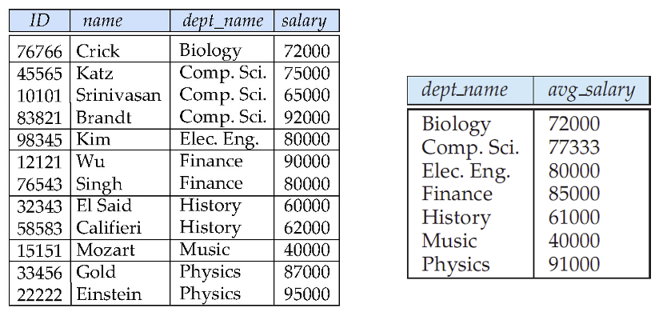

---
hide:
  #- navigation # 显示右
  #- toc #显示左
  - footer
  - feedback
comments: true
--- 

# Chapter 03 : Introduction to SQL

## Data Definition

SQL 数据定义语言（Data Definition Language, DDL）指定以下的信息：

- 每个关系的**模式**
- 关联每个属性的类型值
- **完整性约束**
- 用于维护关系的**索引**
- 每个关系的**安全**和**授权**信息
- 每个关系在硬盘上的物理**存储**结构
***
### Domain Types in SQL

- `char(n)`：定长字符串，由用户指定长度 `n`
    - 当比较两个 `char` 类型的值时，如果它们的长度不同，那么会给短的那个加上额外的空格，使得它们一样长
- `varchar(n)`：变长字符串，由用户指定最大长度 `n`
    - 当比较 `char` 类型和 `varchar` 类型时，有可能会在 `varchar` 值上添加额外的空格，但也有可能不会，这取决于系统。因此即使用 `char` 和 `varchar` 表示两个相同的字符串，比较结果也有可能是 `false`。建议一直使用相同类型的值比较
    - SQL 还提供了 `nvarchar` 类型以表示 Unicode 编码的多语言数据，但是很多数据库支持用 `varchar` 表示 Unicode 编码（尤其是 UTF-8）的字符
- `int`：整数（实际上是依赖于机器的整数的有限子集）
- `smallint`：较小的整数（实际上是依赖于机器的整数的有限子集）
- `numeric(p, d)`：定点 (fixed point) 数，由用户指定位数 `p`（包括符号位）以及十进制小数点右侧的位数 `d`
- `real` / `double precision`：分别对应单精度浮点数和双精度浮点数，其精度依赖于机器
- `float(n)`：浮点数，由用户指定最低精度位数 `n`
***
### Built-in Data Types in SQL

- `date`：日期，包含年（4 位数字）月日，比如 `2025-03-03`
- `time`：时间，包含时分秒，比如 `10:08:54`、`10:08:54.75`
- `timestamp`：时间戳，即日期 + 时间，比如 `2025-03-03 10:08:54.75`
    - 在 SQL Server 2000 里，这个类型被称为 `datetime`
- `interval`：时间间隔，比如 1 天
	- 将一个日期/时间/时间戳减去另一个值，得到一个间隔值
	- 可以将间隔值添加到日期/时间/时间戳
- 时间、日期函数：
	- `current_date()`，`current_time()`
	- `year(x)`，`month(x)`，`day(x)`，`hour(x)`，`minute(x)`，`second(x)`
***
### Create Table Construct

我们用 `create table` 命令来定义一个 SQL 关系：

```SQL
CREATE TABLE r(A1 D1, A2 D2, ..., An Dn,
    (integrity constraints_1),
    ...,
    (integrity constraints_k));
```

- `r` 是关系的名称
- `Ai` 是关系 `r` 的模式中的一个属性名，而 `Di` 是 属性 `Ai` 值域的数据类型
- 可用的完整性约束有（SQL 会阻止不满足完整性约束的更新）：
	- `primary key(A_1, A_2, ..., A_n)`
        - 该属性声明主键后，该属性自动被规定为非空和唯一
        - 虽然是可选的，但建议每个关系都要加一个主键
	- `foreign key(A_m, ..., A_n) references r`
        - 外键从关系 `r` 中参考而来
    - `not null`：不允许属性出现空值

!!! example "Examples"

	=== "Example 01"
	
		```SQL
		create table instructor (
			ID char(5),
			name varchar(20) not null,
			dept_name varchar(20),
			salary numeric(8,2),
			primary key (ID),
			foreign key (dept_name) references department);
		```
	
	=== "Example 02"
	
		- 如果不符合完整性约束条件，插入可能会失败。可以给一个缺省值，例如 `default 0`
		
		```SQL
		create table student (
			ID varchar(5),
			name varchar(20) not null,
			dept_name varchar(20),
			tot_cred numeric(3,0) default 0,
			primary key (ID),
			foreign key (dept_name) references department));
		```
	
	=== "Example 03"
	
		```SQL
		create table takes (
			ID varchar(5),
			course_id varchar(8),
			sec_id varchar(8),
			semester varchar(6),
			year numeric(4,0),
			grade varchar(2),
			primary key (ID, course_id, sec_id, semester, year),  
			foreign key (ID) references student,
			foreign key (course_id, sec_id, semester, year) references section);
		```
		
		- 可以从上面的 `primary key` 中删除 `sec_id`，以确保学生不能在同一学期注册同一课程的两个 section

如果引用的表中有条目被删除，可能会破坏完整性约束条件。有下面的方法：

- `restrict`: 如果有条目是被引用的，那么不允许删除。
- `cascade`: 引用的条目被删了之后，引用者也一并删除
- `set null`: 引用者的指针设为 `null`.
- `set default`

如果引用的表中有更新，也有类似上面的四种方法。我们可以在 `create table` 中定义：

- `on delete cascade |set null |restrict |set default`
- `on update cascade |set null |restrict |set default`

!!! example "Example"

	```SQL
	create table course (
		course_id varchar(8) primary key,
		title varchar(50),
		dept_name varchar(20),
		credits numeric(2,0),
		foreign key (dept_name) references department (dept_name));
	
	foreign key (dept_name) references department
		on delete cascade |set null |restrict |set default
		on update cascade |set null |restrict |set default,
	```
***
### Drop and Alter Table Constructs

- 我们用 `drop table` 语句从 SQL 数据库中删除关系
	- e.g. `drop table student;`
	- 另一种类似的方法是使用 `delete from student;`，该语句的结果是删除 student 内的所有元组，即清空关系 student 的内容，但不删除 student 本身；而前者会直接删掉 student 本身
- 我们用 `alter table` 已有关系中的属性
    - 增加属性：`alter table r add A D;`
	    - 其中 A 是要添加到关系 r 的属性的名称，D 是 A 的域
	    - 关系中的所有元组都被分配为 null 作为新属性的值
	    - e.g. `alter table student add resume varchar(256);`
	- 删除属性：`alter table r drop A;`
        - 其中 A 是关系 r 的属性名称
        - 很多数据库系统不支持删除属性的操作，但是我们可以生成一个新的表，然后把除了要删的列以外的列搬移过去
***
## Basic Query Structure

一条典型的 SQL 查询语句格式为：

```SQL
select A1, A2, ..., An
from r1, r2, ..., rm
where P
```

- `Ai` 表示属性，`Ri` 表示关系，`P` 是谓词
- 查询结果也是一个关系
- 查询语句的运算顺序为：`from`（笛卡尔积） -> `where`（选择谓词） -> `select`（指定属性）
    - SQL 的实际实现不会遵循上述方式，为了优化求解过程而仅生成满足 `where` 子句谓词的笛卡尔积的元素

!!! note "SQL and Relational Algebra"

	=== "Example 01"
	
		`select A1, A2, ..., An from r1, r2, ..., rm where P` 和语句 $\prod_{A_1,...,A_n}(\sigma_P(r_1\times r_2\times ...\times r_m))$ 等价
	
	=== "Example 02"
	
		`select A1, A2, sum(A3) from r1, r2, ..., rm where P group by A1, A2` 和语句$\text{ }_{A_1,A_2}\mathcal{G}_{\text{sum}(A_3)}(\sigma_P(r_1\times r_2\times ...\times r_m))$ 等价
	
	=== "Example 03"
	
		- 更一般地说，select 子句中的非聚合属性可能是 group by 属性的子集，在这种情况下，`select A1, sum(A3) from r1, r2, ..., rm where P group by A1, A2` 和语句$\prod_{A_1,\text{sumA3}}(\text{ }_{A_1,A_2}\mathcal{G}_{\text{sum}(A_3)\text{as sumA3}}(\sigma_P(r_1\times r_2\times ...\times r_m))$ 等价
***
### The Select Clause

- `select` 子句列出了查询结果中所需的属性
	- 对应于关系代数中的投影运算
- 需要注意的是，SQL 语句不允许名称中出现 `-` 字符，请用 `_` 替代
- 并且 SQL 对名称**大小写不敏感**（Case Insensitive），也就是说 SQL 将同一字符的大小写形式看作是同一个字符
- SQL 允许关系和查询结果中出现**重复**记录（Duplicates）（默认使用 `all` 关键字，因为消除重复记录太耗费时间了）。要想强制消除重复记录，可以在 `select` 后使用 `distinct` 关键字，即 `select distinct ...`
- 使用 `*` 表示选择所有属性，比如 `select * from r` 表示选择 `r` 中的所有属性
- SQL 允许查询语句中对常量或属性使用简单的算术表达式，包括加减乘除，对应关系代数的**广义投影**（Generalized Projection）
    - 比如 `select ID, name, salary / 12 from instructor;`
***
### The Where Clause

- `where` 从句指定结果必须要满足的条件，对应于关系代数的**选择谓词**（Selection Predicate）
- 在 `where` 从句的比较表达式内，可以使用逻辑连接词 `and`、`or`、`not` 以及 `between`（用于指定范围）
- 在 `where` 从句的比较表达式内，可以进行元组比较

!!! example "Examples"

	=== "Example 01"
	
		- 找到 Comp. Sci. dept 中薪资大于 80000 的所有老师
		
		```SQL
		select name from instructor
		where dept_name = 'Comp. Sci.' and salary > 80000;
		```
	
	=== "Example 02"
	
		- 找到薪资在 $90,000 到 $100,000 之间（闭区间）的老师
		
		```SQL
		select name from instructor
		where salary between 90000 and 100000;
		```
	
	=== "Example 03"
	
		- 元组比较
		
		```SQL
		select name, course_id  
		from instructor, teaches  
		where (instructor.ID, dept_name) = (teaches.ID, ’Biology’);
		```
***
### The From Clause

- `from` 从句列出包含在查询语句内的关系，对应于关系代数的**笛卡尔积**（Cartesian product）（如果指定多个关系的话）
- 如果查询语句的多个关系中有相同的属性名，且都要在查询语句中用到，那么在属性名前需要加上关系名和点号作为前缀，比如：

```SQL
SELECT name, course_id
FROM instructor, teaches
WHERE instructor.ID = teaches.ID;
```
***
## Additional Basic Operations
### Natural Join

- e.g. `select * from instructor natural join teaches;` 
- `select name, course_id from instructor, teaches where instructor.ID = teaches.ID;` 和 `select name, course_id from instructor natural join teaches;` 是等价的

> 具有相同名称的不相关属性会错误地等同起来

!!! example "Example"

	`course(course_id,title, dept_name,credits)`，`teaches(ID, course_id,sec_id,semester, year)`，`instructor(ID, name, dept_name,salary)` 三者的 department 含义各有不同，不能直接自然连接
	
	可以写成 `select name, title from (instructor natural join teaches）join course using(course_id);` 即规定连接的属性，对应于 $\sigma_{\theta}$
	
	e.g. 找到跨部门上课的学生
	
	```SQL
	select distinct student.id
	from (student natural join takes)
	join course using (course_id)
	where student.dept_name <> course.dept_name
	```
***
### The Rename Operation

- 对于列名，可以使用 `as` 子句为查询结果中某（些）列修改列名
	- 在 SQL Server 中，允许使用 `new-name = column-expression` 修改列名
- 其中 `as` 可以省略
	- e.g. `instructor as T` 和 `instructor T` 是等价的
- 对于关系名，可以在 `FROM` 子句中使用 `AS` 子句，为关系声明元组变量。这样做的好处是：
	- 使关系名的表达更为简洁
	- 便于区分名称（可以为相同的关系赋予不同的名称，从而做到比较同一张表内的记录）

!!! example "Example"

	- 找到所有的老师的名字，他们的薪资比 Comp. Sci. dept 中的某个老师的薪资高
	
	```SQL
	select distinct T.name
	from instructor as T, instructor as S
	where T.salary > S.salary and S.dept_name = 'Comp. Sci.';
	```
***
### String Operations

在字符串的比较中，SQL 包含了一种**字符串匹配运算符**（String-matching Operator）。我们可以使用**通配符**（Wildcards）来描述字符串的模式（Pattern），以实现模糊匹配（置于 `where` 子句中，且必须与 `like` 子句连用），包括：

- `%`：匹配任意字符串（类似文件系统的 `*`）
	- e.g. `'%dar%'` 匹配里面含有 `dar` 的字符串；`'dar%'` 匹配以 `dar` 开头的字符串
- `_`：匹配任意单个字符（类似文件系统的 `?`）
	- e.g. `_ _ _` 匹配长度为 3 的字符串；`_ _ _%` 匹配长度大于等于 3 的字符串

如果希望字符串模式中支持匹配这些通配符，需要加上 `\` 转义符，使其成为一般字符

!!! note "Example"

	匹配字符串 `'100 %'` 但是 `%` 符号被我们作为了通配符，我们需要用到转义符 `\`，即将 `%` 作为正常字符匹配。 
	
	`\` 也可以是一个基本符号，我们需要在后面写出 `escape` 表示其在这里作为转义符。类似地我们还可以将转义符定义为 `#`
	
	```SQL
	like ‘100 \%' escape '\' 
	like ‘100 \%' 
	like ‘100 #%' escape ‘#'
	```

SQL 还支持以下字符串操作：

- **拼接**（Concatenation）：运算符为 `||`
- 大小写转换，有函数 `lower()`、`upper()`
- 获取字符串长度，提取子字符串，有函数 `len()`、`substr()`
***
### Ordering the Display of Tuples

- 在 SQL 查询语句中，可以使用 `order by` 子句为查询结果排序
- 使用关键字 `desc`、`asc` 分别指定降序和升序排序，默认使用升序
	- e.g. `order by name desc`（可以排序字符串、数字类型）
- 可以多关键字排序
	- e.g. `order by name desc, salary asc`，先按照第一关键字排，如果第一关键字相同再按照第二关键字排
***
### The Limit Clause

- limit 子句可用于限制 select 语句返回的行数
- limit 子句接受一个或两个数字参数，这两个参数都必须是非负整数常量
	- e.g. `limit offset, row_count`，`limit row_count == limit 0, row_count`

!!! example "Example"

	- 列出薪资排名前 3 的老师姓名
	
	```SQL
	select name from instructor
	order by salary desc
	limit 3; // limit 0, 3
	```
***
### Duplicates

虽然在传统的关系理论中，不会出现重复数据，但是在实践中，有时我们需要重复的数据。因此，给定多重集关系 $r_1,r_2$，**多重集**（Multiset）的概念如下：

- $\sigma_{\theta}(r_1)$：如果 $r_1$ 中有 $c_1$​ 份元组 $t_1$​ 个副本，且 $t_1$ 满足选择 $\sigma_{\theta}​$，那么结果就会包含这 $c_1$​ 个副本
- $\prod_A(r)$：对于 $r_1$​ 中元组 $t_1$ 的每个副本，那么在 $\prod_A(r_1)$ 内存在一个元组 $\prod_A(t_1)$ 的副本，其中 $\prod_A(t_1)$ 表示单个元组 $t_1$ 的投影
- $r_1\times r_2​$：如果在 $r_1$​ 有 $c_1$​ 个副本的元组 $t_1$​，在 $r_2$ 有 $c_2$​ 个副本的元组 $t_2​$，那么在 $r_1\times r_2$ 中就有 $c_1⋅c_2$ 个元组 $t_1t_2​$ 的副本
***
## Set Operations

- SQL 支持关系代数中的集合运算符 $\cap,\cup,\overline{}$，分别用 `union`、`intersect`、`except` 表示
- 使用这些运算符后会自动消除重复记录（因为集合不允许存在重复记录）
- 如果想要保留重复记录，需要在集合运算关键字后加上 `all` 关键字，即 `union all`、`intersect all`、`except all`。假如有一个元组，在关系 $r, s$ 内分别出现了 $m, n$ 次，那么该元组在
    - 关系 `r union all s` 中出现 $m + n$ 次
    - 关系 `r intersect all s` 中出现 $\min(m, n)$ 次
    - 关系 `r except all s` 中出现 $\max(0, m - n)$ 次
***
## Null Values

- 元组的某些属性可能是空值，记作 null
- null 表示未知值或不存在的值
- 任何包含 null 的算术表达式的结果为 null
- 任何包含 null 的比较结果为 unknown
- SQL 的逻辑表达式的结果有 3 种：true、unknown、false
    - OR
        - (unknown or true) = true
        - (unknown or false) = unknown
        - (unknown or unknown) = unknown
    - AND
        - (unknown and true) = unknown
        - (unknown and false) = false
        - (unknown and unknown) = unknown
    - NOT
        - (not unknown) = unknown
- 如果 `where` 子句的谓词的求解结果为 unknown，SQL 会看作 false
- 使用谓词 `is null` 和 `is not null` 来检查空值
    - 不能使用 `... = null` 比较，因为这样的比较结果恒为 null，没有任何意义
- 如果谓词 P 的求解结果为 unknown，那么 `P is unknown` 的求解结果为 true
- 除了 count($*$) 之外的聚合函数会忽略属性中存在 null 值的记录
- 如果聚合函数的参数包含的记录均为空值，那么返回 null
***
## Aggregate Functions

**聚合函数**（Aggregate Functions）一般作用在关系中的某列的一组值上，然后返回一个值。有以下几种聚合函数：

- `avg(col)`：平均值
- `min(col)`：最小值
- `max(col)`：最大值
- `sum(col)`：求和
- `count(col)`：计数（值的个数）

!!! example "Examples"

	=== "Example 01"
	
		- 找到 Comp. Sci. dept 老师的平均薪资
		
		```SQL
		select avg(salary) from instructor
		where dept_name = 'Comp. Sci.';
		```
	
	=== "Example 02"
	
		- 还可以使用 `group by` 子句，将结果按照某一列分组
			- 找到每一个部门的老师的平均薪资
		
		```SQL
		select dept_name, avg(salary) from instructor
		group by dept_name;
		```
		
		
		
		- select / having 子句中聚合函数之外的属性必须出现在 group by 列表中

聚合函数除了可以紧跟 `select` 之后（类似列名），也可以放在 `having` 子句之后，作为筛选条件（类似 `where` 子句），但是不能放在 `where` 子句内
***
### Having Clause

- `having` 子句用于对分组后的结果进行筛选
- `having` 子句中的谓词在分组形成之后应用，而 `where` 子句中的谓词在分组形成之前应用

!!! example "Example"

	- 找到平均薪资大于 42000 的部门
	
	```SQL
	select dept_name, avg(salary)
	from instructor
	group by dept_name
	having avg(salary) > 42000;
	```
***
### Null Values and Aggregates

- 对于一个聚合函数来说（例如 `select sum(salary) from instructor`）
	- 如果属性中有 null 值，那么会被忽略
	- 如果所有的值都是 null，那么返回 null
- 所有的聚合函数都会忽略 null 值，除了 `count(*)`，它会统计 null 值
- 如果所有的值都是 null，那么 `count` 会返回 0，其他的聚合函数会返回 null
***
### Arithmetic Expression with Aggregate Functions

!!! example "Examples"

	=== "Example 01"
	
		- 找到没有重名的部门
		
		```SQL
		select dept_name
		from student
		group by dept_name
		having count(distinct name) = count(id);
		```
	
	=== "Example 02"
	
	
		- 找到重名率小于 0.1% 的部门
		
		```SQL
		select dept_name
		from student
		group by dept_name
		having 1 - count(distinct name) / count(id) < 0.001;
		```
***
综上所述，完整的查询语句格式为：

```SQL
select <[distince] c1, c2, ...> from <r1, ...>
[where <condition>]
[group by <c1, c2, ...> [having <condition2>]]
[order by <c1 [desc][, c2[desc|asc], ...]>]
```

执行顺序为：`from` $\rightarrow$ `where` $\rightarrow$ `group by` $\rightarrow$ `having` $\rightarrow$ `select` $\rightarrow$ `order by`
***
## Nested Subqueries

SQL 提供了一个嵌套子查询（Nested Subqueries）的机制。**子查询**（Subquery）是指嵌套在其他查询语句中的查询语句，语法大致为：

```SQL
select A1, A2, ..., An
from r1, r2, ..., rm
where P (select B1, B2, ..., Bn
		from s1, s2, ..., sk
		where Q);
```

- 子查询的常见用途有集合查询、集合比较和集合大小
- 我们有一些与集合相关的字句：
	- `some` 子句：
	    - 格式：`C <comp> some r`，其中 `<comp>` 是比较运算符
	    - 等价于：$\exists/t\in r(C<comp>r)$
	    - `= some` $\equiv$ `in`，但`!= some` $\not\equiv$ `not in`
	- `all` 子句：
	    - 格式：`C <comp> all r`
	    - 等价于：$\forall t\in r(C<comp>t)$
	    - `!= all` $\equiv$ `not in`，但`= all` $\not\equiv$ `in`

!!! example "Examples"

	=== "Set Membership"
	
		- 找到在 2009 秋和 2010 春上课的课程
		
		```SQL
		select distinct course_id
		from section
		where semester = 'Fall' and year = 2009 and
			course_id in (select course_id
				from section
				where semester = 'Spring' and year = 2010);
		```
		
		- 找到在 2009 秋但不在 2010 春上课的课程
		
		```SQL
		select distinct course_id
		from section
		where semester = 'Fall' and year = 2009 and
			course_id not in (select course_id
				from section
				where semester = 'Spring' and year = 2010);
		```
	
	
	=== "Set Comparison"
	
		- 找到所有比至少一个在 Biology Department 的老师薪资高的老师
		
		```SQL
		select distinct T.name
		from instructor as T, instructor as S
		where T.salary > S.salary and S.dept_name = 'Biology';
		```
		
		- 我们也可以使用 `some` 来实现同样的功能
		
		```SQL
		select name
		from instructor
		where salary > some (select salary
			from instructor
			where dept_name = 'Biology');
		```
***
### Scalar Subquery

> 标量（Scalar）子查询是在需要单个值时使用的子查询

e.g. `select name from instructor where salary * 10 > (select budget from department where dept_name = instructor.dept_name);`

- 如果子查询返回多个值，那么会报错 RuntimeError
***
### Test for Empty Relations

- `exists` 构造器会在子查询返回结果非空时返回 true，否则返回 false。而 `not exists` 构造器的结果相反
- `exists r` $\Leftrightarrow r\not=\phi$
- `not exists r` $\Leftrightarrow r=\phi$

!!! example "Examples"

	=== "Example 01"
	
		- 另一种查询“在 2009 秋和 2010 春都开课的课程”
		
		```SQL
		select course_id
		from section as S
		where semester = 'Fall' and year = 2009 and
			exists (select *
				from section as T
				where semester = 'Spring' and year = 2010 and
					S.course_id = T.course_id);
		```
	
	=== "Example 02"
	
		- 找到上过 Biology Department 所有课程的学生
			- SQL 语句往往需要逆向考虑，即找到这样的学生，不存在他没选过的生物系的课。
		
		```SQL
		select distinct S.ID, S.name
		from student as S
		where not exists ((select course_id
						from course
						where dept_name = 'Biology')
						except
						(select course_id
						from takes as T
						where S.ID = T.ID));
		```
***
### Test for Absence of Duplicate Tuples

`unique` 构造器用于检验子查询的结果是否存在重复的元组，若不存在重复元组则返回 true，否则返回 false，可作为 `where` 子句的判断条件。而 `not unique` 构造器的行为与之相反

!!! example "Examples"

	=== "Example 01"
	
		- 找到在 2009 年最多开过一次的课程
		
		```SQL
		select T.course_id
		from course as T
		where unique(select R.course_id
					from section as R
					where R.year = 2009 and R.course_id = T.course_id);
		```
	
	=== "Example 02"
	
		- 找到在 2009 年开过 1 次的课程
		
		```SQL
		select T.course_id
		from course as T
		where unique (select R.course_id
					from section as R
					where R.year = 2009 and R.course_id = T.course_id)
			and exists (select R.course_id
						from section as R
						where R.year = 2009 and R.course_id = T.course_id);
		```
		
		- 或者也可以有另一种写法
		
		```SQL
		select T.course_id
		from course as T
		where unique (select R.course_id
					from section as R
					where R.year = 2009 and R.course_id = T.course_id)
			and course_id in (select R.course_id
							from section
							where year = 2009);
		```
***
## With Clause

- with 子句提供了一种创建临时表的方法，该临时表的定义仅适用于出现 with 子句的查询。

!!! example "Examples"

	=== "Example 01"
	
		- 找到最高预算的所有部门
		
		```SQL
		with max_budget(value) as
			(select max(budget)
			from department)
		select dept_name
		from department, max_budget
		where department.budget = max_budget.value;
		```
		
		- 或者还有一种写法：
		
		```SQL
		select dept_name
		from department
		where budget = (select max(budget) from department);
		```
	
	=== "Example 02"
	
		- 找到所有部门总工资大于总工资平均值的所有部门
		
		```SQL
		with dept_total(dept_name, value) as
			(select dept_name, sum(salary)
			from instructor
			group by dept_name),
			dept_total_avg(value) as
			(select avg(value)
			from dept_total)
		select dept_name
		from dept_total, dept_total_avg
		where dept_total.value > dept_total_avg.value;
		```
***
## Modification of the Database

### Deletion

!!! example "Examples"

	=== "Example 01"
	
		- 删除所有老师
		
		```SQL
		delete from instructor;
		```
	
	=== "Example 02"
	
		- 删除所有 Finance Department 的老师
		
		```SQL
		delete from instructor
		where dept_name = 'Finance';
		```
	
	=== "Example 03"
	
		- 删除所有关系 instructor 中和部门地点位于 Watson building 的元组
		
		```SQL
		delete from instructor
		where dept_name in (select dept_name
							from department
							where building = 'Watson');
		```
	
	=== "Example 04"
	
	
		- 删除所有薪水小于平均薪水的老师
		
		```SQL
		delete from instructor
		where salary < (select avg(salary) from instructor);
		```
		
		但是，这样的删除会导致每次删除元组，平均薪水都会发生变化，在 SQL 中的解决方法是：
		
		1. 先计算平均薪水然后找到所有需要删除的元组
		2. 删除所有需要删除的元组（不需要再次计算平均薪水，重新看那些元组）
***
### Insertion

!!! example "Examples"

	=== "Example 01"
	
		- 插入一个新元组到 course
		
		```SQL
		insert into course
			values ('CS-437', 'Database Systems', 'Comp. Sci.', 4);
		```
		
		- 或者也可以写成
		
		```SQL
		insert into course(course_id, title, dept_name, credits)
			values ('CS-437', 'Database Systems', 'Comp. Sci.', 4);
		```
	
	=== "Example 02"
	
		- 插入一个新元组到 student，tot_creds 设为 null
		
		```SQL
		insert into student
			values ('3003, 'Green', 'Finance', null);
		```
	
	=== "Example 03"
	
		- 除了基本写法，我们还可以在 `insert` 后跟查询语句，把查询结果插入到表里去
			- 添加所有老师到 student 关系中，tot_creds 设为 0
		
		```SQL
		insert into student
			select ID, name, dept_name, 0
			from instructor;
		```
***
### Updates

!!! example "Examples"

	=== "Example 01"
	
		- 给薪资大于 $100000 的老师增加 3% 薪资，其他老师增加 5%
		
		```SQL
		update instructor
		set salary = salary * 1.03
		where salary > 100000;
		update instructor
		set salary = salary * 1.05
		where salary <= 100000;
		```
		
		- 也可以使用 case 语句写成：
		
		```SQL
		update instructor
		set salary = case
				when salary <= 100000 then salary * 1.05
				else salary * 1.03
			end;
		```
	
	=== "Example 02"
	
		- 重新计算和更新所有学生的 tot_creds
		
		```SQL
		update student S
		set tot_creds = (select sum(credits)
						from takes natural join course
						where S.ID = takes.ID and
							takes.grade is not null and
							takes.grade <> 'F');
		```


