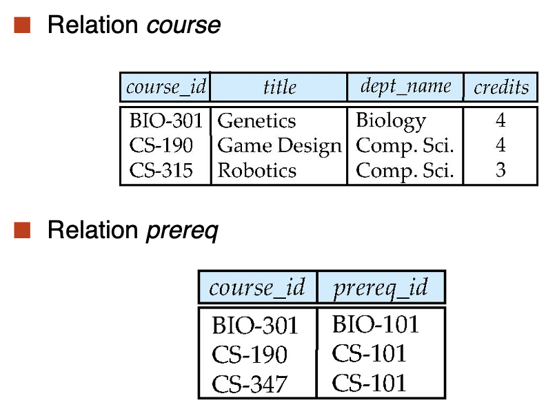
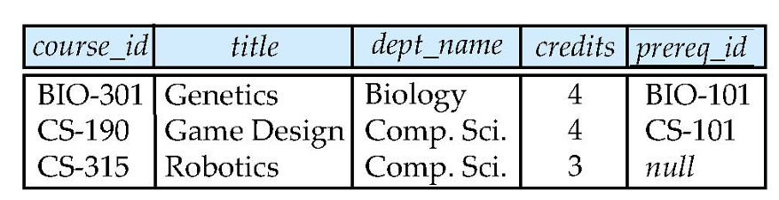
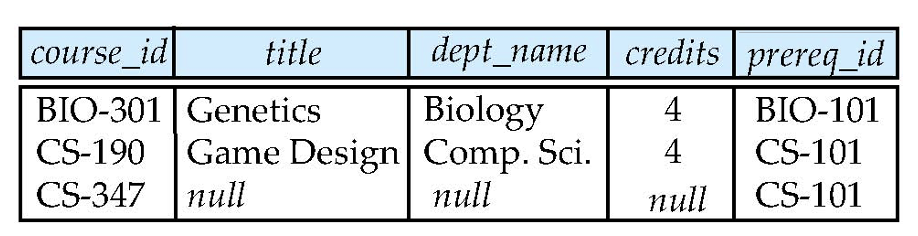
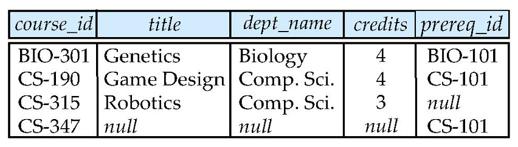

---
hide:
  #- navigation # 显示右
  #- toc #显示左
  - footer
  - feedback
comments: true
--- 

# Chapter 04 : Intermediate SQL

## Joined Relations

- 连接操作输入两个关系，并返回另一个关系
- 连接操作通常用作 from 子句中的子查询表达式
- 连接条件（Join Condition）——定义两个关系中的哪些元组匹配，以及连接结果中存在哪些属性
- 连接类型（Join type）——定义如何处理每个关系中与另一个关系中的任何元组不匹配的元组（基于连接条件）


***
### Natural Join

- `from` 子句获得的是求解好后的新关系，因此有些实现不支持再用原来的关系名访问原属性
- 可以用多个 `natural join` 来连接多个关系

```sql
select A1, A2, ..., An
from r1 natural join r2 natural join ... natural join rm
where P;
```

- 另外，使用 `join ... using` 子句可以从两个关系的同名属性中选择指定的属性，作为连接的依据，更加灵活

```sql
select name, title
from (student natural join takes) join course using (course_id);
```
***
### Join Conditions

- 除了 `join ... using` 外，还有更加通用的 `join ... on` 运算。只要 `where` 支持的谓词，`on` 条件均支持，因此能够表达更为丰富的连接条件

```sql
select *
from student join takes on student.ID = takes.ID;
```
***
### Outer Join

> 自然连接仅保留那些同名属性值相等的元组，那些不相等的元组都会被抛弃，但有时我们需要保留这些不相等的元组。这个时候，就需要用到**外连接**（Outer Joins）

外连接的作用类似自然连接，区别在于它会保留那些两个关系的同名属性值不相等的元组，将其放入新的关系中，并将其未被拼接的属性设为 null。SQL 提供了以下三种形式的外连接：

- **左外连接**（Left Outer Join）：使用 `left outer join` 运算符，仅保留第一个关系的所有元组
- **右外连接**（Right Outer Join）：使用 `right outer join` 运算符，仅保留第二个关系的所有元组
- **全外连接**（Full Outer Join）：使用 `full outer join` 运算符，保留所有关系的元组
    - 可以把它的返回结果看作是左外连接和右外连接结果的并集
    - 有些数据库系统不支持全外连接（比如 MySQL）

对应地，前面介绍的那些没有保留不匹配元组的连接方式称为**内连接**（Inner Join）。

- 在 SQL 语法中可以显式指出 `inner join`，但可以省略 `inner`，因为 `join` 子句默认是内连接的

在外连接中，`on` 和 `where` 子句的区别在于：

- `on` 子句会保留那些不符合条件的元组
- 而 `where` 子句会丢掉那些不符合条件的元组

!!! example "Example"

	我们有如下两个关系：
	
	
	
	可以发现课程 CS-315 对应的 prereq 不存在，以及 CS-437 的课程信息不存在
	
	- 如果我们使用 `course natural left outer join prereq`，这将 prereq 的结果保存下来，没有信息的课程 CS-315 结果设为 NULL：
	
	
	
	- 如果我们使用 `course natural right outer join prereq`，这将 course 的结果保存下来，没有信息的课程 CS-437 结果设为 NULL：
	
	
	
	- 如果我们使用 `course natural full outer join prereq`，这将 course 和 prereq 的结果保存下来，没有信息的课程 CS-315 和 CS-437 结果设为 NULL：
	
	
***
## SQL Data Types and Schemas

### User-Defined Types

- SQL 支持两种形式的用户**定义数据类型**（User-Defined Data Types）：
	- **区分类型**（Distinct Types）
	- **结构化数据类型**（Structured Data Types）：复杂的数据类型，包括嵌套记录结构、数组、多重集
- 不同的属性可能有相同的类型，但有时我们希望讲这些属性的类型区分开来，我们使用 `create type` 语句来定义用户定义数据类型中的区分类型
	
	```sql
	create type Dollars as numeric(12, 2) final;
	create type Pounds as numeric(12, 2) final;
	```
	
	- 定义了 `Dollars` 这个类型后，我们就可以把它当作元类型使用：
	
	```sql
	create table department  
	(dept_name varchar (20),  
	building varchar (15),  
	budget Dollars);
	```
	
	- 用户定义的这两个类型 `Dollars` 和 `Pounds`，虽然底层类型相同，但会被视为不同的类型。因此这两种类型不能直接进行运算，甚至不能与 `numeric` 类型运算，这时就需要用 `cast` 子句进行强制类型转换
***
### Domains

- SQL 的 `domain` 关键字提供了与 `type` 类似的功能，用于为底层类型添加完整性约束：
	
	```sql
	create domain person_name char(20) not null
	```
	
	- 我们还可以使用 `check` 子句来添加额外的约束条件：
	
	```sql
	create domain degree_level varchar(10)  
	constraint degree_level_test  
	check (value in (’Bachelors’, ’Masters’, ’Doctorate’));
	```

`type` 和 `domain` 之间的区别为：

- 域可以有约束，并且可以使用域类型的默认值
- 域并没有强制的类型要求。因此，只要底层类型是可兼容的，在某个域的值就可以被赋予另一个域类型的值
***
### Large-Object Types

> 很多数据库系统需要存储包含大数据项的属性，比如照片、高分辨率的图像或视频等。因此 SQL 为字符数据（`CLOB`）和二进制数据（`BLOB`）提供了**大对象数据类型**（Large-Object Data Types）

- BLOB：二进制大对象（Binary Large Object）——对象是未解释的二进制数据的大型集合（其解释由数据库系统之外的应用程序定义）
	- 在 MySQL 中，BLOB 数据类型有：
		- TinyBlob：0～255 字节
		- Blob：0～64K 字节
		- MediumBlob：0～16M 字节
		- LargeBlob：0～4G 字节
- CLOB：字符大对象（Character Large Object）——对象是大型字符数据的集合
- 当查询返回大型对象时，将返回指针，而不是大型对象本身。
***
## Integrity Constraints

- 完整性约束通过确保对数据库的授权更改不会导致数据一致性的丢失，来防止对数据库的意外损坏。对于一个关系来说，有以下几种：
	- not null：定义键值不允许为空
	- primary key
	- unique
		- `unique(A1, A2, ..., Am)` 指出属性 A1、A2、...Am 形成一个超级键（不一定是一个候选键）
		- 候选键允许为 null（与主键不同）
	- check(P)，其中 P 是一个谓词
		- 也可以有复杂查询，但许多数据库不支持。e.g. `check ((course_id, sec_id, semester, year) in (select course_id, sec_id, semester, year from teaches))`
	
	!!! example "Example"
	
		- 确保每个课程的学期为春夏秋冬其中之一
		
		```sql
		create table section (
		    course_id varchar (8),
		    sec_id varchar (8),
		    semester varchar (6),
		    year numeric (4,0),
		    building varchar (15),
		    room_number varchar (7),
		    time slot id varchar (4),
		    primary key (course_id, sec_id, semester, year),
		    check (semester in (’Fall’, ’Winter’, ’Spring’, ’Summer’))  
		);
		```
	
	- foreign key
***
### Referential Integrity

- **参照完整性**（Referential Integrity）确保在给定属性集的一个关系中出现的值也出现在另一个关系中的特定属性集中
	- 例如，如果 “Biology” 是出现在关系 instructor 的某个元组中的部门名称，则 “Biology” 的关系 department 中存在一个元组
- 在 SQL 中，参照完整性约束由外键实现，语法为：`FOREIGN KEY (dept_name) REFERENCES department`
	- 设 A 为一组属性。 设 R 和 S 是包含属性 A 的两个关系，其中 A 是 S 的主键。如果 A 的任何值出现在 R 中，这些值也出现在 S 中，则称 A 是 R 的外键
- 执行违反参照完整性约束的语句时会被拒绝。然而，对于在被参照关系上的更新和删除行为，如果违反约束，系统必须采取行动来改变参照关系的元组，以恢复约束。对于以下语句：
	
	```sql
	create table course (
	    foreign key (dept_name) references department
	    on delete cascade
	    on update cascade
	    ...
	);
	```
	
	以删除操作为例，如果要删除 `department` 里的元组，那么就会违背参照完整性约束，不过系统不会拒绝这个操作，而是通过级联（Cascade）删除的方式删除在 `course` 中参照在 `department` 中被删除元组的元组。更新操作与之同理
- 除了 `cascade` 关键字外，还可以设置 `set null` 或 `set default`，当违反约束时会触发这些操作

!!! question "如何避免违反约束？"

	例如，我们有如下关系：
	
	```sql
	create table person (
		ID char(10),
		name char(40),
		mother char(10),
		father char(10),
		primary key (ID),
		foreign key (father) references person,
		foreign key (mother) references person);
	```
	
	我们想要避免违反约束地插入一个元组，可以：
	
	- 在插入 person 之前插入一个人的父亲和母亲
	- 或者一开始将 father 和 mother 设置为 null，在插入所有人员后更新（如果 father 和 mother 属性声明为不为空，则无法进行）
	- 或者将约束检查推迟到事务结束
***
### Assertions

**断言**（Assertion）是表达一种希望数据库一直满足的条件的一种谓词。创建断言的语法为：

```sql
create assertion <assertion-name> check <predicate>;
```

!!! example "Example"

	- 验证一个学生获得的总学分，要等于获得的每门课的学分的总和
	
	```sql
	create assertion credits_earned_constraint check (
	    not exists (
	        select ID from student
	        where tot_cred <> (
	            select coalesce(sum(credits), 0)
	            from takes natural join course
	            where student.ID = takes.ID and grade is not null and grade <> 'F'
	        )
	    )
	);
	```
	
	因为 SQL 不提供一种 `for all X, P(X)` 的构造，因此只能用 `not exists X such that not P(X)` 这一等价形式表示
***
## Views

- 视图提供了一种机制，用于从某些用户的视图中隐藏某些数据。例如，考虑一个人，他需要知道 instructor 的姓名和部门，但不需要知道薪水。 此人应该会看到一个关系，在 SQL 中可以通过：
	
	```sql
	select ID, name, dept_name from instructor
	```
	
- 任何不属于概念模型但作为 “虚拟关系” 对用户可见的关系都称为视图
- view 可以隐掉一些细节，或者加上一些统计数据。可以把 view 当作表进行查询
	- 隐藏不必要的细节，简化用户视野
	- 方便查询书写
	- 有利于权限控制（如用户可以看到工资总和，但不能看到每个人的工资）
	- 有独立性，使得数据库应用具有较强的适应性
***
### View Definition

创建视图的语法为：

```sql
create view <view-name> as <query-expression>;
```

其中 `<query-expression>` 是任意一个合法的 SQL 表达式

- 定义视图后，视图名称可用于引用视图生成的虚拟关系，数据库系统只存储视图自身的定义，而不会存储查询表达式的求解结果
	- 当视图关系出现在其他查询语句时就会被替换为被存储的查询表达式
- 可以用视图定义其他视图，例如：
	
	```sql
	create view physics_fall_2009 as  
		select course.course_id, sec_id, building, room_number
		from course, section 
		where course.course_id = section.course_id
			and course.dept_name = ’Physics’
			and section.semester = ’Fall’
			and section.year = ’2009’;
	
	create view physics_fall_2009_watson as 
		select course_id, room_number
		from physics_fall_2009
		where building= ’Watson’;
	```
	
- 虽然看起来与 `with` 子句很像，但 `with` 子句创建的只是临时的关系，而 `create view` 创建的视图可以在后面一直使用，直到被手动销毁或程序中止
- 创建视图时还可以指定属性名：
	
	```sql
	create view departments_total_salary(dept_name, total_salary) as
    select dept_name, SUM(salary) from instructor
	group by dept_name;
	```
	

***


