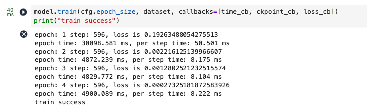
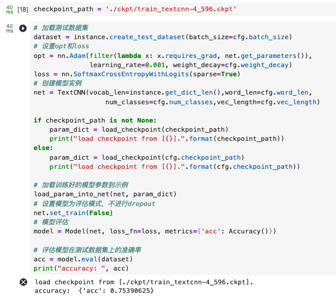
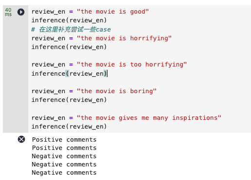

# Lab1-文本分类实验

|    学号    |  姓名  |
| :--------: | :----: |
| 3230104248 | 金祺书 |

## 1. Project Introduction

### 实验简介

情感分析是自然语言处理文本分类任务的应用场景之一，情感分类较为简单，实用性也较强。常见的购物网站、电影网站都可以采集到相对高质量的数据集，也很容易给业务领域带来收益。例如，可以结合领域上下文，自动分析特定类型客户对当前产品的意见，可以分主题分用户类型对情感进行分析，以作针对性的处理，甚至基于此进一步推荐产品，提高转化率，带来更高的商业收益。本实验主要基于卷积神经网络对电影评论信息进行情感分析，判断其情感倾向。实验目的如下：

- 理解文本分类的基本流程
- 理解 CNN 网络在文本任务中的用法
- 掌握 MindSpore 搭建文本分类模型的方法

### 开发环境及系统运行要求

- 开发平台：ModelArts Ascend Notebook
- 开发镜像：mindspore_1_7_0:mindspore_1.7.0-cann_5.1.0-py_3.7-euler_2.8.3-aarch64-d910-20220906
- 硬件要求：1 * Ascend Snt9 | 24 vCPUs | 96 GB
- 开发 IDE：Jupyter Notebook
- 开发包：Python3.7, MindSpore1.1

## **2.** Technical Details

### 理论知识

文本分类（Text Classification），又称文档分类（Document Classification），指的是将一个文档归类到一个或多个类别中的自然语言处理任务。文本分类的应用场景非常广泛，涵盖垃圾邮件过滤、垃圾评论过滤、自动标签、情感分析等任何需要自动归档文本的场合。

### 算法描述

本实验先将文本清洗并映射为定长词索引序列，再通过嵌入层+卷积提取局部语义特征，最后用全连接层输出类别。主要流程如下：

1. 读取 `rt-polarity.pos/neg` 影评数据；
2. 文本预处理（小写、去标点/数字、按空格分词）；
3. 构建词表并将句子转成定长向量（不足补 0，超长截断）；
4. 按正负样本分块后按 0.9 的比例划分训练/测试集；
5. 构建 TextCNN：40 维Embedding + 三路卷积核 + MaxPool + 拼接 + Dropout + 全连接；
6. 使用 SoftmaxCrossEntropyWithLogits 和 Adam 训练 4 轮；
7. 加载checkpoint 在测试集上评估准确率，并进行在线句子推理。

### 关键函数

- `MovieReview(...)`：数据预处理主类。完成读文件、清洗、分词、标签映射、向量化、划分训练测试集。关键参数：

  - `maxlen`：句子最大长度

  - `split`：测试集占比

- `text2vec(maxlen)`：将分词后的句子映射为词索引序列

- `split_dataset(split)`：将正负样本分别分块后抽取一块作为测试集，其余合并为训练集

- `create_train_dataset(epoch_size, batch_size) / create_test_dataset(batch_size)`：封装 MindSpore GeneratorDataset，生成训练与评估迭代器

- `TextCNN(vocab_len, word_len, num_classes, vec_length)`：模型定义。核心结构：

  - nn.Embedding：词嵌入层

  - 三路卷积核：大小分别为 3/4/5，输出通道均为 96

  - 池化后拼接得到 96*3 维特征

  - Dropout + nn.Dense 输出二分类

- `model.train(...)`：训练入口

- `model.eval(dataset)`：测试评估

- `preprocess(sentence) + inference(review_en)`：在线推理

## **3.** Experiment Results

训练过程：

- loss 从 0.1926 快速下降到 0.00027，说明训练集拟合充分且快速收敛

测试评估：

- 准确率约 75%

在线测试：

可以看到，"the movie is horrifying" 和 "the movie give me many inspirations" 有失偏颇，同时加入程度词 "too" 的对比可以看出：TextCNN 依赖局部特征，对强情感词通常有效（如 boring, too），但对语义需更长上下文或者情感并不强烈时易误判

还有可能的原因在于：

1. 预处理后若出现未记录的词，TextCNN 可能会直接忽略，信息损失明显
2. 某些词（如 horrifying）在训练集中可能和正向的标签绑定更多，导致“词义-标签”绑定错误。
3. 训练 loss 很低，但测试 accuracy 约 75.39%，说明可能过拟合，能力仍有限