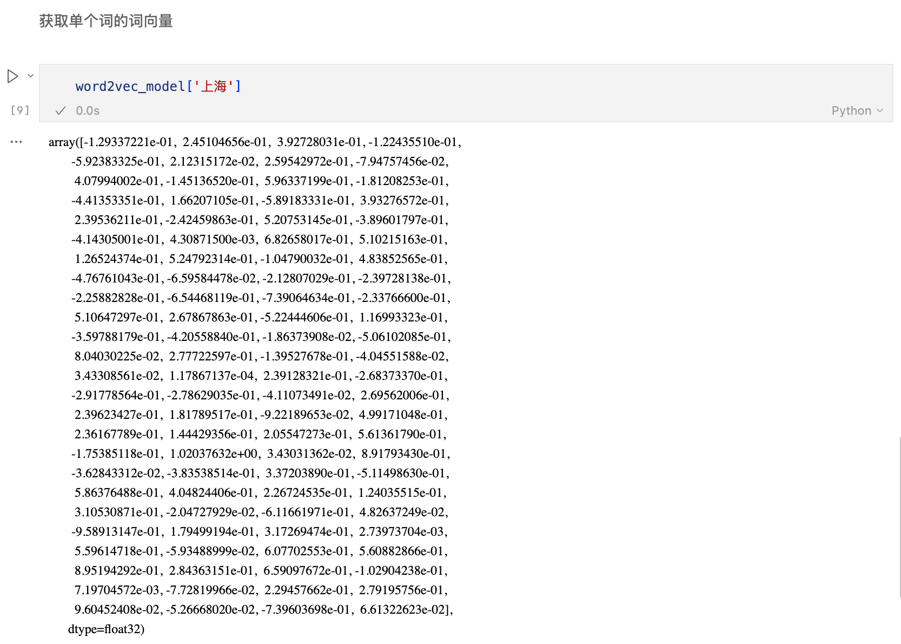
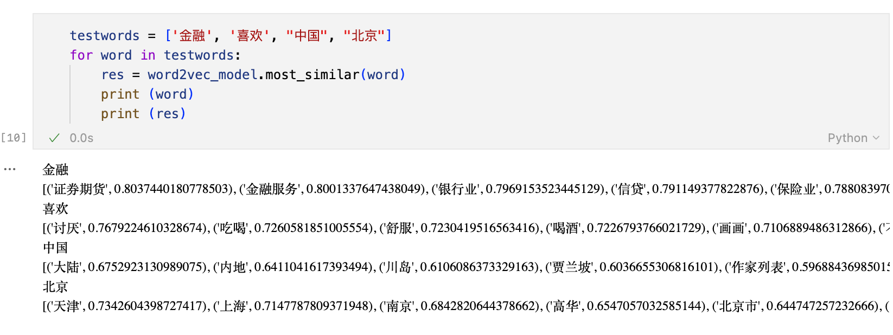
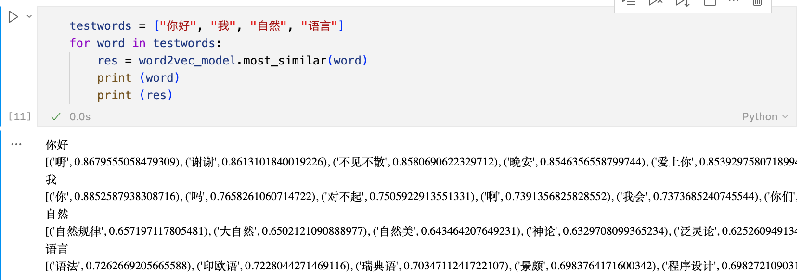

# Lab1-词向量实验

|    学号    |  姓名  |
| :--------: | :----: |
| 3230104248 | 金祺书 |

## 1. Project Introduction

### 实验简介

本实验主要描述了如何在 ModelArts 平台上完成词向量的训练，并应用于语义相似词的搜索、扩展。通过实验掌握词向量训练方法，实现基于 Python 和 gensim 框架实现 Word2Vec 在 Wikipedia 语料集上面的应用。

### 开发环境及系统运行要求

- 开发平台：ModelArts Ascend Notebook
- 开发镜像：mindquantum_0_11_0:mindquantum_0.11.0-cuda_12.4-py_3.11-ubuntu_22.04-x86_64-20251204191704-f7fdf41
- 硬件要求：1 * Pnt1(16GB) | 8 vCPUs | 64 GB
- 开发 IDE：Cursor
- 开发包：Python3.11, GenSim

## **2.** Technical Details

### 理论知识

词向量（Word embedding），又叫 Word 嵌入，是自然语言处理（NLP）中的一组语言建模和特征学习技术的统称，其中来自词汇表的单词或短语被映射到实数的向量。 从概念上讲，它涉及从每个单词一维的空间到具有更低维度的连续向量空间的数学嵌入。当用作底层输入表示时，单词和短语嵌入已经被证明可以提高 NLP 任务的性能，例如语法分析和情感分析。

### 算法描述

Word2vec 是 Google 在 2013 年开源的一款用于词向量计算的工具，一经发布就引起了工业界和学术界的关注。首先，Word2vec 可以在百万数量级的词典和上亿的数据集上进行高效地训练；其次，该工具训练得到的词向量（Word Embedding），可以很好地度量词与词之间的相似性。Word2vec 不是一种深度学习算法，其后面只是一个浅层神经网络，包含两种模型：CBOW 模型和 Skip-gram 模型。我们使用的是 Skip-gram 模型，它将离散词符号映射到连续向量空间，使语义相近的词在向量空间中距离更近。主要流程如下所示：

1. 读取语料 corpus.txt；
2. 构建词表并过滤低频词；
3. 采用 Skip-gram 训练词向量；
4. 导出向量到 embedding.txt；
5. 离线加载向量并进行相似词检索验证效果。

### 关键函数

- `Word2Vec(...)`：初始化并训练模型。关键参数：

  - `vector_size=100`：词向量维度

  - `window=5`：上下文窗口大小

  - `min_count=5`：过滤出现次数低于 5 次的词

  - `workers=cpu_count()`：并行线程数

  - `sg=1`：使用 Skip-gram 模型

- `KeyedVectors.load_word2vec_format(path)`：从离线文件加载词向量。

- `word2vec_model[word]`：获取单词向量。

- `word2vec_model.most_similar(word)`：返回相似词及相似度分数，用于语义效果验证。

## **3.** Experiment Results

获取单个词的词向量：

相似度测试：

从结果可以看到，模型能够学习到较明显的语义相关性，例如：

- 以“金融”为中心，返回“证券期货、金融服务、银行业、信贷、保险业”等词，说明模型捕捉到了金融领域的相关性
- 以“你好”“我”等高频日常词为中心，也能检索到礼貌用语、人称相关词
- 以“北京”为中心，返回“天津、上海、南京、北京市、广州”等地名，说明模型具备一定地理/实体关联能力

相似度分值基本在 0.6~0.9 区间，说明词向量空间中已形成邻域结构，模型训练有效。