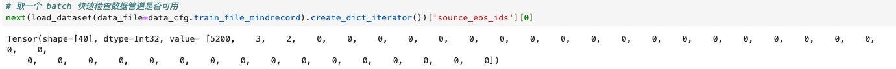
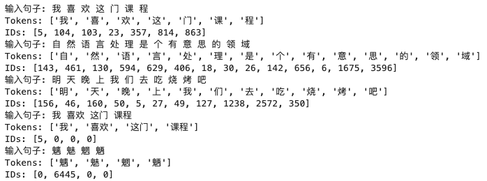
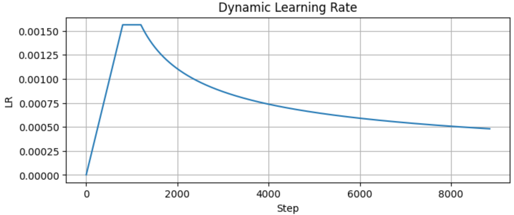

# Lab2-机器翻译实验

|    学号    |  姓名  |
| :--------: | :----: |
| 3230104248 | 金祺书 |

## 1. Project Introduction

### 实验简介

Transformer 是谷歌的研究人员提出的一种全新的模型，Transformer 在被提出之后，很快就席卷了整个自然语言处理领域。与循环神经网络等传统模型不同，Transformer 模型仅仅使用一种被称作自注意力机制的方法和标准的前馈神经网络，完全不依赖任何循环单元或者卷积操作。自注意力机制的优点在于可以直接对序列中任意两个单元之间的关系进行建模，这使得长距离依赖等问题可以更好地被求解。本实验将基于 MindSpore 框架训练一个 Transformer 中英翻译模型，包括数据预处理、模型构建、训练与推理。

### 开发环境及系统运行要求

- 开发平台：ModelArts Ascend Notebook
- 开发镜像：mindspore_1_7_0:mindspore_1.7.0-cann_5.1.0-py_3.7-euler_2.8.3-aarch64-d910-20220906
- 硬件要求：1 * Ascend Snt9 | 24 vCPUs | 96 GB
- 开发 IDE：Jupyter Notebook
- 开发包：Python3.7, MindSpore1.1

## **2.** Technical Details

### 理论知识

机器翻译是典型的序列到序列任务。Transformer 用自注意力机制替代循环结构，可以直接建模序列内任意 token 之间的关系，并支持并行训练。本实验使用 Encoder-Decoder 结构：Encoder 编码源句，Decoder 在训练时通过 teacher forcing 学习目标句，推理时自回归生成翻译结果，并用 Beam Search 保留候选序列。

### 算法描述

1. 数据准备：读取 `ch_en_all.txt` 和 `ch_en_vocab.txt`，使用 `WhiteSpaceTokenizer` 按空格分词并映射为 token id；为源句、目标句构造 `<s>` 与 `</s>` 版本。
2. 数据集构建：按约 8:2 划分训练集和测试集，并写入 MindRecord 格式，供 MindSpore 数据管道读取。
3. 模型训练：构建 base Transformer，使用动态学习率和 Adam 优化器训练 15 个 epoch。
4. 模型推理：加载训练得到的 checkpoint，使用 Beam Search 进行自回归解码并输出翻译结果。

### 关键函数

- `WhiteSpaceTokenizer`：按空格分词并完成 token-id 映射，未登录词映射为 `<unk>`，id 为 0。
- `data_prepare` / `write_instance_to_file`：划分数据集并生成 MindRecord。
- `load_dataset`：读取 MindRecord 并组装 batch。
- `TransformerModel` / `TransformerNetworkWithLoss`：定义 Transformer 前向网络和训练损失。
- `create_dynamic_lr`：生成动态学习率。
- `train` / `evaluate`：分别完成训练和推理。

### 思考题

将 `num_attention_heads` 从 8 改为 1 时，如果 `hidden_size=512` 不变，参数量通常不会显著变化，因为投影矩阵规模主要由 `hidden_size` 决定。但表达能力会下降，8 个 head 可以在多个子空间中关注不同依赖关系，1 个 head 只能学习单一注意力分布，更难同时捕捉多种语义和位置关系。

## **3.** Experiment Results

### 数据预处理与 Token 映射

数据预处理成功生成 MindRecord，训练数据读取如下：



Token 映射探索说明 `WhiteSpaceTokenizer` 严格按空格切分，且未登录词映射为 0：



其中 `"喜欢"`、`"这门"`、`"课程"` 因未按训练语料格式拆分而映射为 `<unk>`；生僻字中只有 `"魅"` 在词表中。这说明模型对分词格式和词表覆盖率较敏感。

### 学习率曲线



学习率先升高再衰减，可以降低训练初期不稳定风险，并在后期减小更新幅度。

### 训练过程

训练共运行 15 个 epoch、8850 个 step。第一个 epoch 因图编译耗时约 181953 ms，后续每个 epoch 约 27 s，每 step 约 45-47 ms。训练日志如下：

```text
epoch: 1, step: 1, outputs are [9.748046]
epoch 1 avg_loss:  5.4923
epoch 15 avg_loss: 3.3888
epoch: 15, step: 8850, outputs are [5.0457044]
```

平均 loss 从 5.4923 降到 3.3888，说明模型持续学习，但是最后 step loss 仍有明显波动，说明模型尚未完全收敛。

### 推理结果

经过测试，选取代表样例如下：

| Source      | Reference      | Result                  |
| ----------- | -------------- | ----------------------- |
| Get away !  | 走 开 ！       | 滚 ！                   |
| Fantastic ! | 很 棒 ！       | 很 棒 ！                |
| Hi .        | 你 好 。       | 如 果 你 戒 烟 戒 烟 。 |
| Have fun .  | 玩 得 开 心 。 | 暴 风 暴 风 暴 风 ...   |

### 扩展探索：Greedy vs Beam Search

将 `beam_width` 改为 1 后，结果明显退化。对比如下：

| Source                     | beam_width=1                            | beam_width=4            |
| -------------------------- | --------------------------------------- | ----------------------- |
| Get away ! / 走 开 ！      | 伦 敦 的 时 候 ， 他 们 开 始 开 始 ... | 滚 ！                   |
| Fantastic ! / 很 棒 ！     | 多 美 国 菜 ！                          | 很 棒 ！                |
| Hit Tom . / 去 打 汤 姆 。 | 汤 姆 应 该 在 暑 假 期 待 了 。        | T o m 应 该 在 医 院 。 |

`beam_width=1` 近似贪心搜索，更容易陷入局部最优，并出现 `"看看看"`、`"戒烟戒烟"`、`"开始开始"` 等重复输出；`beam_width=4` 在部分短句上明显更好，但仍不能完全解决语义漂移。

### Bad Case 分析

评估结果中存在明显的翻译失败案例：

| Source                                                       | Reference                                    | Bad Result                        |
| ------------------------------------------------------------ | -------------------------------------------- | --------------------------------- |
| Hi .                                                         | 你 好 。                                     | 如 果 你 戒 烟 戒 烟 。           |
| Have fun .                                                   | 玩 得 开 心 。                               | 暴 风 暴 风 暴 风 ...             |
| The recent shortage of coffee has given rise to a lot of problems . | 近 来 咖 啡 的 短 缺 造 成 了 许 多 问 题 。 | 没 有 人 在 F a c e b o o o o ... |

这些 bad case 主要表现为语义漂移和重复生成。可能原因包括：

1. 训练轮次和数据规模有限，模型尚未充分收敛；
2. 基于空格的词表分词方式较简单，遇到 OOV 或低频表达时信息损失较大；
3. 长句和专有名词更容易触发解码错误；
4. 推理阶段自回归生成会累积前面 token 的错误。

### 优化尝试

在优化版实验中，我启用了训练集 shuffle，将训练轮次增加到 30，并设置 `beam_width=4`、`max_decode_length=30`、`length_penalty_weight=0.6`。训练结果如下：

```text
epoch 1 avg_loss:  5.2764
epoch 10 avg_loss: 3.7741
epoch 30 avg_loss: 3.6849
epoch: 30, step: 17700, outputs are [3.9045205]
```

优化版在部分短句上有改善：

| Source       | Reference      | Result               |
| ------------ | -------------- | -------------------- |
| Call me .    | 联 系 我 。    | 请 打 电 话 给 我 。 |
| I ' m ill .  | 我 生 病 了 。 | 我 生 病 了 。       |
| I can swim . | 我 会 游 泳 。 | 我 会 游 泳 。       |
| I need you . | 我 需 要 你 。 | 我 需 要 你 。       |

但长句和低频表达仍存在明显错误，例如：

| Source                                     | Reference                        | Bad Result               |
| ------------------------------------------ | -------------------------------- | ------------------------ |
| Thank you .                                | 谢 谢 。                         | 你 错 了 。              |
| The moon is the earth ' s only satellite . | 月 球 是 地 球 唯 一 的 卫 星 。 | 价 格 上 涨 了 。        |
| My sister often cries .                    | 我 妹 妹 经 常 哭 。             | 我 哥 哥 哥 哥 哥 哥 ... |

总体来看，优化后短句翻译有一定改善，但第 10 轮后 loss 下降趋缓，长句和低频表达仍存在语义漂移与重复生成，说明瓶颈不只是训练轮次，还包括数据规模、分词方式和解码质量。
