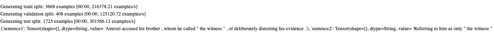
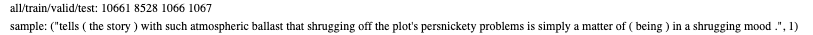
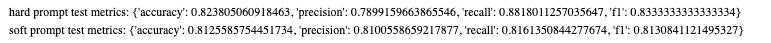

# Lab3-基于 MindSpore 的 Prompt Tuning 实验

|    学号    |  姓名  |
| :--------: | :----: |
| 3230104248 | 金祺书 |

## 1. Project Introduction

### 实验简介

Prompt Learning 是一种利用预训练语言模型完成下游任务的方法。它通过在输入中加入提示信息，使模型更明确地理解当前任务。本实验基于 MindSpore 和 MindNLP，使用 RoBERTa-large 模型完成提示学习实验。实验内容包括：先运行 GLUE/MRPC 数据集上的软提示训练框架，再将该框架迁移到本地 `rt-polarity` 情感分类数据集上，实现硬提示与软提示两种训练方式，并比较二者在二分类情感分析任务上的效果。

### 开发环境及系统运行要求

- 开发平台：ModelArts Ascend Notebook
- 开发镜像：`mindspore_2.4.0-cann_8.0.rc3-py_3.9-euler1.0-aarch64-snt9b`
- 硬件要求：`1 * ascend-snt9b1 | ARM 24 核 192GB`
- 开发 IDE：Jupyter Notebook
- 开发包：Python3.9, MindSpore2.4.0, MindNLP0.4.0, Transformers4.40.0

## **2.** Technical Details

### 理论知识

提示学习的核心思想是将下游任务转化为更接近预训练模型原始学习目标的形式。对于文本分类任务，模型不再只接收原始句子，而是接收带有任务提示的信息，从而更容易判断输入文本的语义类别。

硬提示学习使用人工设计的固定文本模板，例如在影评后添加 `"Overall sentiment:"`。这种方式简单直观，但提示模板质量会直接影响结果。

软提示学习不使用固定自然语言模板，而是在输入 embedding 前拼接一组可训练的虚拟 token。训练时大部分预训练模型参数被冻结，只更新 soft prompt 参数和任务头，因此参数效率更高，适合资源受限场景。

### 算法描述

1. GLUE 示例运行：加载本地 RoBERTa-large 和 GLUE/MRPC parquet 数据，使用 `PromptTuningConfig` 构造软提示任务，验证原始框架可以正常训练和评估。
2. 数据准备：读取 `rt-polarity.neg` 和 `rt-polarity.pos`，分别标记为负类 0 和正类 1；进行小写化、空白清理，并按 8:1:1 划分训练集、验证集和测试集。
3. Tokenizer 处理：使用 RoBERTa tokenizer 将文本转化为 `input_ids` 和 `attention_mask`，再通过 `GeneratorDataset` 和 `padded_batch` 构造 MindSpore 数据集。
4. 硬提示训练：将输入改写为 `Review: {text} Overall sentiment:`，加载 `AutoModelForSequenceClassification`，默认冻结 RoBERTa 主体，只训练分类头。
5. 软提示训练：不添加自然语言模板，使用 `PromptTuningConfig(task_type="SEQ_CLS", num_virtual_tokens=10)` 注入可训练 soft prompt，并训练软提示参数。
6. 测试评估：在测试集上计算 accuracy、precision、recall 和 F1，对比硬提示与软提示效果。

### 关键函数

- `AutoTokenizer.from_pretrained`：加载本地 RoBERTa tokenizer。
- `AutoModelForSequenceClassification.from_pretrained`：加载 RoBERTa 序列分类模型。
- `PromptTuningConfig`：配置软提示任务类型和 virtual token 数量。
- `get_peft_model`：将基础模型包装为 PEFT 软提示模型。
- `MapFunc` / `get_dataset`：GLUE/MRPC 示例中的分词与 batch 构建函数。
- `SentimentGenerator`：将本地情感分类文本转化为模型输入特征。
- `create_sentiment_dataset`：构造 MindSpore 情感分类数据集。
- `train_sentiment_model`：完成训练循环、反向传播和学习率调度。
- `evaluate_sentiment` / `compute_metrics`：计算分类指标。

## **3.** Experiment Results

### GLUE/MRPC 软提示框架运行

首先运行 `roberta_sequence_classification.ipynb` 中原始 GLUE/MRPC 软提示代码，完成模型、tokenizer、数据集和 PEFT 配置加载。



训练过程中，模型只更新少量 prompt tuning 参数，验证集每个 epoch 后输出 accuracy 和 F1。

### 本地情感分类数据预处理

本地数据集包含两个文件：

- `rt-polarity.neg`：负面影评，标签为 0；
- `rt-polarity.pos`：正面影评，标签为 1。

预处理阶段对文本进行了小写化、空白符清理，并按类别分层划分训练集、验证集和测试集。数据读取结果如下：



数据集共包含 10661 条样本，划分结果为：

| Split | Size |
| ----- | ---- |
| Train | 8528 |
| Valid | 1066 |
| Test  | 1067 |

### 硬提示训练

硬提示模板设置为：

```text
Review: {text} Overall sentiment:
```

训练时将每条影评填入模板，再交给 RoBERTa tokenizer 编码。为了降低显存占用，实验中默认冻结 RoBERTa 主体，只训练分类头。

### 软提示训练

软提示阶段不使用自然语言模板，而是直接输入原始影评文本，并通过 PEFT 注入 10 个 virtual tokens：

```python
PromptTuningConfig(
    task_type="SEQ_CLS",
    num_virtual_tokens=10,
)
```

### 硬提示与软提示对比



| Method      | Accuracy | Precision | Recall | F1     |
| ----------- | -------- | --------- | ------ | ------ |
| Hard Prompt | 0.8238   | 0.7899    | 0.8818 | 0.8333 |
| Soft Prompt | 0.8126   | 0.8101    | 0.8161 | 0.8131 |

从结果看，硬提示在本次实验中略优于软提示。硬提示的 recall 较高，说明它对正类样本识别更充分；软提示的 precision 略高，但整体 F1 低于硬提示。
