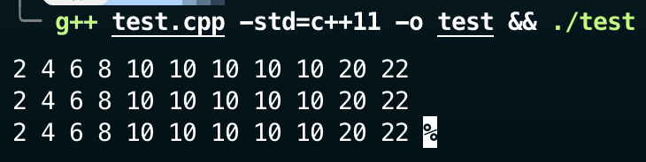
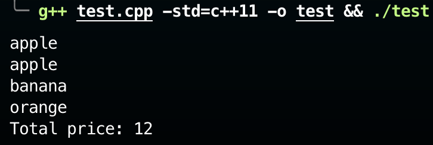
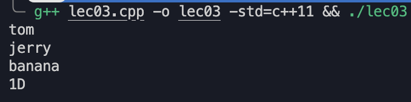
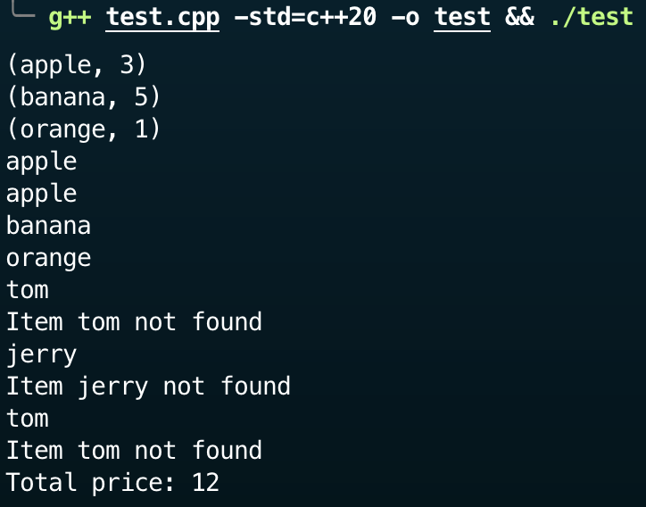
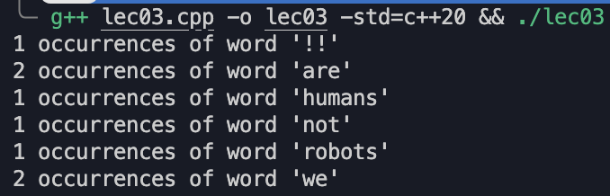
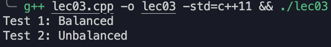
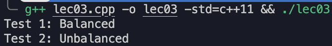

---
hide:
  #- navigation # 显示右
  #- toc #显示左
  - footer
  - feedback
comments: true
--- 

# Chapter 02 : STL Containers

C++ 的一大重要概念是**容器对象**（Collection Objects），它是能够存储其他任意数量对象的对象

容器对象来自 **STL**（Standard Template Library，标准模板库），它是 ISO 标准下的 C++ 库的一部分，包含了各种数据结构和算法。

- 使用 STL 的原因：
    - 节省开发时间：有现成的数据结构
    - 代码可读性更强
    - 鲁棒性
    - 可移植的代码
    - 可维护的代码
    - 容易使用
- STL 的组成部分：容器（Containers）、算法（Algorithms）、迭代器（Iterator）
- STL 中最常用的三个数据结构：
    - `map`（映射）：支持任意键值类型
    - `vector`（向量）：类似 C 数组，但是可以自动扩展
    - `list`（列表）：双向链表
- STL 中的顺序容器（Sequential Containers）有 `vector`、`deque`（Dual-End Queue，双端队列）、`list`、`forward_list`（前向列表）、`array`、`string`
***
C++ 标准库（Standard Library）包括：

- Pair 类：万物皆可配对，比如 int/int，int/char 等等
- 容器（Container）
    - 向量：可扩展数组
    - 双端队列（Deque）：两端均可扩展的数组
    - 列表（Lists）：双向链表
    - 集合（Sets）和映射（Maps）
- 基本算法：排序、搜索等等
- 在库内的所有标识符（Identifier）都在 `std` 名称空间内
***
## Vectors

- `vector` 是一种**泛型类**（Generic Class）。这种类需要指定两种类型，其中一个是容器自身的类型（这里是 `vector`），另一个是容器内元素的类型（上例中就是 `int`）
- `vector` 的内部空间可按需扩大：当有更多项被放入时，它就会为这些项提供足够的空间
- `vector` 会记录当前保存的项数，可以用 `size()` 方法读取
- `vector` 内部项的顺序即为项的插入顺序，因此可按相同的顺序检索
- 基本的运算：
    - 构造函数（Constructors）：
        - `vector<Elem> c;`
        - `vector<Elem> c1(c2);`
    - 获取大小：
        - `V.size()`：当前容器内项数
        - `V.empty()`：是否为空，相比 `.size()` 速度更快
        - `V.capacity()`：在当前分配的存储空间内最多可以存放的项数
    - 迭代器：
        - `I.begin()`：获取第一个位置
        - `I.end()`：获取最后一个位置
    - 元素访问：
        - `V.at(index)`
            - 该方法会进行边界检查，如果越界，编译器会抛出异常，更加安全
        - `V[index]`
            - 注意：不能用这种方法修改元素！
            - 该方法不会做边界检查，如果越界的话，则行为不可预测，是未定义的行为（Undefined Behaviour），因此速度快，但不安全
        - `V.front()`：第一项
        - `V.back()`：最后一项
    - 添加 / 删除 / 查找：
        - `V.push_back(e)`
        - `V.pop_back()`
        - `V.insert(pos, e)`，其中 `pos` 是迭代器变量
        - `V.clear()`：清空向量内所有元素
        - `find(first, last, item)`，其中 `first`、`last` 是迭代器变量，返回的是位于 `first` 和 `last` 之间的迭代器，如果没有找到的话则返回 `last`
    - 其他：
        - 支持比较运算符 `== != < > <= >=`
        - `V.swap(v2)`：交换
		- 更多请见 [cppreference: vector](https://en.cppreference.com/w/cpp/container/vector)

!!! example "Example"

	```c++ title="Example.cpp"
	#include<iostream>
	#include<vector>
	using namespace std;
	
	int main(){
		vector<int> evens {2, 4, 6, 8};
		evens.push_back(20);
		evens.push_back(22);
		evens.insert(evens.begin() + 4, 5, 10);
		
		for(int i = 0; i < evens.size(); i++)
			cout << evens[i] << " ";
		cout<< endl;
		for(vector<int>::iterator it = evens.begin(); it < evens.end(); it++)
			cout << *it << " ";
		cout << endl;
		for(int e: evens)
			cout << e << " ";
		cout << endl;
	}
	```
	
	- 上例需要 `g++ Example.cpp -std=c++11` 改变标准编译
	- `push_back()` 表示在 vector 后插入一个元素
	- `insert(index, count, value)` 表示在 index 位置插入 count 个 value 
	- 上例 11-13 行，14-16 行和 17-19 行是等价的，14-16 行采用了 vector 当中的迭代器，更加模板化
	
	
***
## Lists

与向量类似：

- 构造函数
- 能使用比较运算符比较列表
- 能够访问列表的首尾元素：`x.front()`、`x.back()`

列表相关的函数：

```c++
x.push_back(item)
x.push_front(item)
x.pop_back()
x.pop_front()
x.erase(pos1, pos2)
x.count()
x.reverse(size)
x.resize()
```

列表元素大小不确定，因此使用迭代器对列表遍历时，只能使用 `==` 或 `!=` 比较运算符

- C++ 无法为列表预留空间，所以列表没有 `capacity()` 函数
- 更多请见 [cppreference : list](https://en.cppreference.com/w/cpp/container/list)

!!! tip "数据结构该如何选取？"

	- 除非有别的理由，通常使用 `vector`
	- `vector` 的排序速度很快
	- 如果程序里有很多小的元素，且对空间要求较高的话，不要使用 `list` 或 `forward_list`
	- 如果程序要求对元素的随机访问，那么就用 `vector` 或 `deque`
	    - `vector` 是动态分配的数组，而 `deque` 是一块块连接起来的（Linked-blocks）数组，因此后者的访问时间更长
	- 如果程序需要在容器中间插入元素，那么使用 `list` 或 `forward_list`
	- 如果程序仅需要再首尾两端插入元素，无需在中间插入元素，那么就用 `deque`
***
## Maps

- **映射**（Maps）是一种关联容器（类似 Python 中的字典），用于存储由**键**（Keys）及其映射值构成的元素，以特定顺序排列
- 键常用于排序或识别唯一的元素，映射值存储对应键的内容
- 可用 `[]` 运算符，通过键来访问映射值
    - 如果访问不存在的键，就会创建一个新的键
- 映射像二叉搜索树那样实现

!!! example "Example"

	=== "Example 01"
	
		```c++ title="Example01.cpp"
		#include<iostream>
		#include<map>
		using namespace std;
		
		int main()
		{
			map<string, int> price;
			price["apple"] = 3;
			price["banana"] = 5;
			price["orange"] = 1;
		
			string item;
			int total = 0;
			while(cin >> item)
				total += price[item];
			cout << "Total price: " << total << endl;
			return 0;
		}
		```
		
		
		
		但是上例有一些问题，如果输入一些不存在的物品，会有这样的情况：
		
		
		
		因此对于 map 里面没有的东西，我们需要注意！
	
	=== "Example 02"
	
		```c++ title="Example02.cpp"
		#include<iostream>
		#include<map>
		using namespace std;
		
		int main(){
			map<string, int> price;
			price["apple"] = 3;
			price["banana"] = 5;
			price["orange"] = 1;
			
			for(const auto& p: price)
				cout << "(" << p.first << ", " << p.second << ")" << endl;
			
			string item;
			int total = 0;
			while(cin >> item){
				if(price.contains(item) == false)
					cout << "Item " <<  item << " not found" << endl;
				else
					total += price[item];
			}
			cout << "Total price: " << total << endl;
			return 0;
		}
		```
		
		
		
		- 其中 contains 函数是 c++20 标准，需要用 `-std=c++20` 编译
	
	=== "Example 03"
	
		```c++ title="Example03.cpp"
		#include<iostream>
		#include<map>
		#include<string>
		using namespace std;
		
		int main(){
		    map<string, int> word_map;
		    for(const auto& w : {"we", "are", "not", "humans", "we", "are", "robots", "!!"})
		        ++word_map[w];
		    for(const auto& [word, count] : word_map)
		        cout << count << " occurrences of word '" << word << "'\n";
		    return 0;
		}
		```
		
		

- 更多请见 [cppreference : map](https://en.cppreference.com/w/cpp/container/map)
***
## Stacks

Stack 在 STL 中体现出了 “Adapter” 的思想，即利用一些已有的模板添加上一些属于 Stack 的特性（即 Adapter），最后封装成为了栈模块

!!! example "Example"

	```c++ title="Stack.cpp"
	#include<iostream>
	#include<stack>
	#include<string>
	using namespace std;
	
	bool is_balanced(string s){
	    stack<char> st;
	    for(char c : s){
	        if(c == '(' || c == '{' || c == '[')
	            st.push(c);
	        else if(c == ')' || c == '}' || c == ']'){
	            if(st.empty())
	                return false;
	
	            char top = st.top();
	            st.pop();
	
	            if((c == ')' && top != '(') || (c == '}' && top != '{') || (c == ']' && top != '['))
	                return false;
	        }
	    }
	    return st.empty();
	}
	
	int main(){
	    string test1 = "a(b{c[d]e}f)g";
	    string test2 = "x(y{z[)}}";
	
	    cout << "Test 1: " << (is_balanced(test1) ? "Balanced" : "Unbalanced") << endl;
	    cout << "Test 2: " << (is_balanced(test2) ? "Balanced" : "Unbalanced") << endl;
	    return 0;
	}
	```
	
	

??? question "为什么说 Stack 体现了 Adapter 的思想呢？"

	事实上，Stack 就是在其他 STL 工具的基础上添加转嫁封装形成的一个个接口，我们也可以以 Vector 为基础构建一个 Stack（还是以上面的例子为例）
	
	```c++ title="Custom_Stack.cpp"
	#include<iostream>
	#include<string>
	using namespace std;
	
	template<typename T>
	class Stack{
	public:// virtual 表示这是一个纯虚函数的接口, 子类继承它必须实现这些函数
	    virtual ~Stack() default;// default 也可写成 {}
	    virtual T& top() = 0;
	    virtual bool empty() const = 0;
	    virtual size_t size() const = 0;
	    virtual void push(const T& value) = 0;
	    virtual void pop() = 0;
	};
	
	//Adapter
	template<typename T>
	class c_stack : public Stack<T>{
	public:
	    T& top() override{return c.back();}
	    bool empty() const override{return c.empty();}
	    size_t size() const override{return c.size();}
	    void push(const T& value) override{c.push_back(value);}
	    void pop() override{c.pop_back();}
	private:
	    vector<T> c;
	};
	
	bool is_balanced(string s){
	    c_stack<char> st;
	    for(char c : s){
	        if(c == '(' || c == '{' || c == '[')
	            st.push(c);
	        else if(c == ')' || c == '}' || c == ']'){
	            if(st.empty())
	                return false;
	
	            char top = st.top();
	            st.pop();
	
	            if((c == ')' && top != '(') || (c == '}' && top != '{') || (c == ']' && top != '['))
	                return false;
	        }
	    }
	    return st.empty();
	}
	
	int main(){
	    string test1 = "a(b{c[d]e}f)g";
	    string test2 = "x(y{z[)}}";
	
	    cout << "Test 1: " << (is_balanced(test1) ? "Balanced" : "Unbalanced") << endl;
	    cout << "Test 2: " << (is_balanced(test2) ? "Balanced" : "Unbalanced") << endl;
	    return 0;
	}
	```
	
	结果仍然一样：
	
	