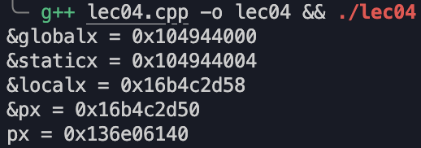

---
hide:
  #- navigation # 显示右
  #- toc #显示左
  - footer
  - feedback
comments: true
--- 

# Chapter 03 : Memory Model

!!! abstract "Lead-in"

	```c++
	int a; // Global Vars.
	static int b; // Static Global Vars.
	
	void f(){
		int k; // Local Vars.
		static int l; // Static Local Vars.
		
		int *p = malloc(sizeof(int)); // Allocated Vars.
	}
	```
	
	上面的程序展现了 C++ 中的四种变量类型，也是这个章节需要介绍的部分

## Memory Layout


上面的图展示了程序在内存中的布局，其中：

- Stack：存放函数的局部变量
- Heap：存放动态分配的内存
- Code / Data：存放全局变量，静态全局变量和静态局部变量

!!! example "Example"

	我们可以写个程序来看不同类型变量的地址：
	
	```c++
	#include<cstdlib>
	#include<iostream>
	using namespace std;
	
	int globalx = 10;
	
	int main(){
	    static int staticx = 3;
	    int localx = 5;
	    int *px = (int*)malloc(sizeof(int));
	
	    cout << "&globalx = " << &globalx << endl;
	    cout << "&staticx = " << &staticx << endl;
	    cout << "&localx = " << &localx << endl;
	    cout << "&px = " << &px << endl;
	    cout << "px = " << px << endl;
	    free(px);
	
	    return 0;
	}
	```
	
	运行结果如下：
	
	
	
	可以看到，静态全局变量和全局变量的地址是比较接近的，而局部变量和指针（普通的局部变量）是比较接近的，指针动态分配的地址是比较远的。

## Global Vars

- 全局变量定义于所有函数之外，可以在不同的 .cpp 文件中共享
	- 共享需要使用 `extern` 关键字
	
	!!! example "Example"
	
		


