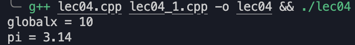
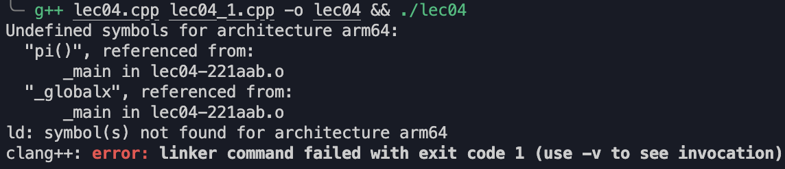
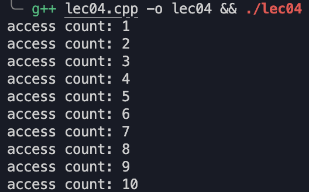
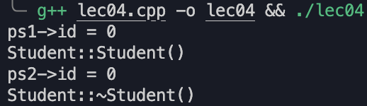
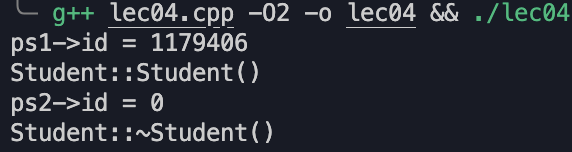

---
hide:
  #- navigation # 显示右
  #- toc #显示左
  - footer
  - feedback
comments: true
--- 

# Chapter 03 : Memory Model

!!! abstract "Lead-in"

	```c++
	int a; // Global Vars.
	static int b; // Static Global Vars.
	
	void f(){
		int k; // Local Vars.
		static int l; // Static Local Vars.
		
		int *p = malloc(sizeof(int)); // Allocated Vars.
	}
	```
	
	上面的程序展现了 C++ 中的四种变量类型，也是这个章节需要介绍的部分

## Memory Layout


上面的图展示了程序在内存中的布局，其中：

- Stack：存放函数的局部变量
- Heap：存放动态分配的内存
- Code / Data：存放全局变量，静态全局变量和静态局部变量

!!! example "Example"

	我们可以写个程序来看不同类型变量的地址：
	
	```c++
	#include<cstdlib>
	#include<iostream>
	using namespace std;
	
	int globalx = 10;
	
	int main(){
	    static int staticx = 3;
	    int localx = 5;
	    int *px = (int*)malloc(sizeof(int));
	
	    cout << "&globalx = " << &globalx << endl;
	    cout << "&staticx = " << &staticx << endl;
	    cout << "&localx = " << &localx << endl;
	    cout << "&px = " << &px << endl;
	    cout << "px = " << px << endl;
	    free(px);
	
	    return 0;
	}
	```
	
	运行结果如下：
	
	
	
	可以看到，静态全局变量和全局变量的地址是比较接近的，而局部变量和指针（普通的局部变量）是比较接近的，指针动态分配的地址是比较远的。

## Global Vars

- 全局变量定义于所有函数之外，可以在不同的 .cpp 文件中共享
	- 共享需要使用 `extern` 关键字，声明整个程序的某个地方会定义这个变量
	
	!!! example "Example"
	
		事实上，不光是普通的全局变量，函数也可以共享，我们编写一个 Lec04.cpp 文件：
		
		```c++ title="Lec04.cpp"
		#include<cstdlib>
		#include<iostream>
		using namespace std;
		
		extern int globalx = 10;
		double pi();
		
		int main(){
		    cout << "globalx = " << globalx << endl;
		    cout << "pi = " << pi() << endl;
		    return 0;
		}
		```
		
		这样直接编译是不行的，因为并没有其他的文件来共享 `globalx` 这个变量，我们再写一个 Lec04_1.cpp 文件：
		
		```c++ title="Lec04_1.cpp"
		int globalx = 10;
		
		double pi(){
		    return 3.14;
		}
		```
		
		使用编译命令时同时编译 Lec04.cpp 和 Lec04_1.cpp 两个文件就可以实现共享了：
		
		
***
### Static Vars

> Static（静态）一词关键体现在两个方面：永久的存储和受限的访问范围

- 静态全局变量只能在定义它的编译单元（即一个 .cpp 文件）中使用，不能在其他编译单元中使用

!!! example "Example"

	我们把上面的 Lec04_1.cpp 修改一下：
	
	```c++ title="Lec04_1.cpp"
	static int globalx = 10;
	
	static double pi(){
	    return 3.14;
	}
	```
	
	此时再次进行编译，会发现报错：
	
	
***
### Static Local Vars

- 静态局部变量只会在第一次调用函数时初始化，之后不会再次初始化，它会在多次调用函数时保持状态

!!! example "Example"

	```c++
	#include<cstdlib>
	#include<iostream>
	using namespace std;
	
	void access_count(){
	    static int count = 0;
	    cout << "access count: " << ++count << endl;
	}
	
	int main(){
	    for(int i = 0; i < 10; i++)
	        access_count();
	
	    return 0;
	}
	```
	
	编译运行结果如下：
	
	
	
	这说明静态局部变量在函数调用之间是保持状态的，每次调用函数时，静态局部变量的值不会进行初始化。这是因为静态局部变量的存储位置在全局数据区，而不是栈上，所以不会被释放
***
## Pointers to Objects

假设我们有：

```c++
string s = "hello"; 
string *ps = &s;
```
***
### Operators with pointers

我们也可以通过 `*ps` 来访问 `s` 这个对象，继而访问其成员函数：

```c++
string *ps = &s;
int len = (*ps).length(); // Get the length of string
int len = ps -> length(); // Equivalent to the above
```
***
### Two Ways to Access

```c++
string s; // 定义一个字符串对象，并且也被初始化了
string *ps; // 定义一个指向字符串对象的指针，但是并没有初始化
```
***
### Assignment

```c++
string s1, s2 = "hello";
s1 = s2; // Copy the value of s2 to s1

string *ps1, *ps2;
ps1 = ps2; // Copy the address of ps2 to ps1
```
***
### Defining References

```c++
char c; // A character
char* p = &c; // A pointer to a character
char& r = c; // A reference to a character
```

- 用 `type& refname = name` 可以为名为 `name` 的变量起一个别名 `refname`
	- 这里的 `r` 是 `c` 的别名，修改 `r` 也会修改 `c` 的值，即用 `r` 就是在用 `c`，用 `c` 就是在用 `r`
- 在函数的参数表 / 成员函数中使用引用也可以写为 `type& refname`，由函数调用者或者是类建立者来初始化

!!! example "Example"

	=== "In Definition"
	
		```c++
		int x = 3;
		int& y = x;
		const int& z = x;
		```
	
	=== "As a Function Argument"
	
	
		```c++
		void f(int& x)
		f(y) // Initialized when function is called
		```
		
		只有在函数被调用的时候 y 才会被“绑定”到 x 上
		
		- 需要注意的是，这里的函数调用是不能传递表达式的，例如 `f(y * 3)` 是不行的，因为 `y * 3` 是一个临时变量，无法被引用
			- 从术语上来说，需要传递的是一个左值（L-value，可以简单理解为在赋值操作中可以放在等号左边的值），而 `y * 3` 是一个右值（R-value）

- 引用并非是一个新的变量，而是一个已经存在的变量的别名，所以对一个引用的指针是不合法的，但是对一个指针的引用是合法的，也不存在一个引用的数组

```c++
int&* p; // Illegal
void f(int*& p); // OK
```
***
## Dynamic Memory Allocation

在 C++ 中，我们可以使用 `new` 和 `delete` 来动态分配和释放内存

```c++
int *p = new int; // Allocate memory for an integer
int stash = new Stash; // Allocate memory for a Stash object
int *arr = new int[10]; // Allocate memory for an array of 10 integers

delete p; // Release memory for an integer
delete stash; // Release memory for a Stash object
delete[] arr; // Release memory for an array of 10 integers
```

!!! question "思考"

	既然 `new` 和 `delete` 可以动态分配和释放内存，那么 `malloc` 和 `free` 呢？它们也可以动态分配和释放内存，那么它们之间有什么区别呢？
	
	事实上，`new` 和 `delete` 能使得对象的构造函数和析构函数得到正确的调用：
	
	```c++
	#include<cstdlib>
	#include<iostream>
	using namespace std;
	
	struct Student{
	    int id;
	    Student(){
	        id = 0;
	        cout << "Student::Student()" << endl;
	    }
	    ~Student(){
	        cout << "Student::~Student()" << endl;
	    }
	};
	
	int main(){
	
	    Student *ps1 = (Student*)malloc(sizeof(Student));
	    cout << "ps1->id = " << ps1->id << endl;
	    Student *ps2 = new Student;
	    cout << "ps2->id = " << ps2->id << endl;
	
	    free(ps1);
	    delete ps2;
	    return 0;
	}
	```
	
	运行可以得到如下结果：
	
	
	
	看起来 ps1 也得到了正确的结果，但是事实上并非如此，我们加 O2 优化编译选项：
	
	
	
	很明显能看出，`new` 和 `delete` 能够正确调用对象的构造函数和析构函数，而 `malloc` 和 `free` 则不能（甚至是初始化也不行）

!!! tips "Tips"

	- 不要将 `malloc` & `free` 与 `new` & `delete` 混用
	- 一定要记得释放动态分配的内存，否则会造成内存泄漏
		- 一般情况下，程序结束时会自动释放内存，但是如果是长时间运行的程序（或者是一直无法结束的程序），那么内存将会无限制的增长，最后导致崩溃
	- 不要重复释放内存，否则会造成程序崩溃
	- 当我们使用 `new` 分配单个对象时，使用 `delete`；当我们使用 `new[]` 分配数组时，使用 `delete[]`
	- `delete` 一个空指针是安全的
***
## Constant

- 我们使用 `const` 来定义一个常量，它的值在程序运行时不能被修改

```c++
const int x = 123;
x = 27; //Illegal!
x++; //Illegal!

int y = x; // ok, copy const to non-const
y = x; // ok, same thing
const int z = y; // ok, const is safer
```

- 常量的作用域和普通变量相同
- 常量在 C++ 中默认为内部链接（Internal Linkage），即在编译器中只是符号表的一个记录，并不是一个真正的变量
- 常量必须在定义时初始化，除非是 `extern` 声明的外部常量
***
### Pointers with Const

```c++
int a[] = {53, 54, 55};

int * const p = a; // p is const
*p = 20; // OK
p++; // ERROR

const int *p = a; // (*p) is const
*p = 20; // ERROR
p++; // OK
```

- `const int *p` 表示指针指向的内容是常量，指针本身是可以改变的
- `int * const p` 表示指针本身是常量，指针指向的内容是可以改变的

!!! example "Example"

	```c++
	int i;
	const int ci = 10;
	
	int* ip;
	const int* cip;
	
	ip = &i; // OK
	ip = &ci; // ERROR
	cip = &i; // OK
	cip = &ci; // OK
	
	*ip = 54; // OK
	*cip = 54; // ERROR
	```
	
	其中 `ip = &ci` 是错误的，因为 `ip` 是一个普通的指针，而 `ci` 是一个常量，绑定之后不能通过指针修改常量的值

- 对于 `char` 的字符数组来说，`char *s` 和 `const char *s` 是等价的，所以我们对于 `char *s` 定义的字符串也是不能修改的，如果需要修改，需要使用 `char s[]` 来定义
	- 这是因为 `s[]` 定义在栈上，而 `*s` 定义在代码段中（是只读的，无法修改）

!!! example "Example"

	```c++
	#include<cstdlib>
	#include<iostream>
	using namespace std;
	
	int main(){
	    const char *s1 = "Hello, World!";
	    char s2[] = "Hello, World!";
	    
	    cout << (void*)s1 << endl;
	    cout << (void*)s2 << endl;
	    cout << (void*)main << endl;
	
	    return 0;
	}
	```
	
	可以看到最终结果：
	
	