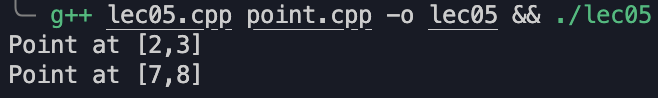
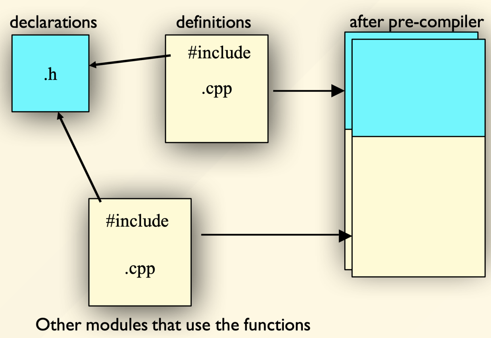
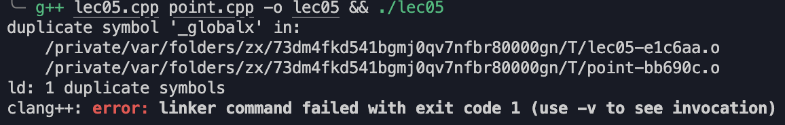
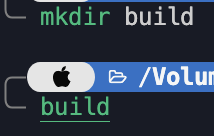
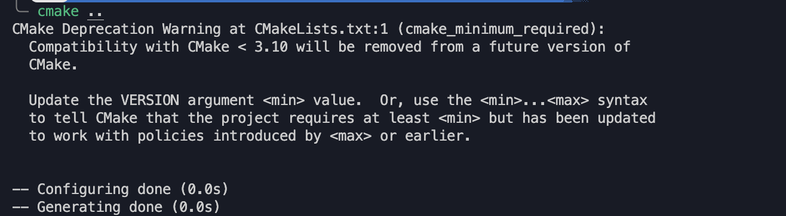
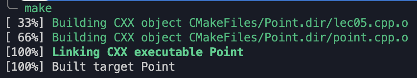
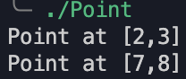
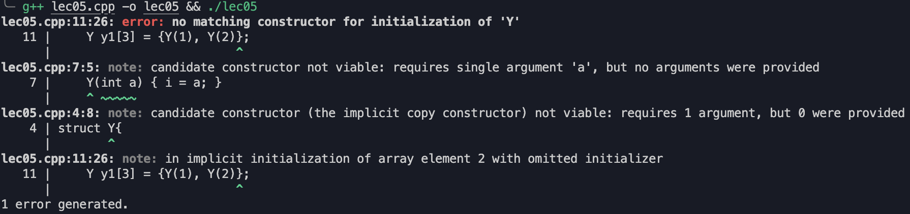

---
hide:
  #- navigation # 显示右
  #- toc #显示左
  - footer
  - feedback
comments: true
--- 

# Chapter 04 : Class

## Introduction

假设我们需要实现一个点移动的功能，正常情况下我们会这样写：

```c++
#include<iostream>
using namespace std;

int px, py;

int main(){
	px = 2, py = 3;
	cout << "Point at [" << px << "," << py << "]" << endl;

	px += 5, py += 5;
	cout << "Point at [" << px << "," << py << "]" << endl;
	return 0;
}
```


***
### Struct and Function

但是事实上，在工程中我们希望它成为一个进行封装过的，能够被更高层面的程序调用的功能，这时候我们有了结构体和函数：

```c++
#include<iostream>
using namespace std;

struct Point;
// Point* point_create();
void point_init(Point *p, int ix, int iy);
void point_print(Point *p);
void point_move(Point *p, int dx, int dy);

struct Point{
    int x, y;
};

void point_init(Point *p, int ix, int iy){
    p -> x = ix;
    p -> y = iy;
}

void point_print(Point *p){
    cout << "Point at [" << p -> x << "," << p -> y << "]" << endl;
}

void point_move(Point *p, int dx, int dy){
    p -> x += dx;
    p -> y += dy;
}

int main(){
    Point p;

    point_init(&p, 2, 3);
    point_print(&p);
    point_move(&p, 5, 5);
    point_print(&p);
    return 0;
}
```


 这样，不仅实现了原样的功能，代码的可读性也得到了提高（因为对于用户来说只需要看第 4～8 行 的内容就能知道这个结构体的功能）
***
### Member Function

上面其实对于 c 语言来说也可以同样实现，但是在 C++ 等一众面向对象编程语言中，上面的函数我们还可以并入 struct 当中使其成为结构体的成员函数：

```c++
#include<iostream>
using namespace std;

struct Point{
    int x, y;
    // Point* point_create();
    void init(int ix, int iy);
    void print();
    void move(int dx, int dy);
    ...
};

int main(){
	...
}
```

实现的功能还是相同的
***
### Private & Public

但是在上面的代码中，我们发现结构体的成员变量是可以直接访问的，这在工程中是不被允许的，我们希望这些变量只能通过结构体的成员函数来访问，而不是通过直接访问的方式，这时候我们就需要将这些变量设置为私有变量：

```c++
#include<iostream>
using namespace std;

struct Point{
private:
    int x, y;
public:
    // Point* point_create();
    void init(int ix, int iy);
    void print();
    void move(int dx, int dy);
    ...
}
	...
```

这样就实现了对于成员变量的封装，只能通过成员函数来访问

- 但是，仅仅靠 private 和 public 还是能让用户看到 struct 当中存在这些变量的，事实上还有一种 [Pimpl Technique](https://en.wikipedia.org/wiki/Pimpl) 可以实现更好的封装，隐藏 private 的成员，但是这里不做展开
***
## Objects

何为“对象”？在面向对象编程语言当中，对象可以抽象成两个部分：属性（Attributes）和服务（Services）

- 数据（Data）：属性或状态（例如上面的 `x, y`）
- 操作（Operation）：服务或行为（例如上面的 `init, print, move`）

在 C++ 中，对象只是一个变量，最纯粹的定义是“存储区域”，之前学习的结构变量只是C++中的对象

!!! example "Example"

	对于一个售票机来说，它可能会有以下属性和服务：
	
	- 属性：票价、余票、总票数
	- 服务：打印票、收钱、展现余票、打印错误…
	
	在 C++ 当中，我们可以定义一个类来表示这个售票机：
	
	```c++
	class TicketMachine{
	private:
	    const int PRICE;
	    int balance;
	    int total;
	public:
	    void getMoney();
	    void printTicket();
	    void showBalance();
	    void printError();
	};
	```

??? question "Question"

	说了这么多，对象和类到底有什么关系和区别？
	
	事实上，类就是对象抽象出来的模板，而对象就是类的实例化，我们把对象比作一只猫，描述这只猫独有的特点，那么类就是猫这一类群体，描述了猫的共性。
	
	对象表示事物、事件或概念，会在运行时响应消息；而类则定义对象这类实例的属性和行为（有点像 `typedef`）

!!! example "Example"

	回到上面的点的例子，对于开发者来说，他需要定义点的属性和服务，那么我们就可以定义一个类来表示这个点：
	
	```c++ title="Point.h"
	class Point{
	private:
	    int x, y;
	public:
	    void init(int ix, int iy);
	    void print();
	    void move(int dx, int dy);
	};
	```
	
	```c++ title="Point.cpp"
	#include "point.h"
	#include <iostream>
	using namespace std;
	
	void Point::init(int ix, int iy){
	    x = ix;
	    y = iy;
	}
	
	void Point::print(){
	    cout << "Point at [" << x << "," << y << "]" << endl;
	}
	
	void Point::move(int dx, int dy){
	    x += dx;
	    y += dy;
	}
	```
	
	那么对于用户来说，他只需要调用这个类的服务即可完成更高层面的调用：
	
	```c++ title="main.cpp"
	#include<iostream>
	#include "point.h"
	using namespace std;
	
	int main(){
	    Point p;
	
	    p.init(2, 3);
	    p.print();
	    p.move(5, 5);
	    p.print();
	    return 0;
	}
	```
	
	同样也能实现原样的功能：
	
	
	
	- 需要注意的是，C++ 建议将类的声明和定义分开（就像我们这里使用 Point.h 来声明，用 Point.cpp 来定义具体功能），这样可以更好的维护代码
		- .h 文件就像是作者和使用者之间的合约，讲述了所有的函数、类、变量等等的声明，而所有的定义都在 .cpp 文件中
	
	

总的来说，OOP 就是认为所有的事物都是对象，程序就是一些对象，他们通过消息传递来交互，而不是直接操作对象，每一个对象都有自己的状态和行为（可以看作一个个 Agent）
***
## `::` Resolver

在上面的例子中，我们使用了 `Point::` 来指定这个函数是属于 `Point` 这个类的，这个操作符叫做作用域解析运算符，一般使用方法为 `Class::Function` 或 `Class::Attribute`，如果冒号前面没有类名，那么就是全局作用域
***
## Computation Unit

- 在 C++ 中，一个 `.cpp` 文件就是一个编译单元（Computation Unit）
	- 编译器会将 `.cpp` 文件编译成 `.obj` 文件
- 链接器会讲所有的 `.obj` 文件链接成一个可执行文件
- 如果要在多个 `.cpp` 文件共享信息，可以使用 `.h` 文件

### `#include`

- `#include` 指令会将 `.h` 文件的内容直接复制到 `.cpp` 文件中，一般来说有两种：
	- `#include "xx.h"`，一般会在当前目录下寻找文件
	- `#include <xx.h>`，一般会在特定的目录下（取决于编译环境）寻找文件
- 以下是一个标准的头文件结构，里面的声明仅出现一次，这样可以避免头文件内容被多次包含，从而导致编译失败的问题

```c++
#ifndef HEADER_FLAG
#define HEADER_FLAG
// Type declaration here...
#endif // HEADER_FLAG
```

!!! example "Example"

	假设我们在上面的 "Point.h" 最上面加一行 `int globalx = 10;`，编译会出现以下情况：
	
	
	
	这是因为我们在 main.cpp 中 `#include "point.h"` 了一次，在 point.cpp 中又 `#include "point.h"` 了一次，所以编译器会认为 `globalx` 被定义了两次，所以会报错
	
	所以说我们在 .h 文件中一般只放声明（比如说 `extern int globalx;`），而在 .cpp 文件中放定义，这样可以避免这种情况的发生
	
	但是还有一种情况，如果我们还有一个 Line_segment.h 文件利用 point.h 实现线段（即在其中也要 `#include "point.h"`），那我们在 main.cpp 中如果同时使用这两个功能时，既要 `#include "point.h"` 又要 `#include "Line_segment.h"`，这样就会出现整个头文件被重复包含的情况
	
	为了更加保险，我们可以添加上面的头文件结构（称为 Safeguard），从而也避免这种情况的发生
***
## Build Automation Tools

- 为了在工程中更好的管理代码，我们可以使用一些自动化工具来帮助我们编译代码
	- 例如 `make`、`cmake` 等等
	- `cmake` 并非是一个构造系统，而是一个构建系统生成器，可以根据不同的构造系统生成不同的构建文件

!!! example "Example"

	例如我们将上面的 Point 用 cmake 来管理
	
	在目录下创建一个 CMakeLists.txt 文件：
	
	```cmake
	cmake_minimum_required(VERSION 2.8.9)
	project(Point)
	add_executable(Point main.cpp point.cpp)
	```
	
	然后创建一个 build 文件夹，进入 build 文件夹：
	
	
	
	执行 `cmake ..`，根据外层目录的 CMakeLists.txt 文件生成 Makefile 文件：
	
	
	
	build 文件夹下会生成相关 `make` 文件：
	
	
	
	使用 `make` 命令编译即可生成：
	
	
	
	
	
	
***
## Constructor

我们需要有机制，保证对象被创建时有合理的初值，如果没有赋初值，那么对象的状态就是不确定的，这时候就需要构造函数（Constructor）

- 构造函数名字和结构名字完全相同，没有返回类型
- 如果没有定义构造函数，编译器会自动生成一个默认构造函数，默认的构造函数没有任何参数
- 本地变量被创建时，构造函数被调用

!!! example "Example"

	构造函数的定义一般有下列形式：
	
	```c++
	#include<iostream>
	using namespace std;
	
	struct Y{
		int i;
		float x;
		Y(int a) { i = a; }
	};
	
	int main(){
		Y y1[2] = {Y(1), Y(2)};
	}
	```
	
	这样是没问题的，但是如果我们将 `y1` 的长度设置为 3，那么会报错：
	
	
	
	这是因为 `Y y1[3]` 会调用默认构造函数，即 `Y y1[3] = {Y(1), Y(2), Y()}`，但是我们并没有定义默认构造函数，所以会报错，那么我们可以定义一个默认构造函数：
	
	```c++
	#include<iostream>
	using namespace std;
	
	struct Y{
		int i;
		float x;
		Y(int a) { i = a; }
		Y() {}
	};
	
	int main(){
		Y y1[3] = {Y(1), Y(2)};
	}
	```
	
	- 事实上，有了默认构造函数，我们甚至可以直接使用 `Y y1[3]`，不需要再赋初值
***
## Destructor

在对象的生命周期结束时，我们需要有机制来释放资源，这时候就需要析构函数（Destructor）

- 析构函数名字和结构名字完全相同，前面加上 `~`，没有返回类型
- 对象即将结束生命周期时，析构函数被调用
- 析构函数没有参数

!!! note "RAII"

	RAII（Resource Acquisition Is Initialization）是一种 C++ 编程技巧，将资源的生命周期与对象的生命周期绑定，通过在对象构造时获取资源，然后在对象析构时释放资源，从而保证资源被正确释放。
	
	!!! example "Examples"
	
		=== "Example 01"
		
			```c++
			std::mutex m;
			
			void bad(){
				m.lock();
				if(!everything_ok())
					return; // early return without mutex release
				m.unlock();
			}
			
			void good(){
				std::lock_guard<std::mutex> lk(m);
				if(!everything_ok())
					return; // unlock
			} // unlock
			```
			
			- `std::lock_guard` 是一个 RAII 类，它在构造时获取锁，在析构时释放锁，这样就保证了锁的正确释放
		
		=== "Example 02"
		
			```c++
			void foo(const std::string& message){
				std::ofstream file("example.txt");
				if(!everything_ok())
					return; // file close
				file << message << std::endl;
			} // file close
			```
			
			- 在构造时打开文件，在析构时关闭文件，这样就保证了文件的正确关闭
		
		=== "Example 03"
		
			```c++
			void bar(){
				std::unique_ptr<int[]> up(new int[10]);
				if(!everything_ok())
					return; // delete[]
			} // delete[]
			```
			
			- 在构造时分配内存，在析构时释放内存，这样就保证了内存的正确释放
***
## Initialization List

!!! tip "Aggregate Initialization"

	```c++
	int a[5] = {1, 2, 3, 4, 5};
	int b[6] = {5};
	int c[] = {1, 2, 3, 4}; // sizeof(c) / sizeof(*c)
	
	struct X{
		int i;
		float f;
		char c;
	};
	X x1 = {1, 2.2, 'c'};
	X x2[3] = {{1, 1.1, 'a'}, {2, 2.2, 'b'}};
	
	struct Y{
		float f;
		int i;
		Y(int a);
	};
	Y y1[] = {Y(1), Y(2), Y(3)};
	```

事实上，在函数体当中的赋值并非真正意义上的初始化。在构造函数中，我们可以使用初始化列表（Initialization List）来初始化成员变量，而不是在函数体中进行初始化

- 需要注意的是，初始化的顺序并不是按照初始化列表当中的顺序，而是按照声明的顺序进行初始化

!!! example "Example"

	正常情况下，我们可以通过构造函数来进行初始化：
	
	```c++
	#include <iostream>
	using namespace std;
	  
	struct X{
		int y;
		X() {
			y = 10;
			cout << "X::X()" << endl;
		}
	};
	  
	int main(){
		X x;
		return 0;
	}
	```
	
	如果我们换成初始化列表的写法，结果是一样的：
	
	```c++
	#include <iostream>
	using namespace std;
	  
	struct X{
		int y;
		X() : y(10){
			// y = 10;
			cout << "X::X()" << endl;
		}
	};
	  
	int main(){
		X x;
		return 0;
	}
	```
	
	

根据上面的 example，其实并不能看出两者有什么本质的区别，但是如果到了我们自定义的类型：

!!! example "Example"

	```c++
	#include <iostream>
	using namespace std;
	
	struct Y{
	    int i;
	    Y(int ii){
	        i = ii;
	        cout << "Y::Y(int)" << endl;
	    }
	};
	    
	struct X{
	    Y y;
	    X() : y(10){
	        // y = 10;
	        cout << "X::X()" << endl;
	    }
	};
	    
	int main(){
	    X x;
	    return 0;
	}
	```
	
	
	
	如果我们换用上面第一种的写法，不采用初始化列表：
	
	```c++
	#include <iostream>
	using namespace std;
	
	struct Y{
	    int i;
	    Y(int ii){
	        i = ii;
	        cout << "Y::Y(int)" << endl;
	    }
	};
	    
	struct X{
	    Y y;
	    X(){
	    // X() : y(10){
	        y = 10;
	        cout << "X::X()" << endl;
	    }
	};
	    
	int main(){
	    X x;
	    return 0;
	}
	```
	
	那么会出现以下情况：
	
	
	
	报错说明 Y 没有默认构造函数，因为 `y = 10;` 这句话已经不是一个初始化了，而是一个赋值操作，真正的初始化是在初始化列表中进行的，如果没有初始化列表，编译器就会默认调用默认构造函数，但是这里没有默认构造函数，所以会报错，如果我们给 Y 加上默认构造函数，那么就不会报错：
	
	```c++
	#include <iostream>
	using namespace std;
	
	struct Y{
	    int i;
	    Y(int ii){
	        i = ii;
	        cout << "Y::Y(int)" << endl;
	    }
	    Y(){
	        cout << "Y::Y()" << endl;
	    }
	};
	    
	struct X{
	    Y y;
	    X(){
	    // X() : y(10){
	        y = 10; // 其实还等价于 y = Y(10);
	        cout << "X::X()" << endl;
	    }
	};
	    
	int main(){
	    X x;
	    return 0;
	}
	```
	
	
	
	- 实际上，`y = 10;` 的操作是隐式地构造了一个 Y 对象，然后把这个对象复制给了 y，有关隐式和显式的问题会在后面讲到

根据上面的例子我们能看到，对于初始化我们有两种方法，一种是显式的初始化列表（例如 `Student::Student(string s) : name(s) {}`，另一种是隐式的初始化列表+赋值（例如 `Student::Student(string s) { name = s; }`），但是由于后者还需要一个默认构造函数，因此，更推荐写初始化列表，可以避免一些可能存在的问题，也可以提高代码的可读性
***
## Local Variable

- 在 C++ 中，我们可以在类的函数体中定义局部变量，这些变量只在函数体中有效
- 如果局部变量和成员变量同名，那么局部变量会覆盖成员变量
- 如果想要访问成员变量，可以使用 `this` 指针
***
## Field

- 在 C++ 中，我们可以在类中定义成员变量，这些变量称为字段（Field）
- 字段可以是任何类型，包括内置类型、自定义类型、指针等
- 字段在对象的整个生命周期中都保存着对象的数据，即它们保存了对象的当前状态
- 字段具有类作用域，在整个类中都可以访问
***
## Const Members

- 如果一个成员函数不会修改对象的状态（或者我们希望它只是一个只读的函数），那么我们可以将其声明为 `const` 函数
- `const` 函数不能修改对象的数据成员，也不能调用非 `const` 函数
- `const` 函数可以被 `const` 对象调用
- 如果我们有一个 `const` 字段，那么它只能在构造函数中初始化，不能在其他地方赋值

!!! example "Example"

	```c++
	#include <iostream>
	using namespace std;
	
	struct X{
	    void foo(){
	        cout << "This is X::foo()" << endl;
	    }
	    void foo() const{
	        cout << "This is X::foo() const" << endl;
	    }
	};
	    
	int main(){
	    X x;
	    x.foo();
	    return 0;
	}
	```
	
	这里得到的结果是：
	
	
	
	如果我们在 main 函数中定义的 `x` 为 `const` 类型，那么会调用 `const` 函数：
	
	
***
## Static Members

- 在 C++ 中，我们可以使用 `static` 关键字来定义静态成员变量
- 静态成员变量是类的所有对象共享的，即它们不是对象的一部分，而是整个类的一部分
- 需要注意的是，静态成员变量必须在类外进行定义，而不能在类内进行定义
- 静态成员函数只能访问静态成员变量，不能访问非静态成员变量

```c++
struct X{
	static void f(); // declaration
	static int n; // declaration
};

int X::n = 7; // definition

void X::f(){ // definition
	n = 1; // X::n is accessible
}
```

!!! example "Example"

	我们有以下代码：
	
	```c++
	#include <iostream>
	using namespace std;
	
	struct A{
	    int data;
	    A() { data = 0; }
	    void setdata(int i) { data = i; }
	    void print() { cout << data << endl; }
	};
	    
	int main(){
	    A a, b;
	    a.setdata(20);
	    a.print();
	    b.print();
	    return 0;
	}
	```
	
	结果显然，`a` 的 data 为 20，`b` 的 data 为 0：
	
	
	
	但是如果我们将 data 定义为静态变量：
	
	```c++
	#include <iostream>
	using namespace std;
	
	struct A{
	    static int data;
	    A() { data = 0; } // 这里的 data = 0 已经没有作用了
	    void setdata(int i) { data = i; }
	    void print() { cout << data << endl; }
	};
	
	int A::data = 0; // 必须要加上这句话
	    
	int main(){
	    A a, b;
	    a.setdata(20);
	    a.print();
	    b.print();
	    return 0;
	}
	```
	
	最后会发现，`a` 和 `b` 的 data 都是 20：
	
	
	
	这是因为静态变量是类的所有对象共享的，即它们不是对象的一部分，而是整个类的一部分，甚至，我们都可以用 `A::data` 来访问这个静态变量
***
## Inline

- 在 C++ 中，我们可以使用 `inline` 关键字来定义内联函数
- 内联函数是一种特殊的函数，编译器会在调用函数的地方直接展开函数体，而不是通过函数调用的方式

比如，我们定义了一个简单的函数：

```c++
inline int f(int i){
	return i * 2;
}
int main(){
	int a = 4;
	int b = f(a);
	return 0;
}
```

编译器会将这个函数展开，变成：

```c++
int main(){
	int a = 4;
	int b = a * 2; // a << 1
	return 0;
}
```

- 内联函数的优点是可以减少函数调用的开销，提高程序的运行效率，相比于宏定义，内联函数可以进行类型检查，而宏定义不能
- 缺点是会增加代码的长度，因为函数体会被复制到调用函数的地方
- 通常我们要求内联函数的主体放在头文件中