---
hide:
  #- navigation # 显示右
  #- toc #显示左
  - footer
  - feedback
# comments: true
---   

# BurpSuite Professional

!!!Abstract

    Burp Suite 是用于攻击 web 应用程序的集成平台。它包含了许多 Burp 工具，这些不同的 burp 工具通过协同工作，有效的分享信息，支持以某种工具中的信息为基础供另一种工具使用的方式发起攻击。

    它主要用来做安全性渗透测试，可以实现拦截请求、Burp Spider 爬虫、漏洞扫描等类似 Fiddler 和 Postman 但比其更强大的功能。

    安装参考链接：https://blog.csdn.net/qq_53183573/article/details/131473133#:~:text=%E4%BB%8EBurpsuite

## 安装 jdk 环境

- 在[官网](https://www.oracle.com/java/technologies/downloads/#java11)进行下载
  


- 按照默认操作进行安装，最后打开终端输入 `java --version` ，如有相关版本信息则安装成功。
  
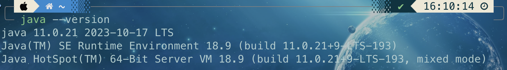

## 下载 BurpSuite Professional

- 在[官网](https://portswigger.net/burp/releases/professional-community-2022-3-9)进行下载
  
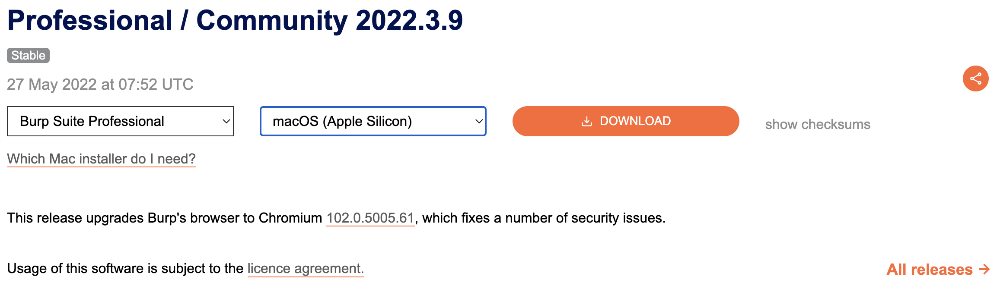

- 按照默认操作进行安装，打开会提示输入 License Key，关闭即可。
  
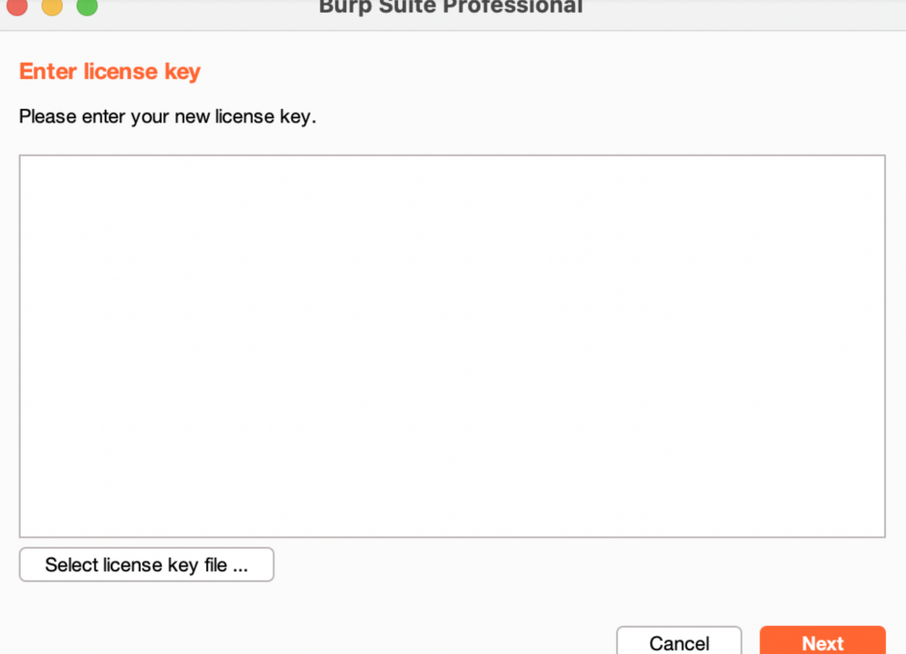

## 下载使用注册机

- 前往[网址](https://github.com/BruceJqs/ZJU-Courses/tree/main/%E7%BD%91%E7%BB%9C%E5%AE%89%E5%85%A8%E6%94%BB%E9%98%B2%E5%AE%9E%E8%B7%B5%EF%BD%9CCapture%20The%20Flag/BurpSuite%20Professional)下载注册机

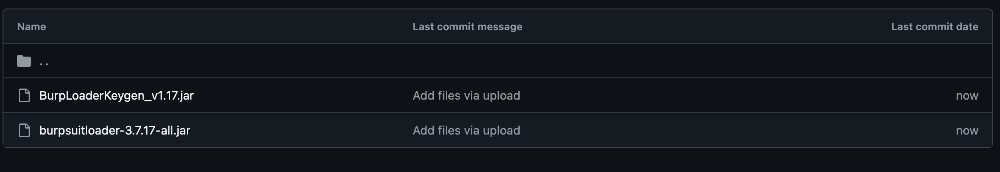

- 将下载好的两个 jar 文件放入包中

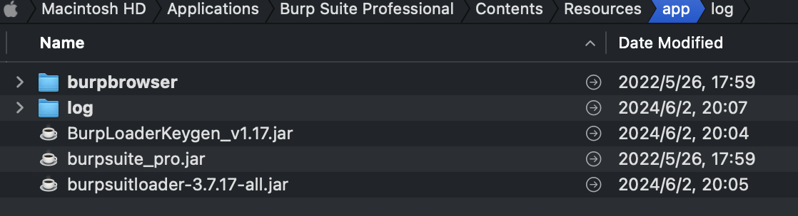

- 修改 Contents 下的 vmoptions.txt，添加：
```
-javaagent:burpsuitloader-3.7.17-all.jar
-javaagent:BurpLoaderKeygen_v1.17.jar
-noverify
```
  
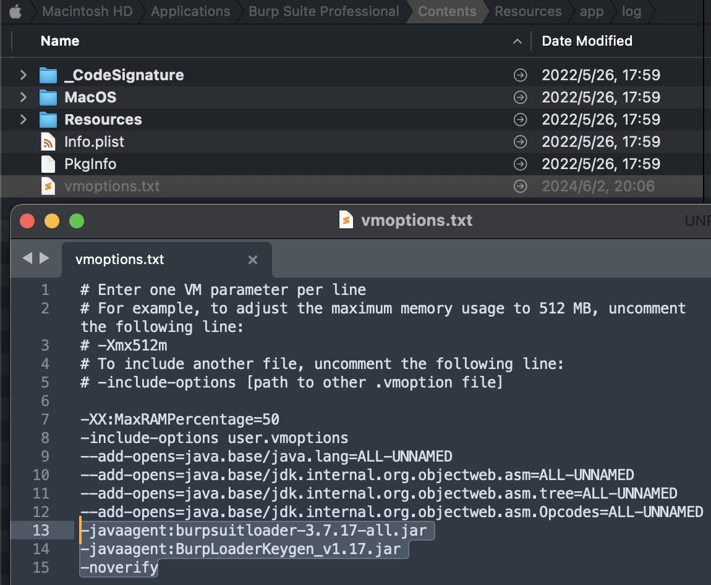

- 在 app 目录中打开终端，输入 `java -jar burp-keygen-scz.jar` 命令启用注册机

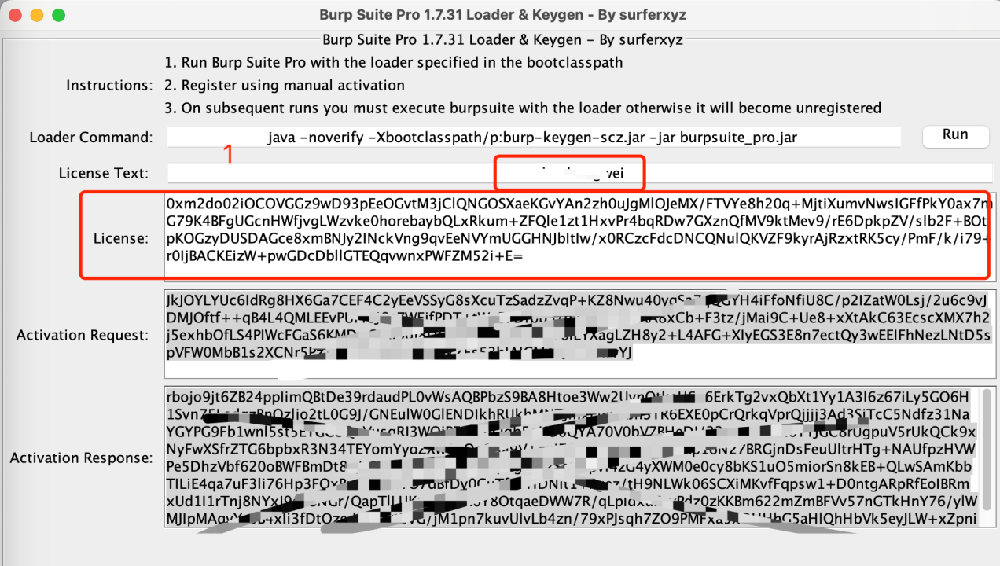

- 再重新打开一个 app 目录下的终端，输入 `java -noverify -javaagent:burp-loader-x-Ai.jar -jar burpsuite_pro.jar` 命令启动 BurpSuite

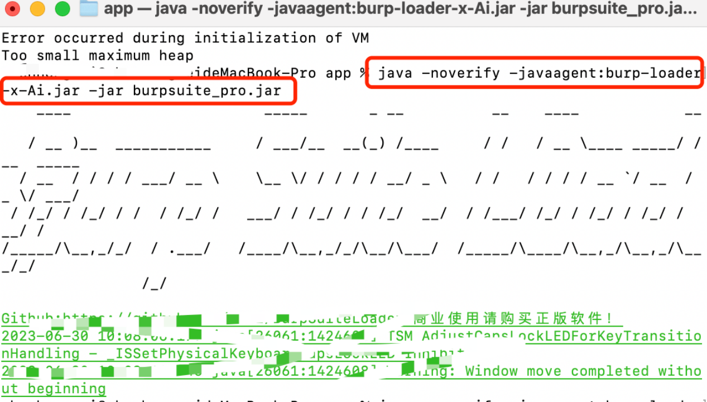

- 启动后还会弹出需要注册码的界面，这时候跟着下图的步骤操作即可
  
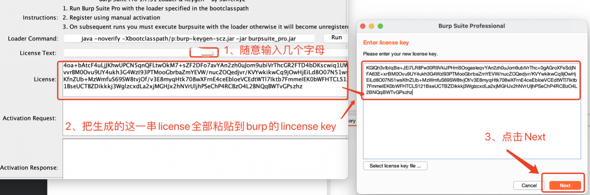
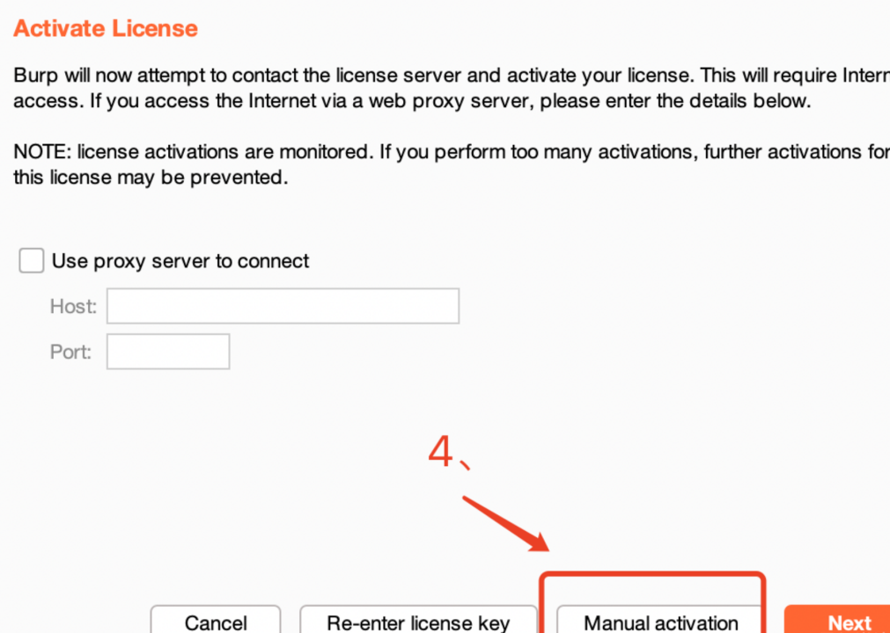
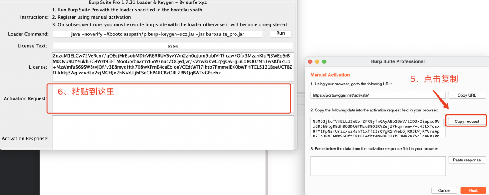
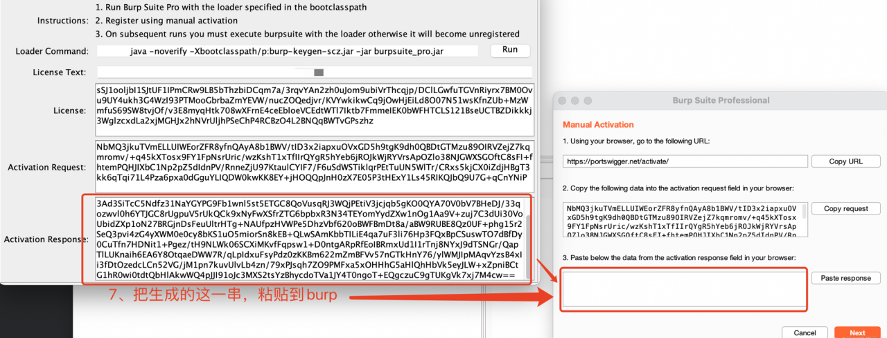
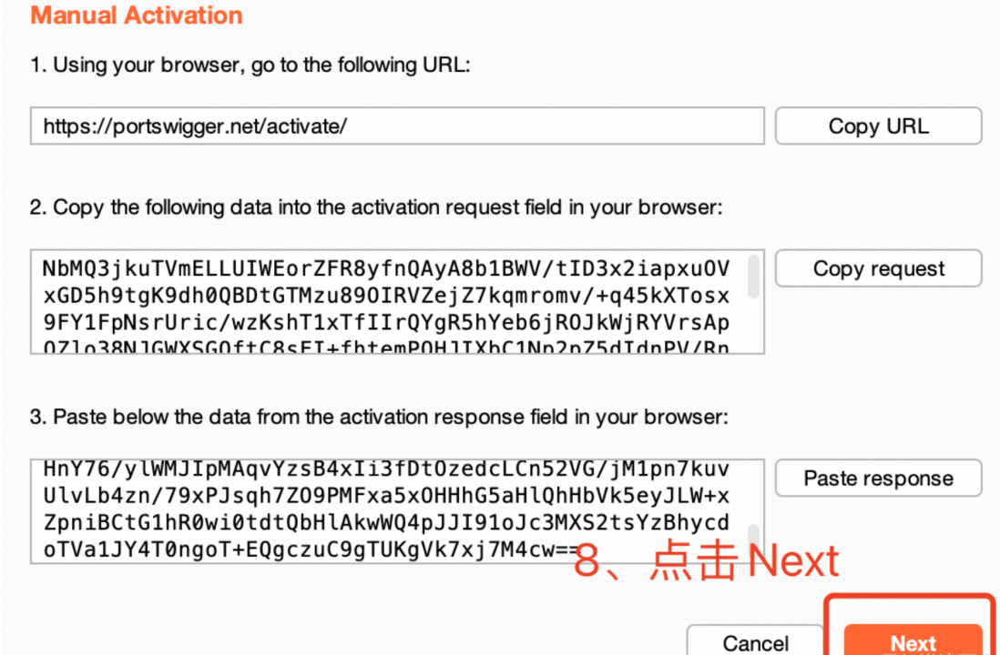

- 最后重新打开即可食用
  
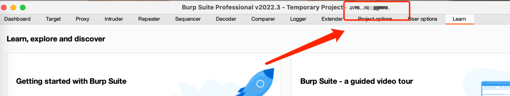