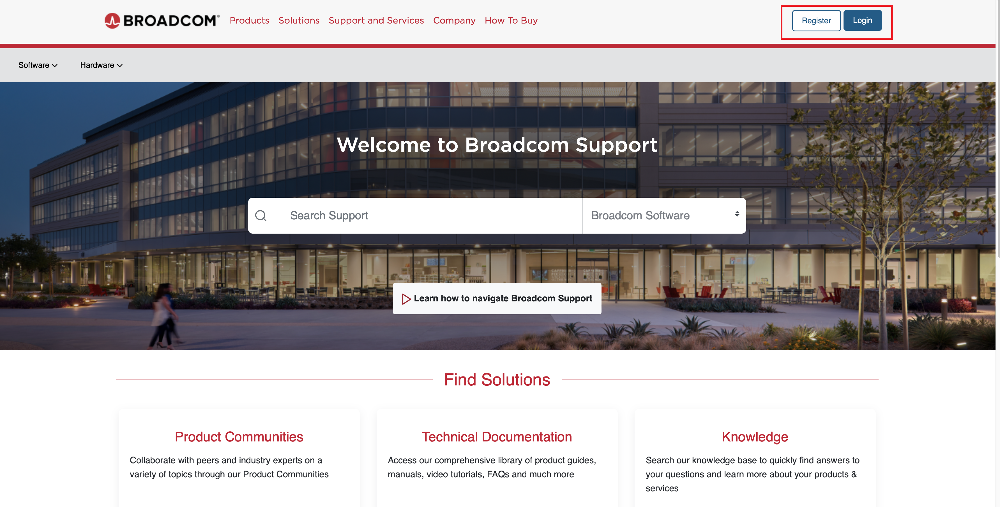
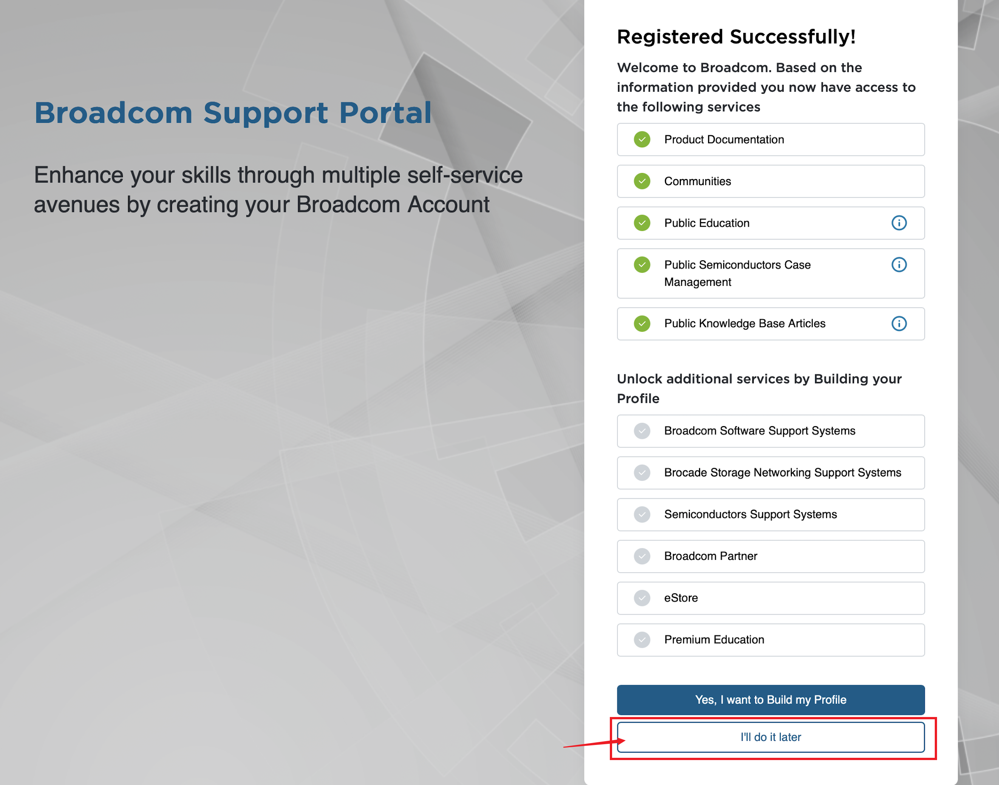

---
hide:
  #- navigation # 显示右
  #- toc #显示左
  - footer
  - feedback
# comments: true
---   

# 用 VMware Fusion 安装 Ubuntu 虚拟机

## 安装 VMware Fusion

上 [VMware Fusion 官网](https://customerconnect.vmware.com/en/evalcenter?p=fusion-player-personal-13) ，右上角注册账号：

注册完成之后会出现以下页面，跳过 `Build My Profile`：

跳过后点击左上角 Software