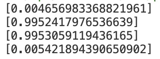
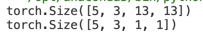
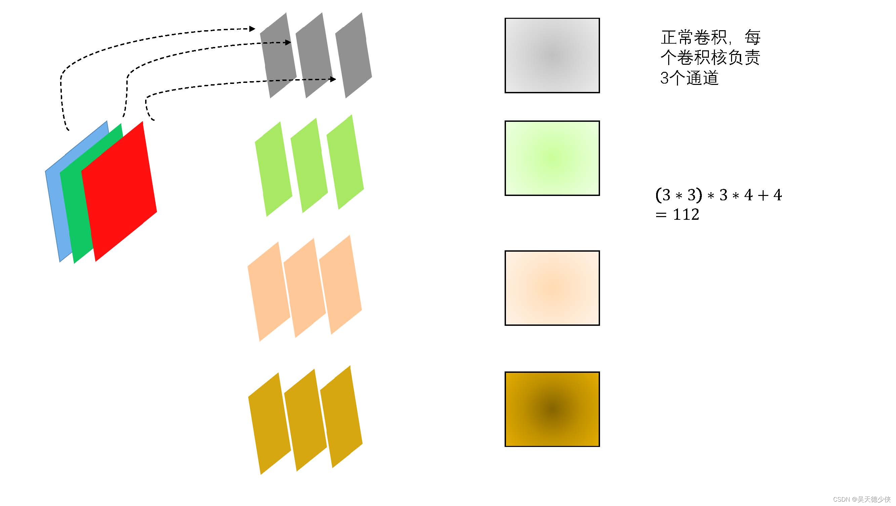
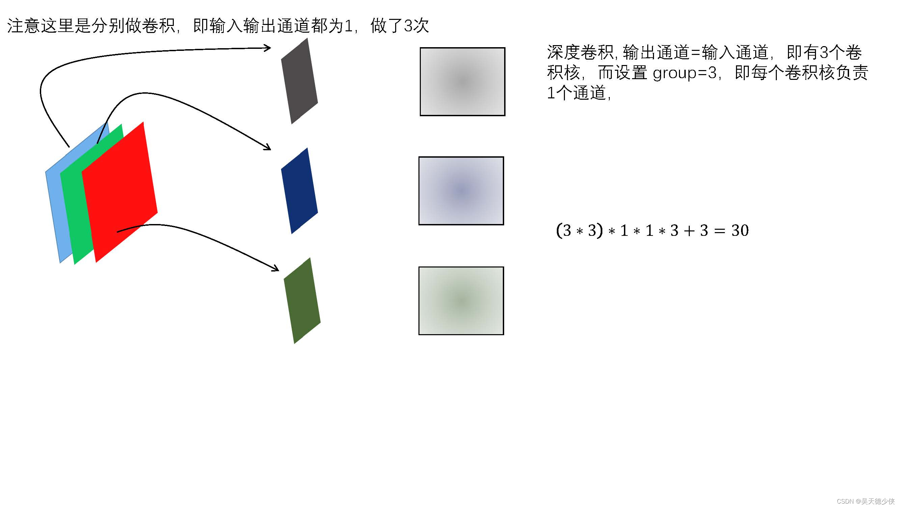
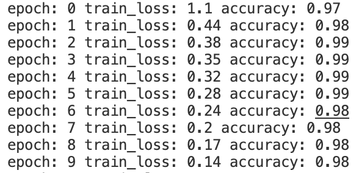
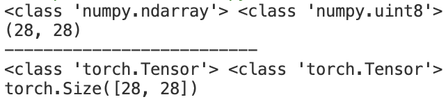
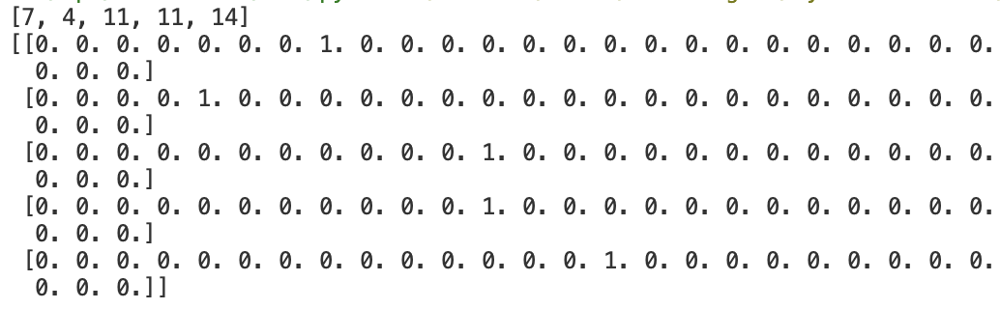
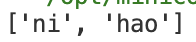
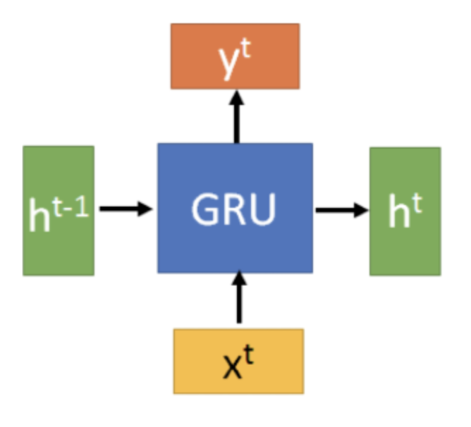
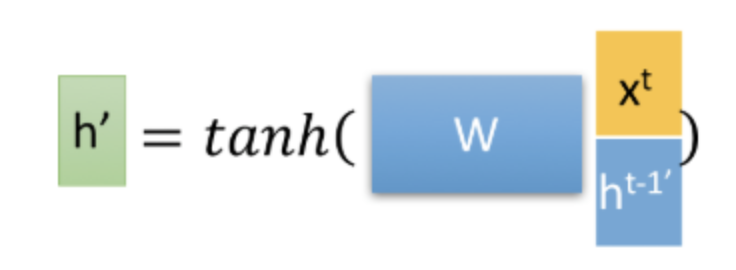

# Learning AI Notes

## 梯度下降

下面这个程序使用梯度下降法计算最小二乘法：$J(\theta)=\frac{1}{2m}\sum\limits_1^m(h_{\theta}(x)-y)^2$ ，其中 $m$ 为数据点总数，$y$ 为数据集中每个点的真实 $y$ 坐标的值，$h_{\theta}(x)$ 为预测函数，$h_{\theta}(x)=\theta_0+\theta_1x$ ，寻找出最佳的 $\theta$ 组。

```python
import numpy as np

m = 20

x0 = np.ones((m,1))
x1 = np.arange(1,m+1).reshape(m,1)
x = np.hstack((x0,x1))
y = np.array([
    3, 4, 5, 5, 2, 4, 7, 8, 11, 8, 12,
    11, 13, 13, 16, 17, 18, 17, 19, 21
]).reshape(m,1)
print(x)
print(y)
alpha = 0.01

def error_function(theta, x, y):
    h_pred = np.dot(x, theta)
    j_theta = (1. / 2 * m) * np.dot(np.transpose(h_pred), h_pred)
    return j_theta

def gradient_function(theta, X, y):
    h_pred = np.dot(X, theta) - y
    return (1. / m) * np.dot(np.transpose(X), h_pred)

def gradient_descent(X, y, alpha):
    theta = np.array([1, 1]).reshape(2, 1)
    gradient = gradient_function(theta, X, y)
    while not np.all(np.absolute(gradient) <= 1e-6):
        theta = theta - alpha * gradient
        gradient = gradient_function(theta, X, y)
    print(np.dot(X, theta))
    return theta

theta = gradient_descent(x, y, alpha)
print('Theta:',theta)
print('Error_function:', error_function(theta, x, y)[0,0])
```

## BP 神经网络

### 前向传播

隐藏层输出值定义：

$$
a_h^{Hl} = W_h^{Hl} \times X_i\\
b_n^{Hl} = f(a_h^{Hl})
$$

其中 $X_i$ 是当前节点的输入值，$W_h^{Hl}$ 是连接到此节点的权重，$a_h^{Hl}$ 是输出值。 $f$ 是当前节点的激活函数，$b_h^{Hl}$ 为当前节点的输入值经过计算后被激活的值。

输出层定义：

$$
a_k = \sum (W_{hk}\times b_h^{Hl})
$$

其中 $W_{hk}$ 为输入的权重，$b_h^{Hl}$ 为最后一层隐藏层经过计算后的激活值，$a_k$ 为神经网络的最后输出值。

### 反向传播

对输出层：

$$
\delta_k = \frac{\partial L}{\partial a_k}=(Y-T)
$$

其中 $\delta_k$ 为输出层的误差项，其计算值为真实值与模型计算值之间的差值，$Y$ 为计算值，$T$ 为真实值。

对隐藏层：

$$
\delta_h^{Hl}=\frac{\partial L}{\partial a_h^{Hl}}=\frac{\partial L}{\partial b_h^{Hl}}\times\frac{b_h^{Hl}}{a_h^{Hl}}=\frac{\partial L}{\partial b_h^{Hl}}\times f'(a_h^{Hl}) =\frac{\partial L}{\partial a_k}\times\frac{\partial a_k}{\partial b_h^{Hl}}\times f'(a_h^{Hl})\\
=\delta_k\times\sum W_{hk} \times f'(a_h^{Hl})=\sum (W_{hk}\times\delta_k\times f'(a_h^{Hl}))
$$

这里的 $\sum$ 有一些模糊，实际上在 $\frac{\partial a_k}{\partial b_h^{Hl}}$ 部分是单个 $W_{hk}$，但是由于对于最终隐藏层的一个点来说，这个节点输出层的结果均有一定权重的贡献，因此最后应当累加。

### 权重更新

$$
W_{ji}=W_{ji}+a\times\delta_j^l\times x_{ji}\\
b_{ji}=b_{ji}+a\times\delta_j^{l}
$$

总的代码如下：

```python
# 这个程序是为了不断训练神经网络使其对于 cases 数据预测结果越来越接近 results
import numpy as np
import math
import random

def rand(a, b):
    return a + (b - a) * random.random()

def make_matrix(m, n, fill = 0.0):
    mat = []
    for i in range(m):
        mat.append([fill] * n)
    return mat

def sigmoid(x):
    return 1.0 / (1.0 + math.exp(-x))

def sigmoid_derivate(x):
    return x * (1 - x)

class BPNeuralNetwork:
    def __init__(self):
        self.input_n = 0
        self.hidden_n = 0
        self.output_n = 0
        self.input_cells = []
        self.hidden_cells = []
        self.output_cells = []

    def setup(self, ni, nh, no):
        self.input_n = ni + 1 # 这里包含了输入的 bias
        self.hidden_n = nh
        self.output_n = no
        self.input_cells = [1.0] * self.input_n
        self.hidden_cells = [1.0] * self.hidden_n
        self.output_cells = [1.0] * self.output_n
        self.input_weights = make_matrix(self.input_n, self.hidden_n)
        self.output_weights = make_matrix(self.hidden_n, self.output_n)

        for i in range(self.input_n):
            for j in range(self.hidden_n):
                self.input_weights[i][j] = rand(-0.2, 0.2)
        for i in range(self.hidden_n):
            for j in range(self.output_n):
                self.output_weights[i][j] = rand(-2.0, 2.0)
    
    #正向计算
    def predict(self,inputs):
        for i in range(self.input_n - 1):
            self.input_cells[i] = inputs[i]
        #从输入层计算到隐藏层
        for i in range(self.hidden_n):
            total = 0.0
            for j in range(self.input_n):
                total += self.input_cells[j] * self.input_weights[j][i]
            self.hidden_cells[i] = sigmoid(total)
        #从隐藏层计算到输入层
        for i in range(self.output_n):
            total = 0.0
            for j in range(self.hidden_n):
                total += self.hidden_cells[j] * self.output_weights[j][i]
            self.output_cells[i] = sigmoid(total)
        return self.output_cells
    
    def back_propagation(self, case, result, learn):
        self.predict(case)
        #计算输出层误差
        output_deltas = [0.0] * self.output_n
        for i in range(self.output_n):
            error = result[i] - self.output_cells[i]
            output_deltas[i] = sigmoid_derivate(self.output_cells[i]) * error
        #计算隐藏层误差(这里只有一层隐藏层)
        hidden_deltas = [0.0] * self.hidden_n
        for i in range(self.hidden_n):
            error = 0.0
            for j in range(self.output_n):
                error += output_deltas[j] * self.output_weights[i][j]
            hidden_deltas[i] = sigmoid_derivate(self.hidden_cells[i]) * error
        #更新输出层权重
        for i in range(self.hidden_n):
            for j in range(self.output_n):
                self.output_weights[i][j] += learn * output_deltas[j] * self.hidden_cells[i]
        #更新隐藏层权重
        for i in range(self.input_n):
            for j in range(self.hidden_n):
                self.input_weights[i][j] += learn * hidden_deltas[j] * self.input_cells[i]
        error = 0
        for i in range(len(result)):
            error += 0.5 * (result[i] - self.output_cells[i]) ** 2
        return error
    
    def train(self, cases, results, epochs = 1000000, learn = 0.05):
        for epoch in range(epochs):
            error = 0
            for i in range(len(cases)):
                result = results[i]
                case = cases[i]
                error += self.back_propagation(case, result, learn)
    
    def test(self):
        cases = [
            [0, 0],
            [0, 1],
            [1, 0],
            [1, 1]
        ]
        results = [[0], [1], [1], [0]]
        self.setup(2, 5, 1)
        self.train(cases, results)
        for case in cases:
            print(self.predict(case))

if __name__ == '__main__':
    nn = BPNeuralNetwork()
    nn.test()
```

可以看到，当训练次数达到 1000000 时，结果已经非常接近 results：



## 卷积神经网络

### 卷积运算

e.g.对高速公路上的跑车的位置进行追踪，对于运动中的目标，采样时间越长，由于滞后性的原因，定位的准确率越低；采样时间越短，就越接近真实值。因此，可以对不同的时间段赋予不同的权重，即 $s(t)=\int x(a)\omega(t-a)da$ ，这样的运算称为卷积运算，也记为 $s(t)=(x\omega)(t)$。

而对于一个矩阵（一般可以是一张图片信息）来说，我们设定一个卷积核（其大小一般远小于输入矩阵），通过卷积运算后可以提取图片特征，减少后续的计算量。（如果卷积核设定得当可以对图片起到锐化、获取轮廓、模糊等效果）

```python
import numpy as np

dateMat = np.ones((7,7))
kernel = np.array([[2, 1, 1], [3, 0, 1], [1, 1, 0]]) 

def convolve(dateMat, kernel):
    m, n = dateMat.shape
    km, kn = kernel.shape
    newMat = np.ones((m - km + 1, n - kn + 1))
    tempMat = np.ones((km, kn))
    for row in range(m - km + 1):
        for col in range(n - kn + 1):
            for m_k in range(km):
                for n_k in range(kn):
                    tempMat[m_k, n_k] = dateMat[row + m_k, col + n_k] * kernel[m_k, n_k]
            newMat[row, col] = np.sum(tempMat)
    return newMat

print(convolve(dateMat, kernel))
```

### PyTorch 的卷积运算

PyTorch 设定了 API 函数 Conv2d(Conv) 作为卷积计算函数，其重要的 5 个参数如下：

- in_channels：输入的卷积核数目（如果对于图片来说，RGB 模式就有 3 个卷积核，灰度模式就有 1 个卷积核）
- out_channels：输出的卷积核数目
- kernel_size：卷积核大小，输入一个向量，具有[filter_height,filter_width]的维度，如果仅仅是一个数 n，默认为 n*n 大小
- strides：步进大小，默认为 1；如果参数是 stride=(2,1) 那么在高步长为 2，在宽步长为 1
- padding：补全方式，只能为 0 或 1，padding 为 1 时图像边缘用一圈 0 补齐，使得卷积结果与原输入矩阵的大小一致

```python
import torch

image = torch.randn(5, 3, 128, 128)

conv2d = torch.nn.Conv2d(3, 10, kernel_size=3, stride=1, padding=1)
image_new_1 = conv2d(image)
print(image_new_1.shape)

conv2d = torch.nn.Conv2d(3, 10, kernel_size=3, stride=2, padding=1)
image_new_2 = conv2d(image)
print(image_new_2.shape)
```


### 池化运算

在卷积获得了图像特征之后，我们下一步希望对这些特征进行分类。

特征提取可以计算图像在一个区域上的某个特定特征的平均值（或最大值），结果不仅具有低得多的维度，同时还会改善结果（不容易过拟合），这种聚合的操作叫做池化（Pooling）。

如果选择图像中的连续范围作为池化区域，并且只是池化相同的隐藏单元产生的特征，那么这些池化单元就具有平移不变性。这意味着即使图像经历了一个小的平移，依然会产生相同的池化特征。比如判定一幅图像是否包含人脸时，并不需要判定眼睛的位置，而是需要知道有一只眼睛出现在脸部的左侧，另一只出现在右侧。

```python
import torch

image = torch.randn(size = (5, 3, 28, 28))

pool = torch.nn.AvgPool2d(kernel_size = 3, stride = 2, padding = 0)
image_pooled_avg = pool(image)
image_pooled_adaptive_avg = torch.nn.AdaptiveAvgPool2d(1)(image)
print(image_pooled_avg.shape)
print(image_pooled_adaptive_avg.shape)
```



这里的 AdaptiveAvgPool2d 函数则是对整张图片进行池化处理（这里即为对 28*28 的每个元素取平均）

### Softmax 激活函数

Softmax 是一个对概率进行计算的模型，在真实的计算模型系统中，对一个实物的判定并非 100% 或者是 0%，Softmax 就是对所有的结果标签上求出一个概率。

$$
f(x)=\sum\limits_i^jw_{ij}x_j+b\\
Softmax=\frac{e^{x_i}}{\sum\limits_0^je^{x_j}}\\
y=Softmax(f(x))=Softmax(w_{ij}x_j+b)
$$


### 卷积神经网络原理

卷积神经网络的处理主要包含以下 4 个步骤：

- 图像输入：获取输入的数据图像

- 卷积：对图像特征进行提取
  - 经过卷积层的图像被卷积核心提取后，获得分块的、同样大小的图片
  - 对分解后的图片使用一个小型神经网络进行进一步的处理，即将二位矩阵转化成一维数组
- Pooling 层：用于缩小在卷积时获取的图像特征
  - 对获取的图像特征进行缩减
- 全连接层：用于对图像进行分类

```python
import torch
import torch.nn as nn
import numpy as np
import einops.layers.torch as elt

x_train = np.load("x_train.npy")
y_train_label = np.load("y_train_label.npy")

x_train = np.expand_dims(x_train, axis = 1)
# print(x_train.shape)

class MnistNetword(nn.Module):
    def __init__(self):
        super(MnistNetword, self).__init__()
        #前置的特征提取模块
        self.convs_stack = nn.Sequential(
            nn.Conv2d(1, 12, kernel_size=7), #第一个卷积层
            nn.ReLU(),
            nn.Conv2d(12, 24, kernel_size=5),#第二个卷积层
            nn.ReLU(),
            nn.Conv2d(24, 6, kernel_size=3) #第三个卷积层
        )
        #最终分类器层
        self.logits_layer = nn.Linear(in_features=1536, out_features=10)

    def forward(self, inputs):
        image = inputs
        x = self.convs_stack(image)

        x = elt.Rearrange('b c h w -> b (c h w)')(x)
        # x = torch.nn.Flatten()(x)
        logits = self.logits_layer(x)
        return logits
    
device = "cuda" if torch.cuda.is_available() else "cpu"
model = MnistNetword().to(device)
# model = torch.compile(model)
loss_fn = nn.CrossEntropyLoss()

optimizer = torch.optim.SGD(model.parameters(), lr=1e-4)

batch_size = 128
for epoch in range(42):
    train_num = len(x_train) // batch_size
    train_loss = 0
    for i in range(train_num):
        start = i * batch_size
        end = start + batch_size

        x_batch = torch.tensor(x_train[start:end]).to(device)
        y_batch = torch.tensor(y_train_label[start:end]).to(device)

        pred = model(x_batch)
        loss = loss_fn(pred, y_batch)
        optimizer.zero_grad()
        loss.backward()
        optimizer.step()
        train_loss += loss.item()

    train_loss /= train_num
    accuracy = (pred.argmax(1) == y_batch).type(torch.float32).sum().item() / batch_size
    print("epoch:", epoch, "train_loss:", round(train_loss, 2), "accuracy:", round(accuracy, 2))
```

这里采用 ReLU 函数作为激活函数，ReLU(x)=max{0,x}


### 深度可分离卷积

普通卷积：一个卷积核处理 m 个输入通道的图片信息，卷积核个数为 n（即输出通道数为 n），则有 n 个处理结果（每个结果通道数为 m），最后 n 个卷积核的结果组成最终结果。



深度可分离卷积：分为深度卷积+逐点卷积

- 深度卷积：一个卷积核处理一个通道的图片信息，m 个输入通道有 m 个卷积核，m 个处理结果。



- 逐点卷积：做卷积核大小为 1 的普通卷积。


深度可分离卷积可以有效减少待训练参数量。

### 膨胀卷积

膨胀卷积又称空洞卷积，在卷积核中增加空洞，可以增加单位面积中计算的大小，从而扩大模型的计算视野。


普通卷积即为膨胀卷积 dilation=1 的情况。

```python
import torch
import torch.nn as nn
import numpy as np
import einops.layers.torch as elt

x_train = np.load('x_train.npy')
y_train_label = np.load('y_train_label.npy')
x_train = np.expand_dims(x_train, axis = 1)

# 自定义深度、可分离、膨胀卷积
depth_conv = nn.Conv2d(in_channels = 12, out_channels = 12, kernel_size = 3, groups = 6, dilation = 2)
point_conv = nn.Conv2d(in_channels = 12, out_channels = 24, kernel_size = 1)
depth_separable_conv = torch.nn.Sequential(depth_conv, point_conv)

class MnistNetword(nn.Module):
    def __init__(self):
        super(MnistNetword, self).__init__()
        self.convs_stack = nn.Sequential(
            nn.Conv2d(1, 12, kernel_size = 7),
            nn.ReLU(),
            depth_separable_conv, #使用自定义卷积替代原生卷积层
            nn.ReLU(),
            nn.Conv2d(24, 6, kernel_size = 3)
        )

        self.logits_layer = nn.Linear(in_features = 1536, out_features = 10)

    def forward(self, inputs):
        image = inputs
        x = self.convs_stack(image)
        x = elt.Rearrange('b c h w -> b (c h w)')(x)
        logits = self.logits_layer(x)
        return logits
    
device = "cuda" if torch.cuda.is_available() else "cpu"
model = MnistNetword().to(device)
# model = torch.compile(model)
loss_fn = nn.CrossEntropyLoss()

optimizer = torch.optim.Adam(model.parameters(), lr = 1e-4)

batch_size = 128
for epoch in range(63):
    train_num = len(x_train) // batch_size
    train_loss = 0
    for i in range(train_num):
        start = i * batch_size
        end = start + batch_size

        x_batch = torch.tensor(x_train[start:end]).to(device)
        y_batch = torch.tensor(y_train_label[start:end]).to(device)

        pred = model(x_batch)
        loss = loss_fn(pred, y_batch)

        optimizer.zero_grad()
        loss.backward()
        optimizer.step()

        train_loss += loss.item()

    train_loss /= train_num
    accuracy = (pred.argmax(1) == y_batch).type(torch.float32).sum().item() / batch_size
    print("epoch:", epoch, "train_loss:", round(train_loss, 2), "accuracy:", round(accuracy, 2))
```



## PyTorch 数据处理与模型展示

### torch.utils.data Dataset 封装自定义数据集

在 PyTorch 2.0 中，数据集的自定义使用需要继承 __torch.utils.data.Dataset__ 类，基本的 Dataset 类架构如下：

```python
class Dataset():
	def __init__(self, transform = None):
		super(Dataset, self).__init__()
		
	def __getitem__(self, index):
		pass
	
	def __len__(self):
		pass
```

Dataset 除了基本的 init 函数，还需要补充额外的两个函数：__getitem__ 和 __len__，这是仿照数组进行的定义，返回 index 对应的数据以及范围数据集大小。

### 改变数据类型的 Dataset 类中的 transform

我们可以利用自定义的数据处理转换类来对输入数据进行一些类型上的处理。

```python
import numpy as np
import torch

class ToTensor1:
    def __call__(self, inputs, targets):
        return torch.tensor(inputs), torch.tensor(targets)
    
class ToTensor2:
    def __call__(self, inputs, targets):
        inputs = np.reshape(inputs, [28 * 28])
        return torch.tensor(inputs), torch.tensor(targets)
    
class MNIST_Dataset(torch.utils.data.Dataset):
    def __init__(self, transform = None): # 在定义时需要明确给出这里定义了transform
        super(MNIST_Dataset, self).__init__()

        self.x_train = np.load('x_train.npy')
        self.y_train_label = np.load('y_train_label.npy')

        self.transform = transform
        
    def __len__(self):
        return len(self.y_train_label)
    
    def __getitem__(self, index):
        image = self.x_train[index]
        label = self.y_train_label[index]

        if self.transform:
            image, label = self.transform(image, label)
        return image, label

mnist_dataset = MNIST_Dataset()
image, label = mnist_dataset[1024]
print(type(image), type(label))
print(image.shape)
print("--------------------------")
mnist_dataset = MNIST_Dataset(transform = ToTensor1())
image, label = mnist_dataset[1024]
print(type(image), type(label))
mnist_dataset = MNIST_Dataset(transform = ToTensor2())
print(image.shape)
```



### 批量输出数据的 DataLoader 类

DataLoader 可以解决使用 Dataset 自定义封装的数据时无法对数据进行批量化处理的问题，其定义如下：

```python
mnist_dataset = MNIST_Dataset(transform = ToTenSor())
from torch.utils.data import DataLoader
train_loader = DataLoader(mnist_dataset, batch_size = batch_size), shuffle = True)
```

## ResNet

传统 CNN 在 ResNet 发布之前都是卷积层与池化层的不断叠加，人们认为卷积层与池化层的叠加层数越多，获得图片特征也就越全，学习效果也就越好，但事实上网络过深会出现梯度消失、梯度爆炸、退化问题。

为了解决梯度消失和梯度爆炸问题，ResNet 采用了 BatchNormalization 的处理方法，批量正则化对数据进行处理。

为了解决退化问题，ResNet 提出了残差结构，使用一种 shortcut 的连接方式，让特征矩阵隔层相加，


左图是基于普通卷积的二层残差学习单元，称为 BasicBlock；右图第一层采用 $1\times1$ 卷积核，对特征矩阵进行降维操作，将特征矩阵的深度由 256 降为 64；第三层 $1\times1$ 卷积核对特征矩阵进行升维操作，将特征矩阵的深度由 64 升为 256，整体称为 Bottleneck，能更好减少参数。

对于经典 BasicBlock 模型的代码：

```python
import torch
import torch.nn as nn

class BasicBlock(nn.Module):
    expansion = 1
    def __init__(self, in_channels, out_channels, stride = 1):
        super().__init__()
        
        #residual function
        self.residual_function = nn.Sequential(
            nn.Conv2d(in_channels, out_channels, kernel_size = 3, stride = stride, padding = 1, bias = False),
            nn.BatchNorm2d(out_channels),
            nn.ReLU(inplace = True),
            nn.Conv2d(out_channels, out_channels * BasicBlock.expansion, kernel_size = 3, padding = 1, bias = False),
            nn.BatchNorm2d(out_channels * BasicBlock.expansion)
        )
        
        #shortcut
        self.shortcut = nn.Sequential()
        #判定输出的维度是否和输入相一致
        if stride != 1 or in_channels != BasicBlock.expansion * out_channels:
            self.shortcut = nn.Sequential(
                nn.Conv2d(in_channels, out_channels * BasicBlock.expansion, kernel_size = 1, stride = stride, bias = False),
                nn.BatchNorm2d(out_channels * BasicBlock.expansion)
            )
       
    def forward(self, x):
        return nn.ReLU(inplace = True)(self.residual_function(x) + self.shortcut(x))
```

ResNet 结构：


对于所有的 ResNet 结构，conv3_x，conv4_x，conv5_x 的第一层均为虚线残差结构，其余均为实线残差结构，两者区别如下：（其实虚线与实线的差别就在于虚线进行了规模的转换，使得矩阵加法能顺利进行）

浅层（18/34）：


深层（50/101/152）：


```python
import pickle
import numpy as np
import os
import torch
import get_data
from resnet import resnet18

def get_cifar10_train_data_and_label(root = ""):
    def load_file(filename):
        with open(filename, 'rb') as fo:
            data = pickle.load(fo, encoding='latin1')
        return data
    
    data_batch_1 = load_file(os.path.join(root, "data_batch_1"))
    data_batch_2 = load_file(os.path.join(root, "data_batch_2"))
    data_batch_3 = load_file(os.path.join(root, "data_batch_3"))
    data_batch_4 = load_file(os.path.join(root, "data_batch_4"))
    data_batch_5 = load_file(os.path.join(root, "data_batch_5"))
    dataset = []
    labelset = []
    for data in [data_batch_1, data_batch_2, data_batch_3, data_batch_4, data_batch_5]:
        dataset.append(data['data'])
        labelset.append(data['labels'])
    dataset = np.concatenate(dataset) # 拼接统一 dataset 格式
    labelset = np.concatenate(labelset)
    return dataset, labelset

def get_cifar10_test_data_and_label(root = ""):
    def load_file(filename):
        with open(filename, 'rb') as fo:
            data = pickle.load(fo, encoding='latin1')
        return data
    data_batch_1 = load_file(os.path.join(root, "test_batch"))
    dataset = []
    labelset = []
    for data in [data_batch_1]:
        dataset.append(data['data'])
        labelset.append(data['labels'])
    dataset = np.concatenate(dataset)
    labelset = np.concatenate(labelset)
    return dataset, labelset

def get_CIFAR10_dataset(root = ""):
    train_dataset, label_dataset = get_cifar10_train_data_and_label(root = root)
    test_dataset, test_label_dataset = get_cifar10_test_data_and_label(root = root)
    return train_dataset, label_dataset, test_dataset, test_label_dataset

if __name__ == "__main__":
    train_dataset, label_dataset, test_dataset, test_label_dataset = get_data.get_CIFAR10_dataset(root = "cifar-10-batches-py")
    
    train_dataset = np.reshape(train_dataset, [len(train_dataset), 3, 32, 32]).astype(np.float32) / 255
    test_dataset = np.reshape(test_dataset, [len(test_dataset), 3, 32, 32]).astype(np.float32) / 255
    label_dataset = np.array(label_dataset)
    test_label_dataset = np.array(test_label_dataset)

    device = "cuda" if torch.cuda.is_available() else "cpu"
    model = resnet18()
    model = model.to(device)
    # model = torch.compile(model)
    optimizer = torch.optim.Adam(model.parameters(), lr=2e-5)
    loss_fn = torch.nn.CrossEntropyLoss()

    batch_size = 128
    train_num = len(train_dataset) // batch_size
    for epoch in range(63):
        train_loss = 0
        for i in range(train_num):
            start = i * batch_size
            end = (i + 1) * batch_size

            x_batch = torch.from_numpy(train_dataset[start:end]).to(device)
            y_batch = torch.from_numpy(label_dataset[start:end]).to(device)

            pred = model(x_batch)
            loss = loss_fn(pred, y_batch.long())

            optimizer.zero_grad()
            loss.backward()
            optimizer.step()

            train_loss += loss.item()
        
        train_loss /= train_num
        accuracy = (pred.argmax(1) == y_batch).type(torch.float32).sum().item() / batch_size

        test_num = 2048
        x_test = torch.from_numpy(test_dataset[:test_num]).to(device)
        y_test = torch.from_numpy(test_label_dataset[:test_num]).to(device)
        pred = model(x_test)
        test_accuracy = (pred.argmax(1) == y_test).type(torch.float32).sum().item() / test_num
        print("epoch: ", epoch, "train_loss: ", round(train_loss, 2), "accuracy: ", round(accuracy, 2), "test_accuracy: ", round(test_accuracy, 2))
```

## 词嵌入

词嵌入本质上是一类技术，单个词在预定义的向量空间中被表示为实数向量，每个单词都映射到一个向量。

### 文本清洗

对于一篇新闻，内含标点符号和一些特殊字符，我们可以通过正则表达式对整篇新闻进行清洗，获得较为干净的词库。同时文章里面会含很多没有意义的副词（如 is,are,the 等），我们也可以利用消除停用词（python nltk 工具包）减少要处理的词汇量以减少后续程序的复杂度。除此之外，英文单词由于时态、复数等变化，我们也可以使用 nltk 中的 PorterStemmer 工具将其还原成原词干。

```python
import csv
import numpy as np
import re
from nltk.stem import PorterStemmer
from nltk.corpus import stopwords

def text_clear(text):
    text = text.lower() # 转换为小写
    text = re.sub(r'[^a-z0-9]', ' ', text) # 替换非字母数字字符为空格
    text = re.sub(r' +', ' ', text) # 多个空格替换为一个空格
    text = text.strip() # 去掉首尾空格
    text = text.split(' ') # 分词
    text = [word for word in text if word not in stoplist] # 去除停用词
    text = [PorterStemmer().stem(word) for word in text] # 还原词干
    text.append("eos") # 添加结束符
    text = ["bos"] + text # 添加开始符
    return text

agnews_label = []
agnews_title = []
agnews_text = []
agnews_train = csv.reader(open('train.csv', 'r'))
stoplist = stopwords.words('english')
for line in agnews_train:
    agnews_label.append(np.float32(line[0]))
    agnews_title.append(text_clear(line[1]))
    agnews_text.append(text_clear(line[2]))
print(agnews_label)
print(agnews_title)
print(agnews_text)
```

### 词向量训练模型 Word2Vec

Word2Vec 是轻量级的神经网络，其模型仅仅包括输入层、隐藏层和输出层，模型框架根据输入输出的不同。Word2Vec 包括两种模型：主要包括 CBOW 和 Skip-gram 模型。 CBOW 的方式是在知道词 $w_t$ 的上下文$𝑤_{𝑡−2},𝑤_{𝑡−1},𝑤_{𝑡+1},𝑤_{𝑡+2}$ 的情况下预测当前词 $𝑤_𝑡$，而 Skip-gram 是在知道了词 $𝑤_𝑡$ 的情况下，对词 $𝑤_𝑡$ 的上下文 $𝑤_{𝑡−2},𝑤_{𝑡−1},𝑤_{𝑡+1},𝑤_{𝑡+2}$ 进行预测，如下图所示：


CBOW 模型是根据上下文去预测目标词来训练得到词向量，而 Skip-gram 模型则是根据目标词去预测上下文来训练得到词向量。CBOW 适合于数据集较小的情况，而 Skip-Gram 在大型语料中表现更好。

Python 实现 Word2Vec 模型，需要 `from gensim.models import word2vec` 导入 word2vec 函数，其主要参数：`Word2Vec(sentences, workers = num_workers, vector_size = num_features, min_count = min_word_count, window = context, sample = downsampling, epochs = 5)` 其中 sentences 是输入数据，worker 是并行运行的线程数，vector_size 是词向量的维数，min_count 是最小的词频，window是上下文窗口大小，sample 是对频繁词汇下采样设置，epochs 是循环的次数，一般不是有特殊要求，按默认值设置即可。

```python
import csv
import numpy as np
import re
from nltk.corpus import stopwords
from nltk.stem import PorterStemmer

def text_clear(text):
    text = text.lower() # 转换为小写
    text = re.sub(r'[^a-z0-9]', ' ', text) # 替换非字母数字字符为空格
    text = re.sub(r' +', ' ', text) # 多个空格替换为一个空格
    text = text.strip() # 去掉首尾空格
    text = text.split(' ') # 分词
    text = [word for word in text if word not in stoplist] # 去除停用词
    text = [PorterStemmer().stem(word) for word in text] # 还原词干
    text.append("eos") # 添加结束符
    text = ["bos"] + text # 添加开始符
    return text

agnews_label = []
agnews_title = []
agnews_text = []
agnews_train = csv.reader(open('train.csv', 'r'))
stoplist = stopwords.words('english')
for line in agnews_train:
    agnews_label.append(np.float32(line[0]))
    agnews_title.append(text_clear(line[1]))
    agnews_text.append(text_clear(line[2]))

print("开始训练模型：")
from gensim.models import word2vec
model = word2vec.Word2Vec(agnews_text, vector_size = 64, min_count = 0, window = 5, epochs = 128)
model_name = "corpusWord2Vec.bin"
model.save(model_name)
from gensim.models import word2vec
model = word2vec.Word2Vec.load('./corpusWord2Vec.bin') #以上次训练的数据为基础继续训练
model.train(agnews_title, epochs = model.epochs, total_examples = model.corpus_count)
```

### 文本主题提取：基于 TF-IDF

TF-IDF 是一种用于资讯检索与咨询勘测的常用加权技术。 TF-IDF 是一种统计方法，用来衡量一个词对一个文件集的重要程度。字词的重要性与其在文件中出现的次数成正比，而与其在文件集中出现的次数成反比。

$$
词频(TF)=\frac{某个词在单个文本中出现的次数}{某个词在整个语料库中出现的次数}\\
逆文档概率(IDF)=\log(\frac{语料库的文本总数}{语料库中包含该词的文本数+1})\\
TF-IDF=TF\times IDF
$$


```python
import csv
import numpy as np
import re
import math
from nltk.corpus import stopwords
from nltk.stem import PorterStemmer

class TFIDF_score:
    def __init__(self, corpus, model = None):
        self.corpus = corpus
        self.model = model
        self.idfs = self.__idf()

    def __idf(self):
        idfs = {}
        d = 0.0
        for doc in self.corpus:
            d += 1
            counted = []
            for word in doc:
                if word not in counted:
                    if word in idfs:
                        idfs[word] += 1
                    else:
                        idfs[word] = 1
                    counted.append(word)
        for word in idfs:
            idfs[word] = math.log(d / float(idfs[word]))
        return idfs
    def __get_TFIDF_score(self, text):
        word_tfidf = {}
        for word in text:
            if word in word_tfidf:
                word_tfidf[word] += 1
            else:
                word_tfidf[word] = 1
        for word in word_tfidf:
            word_tfidf[word] *= self.idfs[word]
        values_list = sorted(word_tfidf.items(), key=lambda item: item[1], reverse=True)
        return values_list
    
    def get_TFIDF_result(self, text):
        values_list = self.__get_TFIDF_score(text)
        value_list = []
        for value in values_list:
            value_list.append(value[0])
        return value_list

def text_clear(text):
    text = text.lower() # 转换为小写
    text = re.sub(r'[^a-z0-9]', ' ', text) # 替换非字母数字字符为空格
    text = re.sub(r' +', ' ', text) # 多个空格替换为一个空格
    text = text.strip() # 去掉首尾空格
    text = text.split(' ') # 分词
    text = [word for word in text if word not in stoplist] # 去除停用词
    text = [PorterStemmer().stem(word) for word in text] # 还原词干
    text.append("eos") # 添加结束符
    text = ["bos"] + text # 添加开始符
    return text

agnews_label = []
agnews_title = []
agnews_text = []
agnews_train = csv.reader(open('train.csv', 'r'))
stoplist = stopwords.words('english')
for line in agnews_train:
    agnews_label.append(np.float32(line[0]))
    agnews_title.append(text_clear(line[1]))
    agnews_text.append(text_clear(line[2]))

tfidf = TFIDF_score(agnews_text)
for line in agnews_text:
    value_list = tfidf.get_TFIDF_result(line)
    print(value_list)
```

### *文本主题的提取：基于 TextRank*

TextRank 算法核心思想来源于网页排名算法 PageRank，PageRank 的思想：

- 当一个网页被越多网页所链接时，其排名会越靠前。
- 排名高的网页应具有更大的表决权，即当一个网页被排名高的网页所链接时，其重要性也会对应提高。

TextRank 步骤如下：

> (1) 把给定的文本 T 按照完整句子进行分割。
>
> (2) 对于每个句子，进行分词和词性标注处理，并过滤掉停用词，只保留指定词性的单词，如名词、动词、形容词等。
>
> (3) 构建候选关键词图 G=(V,E)，其中 V 为节点集，由每个词之间的相似度作为连接的边值。
>
> (4) 根据公式：
> $$
> WS(V_i)=(1-d)+d\times \sum\limits_{V_j\in In(V_i)}\frac{w_{ji}}{\sum\limits_{V_k\in Out(V_j)}w_{jk}}WS(V_j)
> $$
> 迭代传播各节点的权重，直至收敛。最后对节点权重进行倒序排序，作为按重要程度排列的关键词。

### FastText 和预训练词向量

#### FastText 原理与基础算法

FastText 采用两个重要的算法：N-Gram 和 Hierarchical Softmax。

##### N-Gran 架构


其中 $x_1,x_2,...,x_{N-1},x_N$ 表示一个文本中的 N-Gram 向量，每个特征是词向量的平均值。

常用的 N-Gram 架构有三种：1-Gram，2-Gram 和 3-Gram。

**e.g.“我想去成都吃火锅”**

1-Gram：[“我”，“想”，“去”，“成”，“都”，“吃”，“火”，“锅”]

2-Gram：[“我想”，“想去”，“去成”，“成都”，“都吃”，“吃火”，“火锅”]

3-Gram：[“我想去”，“想去成”，“去成都”，“成都吃”，“都吃火”，“吃火锅”]

##### Hierarchical Softmax 架构

FastText 中的 Hierarchical Softmax 利用 Huffman树实现，将词向量作为叶子节点。

#### FastText 训练及其与 PyTorch 2.0 的协同使用

gensim.model 中除了包含 Word2Vec 函数外，还包含 FastText 的专用计算类，其参数定义如下：

- `sentences(iterable of iterables, optional)`：供训练的句子，可以使用简单的列表，但是对于大语料库，建议直接从磁盘/网络流迭代传输句子。
- `vector_size(int, optional)` ：词向量的维度。
- `window(int, optional)` ：一个句子中当前单词和被预测单词的最大距离。
- `min_count(int, optional)` ：忽略词频小于此值的单词。
- `workers(int, optional)` ：训练模型时使用的线程数。
- `sg({0,1}, optional)` ：模型的训练算法：1 代表 skip-gram；0 代表 CBOW。
- `hs({0,1}, optional)` ：1 采用 Hierarchical Softmax 训练模型；0 采用负采样。
- `epochs` ：模型迭代的次数。
- `seed(int, optional)` ：随机数发生器种子。

```python
text = [
    "卷积神经网络在图像处理领域获得了极大成功，其结合特征提取和目标训练为一体的模型能够最好的利用已有的信息对结果进行反馈训练。",
    "对于文本识别的卷积神经网络来说，同样也是充分利用特征提取时提取的文本特征来计算文本特征权值大小的，归一化处理需要处理的数据。",
    "这样使得原来的文本信息抽象成一个向量化的样本集，之后将样本集和训练好的模板输入卷积神经网络进行处理。",
    "本节将在上一节的基础上使用卷积神经网络实现文本分类的问题，这里将采用两种主要基于字符的和基于word embedding形式的词卷积神经网络处理方法。",
    "实际上无论是基于字符的还是基于word embedding形式的处理方式都是可以相互转换的，这里只介绍使用基本的使用模型和方法，更多的应用还需要读者自行挖掘和设计。"
]

import jieba

jieba_cut_list = []
for line in text:
    jieba_cut = jieba.lcut(line)
    jieba_cut_list.append(jieba_cut)
    print(jieba_cut)

from gensim.models import FastText
model = FastText(min_count = 5, vector_size = 300, window = 7, workers = 10, epochs = 50, seed = 17, sg = 1, hs = 1)
model.build_vocab(jieba_cut_list)
model.train(jieba_cut_list, total_examples = model.corpus_count, epochs = model.epochs)
model.save("./fasttext_model_jieba.model")

model = FastText.load("./fasttext_model_jieba.model")
embedding = model.wv["设计"]
print(embedding)
print(embedding.shape)
```

### 针对文本的卷积神经网络模型——字符卷积

#### 字符（非单词）文本的处理

任何一个英文单词都是由字母组成的，因此可以简单地将英文单词拆分成字母的表示形式：

> hello -> ["h","e","l","l","o"]

采用 One-Hot 的方式来处理：



但是对于不同长度的单词，会生成不同的矩阵，我们需要对其进行规范化处理，长的截短，短的补长。

最后构建数据集。

```python
import re
import csv
import numpy as np
from nltk.corpus import stopwords
from nltk.stem import PorterStemmer

stoplist = stopwords.words('english')
def text_clear(text):
    text = text.lower()
    text = re.sub(r'[^a-z]', ' ', text)
    text = re.sub(r' +', ' ', text)
    text = text.strip()
    text = text.split(' ')
    text = [word for word in text if word not in stoplist]
    text = [PorterStemmer().stem(word) for word in text]
    text.append("eos")
    text = ["bos"] + text
    return text

def text_clearTitle(text):
    text = text.lower()
    text = re.sub(r'[^a-z]', ' ', text)
    text = re.sub(r' +', ' ', text)
    text = text.strip()
    text = text + " eos"
    return text

def get_label_one_hot(list):
    values = np.array(list)
    n_values = np.max(values) + 1
    return np.eye(n_values)[values]

def get_one_hot(list, alphabet_title = None):
    if alphabet_title == None:
        alphabet_title = "abcdefghijklmnopqrstuvwxyz "
    else:
        alphabet_title = alphabet_title
    values = np.array(list)
    n_values = len(alphabet_title) + 1
    return np.eye(n_values)[values]

def get_char_list(string, alphabet_title = None):
    if alphabet_title == None:
        alphabet_title = "abcdefghijklmnopqrstuvwxyz "
    else:
        alphabet_title = alphabet_title
    char_list = []
    for char in string:
        num = alphabet_title.index(char)
        char_list.append(num)
    return char_list

def get_string_matrix(string):
    char_list = get_char_list(string)
    string_matrix = get_one_hot(char_list)
    return string_matrix

def get_handle_string_matrix(string, n = 64):
    string_length = len(string)
    if string_length > n:
        string = string[:n]
        string_matrix = get_string_matrix(string)
        return string_matrix
    else:
        string_matrix = get_string_matrix(string)
        handle_length = n - string_length
        pad_matrix = np.zeros([handle_length, 28])
        string_matrix = np.concatenate([string_matrix, pad_matrix], axis = 0)
        return string_matrix
    
def get_dataset():
    agnews_label = []
    agnews_title = []
    agnews_train = csv.reader(open('train.csv', 'r'))
    for line in agnews_train:
        agnews_label.append(np.int32(line[0]))
        agnews_title.append(text_clearTitle(line[1]))
    train_dataset = []
    for title in agnews_title:
        string_matrix = get_handle_string_matrix(title)
        train_dataset.append(string_matrix)
    train_dataset = np.array(train_dataset)
    label_dataset = get_label_one_hot(agnews_label)
    return train_dataset, label_dataset

if __name__ == '__main__':
    train_dataset, label_dataset = get_dataset()
    print(train_dataset.shape)
    print(label_dataset.shape)
```

随后使用一维卷积对其进行模型学习即可。

### 针对文本的卷积神经网络模型——词卷积

不同于字符卷积，词卷积将整个单词作为单位进行 One-Hot 操作，但是常用的英文单词或者中文词语一般在 5000 左右，建立一个稀疏庞大的 One-Hot 矩阵是一个不切实际的想法。

作为解决办法，使用 Word2Vec 的 Word Embedding，通过学习将字库中的词转换成维度一定的向量，作为卷积神经网络的计算依据。

#### 分词模型的处理

不同于字符卷积，我们需要返回的是一个包含所有单词的列表，方便 Word2Vec 处理。

```python
def text_clearTitle_word2vec(text):
    text = text.lower()
    text = re.sub(r'[^a-z]', ' ', text)
    text = re.sub(r' +', ' ', text)
    text = text.strip()
    text = text + " eos"
    text = text.split(" ")
    return text
```

#### 分词模型的训练与载入

对于 Word2Vec 词向量来说，简单地将待补全的矩阵用全 0 补全是不合适的，最好的方法是将全 0 矩阵修改为一个非常小的常数矩阵。

```python
def get_word2vec_dataset(n = 12):
    agnews_label = []
    agnews_title = []
    agnews_train = csv.reader(open('train.csv', 'r'))
    for line in agnews_train:
        agnews_label.append(np.int32(line[0]))
        agnews_title.append(text_clearTitle_word2vec(line[1]))
    from gensim.models import word2vec
    model = word2vec.Word2Vec(agnews_title, vector_size = 64, min_count = 0, window = 5)
    train_dataset = []
    for line in agnews_title:
        length = len(line)
        if(length > n):
            line = line[:n]
            word2vec_matrix = model.wv[line]
            train_dataset.append(word2vec_matrix)
        else:
            word2vec_matrix = model.wv[line]
            pad_length = n - length
            pad_matrix = np.zeros([pad_length, 64]) + 1e-10
            word2vec_matrix = np.concatenate((word2vec_matrix, pad_matrix), axis = 0)
            train_dataset.append(word2vec_matrix)
    train_dataset = np.expand_dims(train_dataset, 3) # 为下一步使用二维卷积做准备
    label_dataset = get_label_one_hot(agnews_label)
    return train_dataset, label_dataset
```

最后使用二维卷积对其进行模型训练学习即可。

```python
import torch
import einops.layers.torch as elt

def word2vec_CNN(input_dim = 28):
    model = torch.nn.Sequential(

        elt.Rearrange("b l d 1 -> b 1 l d"),
        #第一层卷积
        torch.nn.Conv2d(1,3,kernel_size=3),
        torch.nn.ReLU(),
        torch.nn.BatchNorm2d(num_features=3),

        #第二层卷积
        torch.nn.Conv2d(3, 5, kernel_size=3),
        torch.nn.ReLU(),
        torch.nn.BatchNorm2d(num_features=5),

        #flatten
        torch.nn.Flatten(),  #[batch_size,64 * 28]
        torch.nn.Linear(2400,64),
        torch.nn.ReLU(),

        torch.nn.Linear(64,5),
        torch.nn.Softmax()
    )

    return model
#模型训练
import get_data_84 as get_data
from sklearn.model_selection import train_test_split

train_dataset,label_dataset = get_data.get_word2vec_dataset()
X_train,X_test, y_train, y_test = train_test_split(train_dataset,label_dataset,test_size=0.1, random_state=828)  #将数据集划分为训练集和测试集

#获取device
device = "cuda" if torch.cuda.is_available() else "cpu"
model = word2vec_CNN().to(device)

# 定义交叉熵损失函数
def cross_entropy(pred, label):
    res = -torch.sum(label * torch.log(pred)) / label.shape[0]
    return torch.mean(res)

optimizer = torch.optim.Adam(model.parameters(), lr=1e-4)

batch_size = 128
train_num = len(X_test)//128
for epoch in range(99):
    train_loss = 0.
    for i in range(train_num):
        start = i * batch_size
        end = (i + 1) * batch_size

        x_batch = torch.tensor(X_train[start:end]).type(torch.float32).to(device)
        y_batch = torch.tensor(y_train[start:end]).type(torch.float32).to(device)

        pred = model(x_batch)
        loss = cross_entropy(pred, y_batch)

        optimizer.zero_grad()
        loss.backward()
        optimizer.step()

        train_loss += loss.item()  # 记录每个批次的损失值

    # 计算并打印损失值
    train_loss /= train_num
    accuracy = (pred.argmax(1) == y_batch.argmax(1)).type(torch.float32).sum().item() / batch_size
    print("epoch：",epoch,"train_loss:", round(train_loss,2),"accuracy:",round(accuracy,2))
```

### 汉字的文本处理

#### 拼音库包

```python
from pypinyin import pinyin, lazy_pinyin, Style
value = lazy_pinyin('你好')
print(value)
```



#### 词向量

较为常用，使用分词器对文本进行分词，除去停用词和副词之后制作词向量。

```python
text = "在上面的章节中，作者通过不同的卷积（一维卷积和二维卷积）实现了文本的分类，并且通过使用Gensim掌握了对文本进行词向量转换的方法。词向量Word Embedding是目前最常用的将文本转成向量的方法，比较适合较为复杂词袋中词组较多的情况。使用one-hot方法对字符进行表示是一种非常简单的方法，但是由于其使用受限较大，产生的矩阵较为稀疏，因此在实用性上并不是很强，作者在这里统一推荐使用Word Embedding的方式对词进行处理。可能有读者会产生疑问，如果使用Word2Vec的形式来计算字符的“字向量”是否可行。那么作者的答案是完全可以，并且准确度相对于单纯采用one-hot形式的矩阵表示，都能有更好的表现和准确度。"

import jieba
import re
from gensim.models import word2vec

text = re.sub(r"[a-zA-Z0-9-，。“”（）]", " " , text)
text = re.sub(r" +", " ", text)
text = re.sub(" ", "", text)
print(text)
text_list = jieba.lcut_for_search(text)
model = word2vec.Word2Vec([text_list], vector_size = 50, min_count = 1, window = 3)
print(model.wv["章节"])
```

## 循环神经网络

### GRU

循环神经网络用来处理序列数据。传统的神经网络是从输入层到隐藏层再到输出层，层与层之间是全链接的，每层之间的节点是无连接的，在处理序列输出与前面的输出有关的问题无能为力（例如根据上下文预测句子的下一个单词是什么）；循环神经网络会对前面的信息进行记忆兵营用于当前输出的计算中，即隐藏层之间的节点不再是无连接的，而是有连接的，并且隐藏层的输入不仅包括输入层的输出，还包括上一时刻隐藏层的输出。


GRU 是循环神经网络的一种，为了解决长期记忆和反向传播中的梯度等问题，是一种用于处理序列数据的神经网络，更擅长处理序列变化的数据（例如某个单词的意思会因为上文提到的内容不同而有不同的含义）

在 GRU 中有一个当前的输入 $x^t$ ，和上一个节点传递下来的隐藏状态（Hidden State）$h^{t-1}$ （包含之前节点的相关信息），结合 $x^t$ 和 $h^{t-1}$，GRU会得到当前隐藏节点的输出 $y^t$ 和传递给下一个节点的隐藏状态 $h^t$。



GRU 利用门先通过上一个传输下来的状态 $h^{t-1}$ 和当前节点的输入 $x^t$ 来获取两个门控状态，$r$ 用于控制重置的门控（Reset Gate），$z$ 用于控制更新的门控（Update Gate）。$\sigma$ 为 Sigmoid 函数，通过这个函数可以将数据变换为 0-1 范围内的数值，从而来充当门控信号。


得到门控信号之后，首先使用重置门控来得到重置之后的数据 $h^{(t-1)'}=h^{t-1}\times r$ ，再将 $h^{(t-1)'}$ 与输入 $x^t$ 进行拼接，通过一个 Tanh 激活函数来将数据所放到 -1-1 的范围内，得到 $h'$ ，存储当前时刻的状态。



最后便是 GRU 最关键的步骤——“更新记忆”阶段，同时进行遗忘和记忆两个步骤。


使用先前得到的更新门控 z，从而能够获得新的更新：$h^t=zh^{t-1}+(1-z)h'$

- $zh^{t-1}$：表示对原本的隐藏状态选择性“遗忘”。这里的 z 可以想象成遗忘门（Forget Gate），忘记 $h^{t-1}$ 维度中一些不重要的信息。
- $(1-z)h'$ ：表示对包含当前节点信息的 $h'$ 进行选择性“记忆”。可看作是对 $h'$ 维度中的一些信息进行选择。

### 双向 GRU

双向 GRU 将相同的信息以不同的方式呈现给循环网络，是一种常见的 GRU 变体，常用于自然语言处理任务。

单向 GRU 特别依赖于顺序或时间，按顺序处理输入序列的时间步，而打乱时间步或反转时间步会完全改变 GRU 从序列中提取的表示。如果顺序对问题很重要（比如室温预测等问题），GRU 的表现就会很好。

双向 GRU 中的每一个 GRU 分别沿一个方向对输入序列进行处理（时间正序和时间逆序），然后将它们的表示合并在一起。

![26. 簡介雙向遞迴神經網路(BiRNN) - Programming with Data - Medium](data:image/png;base64,iVBORw0KGgoAAAANSUhEUgAAAXwAAACFCAMAAABv07OdAAACQFBMVEX///8AAAC316iTxX3Vpr2kwvW1p9fDe6CZmZlcXFxKSkr6+vqWyX+626vv7++nxvq4uLjk5OSfn5/KyspfZF1skF2jwJaDmXjDw8NLYkGHhYhpdWNQUFB/f39mZmb19fU7Ozve3N5+qWped1OMvndkhFZ3oGUdHh5YZFOtrK6VsIqwz6GZlptzcXSPjo9maWZzhGooKCitoM4zMzODg4MQEBBBQUEAABh+dZaekrxcWmIOAAAfAABkXnSeZIJ+UGjLnrSNp9KYtOSPhap1bIplYXAAAAxta3K5qNEqAAAAACxbQU6ubY+Aun1AVjarYG0aAAA0JAA2AACRXHiog5V+ZHF2i69pe5mEnMRicImCtPZWUmCHdI+LisGPfZGChbetl7d3daJvSzYMNWeXndSAXFcADUqrkaIAJV9rfbsxTodzT0GCj89MJABOY6G4o7w3EQA7MEpOQlmOaGRjc61EP2+ggIQAE0JmTlcWGwFIPmVAHQAcAhQAGCBmQ1YyJDRZQzpIUUWDQUIzK1BPThwXMC84NgtLh2d6ikZgm24aRz6IqV8qFhB8YI8YQ0FlaSI/c1gAHRfIeo9bJhqQZI2Rsl5hOT8ADSaAkUejWmuFW4M7OBlKJiVKRA4sOyZUaDpZKD+dU01CeF1gTXh6PkF2nIWywoVjVSE6bnGdn2aIgEkXSFNkl40ANExsazuNwKPTlpq3c2NKMQAzX2ZjPWHBhX4ELlSFiV1XRyufsMZEV3lrRQBam8Lbvo6KwOFIapG3U14CAAAYDklEQVR4nO2di3/T1tnHfQg2dizLkkWKAVuKkjSJAjKY2CYxhFzIBZpAy3IjSd+WtVAupYS2rGRtB2MrbaG8XcdW6La2vN3a0CswNrYX3tu/9p6LJFu2ZN28BH/q3+fT2Cl5zjn66tFznnOOdOTz1VVXXXXVVVeVFA67NxVW2tC4MPdHsKrigvLYmBwUXZiyUnIsL2+KO+bIxpBhKl4VZDSDCsswdDUKW1Gxct/eHYHAjr19MuvQNBxc2LtjR2BH73Ao7shQSGmGnMM6DRTL9/SiwnryjPfCVlTMQm9AUe+CMxJsaK9quqMv5cQwX2QYc9beMtFyj1bYcNJjYSsrbmFHQNOOBSehRwj1FkwDw0HbhnSi2LBPct7qYvF7iwrryXgrbEVF54vYQ/ohB8E7U3zUEKLtyybZqzN0dMbLFOvRFTZcQ5EnqG96oMe+G4p9etMdvE1DrsSwV3bXdix6oaQV+ZrJesL5QEnbedttT/WW2PbZ9OBkmaHTjr5I0t6Swoaddf2rKOS9+579N/TjqFMQKGA993yR6V6bXSfyVZ2hg8utTDIKm0d64M8jPyXXUc1E/TiKOi+8GAi8sVMBMWw3ctMj8K+PvRQIHAenA04Om0ZR5+UT0HBUqbPXSaakV3gMwV8EJwP7XjhFrl0vQWxFFUMX7XFwNIBajrveHrsdFosYHt91OnDsRTVk2Tts3FfAM7bvZbXOHe4TROwC2H8Wn1F8IFQrQR97/r5XzizuPr342sJJx54P3W3f2ZOB468edeD5I0qd+0/COs9Vw/PRhfv6iQAOY7Xj+SRjef3E9InAG+cWf+Yk5odxkvrGS889dXRfz2tHHcb8wBvnN50/euToIooVe73GfHguz71ybt+SAxd4DESyncXdPz8TeP3c4pvOs519b72N8F046jTbOXL27TPwJz5rVch2Xv8F9AEMv3ayHV8Qt/3lm0cDxx89d8ZFnn8Md7cIvsM8/2XYxR+/+NNej3k+S/L8xd2nAvuWTqM8v5pzpf9akRHuMeS9KFVzNETBI1wYatG1HnA8wkX99JGenuerM8Jd3A/Bo/bU0gjXxy0EjkyryaLjuZ0jw8+cVAc3juZ2jozs0gw9zqzxe+GI4ZcnlCFDbc2sMQvTr55T8m2ns5r8sYuKqdNZzSLDKsxq7lt6Ew8ZdgwnayXPVCTKw70u5/OFIFkK6B12OJNOpzTDKvSPsQVSWE/e4wTpakhMyflGOeVqJSsm5xfGkm5WsuR8Xs5UaSVLksdyfJKpnb5Wp0yH64bzzS4BhhJuqzQQC7yGr1UTDVy3XQTAXYLBAVDFlDwDsjUW7jUlAci6XH0OAdDt6rAbAaie67MAAPvp1mMl1HTgboKFQ6Zu+rk4Mqya68vAvfusslDTAXA1yG9Elt3OO4xwMzJ0212USgTu3WeVhb0XADejfIaYOr/iJWJYpdwwBNy7zyqLlRgeMIybGCBKTGOaYZzffMMxTK7ZjaGhGEYCSUaqzbjjCwLXpnyzS8OqpppCtS6iVVDI9SUrdKTdBW4hna7ioIgBoeoVtkIKIwl0DACexd/tggyzIhaXcDxEIHWyML1N0Y7qNBCtNEMCWZARWSz3pa2oRL4ZqRuih/i78S852c40A9MNVEk8yPEyUsxOzI2HcDVpiB7ibyZ1Jt1F63Amq7Yix2a0rzWxnMKBLI8kp2C/Jwbxdz6UBda9YBzkJI4Ihg4plEsj2cnbJdBN6kQ3RXMppU6QdeWvMpAZ0grkMCwnIcWabRzA6qsxbXTIdHOzpWWidFAroOghNluGfyFreHOB6CrPZY0ze1iHi8JWWIJJsJYsO186a7xmwVj6HGfyF7KbXpsBxhFSzjova6VFm8yIxS0R0iaDSdEy7sRNTmwKuIj6kgl8D3nziskMPmeJ0Ay+WYkFmcGPuUl1zeDH6vANVYevqA5/FVWHv4qqw19F1Tx8s1Rz5eALbJyJs06y5LAihEr9XvzvpvAFRpHUIatfdXcMmMLXqoHwjap0Aj8cV6veNBpTv+oSVTP4XiaRjCRmli5MTvZfyNu/8UNar+qS9k13Z68pfPFgU5kOFtdrCj+l1ZTTvulGeA7g05fKW7FR12JD+KyU5EN8pnpz/nTmwp51RHvGUzYnaLe2UGXS3eNqDr+13LLVFny5ocywbVPxHziB31neiiet4NOZ8ckJiGmifzxVHfxiQkWP8SfstR/CbyiVbfilhnbht5UZtniAX1aYFXyusUBqMlGNeTe2cWJdsSbs0f8RwmfGdZzGvdMP83r20Pdt3SH/44Mvjus5TTR6jjyxyXWl6rdz75gKn8IflBv4lPbTIfxCnVWAX1RYZfjlXur1uS1hqai0X/2afNp5tkGBT71z+UBDQ9u771FO4VPvj16hGqjfXHUMn2pvQh9NsAXe4X986Cr88sEzV6zgcxdUTNev/Tv5csHT8xhwuNJfDP+84vokmsUqraoS+NQHIAu5f3ztzxp8NkkAWMJ/9+cfIviXNfjhILl1wAp+2zWATtv+jzT4nHJDvXP41Pu/BQfQYRTgS8rtQyXwk5rjXwcK/AmPT81llCIn+2H4+eJF5XpCI0+mGWyqYKjA/83VO5chg0NXFPh0Rr3pyAI+9cHOJnjE1PvI8TB8Jq0sy1jApz65/A40os7+WYEv8iDtGv799z6DJ/GDXQcU+PFmoCzx6OGHcYiY6O///brru3+vnIa83dqMNUZK+d3FC2f/se66WqjsQ7cTVLxxTgk7+9/7GLoh1XQA/SILwSywC//Oh9T9jyjqgyYCP54DwCb8zz76ZCf01neQ+7dspZOFGwYdw4cuf+D9m7DxTTjmc/iwDeGzKOo8veu1G9DttW5yydM9DkJeu5Cu9xc6lHwIWArBp96/SVHIcyjcbTVbWyFh+G27r1CfoMMmHW63tRkUhg95UTjMUQi+PUMDXVKuXKph9xWl63+yQmHZfiUu/+GPhTjtLegr8Nd9CS7+Hbn90ySa5Tl852oiFjRTLI/hf/bbW61/2nmAajr4JPyVT+F2pvBfJIFsbL6pFZ82sHHjLQD7i9Y2BD+GHB+EsEXKzDLXhnldbmu7c7mtoeXgwTaqRUaODzpIo0JK3TaUIp6//+qtW4dg39PSjuBvRY4PGmNKYcV/n0Hwn949+ipm/4fx15CrLnmCH+aVczjR/ymA9J/+C/6Nx7HPOux8DDa2tt565j3qILWxDcV8FPKVdVSzRW4fi+F/drW1tfXdy1T75y0k5sOQr4QdoXLYOYTP8BXqyYb2Jqol5WN5GHbIH8Tsr+EKndgFdsJW3IKFtbRTKOz4UPQzDDs0SQsnbzyDUsL/WPcFctMlb5k+6cOffht2Iz/5iwp/AlNnspU6cwQfpSow4Nz5RcNGqrWNZDusbCvm454CJRlUqwLfF5aU25Qrxnzqk9EDDW0N969SVPvBhgac7YgJlx0u7nUoCmab8Dwq2Q7TYQjfF0Jh52cwK3lqQoNv94FtEzEk1fzdzvFPb06o8PsJNqHSRYXgt+3GoRciPEgd1PJ8kUzNVYRP3bmJQwg87FsqfHTXHv6DyvA/+xDV+Qk40PRkIc9XWuoUPjr5KJCNHijA94W1wnQGwT2ow714YxdC9OUfb8A4MenxAS7lalq3ZxJ34RM431myMbOJ4ZMkBw53Wja2U44GWe3tJNloamhvczTIaiNZ7cd/eq+9dWOLx0FWSxMZODQdaGmhLAZZLJpduD45STJC/DHudX4hWD69YOuE4pivzROQbMcB/MLY3sX0glYn5RE+VZjooCynF1KlpLw6Pnr6vnTKYsLWPj8/vom1cGiPjpPnqR0fmqwrmVIet5U//fjg++hQse9P8tVYTuGWiulPNJawp1nDpd1y+A5WsgzhC6wiEcTUr/rjWwn4WivoFChthZC8oKKauJCqzlIuK/cXypR1xxtP8tPT03m5/JH4rU3tZULwY5sU8YBXvmX0Cb/ZMmKsc3OZ9Lmc3FZmiODTKbXOBJDVr5Z36ZosI8YvlbeisEcrJ4/3T+7Z0z+eLBnECJyUycQ4NxdDHJc52T8u68qMh6YHBtZCDUyHSp9V4oIxRSH1S4xBgfGJMm3Q24qfbyzT5xD+1q5ImUrgt7eUqgnCZzvL69xseZduzqAVED6zobwV64tcj43DAy2FTAfz01NTA1PT+Yyb2R6ak2JSSZmpaUx+LcEvm5xVWhdewtvK295VcuJoRcLWlKB+h/872BVZUyo9fCmlKqd9g5Wzm8vr3G65xqe1QpK1VoQx/NJG6OAbKZ6YUjlNLVXnibrk9NpiTfHGTUiCXNFv4fXlbS+Fr0ro0O2TYQ1fE6eL7RB+WZ3W8DU16gpzAV9aGijiNF2Nh6hjevaQvmFqJQLdlhVO4Mf0jz07gN8Iiv/BG3xG/9y2c/jxJT2nae8bl4glRaJSjTJA9Mx/0fMgBfgR7YsJfDqrTcJhafAjmqkJfPTAelFO5gl+OK0vrAC/cAAV4dOJgRJO3uY6keTSImHcN9iZXcRTjIVzXYD/z80W8PH8c9HcnQo/srz5rlqIMXw07V70LwX4BV624eMNBIoKK8Df/JXqDBXhB6fKOHkdfbHljg9dvzxzJ6suHdCBWXxdaPCXdwEFoQl8lixSIC8hN99p8G+DryvCJxsuILoCLlmDHymccLvwhaxWGINDvwo/8g14aksl+KRun5A34OTR9SXlfA4MFF0BU+V9iSjGQVBET3KKoJErwI98+93tryvCZ3i5Iy3z6JTlQFAowF/etX3n3QrwBbLehJ76p/HTshr85d1A8Vbb8Dme787yPLp0eZChi+Df/uit7yMV4JO6fZzaNRaRmvKY8WRISa+DLHhUoG/EIqykmigAhTjfNqXBZ7//RkFo2uH6QsrDlo2w25B8MQI/8u0PEfWw12wzMmNZCXD4EXEB16nCh5Z3vlPh23e+VJp8bgMgGwzHFfjL4O63P6iebzSYJXWrXjrwwmh25171PHjcGZLH8O+BvWsfXDyiwc+HDARy+AOvwAE+RAh+c/MuRgijcKQrZ2QWCvEdHeRLB7LMhRT40AzyX4N/MbTk+UYAf+C68TWgev7975dHUaxDeX6jcZ0GSgP1E6qb36C4wHeRZRQ4UXGXDO3I8W4j8P/61OLav76pwve4yMLjUu69crPv+Nq1D5aGSalLucZygW78kSMgEqTtt7/r6rr9w5rIhs4nIl3dBlZQiWw2gb/guNudwPBhrP2qC/4X6eqCvzUbWzaDXFGduU7lhO+8G7kPY11X5/bIdhNLg1akAfnELtCRUOCf/bqrCxYW2bAFwjc0JMcbIiHiwa5Xnz2y9t6zVYGvJDsDr/8S/LB4Y/FXvcTzDf5SKAo7MAqSsLO8+3MoiLAzcsk87CSUsJPAFzwJO5Hbv4CW1/72xCX0q2HYQYMsWqkb1amEncidH9AJ3xLZHOnc4iDsZDqUQ0bJF03CDnQBdADw8u3aUiHs5BhfTOkc7x37FDy6N1yVsJPCZd7rW1x7b//w39d+8bxpDqVOAIugm1E73Mi3N9G1f/tvT2yH+C3h53BXRzrc5V3fQ8tvRu92IQomLqQ+FkTjOhX4y/svoxMOzbs6nYxwkwp8HqDtWEmHC5sOW7G8//vI9iciZh0uqlvtcB9A7A92TvWRDtfjMIt5DsM/++rUsdEjNxa/xJ4/ZbQPlwqflZB/KPDfQpkOdJ+7tjw/hlFi+JFvcYK3vP9rW/BjqE4CH1riE/5dZPsGO3M7mlT4Er5YCHzkAuhaumkOX8B1+2iSaj4AfVMv/OMegT/t8eZxJX29d2x8AYaypWfN81f90geBv9yJc/wtnV/hmG8Fn4h4/j9xogMzdhzzLeATKfDvqyd8++bONS7gExH436xHLhCBx4FifsVBVobEnXtL430DJOZ7Dflq3NHJeORmBF8daqL5xQqpphH8gqXpIMsYvnrCW7+yN6upyQi+OlTGzagMv3w4ajAWdajyKQuTOQtD+MVyBl8vB/ALp83JIMtnDF9/AJUn1qSSGcipKrzxgys9oyazdY8NfF2dKwjfl9LRn9pWjfVFRjdNbTpPXYfvixVIDUxnqrO2y4UKcd98haYU/potpdpgG36pVgd+xWVEQ4nbpqcGoKamHb7Rt4Lw0iQqdHrJfG2yBH5ym6qQ9sWsQSXwt28ok8lOW6XwVeZbtqjf3MPvLG9FwvoOPlFK8rwcq+q2bEI8JctyiqmwLGy690KjZel6+KK2F0BCUr+ZHEwJ/ND6MiXsj3D18Fm16nhI2xWgOu9G+FfIDH6j9Yb4CWPHFi232DTd+MLNuF4PX5MAauCtNSbw49pN8+Yygc+DrNXtAsbw6azJBiIVZQI/VQs7WpvARyseVmsKxvDRbuQWdwCYwE/pFgTtyhg+C1wVtsIyho+X+qx2OTaGjybKLd4gYAyfVZclnckYftJdYSssQ/jK0qjFhviG8PG7ICzirTF8zMv5TqSG8MmNAY/9tqaG8NlgjAfBmEXcMdy2ne9Ig450uqLrG8InvJy/w8MQfga2IpvueNxd3yzbsbEnKGPUKwiCCCSBrpjdcUaGYkxqTkvOU23DnVAFgQapcOVWPAYSgOFEEp22vmbDCZDDS7F8hik6TLMd54qU6+CMuKTddJGccfced/nuqJWVXNxKmpHIJtxpO5twC7FENxYAOcHHkq28gzZCrahuup4u2hlLlN29NygJusmSeFIS0C3DWLGsu1dHrbBotIzdkc1mO5Ks8uYZtLLs6PIPx4Fy+wPK8Gw8jycw5CZlHjSLhcflXd6jyvA5rA6Q5XjtAB7/LB8pzATxWwfg4AiEOFrAclqIDLKxOJazg0bJUZI8JC55xiV2wAyNcdGKx0Aw33D9/pKU23cF5Ny9scBYwVp+YY37Ledlt4P5XDXfFhSr5osWV1iy+01Y3cIPN9fhE9Xhr6Lq8FdRdfirqDr8VZQH+Em32U6V4dfCy7EMFOakHJDczQOyTCNIxV08vy1KHWmJq9LbEdk4D5JuWrHqkvJzhwcHZ+Z45/NRnDw3c3jw8OyI0625OX5uZhAZBquAX0ziVsyMuHqKfDVFy7P+KNbQrNmz6mYKzg0RU//hvJOrPpzSDGfynmfepZFBUlj0cL4W5jMLohODUb+i6GGDR0YrKDMbVW2jQwsO6CdnCnUOLXikH5zza63wz9UUfbnAHtF3ctOFNFtsOpS3fdnE3BoaiZsrKszvH3ncl7CKxMzqmh6ds++/dN6vMz1s9x5fdqHE0MueB2F+SFfYYBV2kVop6Zvu9w/Zb3tsRnfe/NEFm91d8LDe0L/godONz5a0Yq5mXJ9F1+wQOgHKSYiO2I4B6LwNDUULpjM24y26YnR1znoI1JlBPykpiov0eB2tqOLQe6Pbbs77//NFFYTduCOMwL/OgPno+vOK0w3aO2waGSZHYZ0n1LhjcaNKBYXHEPKHZ09FH4KTUYfX7ipLwhHg/qnkU/NRnLnYdl9y0cCTtgny9zs5bJEYntq0cz5KKh1yf28lPYZbvRXM3D+lpF58LazgIjEobkcfXgOno/6xR/MIvt0pEnoOHfXDQ9jh5ubtM8RnTTEceYSixqD7x3GEMXLxyABeurPzGL7rwlZYHOmu7kMnDJ57eCrqoL9CYQd5MDpvc79G523QXvRQDUfnow9P4zoPV7y3mRbCrM/0FXgyifRbASxoxIELPAaiR5AXrj8ROhHNnH74CP6St515oMOOJs/z5+f90T4Ef9bmRYN66ui286ETMFqNwVNn0c/813//z0v0T/7X5F+Dg+Ta/b9rJ6N5fOl63y5qpZSEI/OtYP7h2TMx5PlRm50mEkzyYC932o+CLYJv+7zBWAfrPP3w0Bl//jTy28rv0GBpQVT32C6X0oOciKbAPILvt5+urbpQ2/PnIIxHQ3Mw5tvO1ZH4oah8Bp6A1+ajPdB0xu7tA+HQkJ+HdT58NPNoDn56yTSJ+6Am+MfOwZhfQ5mmDw/1UZYA/0Opx6yT+y/EBb9i6keB236WwY0ohmQ2zFtuyOaHlEQNHcNQqHYcHyo5q85LwY7TmdswC0PalNZhJ0ctjaiGkL2d29wqicsXWjGYr7FJ5djCYT+ZFl5wet8Rl58h/js0l3SEUDMcnPP+9CvLzw4prZBrjD26JT8/Nzs7Fwo6v2LDEj8yNzuXL92g2LZhpiozMYyMC5Nrchk3zHKco5dJF4kWOdNUxMqQrdIqImlFTUX7uuqqq6666qpLr/8H2+Jtd9fQ5b8AAAAASUVORK5CYII=)

对于文本分类等问题，一个单词对理解句子的重要性通常并不取决于它在句子中的位置，即用正序序列和逆序序列，或者随机打断其出现的位置，将新的数据作为样本输入给 GRU 进行重新训练并评估，性能几乎相同。

双向循环层还有一个好处在于如果一种数据表示不同但有用，那么总是值得加以利用，这提供了查看数据的全新角度，可以提高模型在某个任务上的性能。