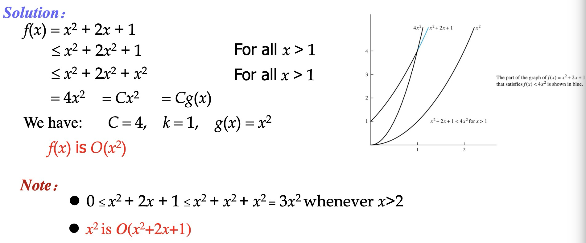
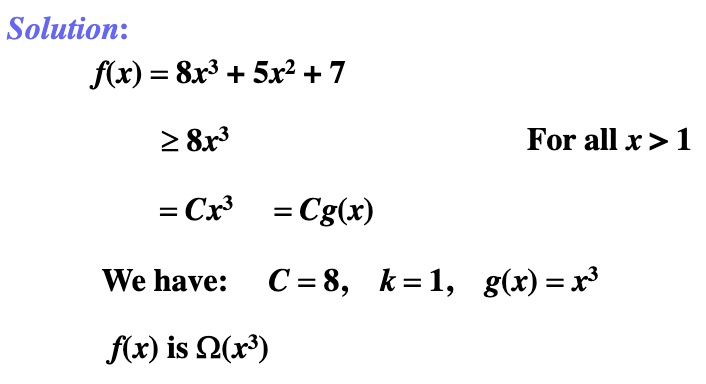

## Algorithms

定义：一个算法（Algorithm）是解决一个问题的精确指令的有限集。

### Properties of Algorithms

- 输入：算法从一个指定的集合得到输入值
- 输出：对每个输入值集合，算法都要从一个指定的集合中产生输出值，即为问题的解
- 确定性：算法的步骤必须是准确定义的
- 正确性：对每一组输入值，算法都应产生正确的输出值
- 有限性：对任何输入算法都应在有限（可能很多）步之后产生期望的输出
- 有效性：算法的每一步都应能够准确地在有效时间内完成
- 通用性：算法过程应该可以应用于期望形式的所有问题，而不只是用于一组特定的输入值

## The Growth of Functions

### Big-O Notation

定义：令 $f$ 和 $g$ 为从整数集或实数集到实数集的函数。如果存在常数 $C$ 和 $k$ 使得只要当 $x>k$ 时就有 $|f(x)|\leq C|g(x)|$，称 $f(x)$ 是 $O(g(x))$ 的。

**e.g. 证明 $f(x)=x^2+2x+1$ 是 $O(x^2)$ 的。**

如果两个函数 $f(x)$ 和 $g(x)$ 满足 $f(x)$ 是 $O(g(x))$ 的，以及 $g(x)$ 是 $O(f(x))$ 的，我们称 $f(x)$ 和 $g(x)$ 是同阶的

#### Big-O Estimates for Polynomials

令 $f(x)=a_nx^n+a_{n-1}x^{n-1}+...+a_1x+a_0$ ，其中 $a_0,a_1,...,a_{n-1},a_n$ 为实数。那么 $f(x)$ 是 $O(x^n)$ 的。

#### The Growth of Combinations of Functions

如果 $f_1(x)$ 是 $O(g_1(x))$ 的，$f_2(x)$ 是 $O(g_2(x))$ 的，那么 $(f_1+f_2)(x)$ 是 $O(max\{|g_1(x)|,|g_2(x)|\})$ 的；$(f_1f_2)(x)$ 是 $O(g_1(x)g_2(x))$ 的。

### Big-Omega Notation

定义：令 $f$ 和 $g$ 为从整数集或实数集到实数集的函数。如果存在常数 $C$ 和 $k$ 使得只要当 $x>k$ 时就有 $|f(x)|\geq C|g(x)|$，称 $f(x)$ 是 $\Omega(g(x))$ 的。

**e.g. 证明 $f(x)=8x^3+5x^2+7$ 是 $\Omega(x^3)$ 的**

### Big-Theta

定义：令 $f$ 和 $g$ 为从整数集或实数集到实数集的函数。如果 $f(x)$ 是 $O(g(x))$ 的且 $f(x)$ 是 $\Omega(g(x))$ 的，称 $f(x)$ 是 $\Theta(g(x))$ 的，即 $f(x)$ 是 $g(x)$ 阶的，或 $f(x)$ 和 $g(x)$ 是同阶的。