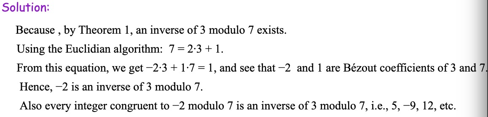
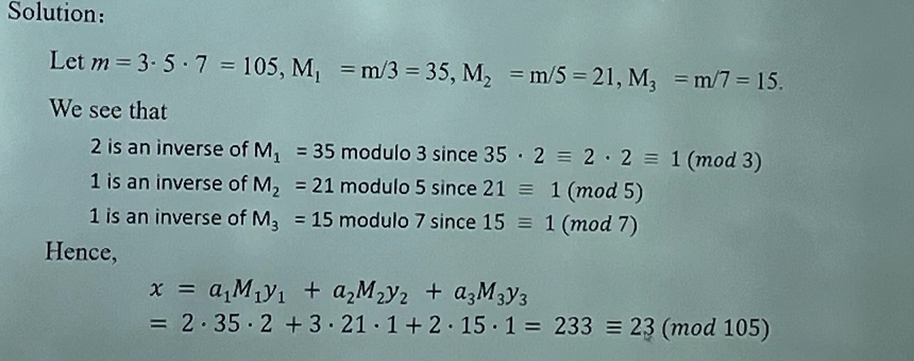

## Divisibility and Modular Arithmetic

### Division

定义：如果 $a$ 和 $b$ 都为整数且 $a\not =0$ ，如果存在一个整数 $c$ 使得 $b=ac$ （或者 $b/a$ 是一个整数），那么称 $a$ 整除 $b$ （用 $a|b$ 表示），$a$ 是 $b$ 的一个因子或除数，而 $b$ 是 $a$ 的一个倍数，用 $a\nmid b$ 表示 $a$ 不整除 $b$ 。

定理：令 $a,b,c$ 为整数，其中 $a\not= 0$

- 如果 $a|b$ 和 $a|c$ ，那么对任意整数 $m$ 和 $n$ 都有 $a|(mb+nc)$
- 如果 $a|b$ ，那么对所有整数 $c$ 都有 $a|bc$
- 如果 $a|b$，$b|c$，则 $a|c$

### Division Algorithm

除法算法（Division Algorithm）：令 $a$ 为整数，$d$ 为正整数。则存在唯一的整数 $q$ 和 $r$ ，满足 $0\leq r<d$，使得 $a=dq+r$ ，其中 $d$ 称为除数（Divisor），$a$ 称为被除数（Dividend），$q$ 称为商（Quotient）（记为 $q=a\space div\space d$），$r$ 称为余数（Remainder）（记为 $r=a\space mod \space d$）。

### Congruence Relation

定义：如果 $a$ 和 $b$ 为整数而 $m$ 为正整数，则当 $m$ 整除 $a-b$ 时称 $a$ 模 $m$ 同余（Congruent） $b$，用式子 $a\equiv b(mod\space m)$ 表示，该式子被称为同余式（Congruence），$m$ 被称为它的模（Modulus），用 $a\not \equiv b(mod\space m)$ 表示 $a$ 和 $b$ 不是模 $m$ 同余的。

定理：令 $a$ 和 $b$ 为整数，$m$ 为正整数

- $a\equiv b(mod\space m) \Leftrightarrow a\space mod\space m=b\space mod \space m \Leftrightarrow \exists k \in \Z,a=b+km$
- 如果 $a\equiv b(mod\space m),c\equiv d(mod\space m)$，则 $a+c\equiv b+d(mod\space m),ac\equiv bd(mod\space m)$（一般地，当 $d=c$ 时，$a+c\equiv b+c(mod\space m),ac\equiv bc(mod\space m)$）
- $(a+b)\space mod \space m=((a\space mod\space m)+(b\space mod \space m))mod\space m$
- $ab\space mod\space m=((a\space mod\space m)(b\space mod \space m))mod\space m$

### Arithmetic Modulo

在 $\Z_m$ 上，即小于 $m$ 的非负整数的集合 $\{0,1,...,m-1\}$ 上定义算术运算，定义这些整数的加法（用 $+_m$ 表示）：$a+_mb=(a+b)mod\space m$；定义这些整数的乘法（用 $·_m$ 表示）：$a·_mb=(a·b)mod\space m$。这些运算被称为模 $m$ 算术。

模 $m$ 算术满足如下性质：

- 封闭性：如果 $a$ 和 $b$ 属于 $\Z_m$，则 $a+_mb$ 和 $a·_mb$ 也属于 $\Z_m$
- 结合律：如果 $a$ 和 $b$ 属于 $\Z_m$，则 $(a+_mb)+_mc=a+_m(b+_mc),(a·_mb)·_mc=a·_m(b·_mc)$
- 交换律：如果 $a$ 和 $b$ 属于 $\Z_m$，则 $a+_mb=b+_ma,a·_mb=b·_ma$
- 单位元：元素 0 和 1 分别是模 $m$ 加法和乘法的单位元。即如果 $a$ 属于 $\Z_m$，则 $a+_m0=0+_ma=a,a·_m1=1·_ma=a$
- 加法逆元：如果 $a\not =0$ 属于 $\Z_m$，则 $m-a$ 是 $a$ 的模 $m$ 加法逆元，而 0 是其自身的加法逆元。即 $a+_m(m-a)=0,0+_m0=0$
- 分配律：如果 $a,b$ 和 $c$ 属于 $\Z_m$，则 $a·_m(b+_mc)=(a·_mb)+_m(a·_mc),(a+_mb)·_mc=(a·_mc)+_m(b·_mc)$

## Integer Representations and Algorithms

## Primes and Greatest Common Divisors

### Primes

定义：如果一个大于 1 的整数 $p$ 的正因子只是 1 和 $p$，那么这个整数被称为素数（Prime）；大于 1 但又不是素数的正整数被称为合数（Composite）

### The Fundamental Theorem of Arithmetic

算术基本定理（The Fundamental Theorem of Arithmetic）：每一个大于 1 的整数都可以唯一地写为两个或多个素数的乘积，其中素数因子以非递减序排列。（即质因子分解）

### Trial Division

定理：如果 $n$ 是一个合数，那么 $n$ 必有一个素因子小于等于 $\sqrt{n}$

### Infinitude of Primes

定理：存在无穷多个素数

### Mersenne Primes

定义：如果一个素数被表示为 $2^p-1$，其中 $p$ 为素数，那么这个素数被称为梅森素数（Mersenne Primes）

### Distribution of Primes

素数定理（Prime Number Theorem）：当 $x$ 无限增长时，不超过 $x$ 的素数个数（记为 $\pi(x)$）与 $\frac{x}{\ln x}$ 之比趋近于 1。

### Greatest Common Divisor

定义：令 $a$ 和 $b$ 是两个整数，不全为 0。 能使 $d|a$ 和 $d|b$ 的最大整数 $d$ 称为 $a$ 和 $b$ 的最大公约数（Greatest Common Divisor），记作 $\gcd(a,b)$。

如果整数 $a$ 和 $b$ 的最大公约数是 1，那么称它们是互素的（Relatively Prime）。

更一般地，当 $1\leq i<j\leq n$ 时都有 $\gcd(a_i,a_j)=1$ ，那么称整数 $a_1,a_2,...,a_n$ 是两两互素的（Pairwise Relatively Prime）。

### Least Common Multiple

定义：正整数 $a$ 和 $b$ 的最小公倍数（Least Common Multiple）是能被 $a$ 和 $b$ 整除的最小正整数，记作 $lcm(a,b)$ 。

### Prime Factorizations

假设 $a$ 和 $b$ 的质因数分解式（Prime Factorizations）为：

$a=p_1^{a_1}p_2^{a_2}...p_n^{a_n},b=p_1^{b_1}p_2^{b_2}...p_n^{b_n}$

那么 $a$ 和 $b$ 的最大公约数可被表示为：$\gcd(a,b)=p_1^{\min(a_1,b_1)}p_2^{\min(a_2,b_2)}...p_n^{\min(a_n,b_n)}$

最小公倍数可被表示为：$lcm(a,b)=p_1^{\max(a_1,b_1)}p_2^{\max(a_2,b_2)}...p_n^{\max(a_n,b_n)}$

$ab=\gcd(a,b)\times lcm(a,b)$

### Euclidean Algorithm

令 $a=bq+r$，其中 $a,b,q$ 和 $r$ 均为整数。则 $\gcd(a,b)=\gcd(b,r)$

欧几里得算法（Euclidean Algorithm）：辗转相除法求最大公约数。（当 $a\geq b$ 时时间复杂度为 $O(\log\space b)$

### gcds as Linear Combinations

贝祖定理（Bézout’s Theorem）：如果 $a$ 和 $b$ 为正整数，则存在整数 $s$ 和 $t$ 使得 $\gcd(a,b)=sa+tb$，其中 $s$ 和 $t$ 被称为 $a$ 和 $b$ 的贝祖系数（Bézout’s Coefficients），等式被称为贝祖恒等式。

**e.g. 将 $\gcd(252,198)=18$ 表达为贝祖恒等式。**

由贝祖定理可以推导出如下定理：

- 如果 $a,b$ 和 $c$ 为正整数，使得 $\gcd(a,b)=1$ 且 $a|bc$，则 $a|c$

- 如果 $p$ 是素数，且 $p|a_1a_2...a_n$，其中 $a_i$ 为整数，则对于某个 $i$，$p|a_i$

- 令 $m$ 为正整数，$a,b$ 和 $c$ 为整数。如果 $ac\equiv bc(mod\space m)$ 且 $\gcd(c,m)=1$，则 $a\equiv b(mod\space m)$

## Solving Congruences

### Linear Congruences

定义：具有形式 $ax\equiv b(mod\space m)$ 的同余方程（其中 $m$ 为正整数，$a$ 和 $b$ 为整数，$x$ 为变量）被称为线性同余方程（Linear Congruences）

### Inverse of a modulo m

如果存在一个整数 $\overline{a}$，使得 $\overline{a}a\equiv 1(mod\space m)$，那么称整数 $\overline{a}$ 为 $a$ 模 $m$ 的逆（Inverse of $a$ modulo $m$）

定理：如果 $a$ 和 $m$ 为互素的整数且 $m>1$，则 $a$ 模 $m$ 的逆存在。更进一步地，这个模 $m$ 的逆是唯一的。（即存在唯一小于 $m$ 的正整数 $\overline{a}$ 是 $a$ 模 $m$ 的逆，并且 $a$ 模 $m$ 的其他每个逆均和 $\overline{a}$ 模 $m$ 同余）

证明：由 $\gcd(a,m)=1$ 及贝祖定理得存在整数 $s$ 和 $t$ 使得 $sa+tm=1$，即 $sa+tm\equiv 1(mod\space m)$，由 $tm\equiv 0(mod\space m)$，则 $sa\equiv 1(mod\space m)$，即 $s$ 为 $a$ 模 $m$ 的逆。

**e.g.1. 找到 3 模 7 的逆。**

**e.g.2. 找到 101 模 4620 的逆。**

### Using Inverses to Solve Congruences

**e.g. 解同余方程 $3x\equiv 4(mod\space 7)$**

由 4.4.2 e.g.1. 得 -2 是 3 模 7 的逆，在同余式两边同乘 -2 得 $-2\times3x\equiv -2\times4(mod\space 7)$，因为 $-6\equiv 1(mod\space 7)$ 且 $-8\equiv 6(mod\space 7)$，所以如果 $x$ 是解，则有 $x\equiv -8\equiv 6(mod\space 7)$

### The Chinese Remainder Theorem

中国剩余定理（The Chinese Remainder Theorem）：令 $m_1,m_2,...,m_n$ 为大于 1 的两两互素的正整数，而 $a_1,a_2,...,a_n$ 是任意整数。则同余方程组
$$
\begin{cases}
x\equiv a_1(mod\space m_1)\\
x\equiv a_2(mod\space m_2)\\
\cdots\\
x\equiv a_n(mod\space m_n)
\end{cases}
$$
有唯一的模 $m=m_1m_2...m_n$ 的解（即存在一个满足 $0\leq x\leq m$ 的解 $x$，而所有其他的解均与此解模 $m$ 同余）

**e.g. 求解同余方程组**
$$
\begin{cases}
x\equiv 2(mod\space 3)\\
x\equiv 3(mod\space 5)\\
x\equiv 2(mod\space 7)
\end{cases}
$$

### Back Substitution

回代方法是另一种求解同余方程组的方法。

**e.g. 求解同余方程组**
$$
\begin{cases}
x\equiv 1(mod\space 5)\\
x\equiv 2(mod\space 6)\\
x\equiv 3(mod\space 7)
\end{cases}
$$

### Computer Arithmetic with Large Integers

假定 $m_1,m_2,...m_n$ 是两两互素的模数，并令 $m$ 为其乘积。根据中国剩余定理可以证明满足 $0\leq a<m$ 的整数 $a$ 可唯一地表示为一个 $n$ 元组，其元素由 $a$ 除以 $m_i$ 的余数组成（$i=1,2,..n$）。即 $a$ 可以唯一地表示为 $(a\space mod\space m_1,a\space mod\space m_2,...,a\space mod\space m_n)$（被用于处理大整数）

**e.g. 利用模数为 $99,98,97,95$ 来寻找 $123684$ 和 $413456$ 的和。**

### Fermat's Little Theorem

费马小定理（Fermat's Little Theorem）：如果 $p$ 为素数，$a$ 是一个不能被 $p$ 整除的整数，则 $a^{p-1}\equiv 1(mod\space p)$。更一般地，对每个整数 $a$ 都有 $a^p\equiv a(mod\space p)$。

**e.g. 求 $7^{222}\space mod \space 11$**

### Pseudoprimes

定义：令 $b$ 是一个正整数。如果 $n$ 是一个正合数且 $b^{n-1}\equiv 1(mod\space n)$，则 $n$ 称为以 $b$ 为基数的伪素数（Pseudoprimes）

卡米切尔数（Carmichael Numbers）：一个正合数 $n$ 如果对于所有满足 $\gcd(b,n)=1$ 的正整数 $b$ 都有同余式 $b^{n-1}\equiv 1(mod\space n)$ 成立，则被称为卡米切尔数。

**e.g. 561 是一个卡米切尔数。**

