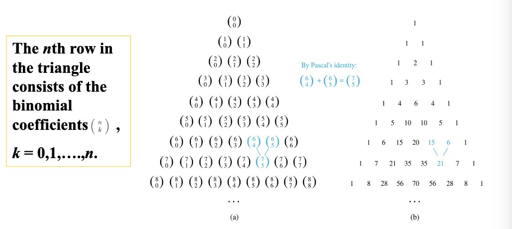

---
hide:
  #- navigation # 显示右
  #- toc #显示左
  - footer
  - feedback
comments: true
---  

# Chapter 06: Counting

## The Basics of Counting

### Basic Counting Principles : The Product Rule

乘积法则（The Product Rule）：假定一个过程可以被分解成两个任务。如果完成第一个任务有 $n_1$ 种方式，在第一个任务完成之后有 $n_2$ 种方式完成第二个任务，那么完成这个过程有 $n_1n_2$ 种方式。

### Basic Counting Principles : The Sum Rule

求和法则（The Sum Rule）：如果完成第一项任务有 $n_1$ 种方式，完成第二项任务有 $n_2$ 种方式，并且这些任务不能同时执行，那么完成第一或第二项任务有 $n_1+n_2$ 种方式。

### Basic Counting Principles : The Subtraction Rule

减法法则（The Subtraction Rule）：如果一个任务或者可以通过 $n_1$ 种方法执行，或者可以通过 $n_2$ 种另一类方法执行，那么执行这个任务的方法数是 $n_1+n_2$ 减去两类方法中相同的方法（与容斥原理类似）

### Basic Counting Principles : Division Rule

除法法则（Division Rule）：如果一个任务能由一个可以用 $n$ 种方式完成的过程实现，而对于每种完成任务的方式 $\omega$，在 $n$ 种方式中正好有 $d$ 种与之对应，那么完成这个任务的方法数为 $n/d$。

## The Pigeonhole Principle

### The Pigeonhole Principle

鸽巢原理（The Pigeonhole Principle）/狄利克雷抽屉原理（Dirichlet Drawer Principle）：如果 $k+1$ 个或更多的物体放入 $k$ 个盒子，那么至少有一个盒子包含了 $2$ 个或更多的物体。

推论：一个从 $k+1$ 甚至更多个元素的集合到 $k$ 个元素的集合的函数 $f$ 不是一对一函数。

### The Generalized Pigeonhole Principle

广义鸽巢原理（The Generalized Pigeonhole Principle）：如果 $N$ 个物体放入 $k$ 个盒子，那么至少有一个盒子包含了至少 $\lceil N/k\rceil$ 个物体。

## Permutations and Combinations

与高中所学排列（Permutations）组合（Combinations）相同

## Binomial Coefficients

### Powers of Binomial Expressions

定义：二项式（Binomial Expressions）是两项的和，例如 $x+y$。（更一般地，这些项可以是常数与变量的积）

### The Binomial Theorem

二项式定理（The Binomial Theorem）：设 $x$ 和 $y$ 是变量，$n$ 是非负整数，那么 $(x+y)^n=\sum\limits_{j=0}^{n}\begin{pmatrix}n\\j\end{pmatrix}x^{n-j}y^j$，其中$\begin{pmatrix}n\\j\end{pmatrix}=C_n^j$

推论：

- $\sum\limits_{k=0}^n\begin{pmatrix}n\\k\end{pmatrix}=2^n$
- $\sum\limits_{k=0}^{n}(-1)^k\begin{pmatrix}n\\k\end{pmatrix}=0$
- $\sum\limits_{k=0}^n2^k\begin{pmatrix}n\\k\end{pmatrix}=3^n$

### Pascal's Identity

帕斯卡恒等式（Pascal's Identity）：设 $n$ 和 $k$ 是满足 $n\geq k$ 的正整数，那么有 $\begin{pmatrix}n+1\\k\end{pmatrix}=\begin{pmatrix}n\\k-1\end{pmatrix}+\begin{pmatrix}n\\k\end{pmatrix}$

### Other Identity Involving Binomial Coefficients

范德蒙德恒等式（Vandermonde's Identity）：设 $m,n,r$ 是非负整数，其中 $r$ 不超过 $m$ 或 $n$，那么 $\begin{pmatrix}m+n\\r\end{pmatrix}=\sum\limits_{k=0}^r\begin{pmatrix}m\\r-k\end{pmatrix}\begin{pmatrix}n\\k\end{pmatrix}$

推论：如果 $n$ 是一个非负整数，那么 $\begin{pmatrix}2n\\n\end{pmatrix}=\sum\limits_{k=0}^n\begin{pmatrix}n\\k\end{pmatrix}^2$

设 $n$ 和 $r$ 是非负整数，$r\leq n$ ，那么 $\begin{pmatrix}n+1\\r+1\end{pmatrix}=\sum\limits_{j=r}^n\begin{pmatrix}j\\r\end{pmatrix}$

## Generalized Permutations and Combinations

与高中所学基本类似，补充第二类斯特林数：

设 $S(n,j)$ 表示将 $n$ 个可辨别的物体放入 $j$ 个不可辨别的盒子的方式数，其中不允许有空的盒子。数 $S(n,j)$ 称为第二类斯特林数（Stirling numbers of the second kind），有如下性质：

- $S(r,1)=S(r,r)=1$
- $S(r,2)=2^{r-1}-1$
- $S(r,r-1)=C(r,2)$
- $S(r+1,n)=S(r,n-1)+nS(r,n)$
- $S(n,j)=\frac{1}{j!}\sum\limits_{i=0}^{j-1}(-1)^i\begin{pmatrix}j\\i\end{pmatrix}(j-i)^n$