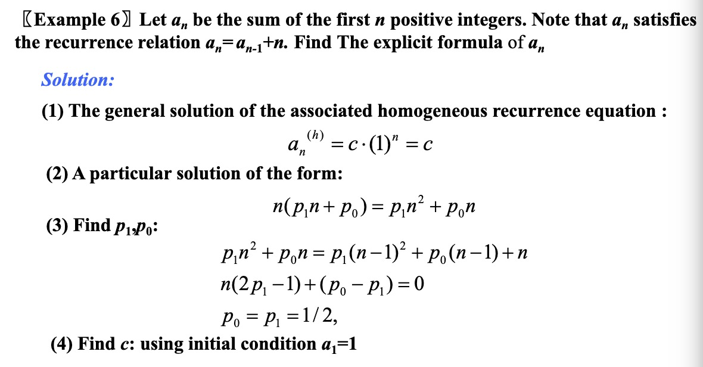
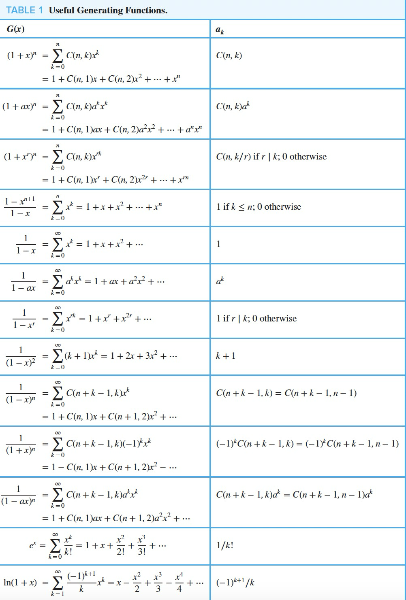

---
hide:
  #- navigation # 显示右
  #- toc #显示左
  - footer
  - feedback
# comments: true
---  

# Chapter 08: Advanced Counting Techniques

## Applications of Recurrence Relations

用递推求总方法数（e.g.Hanoi，Fibonacci...）

## Solving Linear Recurrence Relations

特征根&特征方程，与高中类似，补充内容：

### Linear Homogeneous Recurrence Relations

- Linear（线性）
- Homogeneous（齐次），Inhomogeneous/Nonhomogeneous（非齐次）
- Constant coefficients（常系数）
- Degree k：如果递推关系中用到了 k 项，那么这个递推关系的度为 $k$

### Theorems

- 设 $c_1$ 和 $c_2$ 是实数。假设 $r^2-c_1r-c_2=0$ 有两个不相等的根 $r_1$ 和 $r_2$ ，那么 $a_n=\alpha_1r_1^n+\alpha_2r_2^n$ 是递推关系 $a_n=c_1a_{n-1}+c_2a_{n-2}$ 的解（$n=0,1,2,...$），其中 $\alpha_1,\alpha_2$ 是常数。一般地，设 $c_1,c_2,...,c_k$ 是实数。假设特征方程 $r^k-c_1r^{k-1}-...-c_k=0$ 有 $k$ 个不相等的根 $r_1,r_2,...,r_k$。那么 $a_n=\alpha_1r_1^n+\alpha_2r_2^n+...+\alpha_kr_k^n$ 是递推关系 $a_n=c_1a_{n-1}+c_2a_{n-2}+...+c_ka_{n-k}$ 的解

- 设 $c_1$ 和 $c_2$ 是实数，$c_2\not=0$。假设 $r^2-c_1r-c_2=0$ 只有一个根 $r_0$ ，那么 $a_n=\alpha_1r_0^n+\alpha_2nr_0^n$ 是递推关系 $a_n=c_1a_{n-1}+c_2a_{n-2}$ 的解（$n=0,1,2,...$），其中 $\alpha_1,\alpha_2$ 是常数。一般地，设 $c_1,c_2,...,c_k$ 是实数。假设特征方程 $r^k-c_1r^{k-1}-...-c_k=0$ 有 $t$ 个不相等的根 $r_1,r_2,...,r_t$，其重数分别为 $m_1,m_2,...,m_t$。那么 $a_n=(\alpha_{1,0}+\alpha_{1,1}n+...+\alpha_{1,m-1}n^{m_1-1})r_1^n\\+(\alpha_{2,0}+\alpha_{2,1}n+...+\alpha_{2,m_2-1}n^{m_2-1})r_2^n\\+...+(\alpha_{t,0}+\alpha_{t,1}n+...+\alpha_{t,m_t-1}n^{m_t-1})r_t^n$ 是递推关系 $a_n=c_1a_{n-1}+c_2a_{n-2}+...+c_ka_{n-k}$ 的解（$n=0,1,2,...$），其中 $\alpha_{i,j}$ 是常数，$1\leq i\leq t$ 且 $0\leq j\leq m_i-1$
- 如果 $a_n^{(p)}$ 是常系数非齐次线性递推关系 $a_n=c_1a_{n-1}+c_2a_{n-2}+...+c_ka_{n-k}+F(n)$ 的一个特解，那么每个解都是 $a_n^{(p)}+a_n^{(k)}$ 的形式，其中 $a_n^{(k)}$ 是相伴的齐次递推关系 $a_n=c_1a_{n-1}+c_2a_{n-2}+...+c_ka_{n-k}$ 的一个解

- 假设 $\{a_n\}$ 满足线性非齐次递推关系 $a_n=c_1a_{n-1}+c_2a_{n-2}+...+c_ka_{n-k}+F(n)$，且 $F(n)=(b_tn^t+b_{t-1}n^{t-1}+...+b_1n+b_0)s^n$ ，其中 $b_0,b_1,...,b_t$ 和 $s$ 是实数，当 $s$ 不是相伴的线性齐次递推关系的特征方程的根时，存在一个特解 $(p_tn^t+p_{t-1}n^{t-1}+...+p_1n+p_0)s^n$，当 $s$ 是特征方程的根且它的重数是 $m$ 时，存在一个特解 $n^m(p_tn^t+p_{t-1}n^{t-1}+...+p_1n+p_0)s^n$

## Generating Functions

与 vjf 所学级数类似，重点概念：

生成函数（Generating Function）：序列 $a_0,a_1,a_2,...,a_k,...$ 的生成函数为 $G(x)=a_0+a_1x+...+a_kx^k+...=\sum\limits_{k=0}^{\infin}a_kx^k$

## Inclusion-Exclusion and Its Application

与广义容斥原理相同，补充内容：

- 设 $m$ 和 $n$ 是正整数，满足 $m\geq n$ 。那么存在 $n^m-C(n,1)(n-1)^m+C(n,2)(n-2)^m-...+(-1)^{n-1}C(n,n-1)*1^m$ 个从 $m$ 元素集合到 $n$ 元素集合的映上函数。
- $n$ 元素集合的错位排列数是 $D_n=n![1-\frac{1}{1!}+\frac{1}{2!}-\frac{1}{3!}+...+(-1)^n\frac{1}{n!}]$