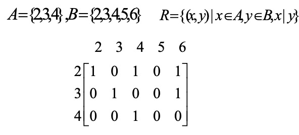
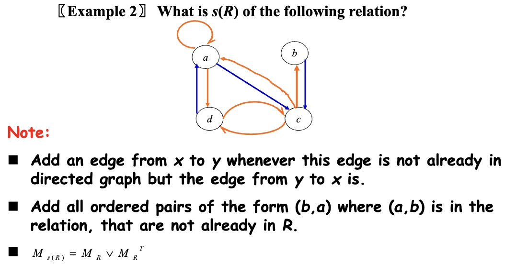
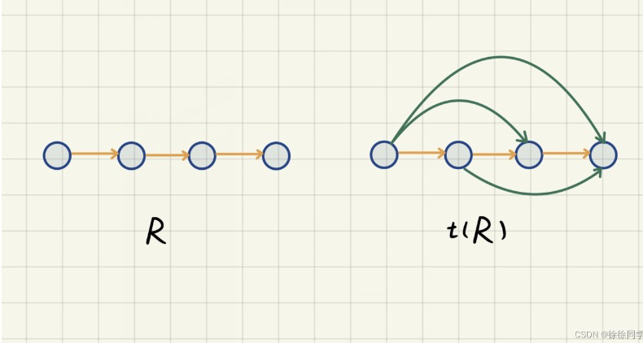
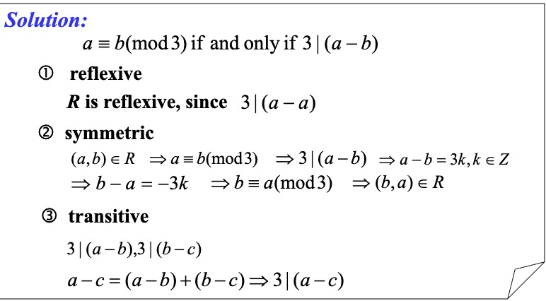
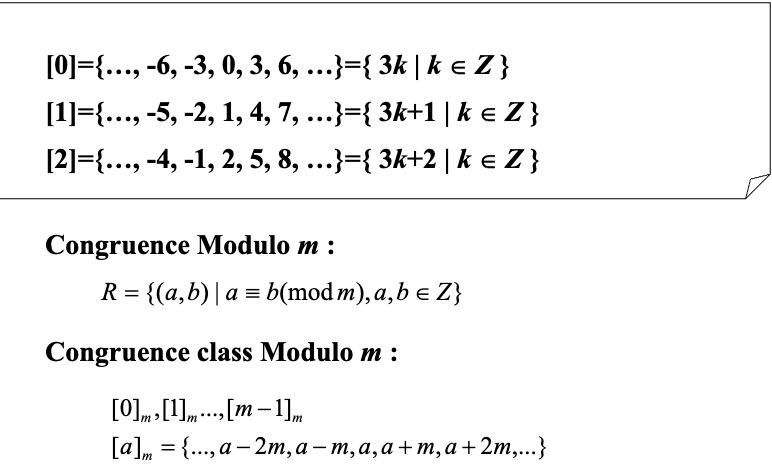
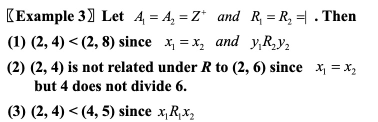

---
hide:
  #- navigation # 显示右
  #- toc #显示左
  - footer
  - feedback
comments: true
---  

# Chapter 09: Relations

## Relations and Their Properties

### Binary Relation

设 $A$ 和 $B$ 是集合，一个从 $A$ 到 $B$ 的二元关系（Binary Relation）是 $A\times B$ 的子集。更一般地，设 $A_1,A_2,...,A_n$ 是集合，一个关于 $A_1,A_2,...,A_n$ 的 $n$ 元关系是 $A_1\times A_2\times...\times A_n$ 的子集。 

### Relations On A Set

集合 $A$ 上的关系是从 $A$ 到 $A$ 的关系。

可以用一个 $m\times n$ 的连接矩阵 $M_R=[m_{ij}]$ 来表示集合 $A=\{a_1,a_2,...,a_m\}$ 和 $B=\{b_1,b_2,...,b_n\}$ 之间的关系，其中 $m_{ij}=\begin{cases}1,(a_i,b_j)\in R\\0,(a_i,b_j)\not\in R\end{cases}$ 

**e.g.**

### Properties of Binary Relations

- 自反性（Reflexive Relations）：若 $\forall x(x\in A \rightarrow (x,x)\in R)$，那么定义在集合 $A$ 上的关系 $R$ 称为自反的。
- 反自反性（Irreflexive Relations）：若 $\forall x(x\in A\rightarrow (x,x)\not\in R)$ ，那么定义在集合 $A$ 上的关系 $R$ 称为反自反的。
- 对称性（Symmetric Relations）：若 $\forall x\forall y((x,y)\in R\rightarrow (y,x)\in R)$ ，那么定义在集合 $A$ 上的关系 $R$ 称为对称的。
- 反对称性（Antisymmetric Relations）：若 $\forall x\forall y((x,y)\in R \land (y,x)\in R\rightarrow x=y)$，那么定义在集合 $A$ 上的关系 $R$ 称为反对称的。
- 传递性（Transitive Relations）：若 $\forall x\forall y\forall z((x,y)\in R \land (y,z)\in R \rightarrow (x,z)\in R)$，那么定义在集合 $A$ 上的关系 $R$ 称为传递的。

### Combining Relations

设 $A=\{a_1,a_2,...,a_n\},B=\{b_1,b_2,...,b_m\}，M_{R_1}=[c_{ij}],M_{R_2}=[d_{ij}]$，通过连接矩阵来表示：

- $M_{R_1\bigcup R_2}=[c_{ij}\lor d_{ij}]=M_{R_1}\lor M_{R_2}$
- $M_{R_1\bigcap R_2}=[c_{ij}\land d_{ij}]=M_{R_1}\land M_{R_2}$
- $M_{\overline{R_1}}=[\overline{c_{ij}}]$
- $M_{R_1-R_2}=M_{R_1\bigcap \overline{R_2}}=[c_{ij}\land \overline{d_{ij}}]$

设 $R$ 是从集合 $A$ 到集合 $B$ 的关系，$S$ 是从集合 $B$ 到集合 $C$ 的关系。$R$ 与 $S$ 的合成是由有序对 $(a,c)$ 的集合构成的关系，其中 $a\in A,c\in C$，并且存在一个 $b\in B$ 的元素，使得 $(a,b)\in R$ 且 $(b,c)\in S$。我们用 $S\circ R$ 表示 $R$ 与 $S$ 的合成。$M_{R\circ S}=M_S\times M_R$

### The Power of a relation R

设 $R$ 是集合 $A$ 上的关系。$R$ 的 $n$ 次幂 $R^n(n=1,2,3,...)$ 递归地定义为 $R^1=R$ 和 $R^{n+1}=R^n\circ R$

定理：集合 $A$ 上的关系 $R$ 是传递的，当且仅当对 $n=1,2,3,...$ 有 $R^n\subseteq R$

### Inverse Relation

设 $R$ 是从 $A$ 到 $B$ 的关系，那么其逆关系 $R^{-1}/R^c=\{(b,a)|(a,b)\in R,a\in A,b\in B\}$

逆关系具有如下性质：

- $(R\bigcup S)^{-1}=R^{-1}\bigcup S^{-1}$
- $(R\bigcap S)^{-1}=R^{-1}\bigcap S^{-1}$
- $\overline{R}^{-1}=\overline{R^{-1}}$
- $(R-S)^{-1}=R^{-1}-S^{-1}$
- $(A\times B)^{-1}=B\times A$
- $\overline{R}=A\times B-R$
- $(S\circ T)^{-1}=T^{-1}\circ S^{-1}$
- $(R\circ T)\circ P=R\circ(T\circ P)$
- $(R\bigcup S)\circ T=R\circ T\bigcup S\circ T$

## n-ary Relations and Their Applications

## Representing Relations

## Closures of Relations

### What Is Closures of Relations

定义：设 $R$ 是集合 $A$ 上的关系，关系 $R$ 具有性质 $P$ 的闭包（Closure） 即为集合 $A$ 上包含 $R$ 的具有性质 $P$ 的关系 $S$ ，并且 $S$ 是每一个包含 $R$ 的具有性质 $P$ 的 $A\times A$ 的子集。（简单理解即为 **$R$ 的具有性质 $P$ 的闭包就是把 $R$ 与满足性质 $P$ 的关系的集合取并**）

### Reflexive Closure

定义：设 $R$ 是集合 $A$ 上的关系，那么 $R$ 的自反闭包（Reflexive Closure），记为 $r(R)$ ，是 $R\bigcup I_A$ （其中 $I_A$ 即为 $A$ 的对角关系，$I_A=\{(x,x)|x\in A\}$）

$R=R\bigcup I_A\Leftrightarrow R$ 是一个自反闭包 

**e.g. $R=\{(a,b)|a<b,a,b\in Z\}$，求 $R$ 的自反闭包。**

### Symmetric Closure

定义：设 $R$ 是集合 $A$ 上的关系，那么 $R$ 的对称闭包（Symmetric Closure），记为 $s(R)$ ，是 $R\bigcup R^{-1}$ 。

$R=R\bigcup R^{-1}\Leftrightarrow R$ 是一个对称闭包

### Transitive Closure

定义：设 $R$ 是集合 $A$ 上的关系，那么 $R$ 的传递闭包（Transitive Closure），记为 $t(R)$ ，满足 $\forall a\in A\space\forall b\in A\space a$ 可达 $b\rightarrow (a,b)\in R$

定理：设 $R$ 是集合 $A$ 上的关系，那么存在一条 $a$ 到 $b$ 长度为 $n$ 的路径 $\Leftrightarrow (a,b)\in R^n$。 

### Connectivity Relation

定义：连通关系（Connectivity Relation）即为一个有序对 $(a,b)$ 的集合，满足在 $R$ 中存在一个 $a$ 到 $b$ 的道路，记为 $R^*$ 。

定理：

- $t(R)=R^*$
- 如果 $|A|=n$，那么任何长度大于 $n$ 的道路一定含有回环。
- 如果 $|A|=n$ ，$R$ 是集合 $A$ 上的关系，那么 $\exists k,k\leq n,R^*=R\bigcup R^2\bigcup...\bigcup R^k,t(R)=R^*=R\bigcup R^2\bigcup...\bigcup R^n$
- $M_{t(R)}=M_R\lor M_R^{[2]}\lor...\lor M_R^{[n]}$

### Warshall's Algorithm

内部顶点：对于一条从 $a$ 到 $b$ 的路径，除了起点 $a$ 和终点 $b$ 出现在路径中的所有顶点。

沃舍尔算法（Warshall's Algorithm）：构造一系列 0-1 矩阵 $W_0,W_1,...,W_n$ ，其中 $W_0=M_R,W_k=[\omega_{ij}^{(k)}]$，其中如果存在一条从 $v_i$ 到 $v_j$ 的路径使得这条路径的所有内部顶点都在集合 $\{v_1,v_2,...,v_k\}$ （前 $k$ 个顶点）中，那么 $\omega_{ij}^{(k)}=1$，否则为 0（这条路径的起点和终点可能在集合之外），由定义可知 $W_n=M_{t(R)}$

引理：$\omega_{ij}^{[k]}=\omega_{ij}^{[k-1]}\lor(\omega_{ik}^{[k-1]}\land\omega_{kj}^{[k-1]})$

## Equivalence Relations

### Equivalence Relations

如果一个定义在集合 $A$ 上的关系 $R$ 是自反的、对称的和传递的，那么称关系 $R$ 是等价关系（Equivalence Relations）。若两个元素 $a$ 和 $b$ 通过等价关系而关联，则称它们是等价的，记为 $a$~$b$。

### Equivalence Class

设 $R$ 是定义在集合 $A$ 上的等价关系，与 $A$ 中其中一个元素 $a$ 有关系的所有元素的集合叫作 $a$ 的等价类（Equivalence Class），记作 $[a]_R/[a]$，由定义 $[a]_R=\{s|(a,s)\in R\}$，如果 $b\in [a]_R$，那么称 $b$ 为等价类的代表。

**e.g. 模 3 同余的关系 $R=\{(a,b)|a\equiv b(mod\space3),a,b\in Z\}$，证明其是一个等价关系并指出其等价类。**

### Partition of a Set

令 $\{A_1,A_2,...\}$ 是 $A$ 的子集的组合。那么这个组合被称为 $A$ 的划分（Partition，记作 $pr(A)$）当且仅当：

- $A_i\not=\phi,i\in Z$
- $A_i\bigcap A_j=\phi,i\not=j$
- $\forall a\in A,\exists i, a\in A_i(i=1,2,...)$

### Equivalence Classes and Partitions

令 $R$ 是一个集合 $A$ 上的等价关系，定理：

- $aRb\Leftrightarrow [a]=[b]\Leftrightarrow [a]\bigcap[b]\not=\phi$
- $R$ 的等价类是 $A$ 的划分。反过来说，如果给定一个 $A$ 的划分 $\{A_i|i\in I\}$，那么一定有一个对应的等价关系 $R$，使得其等价类为这个划分。

### The Operations of Equivalence Relations

如果 $R_1,R_2$ 是 $A$ 的等价关系，定理：

- $R_1\bigcap R_2$ 也是 $A$ 的等价关系。
- $R_1\bigcup R_2$ 是 $A$ 的对称和自反关系。
- $(R_1\bigcup R_2)^*$ 也是 $A$ 的等价关系。

## Partial Orderings

### Partial Orderings

令 $R$ 是集合 $S$ 上的关系，如果 $R$ 是自反的、反对称的、传递的，那么称 $R$ 为偏序（Partial Ordering/Partial Order），记为 $(S,R)$。用记号 $a\preccurlyeq b$ 来表示 $(a,b)\in R$，$a \prec b$  表示 $(a,b)\in R,a\not=b$，$\preccurlyeq$ 表示所有的偏序，$(S,\preccurlyeq)$ 表示所有的偏序集。

设偏序集 $(S,\preccurlyeq)$ 中的元素 $a,b$，如果 $a\preccurlyeq b$ 或 $b\preccurlyeq a$ ，那么称 $a$ 和 $b$ 是可比的（Comparable）；否则为不可比的（Incomparable）。

如果 $(S,\preccurlyeq)$ 是偏序集，且 $S$ 中的每对元素都是可比的，则 $S$ 称为全序集或线序集（Totally Ordered Set/Linearly Ordered Set），$\preccurlyeq$ 被称为全序或线序（Total Order/Linear Order），一个全序集也被称为链。

对于偏序集 $(S,\preccurlyeq)$ ，如果 $\preccurlyeq$ 是全序，并且 $S$ 的每个非空子集都有一个最小元素，就称其为良序集（Well-Ordered Set）。

良序归纳原理：设 $S$ 是一个良序集。归纳步骤：对所有 $y\in S$ ，如果 $P(x)$ 对所有 $x\in S$ 且 $x\prec y$ 为真，$P(y)$ 为真，结论为 $P(x)$ 对所有 $x\in S$ 为真

### Lexicographic Order

对于两个偏序集 $(A_1,\preccurlyeq_1)$ 和 $(A_2,\preccurlyeq_2)$ ，那么在 $A_1\times A_2$ 上的字典顺序（Lexicographic Order）$\prec$ 定义为：$(a_1,a_2)\prec(b_1,b_2)\Leftrightarrow (a_1\prec_1b_1) \lor((a_1=b_1)\land(a_2\prec_2b_2))$

### Hasse diagrams

### Chain and Antichain

设 $(A,\preccurlyeq)$ 是一个偏序集，$B\subseteq A$，如果 $(B,\preccurlyeq)$ 是一个全序集，那么 $B$ 被称为 $(A,\preccurlyeq)$ 的链（Chain），链的长度为 $|B|$；如果 $B\subseteq A$，$\forall a,b\in B(a\neq b),(a,b)\not\in R,(b,a)\not\in R$，那么 $B$ 被称为 $(A,\preccurlyeq)$ 的反链（Antichain）。

### Maximal and Minimal Elements

设 $(A,\preccurlyeq)$ 是一个偏序集，如果不存在 $b\in A$ 使得 $a\prec b$，那么 $a$ 在偏序集 $(A,\preccurlyeq)$ 中是极大元（Maximal Elements）；如果不存在 $b\in A$ 使得 $b\prec a$，那么 $a$ 在偏序集 $(A,\preccurlyeq)$ 中是极小元（Minimal Elements）

### Greatest and Least Element

设 $(A,\preccurlyeq)$ 是一个偏序集，如果对所有的 $b\in A$ 有 $b\preccurlyeq a$，那么 $a$ 在偏序集 $(A,\preccurlyeq)$ 中是最大元（Greatest Elements）；如果对所有的 $b\in A$ 有 $a\preccurlyeq b$，那么 $a$ 在偏序集 $(A,\preccurlyeq)$ 中是最小元（Least Elements）

定理：当最大/最小元存在时，它是唯一的。

### Upper and Lower Bounds

设 $A$ 是 $S$ 的一个子集，如果 $u$ 是 $S$ 中的元素，使得对所有的元素 $a\in A$ 有 $a\preccurlyeq u$，那么 $u$ 被称为 $A$ 的一个上界（Upper Bounds）；如果 $u$ 是 $S$ 中的元素，使得对所有的元素 $a\in A$ 有 $u\preccurlyeq a$，那么 $u$ 被称为 $A$ 的一个下界（Lower Bounds）。

若任意 $a\in A$ 有 $a\preccurlyeq x$，并且对于 $A$ 的任意上界 $z$ 有 $x\preccurlyeq z$，则 $x$ 被称为 $A$ 的最小上界（Least Upper Bounds），记作 $lub(A)$；如果 $y$ 是 $A$ 的下界，并且对于 $A$ 的任意下界 $z$，有 $z\preccurlyeq y$，则 $y$ 被称为 $A$ 的最大下界（Greatest Lower Bounds），记作 $glb(A)$。

### Lattices

如果一个偏序集的每对元素都有最小上界和最大下界，那么称这个偏序集为格（Lattices）

### Topological Sorting

如果只要 $aRb$ 就有 $a\preccurlyeq b$，则称一个全序 $\preccurlyeq$ 与偏序 $R$ 是相容的（Compatible）。从一个偏序构造一个相容的全序称为拓扑排序（Topological Sorting）。

引理：每个有穷非空偏序集 $(S,\preccurlyeq)$ 至少有一个极小元。