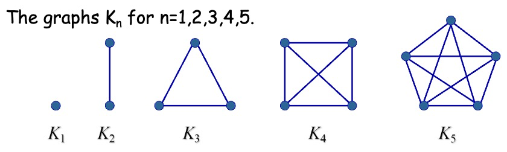
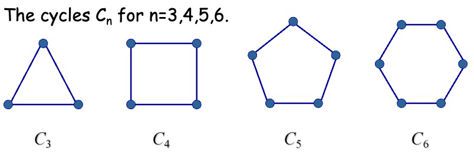
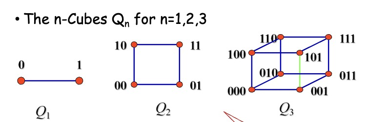
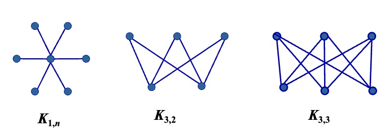
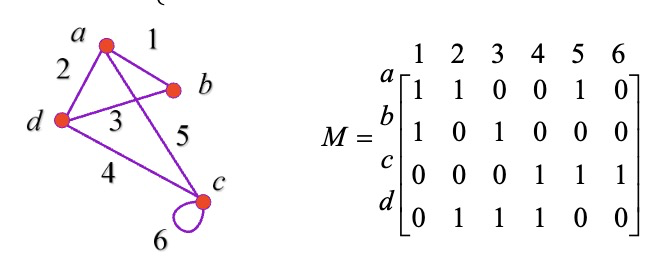
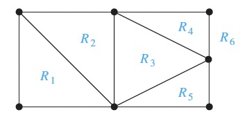

---
hide:
  #- navigation # 显示右
  #- toc #显示左
  - footer
  - feedback
# comments: true
---  

# Chapter 10: Graphs

## Graphs and Graph Models

### Graphs

定义：图（Graph） $G=(V,E)$ 由顶点（Vertices）（或结点（Nodes））的非空集 $V$ 和边（Edge）集 $E$ 构成，每条边有一个或两个顶点与它相连，这样的顶点称为边的端点（Endpoints），边连接它的端点。

顶点集为无限集或有无限条边的图称为无限图（Infinite Graph）；顶点集和边集为有限集的图称为有限图（Finite Graph）。

每条边都连接两个不同的顶点且没有两条不同的边连接一对相同顶点的图称为简单图（Simple Graph）；有多重边（Multiple edges）（多条边连接同一对顶点）连接同一对顶点的图称为多重图（Multigraph）；包含环（Loops）或存在多重边连接同一对顶点或同一个顶点的图称为伪图（Pseudograph）。

定义：有向图（Directed Graph/Digraph） $(V,E)$ 由一个非空顶点集 $V$ 和一个有向边（Directed edges）（或弧（Arcs））集 $E$ 组成。每条有向边与一个顶点有序对相关联。我们称与有序对 $(u,v)$ 相关联的有向边开始于 $u$，结束于 $v$。

当一个有向图不包含环和多重有向边时，就称为简单有向图（Simple Directed Graph）；含有从一个顶点指向第二个（也许是同一个）顶点的多重有向边的有向图称为有向多重图（Directed Multigraph）。当 $m$ 条有向边中的每一条都与顶点有序对 $(u,v)$ 相关联时，称 $(u,v)$ 是一条多重度为 $m$ 的边。

定义：既包含有向边又包含无向边的图称为混合图（Mixed Graph）。

## Graph Terminology and Special Types of Graphs

### Basic Terminology

对于无向图 $G=(V,E)$：

> 若 $u$ 和 $v$ 是无向图中的一条边 $e$ 的端点，则称两个顶点 $u$ 和 $v$ 在 $G$ 里邻接（Adjacent）（或相邻（Neighbors））。这样的边 $e$ 称为关联（Incident）顶点 $u$ 和 $v$，也可以说边 $e$ 连接（Connect） $u$ 和 $v$。

> 顶点 $v$ 的所有相邻顶点的集合，记作 $N(v)$，称为顶点 $v$ 的邻居（Neighborhood）。若 $A$ 是 $V$ 的子集，我们用 $N(A)$ 表示图 $G$ 中至少和 $A$ 中一个顶点相邻的所有顶点的集合。所以 $N(A)=\bigcup\limits_{v\in A}N(v)$。

> 顶点的度（Degree）是与该顶点相关联的边的数目，记作 $deg(v)$。特别地，顶点上的环为顶点的度做出双倍贡献。度为 0 的顶点称为孤立的（Isolated）；度为 1 的顶点称为悬挂的（Pendant）。

握手定理：设 $G=(V,E)$ 是有 $m$ 条边的无向图，则 $2m=\sum\limits_{v\in V}deg(v)$。

推论：无向图有偶数个度为奇数的顶点。

对于有向图 $G=(V,E)$：

> 当 $(u,v)$ 是 $G$ 的有向边时，说 $u$ 邻接到（Adjacent to） $v$，或 $v$ 从 $u$ 邻接（Adjacent From）。顶点 $u$ 称为 $(u,v)$ 的起点（Initial Vertex），$v$ 称为 $(u,v)$ 的终点（Terminal Vertex）。环的起点和终点是相同的。

> 顶点 $v$ 的入度（In Degree），记作 $deg^-(v)$，是以 $v$ 作为终点的边数。顶点 $v$ 的出度（Out Degree），记作 $deg^+(v)$，是以 $v$ 作为起点的边数。特别地，顶点上的环对这个顶点的入度和出度的贡献都是 1 。

> $\sum\limits_{v\in V}deg^-(v)=\sum\limits_{v\in V}deg^+(v)=|E|$

忽略边的方向后得到的无向图称为基本无向图（Underlying Undirected Graph）。

### Some Special Simple Graphs

#### Complete Graphs

$n$ 个顶点的完全图（Complete Graphs）记作 $K_n$，是在每对不同顶点之间都恰有一条边的简单图；至少有一对不同的顶点不存在边相连的简单图称为非完全图。

#### Cycles

圈图（Cycles）$C_n(n\geq 3)$ 是由 $n$ 个顶点 $v_1,v_2,...,v_n$ 以及边 $\{v_1,v_2\},\{v_2,v_3\}$$,...,\{v_{n-1},v_n\},\{v_n,v_1\}$ 组成的图。

#### Wheels

当给圈图 $C_n(n\geq 3)$ 添加另一个顶点，并把这个新顶点与 $C_n$ 中的 $n$ 个顶点逐个连接时，就得到轮图（Wheels） $W_n$。

#### n-Cubes

$n$ 立方体图（n-Cubes）记作 $Q_n$，是用顶点表示 $2^n$ 个长度为 $n$ 的比特串的图。两个顶点相邻，当且仅当它们所表示的比特串恰恰有一位不同。

可以从 $n$ 立方体图 $Q_n$ 来构造 $(n+1)$ 立方体图 $Q_{n+1}$，方法是建立 $Q_n$ 的两个副本，在 $Q_n$ 的一个副本的顶点标记前加 0，在 $Q_n$ 的另一个副本的顶点标记前加 1，并且加入连接那些标记只在第一位不同的两个顶点的边。

### Bipartite Graphs

若把简单图 $G$ 的顶点集分成两个不相交的非空集合 $V_1$ 和 $V_2$，使得图中的每一条边都连接 $V_1$ 中的一个顶点与 $V_2$ 中的一个顶点（因此 $G$ 中没有边连接 $V_1$ 中的两个顶点或 $V_2$ 中的两个顶点），则 $G$ 称为二分图（Bipartite Graphs）。当此条件成立时，称 $(V_1,V_2)$ 为 $G$ 的顶点集的一个二部划分（Bipartition）。

完全二分图（Complete Bipartite Graphs）$K_{m,n}$ 是顶点集划分成分别含有 $m$ 和 $n$ 个顶点的两个子集的图，并且两个顶点之间有边当且仅当一个顶点属于第一个子集而另一个顶点属于第二个子集。

定理：一个简单图是二分图，当且仅当能够对图中的每个顶点赋予两种不同的颜色，并使得没有两个相邻的顶点被赋予相同的颜色。

### Regular Graph

如果一个简单图中每个顶点都有相同的度，那么称这个简单图是规则的（Regular），特别地，如果每个顶点度都为 $n$ ，那么称这个简单图是 $n-$规则的（n-Regular）。

### New Graphs From Old

图 $G=(V,E)$ 的子图（Subgraph）是图 $H=(W,F)$，其中 $W\subseteq V$ 且 $F\subseteq E$。若 $H\not= G$，则称图 $G$ 的子图 $H$ 是 $G$ 的真子图（Proper Subgraph）；若 $W=V$ 且 $F\subseteq E$，则称图 $G$ 的子图 $H$ 是 $G$ 的扩展子图（Spanning Subgraph）

令 $G=(V,E)$ 是一个简单图，图 $(W,F)$ 是由顶点集 $V$ 的子集 $W$ 导出的子图（Subgraph Induced by a subset of V），其中边集 $F$ 包含 $E$ 中的一条边当且仅当这条边的两个端点都在 $W$ 中。

> 已知图 $G=(V,E)$，边 $e\in E$ ，删除边 $e$ 得到图 $G$ 的子图记作 $G-e$ ，它和图 $G$ 具有相同的顶点集，边集为 $E-e$，即 $G-e=(V,E-\{e\})$，类似地，若 $E'$是 $E$ 的子集，我们可以通过从图中删除 $E'$ 所有的边得到图 $G$ 的子图，所得到的子图和 $G$ 具有相同的顶点集，边集为 $E-E'$

> 已知图 $G=(V,E)$，边 $e\in E$ ，添加边 $e$ 得到图 $G$ 的子图记作 $G+e$ ，它和图 $G$ 具有相同的顶点集，边集为 $E\bigcup\{e\}$，即 $G+e=(V,E\bigcup\{e\})$

> 边的收缩：有时当我们从图中删除一条边后，我们不希望将该边的端点作为独立的顶点保留在所得到的子图中，我们删除端点为 $u$ 和 $v$ 的边 $e$，把 $u$ 和 $v$ 合并成一个新的顶点 $w$，对每一条以 $u$ 或 $v$ 为端点的边，将该边 $u$ 或 $v$ 的位置替换成 $w$ 且另一个端点不变。因此在图 $G=(V,E)$ 中，对端点为 $u$ 和 $v$ 的边 $e$ 进行收缩得到一个新图 $G'=(V',E')$（这并非 $G$ 的子图），其中 $V'=V-\{u,v\}\bigcup\{w\}$，$E'$ 包含 $E$ 中不以 $u$ 或 $v$ 为端点的边以及连接 $w$ 与集合 $V$ 中所有与 $u$ 或 $v$ 相邻的顶点的边。

>已知图 $G=(V,E)$，顶点 $v\in V$ ，删除顶点 $v$ 以及所有与它相关联的边，得到图 $G$ 的子图记作 $G-v$ ，$G-v=(V-v,E')$，其中 $E'$ 是 $G$ 中不与 $v$ 相关联的边的集合。类似地，若 $V'$ 是 $V$ 的子集，则图 $G-V'$ 是子图 $(V-V',E')$，其中 $E'$ 是 $G$ 中不与 $V'$ 中的顶点相关联的边的集合。

> 两个简单图 $G_1=(V_1,E_1)$ 和 $G_2=(V_2,E_2)$ 的并图（Graph Union）是带有顶点集 $V_1\bigcup V_2$ 和边集 $E_1\bigcup E_2$ 的简单图。$G_1$ 和 $G_2$ 的并图表示成 $G_1\bigcup G_2$。

## Representing Graphs and Graph Isomorphism

### Representing Graphs

用邻接表或邻接矩阵来表示，一般稀疏图用邻接表，稠密图用邻接矩阵。

关联矩阵：设 $G=(V,E)$ 是无向图。设 $v_1,v_2,...,v_n$ 是图 $G$ 的顶点，而 $e_1,e_2,...,e_m$ 是该图的边。相对于 $V$ 和 $E$ 的这个顺序的关联矩阵是 $n\times m$ 的矩阵 $M=[m_{ij}]$，其中 $m_{ij}=\begin{cases}1，当边 e_j 关联v_i 时\\0，其他情况\end{cases}$

### Isomophism Of Graphs

设 $G_1=(V_1,E_1)$ 和 $G_2=(V_2,E_2)$ 是简单图，若存在一对一的和映上的从 $V_1$ 到 $V_2$的函数 $f$ ，且 $f$ 具有这样的性质：对 $V_1$ 中所有的 $a$ 和 $b$ 来说，$a$ 和 $b$ 在 $G_1$ 中相邻当且仅当 $f(a)$ 和 $f(b)$ 在 $G_2$ 中相邻，则称 $G_1$ 与 $G_2$ 是同构的（Isomophic）。这样的函数 $f$ 称为同构。两个不同构的简单图称为非同构的。

判断两个简单图同构与否的方法：

> 同构的简单图具有相同的顶点数和相同的边数。

> 同构的简单图的对应顶点的度必须相同。

## Connectivity

### Paths

设 $n$ 是非负整数且 $G$ 是无向图。在 $G$ 中从 $u$ 到 $v$ 的长度为 $n$ 的通路（Paths）是 $G$ 的 $n$ 条边 $e_1,...,e_n$ 的序列，其中存在 $x_0=u,x_1,...,x_n=v$ 的顶点序列，使得对于 $i=1,...,n,e_i$ 以 $x_{i-1}$ 和 $x_i$ 作为端点。当这个图是简单图时，就用顶点序列 $x_0,x_1,...,x_n$ 表示这条通路。若一条通路在相同的顶点开始和结束，即 $u=v$ 且长度大于 0，则称其为一条回路（Circuit）；若通路或回路不重复地包含相同的边，则它是简单的（Simple Path/Circuit）。

设 $n$ 是非负整数且 $G$ 是有向图。在 $G$ 中从 $u$ 到 $v$ 的长度为 $n$ 的通路（Paths）是 $G$ 的 $n$ 条边 $e_1,...,e_n$ 的序列，使得 $f(e_1)=(x_0,x_1),f(e_2)=(x_1,x_2),...,f(e_n)=(x_{n-1},x_n)$，其中 $x_0=u,x_n=v$ 。当有向图中没有多重边时，就用顶点序列 $x_0,x_1,...,x_n$ 表示这条通路。把在相同的顶点开始和结束的长度大于 0的通路为回路或圈（Circuit/Cycle）；若一条通路或回路不重复地包含相同的边，则它是简单的（Simple Path/Circuit）。

### The definition of connected and disconnected

若无向图中每一对不同的顶点之间都有通路，则该图称为连通的（Connected），否则称为不连通的（Disconnected）。当从图中删除顶点或边，或两者时，得到了不连通的子图，就称将图变成不连通的（Disconnect the graph）

定理：在连通无向图的每一对不同顶点之间都存在简单通路。

连通分支（Connected Components）：图 $G$ 的连通分支是 $G$ 的连通子图，且该子图不是图 $G$ 的另一个连通子图的真子图，即图 $G$ 的连通分支是 $G$ 的一个极大连通子图。

### How connected is a graph?

当删除图中的一个顶点和它所关联的边，就产生比原图具有更多连通分支的子图，这个顶点被称为割点/关节点（Cut Vertex/Articulation Point）；如果删除一条边，就产生比原图具有更多连通分支的子图，这条边就称为割边/桥（Cut Edge/Bridge）。

并不是所有图都有割点，例如完全图 $K_n(n\geq 3)$ 就没有割点，不含割点的连通图称为不可分割图（Nonseparable Graphs）

#### Vertex Connectivity

若 $G-V'$ 是不连通的，则称 $G=(V,E)$ 的顶点集 $V$ 的子集 $V'$ 是点割集/分割集（Vertex Cut/Separating Set）

除了完全图以外，每一个连通图都有一个点割集，定义非完全图的点连通度（Vertex Connectivity）为点割集中最小的顶点数，记作 $\kappa(G)$，对于每一个图 $G$ ，$\kappa(G)$ 是使 $G$ 变成不连通的图或只含有一个顶点的图所需删除的最小的顶点数。

> 若 $G$ 是不连通的或 $G=K_1$，$\kappa(G)=0$
>
> 若 $G$ 是含有点割集的连通图或 $K_2$，$\kappa(G)=1$
>
> 若 $G$ 是完全图，$\kappa(G)=n-1$
>
> 如果 $G$ 含有 $n$ 个顶点，$0\leq\kappa(G)\leq n-1$

$\kappa(G)$ 越大，我们认为 $G$ 的连通性越好。若 $\kappa(G)\geq k$，我们称图为 $k$ 连通的/$k$ 顶点-连通的（K-connected/K-vertex-connected）

#### Edge Connectivity

如果 $G-E'$ 是不连通的，那么称边集 $E'$ 为图 $G$ 的边割集（Edge Cut）。

图 $G$ 的边连通度（Edge Connectivity），记作 $\lambda(G)$，是图 $G$ 的边割集中的最小的边数。对于每一个图 $G$ ，$\lambda(G)$ 是使 $G$ 变成不连通的图所需删除的最小的边数。

> 若 $G$ 是不连通的或只含有一个顶点，则 $\lambda(G)=0$
>
> 若 $G$ 是完全图，$\lambda(G)=n-1$
>
> 如果 $G$ 含有 $n$ 个顶点，$0\leq\lambda(G)\leq n-1$

#### An inequality for vertex connectivity and edge connectivity

若 $G$ 是一个连通的非完全图，则 $\kappa(G)\leq\lambda(G)$

若 $n$ 为正整数，则 $\kappa(K_n)=\lambda(K_n)=\min\limits_{v\in V} deg(v)=n-1$

若 $G$ 是不连通的图，则 $\kappa(G)=\lambda(G)=0$

对所有的图 $G$ 有 $\kappa(G)\leq\lambda(G)\leq\min\limits_{v\in V}deg(v)$

### Connectedness in directed graphs

若对于有向图中的任意顶点 $a$ 和 $b$，都有从 $a$ 到 $b$ 和从 $b$ 到 $a$ 的通路，则该图是强连通的（Strongly Connected）。

若在有向图的基本无向图中，任何两个定点之间都有通路，则该有向图是弱连通的（Weakly Connected）。

若一个有向图 $G$ 的子图是强连通的，且不包含在更大的强连通子图中，即极大强连通子图，则这个子图被称为 $G$ 的强连通分支/强分支（Strong Components）

### Paths and Isomorphism

对于一些含有通路的图，如果两个图含有相同长度的简单回环，则它们可能是同构的；如果两个图含有的两个通路按顺序经过的顶点都含有相同的度，则它们可能是同构的。

### Counting Paths Between Vertices

定理：设 $G$ 是一个图，该图的邻接矩阵 $A$ 包含顶点 $v_1,v_2,...,v_n$（允许带有无向或有向边、带有多重边和环）。从 $v_i$ 到 $v_j$ 长度为 $r$ 的不同通路的数目等于 $A^r$ 的第 $(i,j)$ 项，其中 $r$ 是正整数。

## Euler and Hamilton Paths

### Terminologies

欧拉通路（Euler Paths）：包含图 $G$ 的每一条边的简单通路。

欧拉回路（Euler Circuits）：包含图 $G$ 的每一条边的简单回路。

欧拉图（Euler Graphs）：一个含有欧拉回路的图。

哈密顿通路（Hamilton Paths）：一条通过 $G$ 中每个顶点仅一次的通路。

哈密顿回路（Hamilton Circuits/Cycles）：一条通过 $G$ 中每个顶点（除了起点）的回路。

哈密顿图（Hamilton Graphs）：一个含有哈密顿回路的连通图 $G$。

### Necessary and Sufficient Condition for Euler Circuits and Paths

定理：含有至少两个顶点的连通多重图具有欧拉回路当且仅当它的每个顶点的度都为偶数；连通多重图具有欧拉通路但无欧拉回路当且仅当它恰有两个度为奇数的顶点。

### Euler Circuits and Paths in Directed Graphs

一个没有孤立点的有向多重图具有欧拉回路当且仅当它是弱连通的且每个顶点的入度和出度是相等的。

一个没有孤立点的有向多重图具有欧拉通路但无欧拉回路当且仅当它是弱连通的且除了某两个顶点其他所有顶点的入度与出度相等，这两个顶点一个入度比出度多 1，另一个出度比入度多 1。

### Conditions for the Existence of Hamilton Path and Hamilton Circuit

狄拉克定理（DIRAC’THEOREM）：如果 $G$ 是有 $n$ 个顶点的简单图，其中 $n\geq 3$，并且 $G$ 中每个顶点的度都至少为 $\frac{n}{2}$，则 $G$ 有哈密顿回路。

欧尔定理（ORE’THEOREM）：如果 $G$ 是有 $n$ 个顶点的简单图，其中 $n\geq 3$，并且对于 $G$ 中每一对不相邻的顶点 $u$ 和 $v$ 来说，都有 $deg(u)+deg(v)\geq n$， 则 $G$ 有哈密顿回路。

> 一个含有度为 1 的顶点的图没有哈密顿回路。

> 如果一个图中的顶点度为 2，那么与这个顶点相关联的两条边必定都是哈密顿回路的一部分。

> 如果一个哈密顿回路在生成过程中，通过一个顶点，除了使用的两条边，其他的边都不需要考虑。

对于 $V$ 的任意一个非空子集 $S$，$G-S$ 的连通分支个数 $\leq|S|$

## Shortest-Path Problems

## Planar Graphs

### Definition of Planar Graph

若可以在平面中画出一个图而边没有任何交叉，则这个图是平面图（Planar Graph）。这种画法称为这个图的平面表示（Planar Representation）。

### Euler's Formula

面（Region）：一个图的平面表示把平面分割成一些面。面分为有界面（Bounded Region）和无界面（Unbounded Region）。

**e.g.一个图的平面表示将整个平面分为 6 个面。其中 $R_6$ 为无界面，$R_1,R_2,R_3,R_4,R_5$ 为有界面。**

若一个面 $R$ 是一个连通平面简单图，则 $R$ 的度，记作 $deg(R)$，为围成面 $R$ 的边数。对一个平面图 $G=(V,E)$，有 $2E=\sum\limits_{所有面 R}deg(R)$。

如果两个面有一条共同边界，那么称这两个面是邻接的（Adjacent）。

如果边 $e$ 不是一条割边，那么它一定是两个面的共同边界。

欧拉公式：设 $G$ 是带 $e$ 条边和 $v$ 个顶点的连通平面简单图。设 $r$ 是 $G$ 的平面表示中的面数。则 $r=e-v+2$。更一般地，对于一个含有 $k$ 个连通分支，$e$ 条边和 $v$ 个顶点的平面图 $G$，设 $r$ 是 $G$ 的平面表示中的面数。则 $r=e-v+k+1$。

> 推论 1：若 $G$ 是 $e$ 条边和 $v$ 个顶点的连通平面简单图，其中 $v\geq 3$，则 $e\leq 3v-6$。

> 推论 2：若 $G$ 是连通平面简单图，则 $G$ 中有度数不超过 5 的顶点。

> 推论 3：若连通平面简单图有 $e$ 条边和 $v$ 个顶点，$v\geq 3$ 并且没有长度为 3的回路，则 $e\leq 2v-4$。

### KURATOWSKI'S THEOREM

初等细分（Elementary Subdivision）：若一个图是平面图，则通过删除一条边 $\{u,v\}$ 并且添加一个新顶点 $w$ 和两条边 $\{u,w\}$ 与 $\{w,v\}$ 获得的任何图也是平面图，这种操作称为初等细分。

若可以从相同的图通过一系列初等细分来获得图 $G_1=(V_1,E_1)$ 和图 $G_2=(V_2,E_2)$，则称它们是同胚的（Homeomorphic）。

库拉图斯基定理：一个图是非平面图当且仅当它包含一个同胚于 $K_{3,3}$ 或 $K_5$ 的子图。

## Graph Coloring

### Dual Graph

平面中的每幅地图都可以表示成一个图。将地图的每个区域都表示成一个顶点。若两个顶点所表示的区域具有公共边界，则用边连接这两个顶点。只相交于一个点的两个区域不算是相邻的。这样所得到的图称为这个地图的对偶图（Dual Graph）。

### The chromatic numbers of a graph

> 定义 1：简单图的着色（Coloring）是对该图的每个顶点都指定一种颜色，使得没有两个相邻的顶点颜色相同。

> 定义 2：图的着色数（Chromatic Number）是着色这个图所需要的最少颜色数。图 G 的着色数记作 $\chi(G)$ 

> 四色定理：平面图的着色数不超过 4。