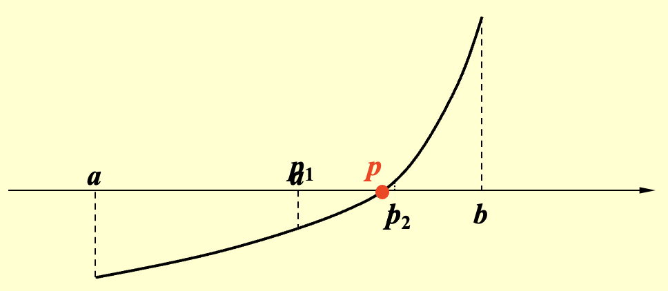
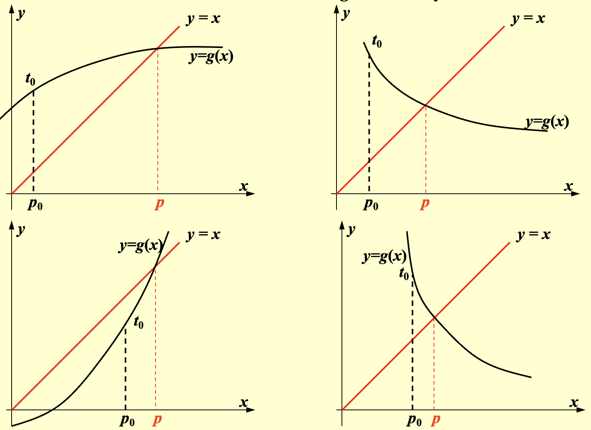
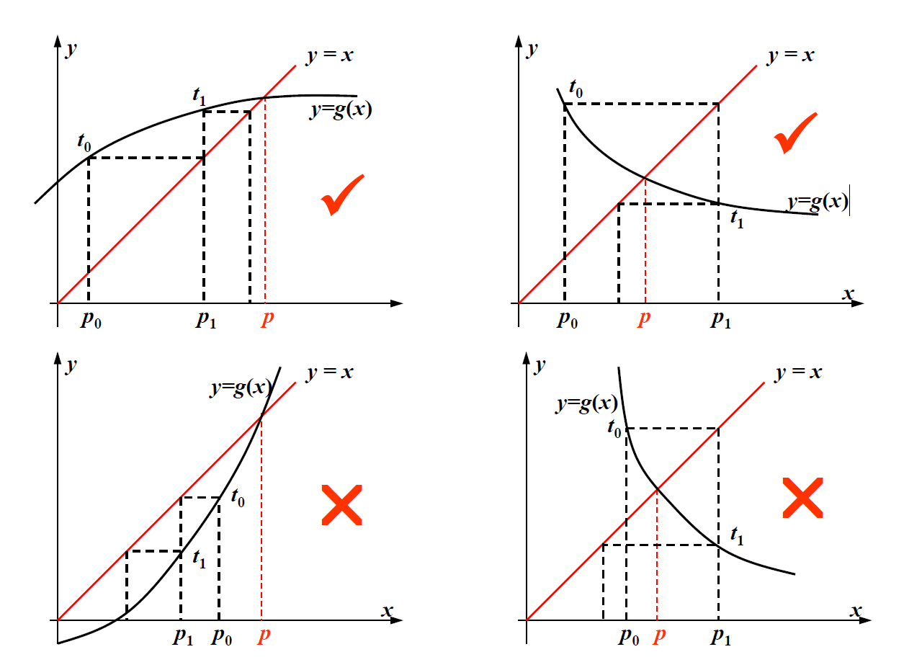

---
hide:
  #- navigation # 显示右
  #- toc #显示左
  - footer
  - feedback
comments: true
--- 

# Chapter 02 : Solutions of Equations in One Variable

> 这一整章核心要解决的问题就是如何求一个一元方程 $f(x)=0$ 的根，下面介绍了几种方法

## The Bisection Method

!!! note "Intermediate Value Theorem"

	介值定理：如果 $f\in C[a,b]$（$C$ 表示连续函数）且 $K$ 是介于 $f(a)$ 和 $f(b)$ 之间的任意值，那么存在一个数 $p\in (a,b)$，使得 $f(p)=K$
	
	

根据上面的介值定理，我们可以通过二分法，不断逼近真正的根，我们还有以下定理：

!!! note "Theorem"

	假设 $f\in C[a,b]$ 且满足 $f(a)⋅f(b)<0$，那么二分法将产生一个序列 ${p_n}(n=1,2,…)$，用于逼近 $f$ 的一个零点 $p$，并满足 $|pn−p|\leq\frac{b−a}{2^n},n\geq 1$
	
	??? note "Proof"
	
		当 $n\geq 1$ 时，有 $b_n−a_n=\frac{1}{2^{n−1}}(b−a)\text{ and }p\in (a_n,b_n)$ 成立。
		
		因为 $n\geq 1$ 时，有 $p_n=\frac{1}{2}(a_n+b_n)$，所以 $|pn−p|\leq\frac{1}{2}(b_n−a_n)=\frac{b−a}{2^n}$ 成立

在连续函数 $f$ 的区间 $[a,b]$ 上寻找 $f(x)=0$ 的解，其中 $f(a),f(b)$ 符号相反

- 输入：端点 $a,b$；容忍值（Tolerance）TOL；最大迭代次数 $N_{\max}$
- 输出：$p$ 的近似解或失败信息

```c title="Bisection Method.c"
Step 1  Set i = 1;
            FA = f(a);
Step 2  while (i <= N_max) do steps 3-6
        Step 3  Set p = a + (b - a) / 2;  /*computer p_i*/
                FP = f(p);
        Step 4  if (FP == 0) or (b - a) / 2 < TOL then Output(p);
                STOP;  /*successful*/
        Step 5  Set i++;
        Step 6  if sign(FA) * sign(FP) > 0 then Set a = p; FA = FP;
                else set b = p;  /*update a_i, b_i*/
Step 7  Output(Method failed after N_max iterations);  /*unsuccessful*/
		Stop.
```

!!! question "Question"

	=== "Question"
	
		在 Step 3 当中，为什么不是 `p = (a + b) / 2`；在 Step 6 当中，为什么不是 `FA * FP > 0`
	
	=== "Answer"
	
		两个问题的答案是一致的，是为了防止溢出（Overflow），无论是 `a + b` 还是 `FA * FP`，如果它们的符号一致，且数值特别大的时候，它们的和或积可能是计算机无法表示出来的东西，也就是产生了溢出的问题，此时该算法可能返回的是一个意料之外的结果，而不产生报错
		
		另外对于 Step 3 有特殊的一点，如果 $a$ 和 $b$ 都是很小的数，相加可能会产生舍入误差。用 `a+(b-a)/2` 可以确保 $p$ 落在 $a$ 和 $b$ 之间
		
		例如，用截断保留 2 位有效数字，$a=0.91$，$b=0.93$，$(a+b)/2=1.8/2=0.9$，而 $a+(b-a)/2=0.91+(0.93-0.91)/2=0.92$

对于二分法来说，其优点在于：

- 该方法简单，只要求函数 $f$ 是连续的
- 结果总是会收敛到真正的解

但其缺点在于：

- 收敛速度过慢，并且在计算过程中，更好的中间值近似可能在不经意间被抛弃掉了
- 不适用于寻找多根和复数根的情况

!!! tip "Tips"

	实际上，我们可以在使用二分法之前先画一幅 $f(x)$ 的草图，观察二分法是否可行，或者用一个子程序将完整的区间划分为多个子区间 $[a_k,b_k]$，这样的话即使 $f(a)⋅f(b)$，也可以保证 $f(a_k)⋅f(b_k)<0$
***
## Fixed-Point Iteration

不动点迭代方法将 $f(x)$ 的根看成一个函数 $g(x)$ 的不动点，即 $f(x)=0\stackrel{\text{equivalent}}{\Leftrightarrow}x=g(x)$

基本思路是：从初始的近似值 $p_0$ 开始，通过 $p_n=g(p_{n−1})$（其中 $n\geq 1$），产生序列 $\{p_n\}_{n=0}^{\infty}​$。如果该序列能收敛到 $p$，且 $g$ 是一个连续函数，那么：

$$
p=\lim\limits_{n\rightarrow\infty}p_n=\lim\limits_{n\rightarrow\infty}g(p_{n-1})=g(\lim\limits_{n\rightarrow\infty}p_{n-1})=g(p)
$$

!!! question "这个方法适用所有方法吗？"

	看起来貌似只需要不断的迭代，我们总能找到解。但实际上，并不是所有的 $g(x)$ 都能做到让序列收敛，具体来看下面几个例子：
	
	!!! example "Example"
	
		=== "Question"
		
			判断以下几种 $g(x)$ 中，哪个能做到收敛，为什么？
			
			
		
		=== "Answer"
		
			想必高中应该都被蛛网图祸害过吧（bushi）
			
			

那么怎样才能准确判断 $g(x)$ 能让序列收敛有不动点呢？我们有定理如下：

!!! note "Fixed-Point Theorem"

	- 令 $g\in C[a,b]$，且满足 $\forall x\in [a,b]$，有 $g(x)\in [a,b]$，那么 $g$ 在 $[a,b]$ 上有不动点
	- 一阶导函数 $g'$ 存在于区间 $(a,b)$，且满足 $\forall x\in (a,b)$，$\exists$ 常数 $k\in (0,1)$ 使得 $|g'(x)|\leq k$ 成立，那么该不动点是唯一的，且 $\forall p_0\in [a,b]$，由 $p_n=g(p_{n−1}),n\geq 1$ 定义的序列会收敛到位于区间 $[a,b]$ 上的唯一不动点。
	
	??? note "Proof"
	
		- “不动点”：令 $f(x)=g(x)−x$，因为 $a\leq g(x)\leq b$，所以 $f(a)=g(a)−a\geq 0$ 且 $f(b)=g(b)−b\leq 0$。由介值定理知，$f$ 一定有一个根，因此 $g$ 有一个不动点
		- “唯一”：（用反证法证明）
		    - 假设 $p,q$ 都是 $g$ 在区间 $[a,b]$ 上的两个不同的不动点
		    - 根据均值定理（Mean Value Theorem），存在一个位于 $p,q$ 的数 $\xi$，满足 $g(p)−g(q)=g'(\xi)(p−q)$
		    - 因为 $g(p)=p,g(q)=q$，所以可以得到 $(1−g'(\xi))(p−q)=0$，和已知条件矛盾，因此假设不成立，即“不动点是唯一的”结论成立
		- “收敛”：即证明 $\lim\limits_{⁡n\rightarrow\infty}|p_n−p|=0$
		    - 因为 $\forall x\in [a,b]$，$g(x)\in [a,b]$，所以 $\forall n\geq 0$，$p_n$ 都是有定义的
		    - 因此：
			    
				$$
				\begin{aligned}
		        ∣p_n−p∣&=∣g(p_{n−1})−g(p)∣=∣g'(\xi)∣∣p_{n−1}−p∣\leq k∣p_{n−1}−p∣\\
		        & \leq k^2∣p_{n−2}−p∣\leq...\leq k^n∣p_0−p∣
		        \end{aligned}
		        $$
		        
		    - 根据条件，$k∈(0,1)$，所以 $k^n\rightarrow 0$，因此 $\lim\limits_{n\rightarrow\infty}|p_n-p|=0$ 成立


