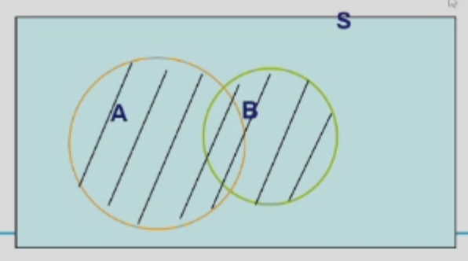
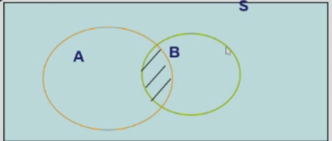
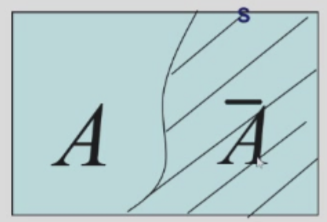
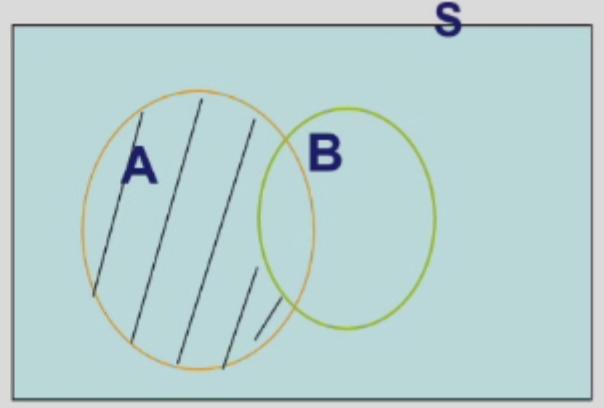
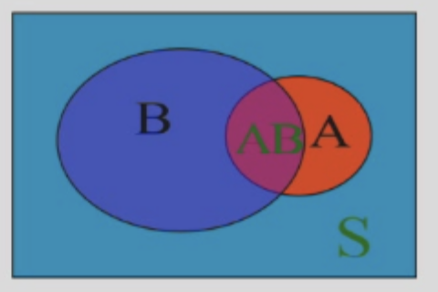

---
hide:
  #- navigation # 显示右
  #- toc #显示左
  - footer
  - feedback
# comments: true
---  
# Chapter 01 : 概率论的基本概念

!!! Abstract

	本章和离散数学集合知识非常相似，具体也可请移步：[Discrete mathmatics notes-Chapter 02: The Basic Structures:Sets,Functions,Sequences,Sums and Matrices](https://note.eternity1005.top/blog/Math/Discrete%20mathmatics/Discrete%20mathmatics%20notes-Ch02/)

## 随机试验

自然界与社会生活中有两类现象：

- 确定性现象：结果确定
- 不确定性现象：结果不确定
	- 个别现象
	- 随机现象：在个别试验中其结果呈现出不确定性，但在大量重复试验中其结果又具有统计规律性

!!! Definition

	对随机现象的观察、记录、实验统称为随机试验。它具有以下特性：
	
	- 可以在相同的条件下重复进行
	- 每次试验可能出现的结果是不确定的, 但能事先知道试验的所有可能结果
	- 每次试验完成前不能预知哪一个结果会发生
***
## 样本空间 · 随机事件

### 样本空间

!!! Definition

	随机试验 E 的所有结果构成的集合称为 E 的样本空间，记为 $S=\{e\}$，称 S 中的元素 e 为样本点。
	
	!!! Examples
	
		- 一枚硬币抛一次
			- $S=\{正面，反面\}$
		- 记录一城市一日中发生交通事故次数
			- $S=\{0,1,2,...\}$
***
### 随机事件

!!! Definition

	一般我们称 S 的子集 A 为 E 的随机事件 A，简称为事件 A。当且仅当 A 所包含的一个样本点发生称事件 A 发生。它具有如下特征：
	
	- 事件 A 是相应的样本空间 S 的一个子集，其关系可以用维恩（Venn）图来表示
	- 事件 A 发生当且仅当 A 中的某个样本点出现
	- 事件 A 的表示可用集合，也可用语言来表示

特别地：

- 一个样本点组成的单点集称为基本事件。
- 如果每次试验事件 S 总是发生，那么称 S 为必然事件
- 记 $\Phi$ 为空集，不包含任何样本点，即每次试验 $\Phi$ 都不发生，则称 $\Phi$ 为不可能事件
***
## 事件的关系及运算

### 事件的关系（包含、相等）

- 包含（$A\subset B$）：事件 A 发生一定导致 B 发生

- 相等（$A=B$）$\Leftrightarrow\begin{cases}A\subset B\\ B\subset A\end{cases}$ 
***
### 事件的运算

!!! 事件的运算

	=== "和事件"
	
		- A 与 B 的和事件，记为 $A\bigcup B$
		- $A\bigcup B = \{x|x\in A 或 x\in B\}$
		- A 与 B 至少有一个发生
	
		
	
		- $\bigcup\limits_{i=1}^n A_i : A_1, A_2,..., A_n$ 至少有一发生
	
	=== "积事件"
	
		- A 与 B 的积事件，记为 $A\bigcap B, A·B, AB$
		- $A\bigcap B = \{x|x\in A 且 x\in B\}$
		- A 与 B 同时发生
		
		
		
		- $\bigcap\limits_{i=1}^n A_i : A_1, A_2,..., A_n$ 同时发生
		- 当 $AB=\Phi$ 时，称事件 A 和 B 是不相容的
		  ，或互斥的。
	
	=== "逆事件"
	
		- A 的逆事件记为 $\overline{A}$，有 $\begin{cases}A\bigcup\overline{A}=S\\ A\overline{A} = \emptyset \end{cases}$
		- 若 $\begin{cases}A\bigcup B=S\\ AB = \emptyset \end{cases}$，则称 A, B 互逆（互为对立事件）。
		
		
	
	=== "差事件"
	
		- 事件 A 对事件 B 的差事件：$A - B = A - AB = A\overline{B} = \{x|x\in A 且 x\not\in B\}$
			- 前一个等号是一个比较好用的结论
	
		
	
	=== "德摩根定律"
	
		- $\overline{\bigcap\limits_{i=1}^n A_i} = \bigcup\limits_{i=1}^n \overline{A_i} = \overline{A_1}\bigcup\overline{A_2}\bigcup\overline{A_3}\bigcup...\bigcup\overline{A_n}$
		
		- $\overline{\bigcup\limits_{i=1}^n A_i} = \bigcap\limits_{i=1}^n \overline{A_i} = \overline{A_1}·\overline{A_2}·\overline{A_3}·...·\overline{A_n}$
***
## 频率与概率

### 频率

!!! Definition

	- 记 $f_n(A)=\frac{n_A}{n}$，其中 $n_A$ 表示 A 发生的次数（频数），n 为总试验次数，则称 $f_n(A)$ 为 A 在这 n 次试验中发生的频率
	- 频率 $f_n(A)$ 反映了事件 A 发生的频繁程度

!!! Properties

	- $0\leq f_n(A)\leq 1$
	- $f_n(S) = 1$
	- 若 $A_1, A_2,..., A_k$ 两两互不相容，则 $f_n(\bigcup\limits_{i=1}^k A_i) = \sum\limits_{i=1}^k f_n(A_i)$
	- $f_n(A)$ 随 n 的增大渐趋稳定，记稳定值为 p
***
### 概率

!!! Definition

	=== "Definition 1"
	
		$f_n(A)$ 的稳定值 p 定义为 A 的概率，记为 $P(A)=p$
	
	=== "Definition 2"
	
		将概率视为测度，且满足：
		
		- $P(A)\geq 0$
		- $P(S)=1$
		- $A_1,A_2,...,A_k,...,A_iA_j = \emptyset(i\not = j)$
		
		$\Rightarrow P(\bigcup\limits_{i=1}^{\infty}A_i) = \sum\limits_{i=1}^{\infty}P(A_i)$

!!! Properties

	- $P(A) = 1 - P(\overline{A})$，特别地，$P(\emptyset) = 0$
	- $P(A-B) = P(A) - P(AB)$，特别地，当 $B\subset A$ 时，$P(A-B) = P(A) - P(B)$ 且 $P(A)\geq P(B)$
	- $P(A\bigcup B) = P(A) + P(B) - P(AB)$，推广即容斥原理：$P(\bigcup\limits_{i=1}^n A_i)=\sum\limits_{i=1} ^n P(A_i)-\sum\limits_{1\leq i<j \leq n}P(A_iA_j)+\sum\limits_{1\leq i<j<k \leq n}P(A_iA_jA_k)+...+(-1)^{n-1}P(A_1A_2...A_n)$
		- 推论：$P(A\bigcup B) \leq P(A) + P(B)$
***
## 三种常见概型

### 等可能概型（古典概型）

!!! Definition

	若试验满足：
	
	- 有限性：S 中样本点有限
	- 等可能性：出现每一样本点的概率相等($\forall i,j\in\{1,2,...,n\},P(e_i)=P(e_j)$)
	
	称这种试验为等可能概型（或古典概型）
	
	$\Rightarrow P(A) = \frac{A所包含的样本点数}{S中的样本点数}$
***
#### 超几何分布

!!! Example

	=== "Question"
	
		有 N 件产品，其中 D 件是次品，从中不放回地取 n 件，记 $A_k = \{恰有 k 件次品\}(k\leq D)$，求 $P(A_k)$
	
	=== "Answer"
	
		$P(A_k) = \frac{C_D^k C_{N-D}^{n-k}}{C_N^n},k = 0,1,2,...,n$
	
		注：当 $L>m$ 或 $L<0$ 时，记 $C_m^L = 0$
***
#### 抽签公平问题

!!! Example

	=== "Question"
	
		一袋中有 $a$ 个红球，$b$ 个白球，记 $a+b=n$，设每次摸到各球的概率相等，每次从袋中摸一球，不放回地摸 $n$ 次，求第 $k$ 次摸到红球的概率。
	
	=== "Answer"
	
		记 $A_k=\{第 k 次摸到红球\}$，求 $P(A_k)$
		
		将 $n$ 个球依次编号为 $1,2,...,n$，其中前 $a$ 号球是红球
		
		!!! note
		
			=== "解法 1"
			
				视 1,2,...,n 的每一个排列为一个样本点，则每一样本点等概率，则有：
				
				$$
				P(A_k) = \frac{a(第 k 位有 a 种情况)\times (a+b-1)!(其它 a+b-1 位全排列)}{(a+b)!(全部排列数)}=\frac{a}{a+b}
				$$
				
			=== "解法 2"
			
				视哪几次摸到红球为一样本点，每点出现的概率相等，则有：
				
				$$
				P(A_k) = \frac{C_{n-1}^{a-1}(其它 n-1 位放 a-1 个红球)}{C_n^a(全部可能)} = \frac{a}{a+b}
				$$
				
			=== "解法 3"
			
				将第 $k$ 次摸到的球号作为一样本点，由对称性，取到各球的概率相等，则有：
				
				$$
				\begin{aligned}
				S=\{1,2,...,n\}\\
				A_k=\{1,2,...,a\}\\
				\Rightarrow P(A_k) = \frac{a}{n} = \frac{a}{a+b}
				\end{aligned}
				$$
				

***
#### 生日问题

!!! Example

	=== "Question"
	
		将 $n$ 个不同的球，投入 $N$ 个不同的盒中（$n\leq N$），设每一球落入各盒的概率相同，且各盒可放的球数不限，记 $A=\{恰有 n个盒子各有一球\}$，求 $P(A)$
	
	=== "Answer"
	
		- A:"每盒至多一球"
		
		$$
		P(A) = \frac{N(N-1)(N-2)...(N-n+1)}{N^n} = \frac{A_N^n}{N^n}
		$$
		

由这个例子，我们记 $B=\{至少两人生日相同\}$，则 $P(B)=1-\frac{A_{365}^n}{365^n}$

- 当 $n=64$ 时，$p=0.997$
- 当 $n=100$ 时，$p=0.9999997$
***
### 几何概型

几何概型的特点：

- 样本空间 $\Omega$ 与几何区域有关（线段、平面、立体）
- 等可能性：向 $\Omega$ 的区域内任意投一点，落在区域内任何一点的可能性相等

设任意事件 $A\subset\Omega$，则 $P(A)=\frac{A\text{ 的长度/面积/体积}}{\Omega\text{ 的长度/面积/体积}}$
***
### 伯努利概型

- 伯努利试验：当试验 $E$ 只有两种可能的结果 $A$ 与 $\overline{A}$，则称试验 $E$ 为伯努利试验
	- 如：抛一枚硬币、投一次篮球、射击一次
- $n$ 重伯努利试验：把伯努利试验 $E$ 独立重复地进行 $n$ 次，则称之为 $n$ 重伯努利试验
	- 如：抛 $n$ 枚硬币、投 $n$ 次篮球、射击 $n$ 次
***
## 条件概率

!!! Definition

	如果 $P(B)>0$，那么定义在 B 发生的条件下 A 发生的条件概率(contidional probability)为 $P(A∣B)=\frac{P(AB)}{P(B)}$，可理解为 A 在 B 中所占的比例。
	
	 条件概率是在**新的样本空间下的概率度量**，它满足概率的定义和性质。

!!! Properties

	
	
	- 非负性：$P(B|A)\geq 0$
	- 规范性：$P(S|A)=1$
	- 可列可加性：$A_1,A_2,...,A_k$ 两两互斥 $\Rightarrow P(\bigcup\limits_{i=1}^\infty A_i|A)=\sum\limits_{i=1}^\infty P(A_i|A)$
	- $P(B|A)=1-P(\overline{B}|A)$
	- $P(B\bigcup C|A)=P(B|A)+P(C|A)-P(BC|A)$
	- $P(B-C|A)=P(B|A)-P(BC|A)$
***
### 乘法公式

- 当下面的条件概率都有意义时：
	- $P(AB)=P(A)·P(B|A)=P(B)·P(A|B)$
	- $P(ABC)=P(A)·P(B|A)·P(C|AB)$
	- 一般地，$P(A_1A_2...A_n)=P(A_1)·P(A_2|A_1)·P(A_3|A_1A_2)·...·P(A_n|A_1...A_{n-1})$

!!! Examples

	=== "Question"
	
		$N$ 个士兵每人配一把外形相同的枪，在一次紧急集合中每人随机地取一把，求至少有一人能拿到自己枪的概率。
	
	=== "Answer"
	
		用 $A_i$ 表示第 $i$ 个士兵拿到自己的枪，$A$ 表示至少有一名士兵拿到自己的枪
		
		$$
		\begin{aligned}
		P(A)&=P(A_1\bigcup A_2\bigcup ...\bigcup A_N)\\
		&=\sum\limits_{i=1}^NP(A_i)-\sum\limits_{1\leq i<j\leq N}P(A_iA_j)+\sum\limits_{1\leq i<j<k\leq N}P(A_iA_jA_k)+...+(-1)^{N-1}P(A_1A_2...A_n)\\
		&=N\times\frac{1}{N}-C_N^2P(A_i)P(A_j|A_i)+C_N^3P(A_i)P(A_j|A_i)P(A_k|A_iA_j)+...+(-1)^{N-1}\times P(A_1)P(A_2|A_1)...P(A_N|A_1...A_{N-1})\\
		&=1-\frac{1}{2!}+\frac{1}{3!}+...+(-1)^{N-1}\frac{1}{N!}
		\end{aligned}
		$$
		
***
### 全概率公式与 Bayes 公式

定义**完备事件组**为 $S$ 的一个**划分** $B_1,B_2,...,B_n$​，它满足如下性质：

- $B_iB_j=\emptyset,1\leq i,j\leq n,i\not=j$
- $\bigcup\limits_{i=1}^n B_i=S$

那么有：

- 全概率公式：$P(A)=\sum\limits_{j=1}^nP(B_j)P(A|B_j)$
- Bayes 公式（贝叶斯公式）：$P(B_k|A)=\frac{P(B_kA)}{P(A)}=\frac{P(B_k)P(A|B_k)}{\sum\limits_{j=1}^nP(B_j)P(A|B_j)}$

其中，我们称 $P(B_j)$ 这种事先知道的概率为**先验概率**；而 $P(B_j∣A)$ 这种，当事件 A 发生后需要修正 $B_j$ 的概率成为**后验概率**。

!!! Example

	=== "Question"
	
		设某同学每天手机收到短信条数为 $i$ 的概率为 $\frac{\lambda^i e^{-\lambda}}{i!},i=0,1,2,...$，而同学看每条短信的概率均为 $p$，求该同学每天只看 $k$ 条短信的概率
		
	=== "Answer"
	
		设事件 $B_i$ 为收到 $i$ 条短信，事件 $A$ 为看了 $k$ 条短信，那么有：
		
		$$
		\begin{aligned}
		P(B_i)=\frac{\lambda^i e^{-\lambda}}{i!}&,i=0,1,2,...\\
		P(A|B_i)=C_i^kp^k(1-p)^{i-k}&,i=k,k+1,...
		\end{aligned}
		$$
		
		由全概率公式我们有：
		
		$$
		\begin{aligned}
		P(A)&=\sum\limits_{i=k}^\infty P(B_i)P(A|B_i)=\sum\limits_{i=k}^\infty \frac{\lambda^i e^{-\lambda}}{i!}C_i^kp^k(1-p)^{1-k}\\
		&=\sum\limits_{i=k}^\infty \frac{\lambda^i e^{-\lambda}}{i!}\frac{i!}{k!(i-k)!}p^k(1-p)^{i-k}\\
		令\space t&=i-k，有:\\
		P(A)&=\frac{\lambda^kp^k e^{-\lambda}}{k!}\sum\limits_{t=0}^\infty \frac{[(1-p)\lambda]^{t}}{(t)!}=\frac{\lambda^kp^k e^{-\lambda}}{k!}e^{(1-p)\lambda}=\frac{(\lambda p)^k}{k!}e^{-\lambda p}
		\end{aligned}
		$$
		
 ***
## 事件独立性与独立试验

设 $A,B$ 为两个随机事件，若有 $P(AB)=P(A)\times P(B)$，则 A,B 相互**独立(independent)** ，其实际意义是，事件 $A$ 的发生与事件 $B$ 的发生互不影响。

- 若 $P(A)\not=0,P(B)\not=0$，$P(AB)=P(A)P(B)\Leftrightarrow P(B|A)=P(B)\Leftrightarrow P(A|B)=P(A)$
- $A,B$ 相互独立 $\Leftrightarrow P(B|A)=P(B|\overline{A})=P(B)\Leftrightarrow P(B|A)+P(\overline{B}|\overline{A})=1$
- $A,B$ 相互独立 $\Leftrightarrow\overline{A},B$ 相互独立 $\Leftrightarrow A,\overline{B}$ 相互独立 $\Leftrightarrow\overline{A},\overline{B}$ 相互独立

!!! Proof 

	若 $A,B$ 相互独立，我们只证 $A,\overline{B}$ 相互独立，其余同理。
	
	$P(A\overline{B})=P(A-AB)=P(A)-P(AB)=P(A)-P(A)P(B)=P(A)(1-P(B))=P(A)P(\overline{B})$
	
	证毕。

当出现两个以上的随机事件时，如三个随机事件 $A,B,C$，当：  
$P(AB)=P(A)∗P(B),P(AC)=P(A)∗P(C),P(BC)=P(B)∗P(C)$ 都成立，则称事件 $A,B,C$ **两两独立**；  
如果**同时还**满足：$P(ABC)=P(A)P(B)P(C)$，则称事件 $A,B,C$ **相互独立**。

- 显然，相互独立 $\Rightarrow$ 两两独立
- 若 $A,B,C$ 相互独立，则 $A$ 与 $B$ 的和、差、积、逆与 $C$ 或 $\overline{C}$ 均独立

更普遍地，定义 $\{A_i\}$ **相互独立**当且仅当 $\forall i_j,P(\prod\limits_{j=1}^kA_{i_j})=\prod\limits_{j=1}^kP(A_{i_j})$
独立试验与重复试验：

- **独立试验**各个试验结果互不影响；
- **重复试验**的每一次子试验都在相同情况下进行；
