# Blockchain Exploration

## Task 1: Setting Up MetaMask Wallet

安装好 MetaMask 插件后，启动 Emulator，用 `dockps | grep Geth` 随便找一个 Geth 节点，用 8545 端口作为 RPC，可以用 `curl -X POST http://10.150.0.71:8545 -H 'Content-Type: application/json' --data '{"jsonrpc":"2.0","method":"eth_chainId","params":[],"id":1}'` 查看 Chain ID：

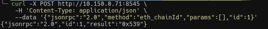

设置网络，并连接，添加账户，可以看到我们有一个 10 ETH 的账户：

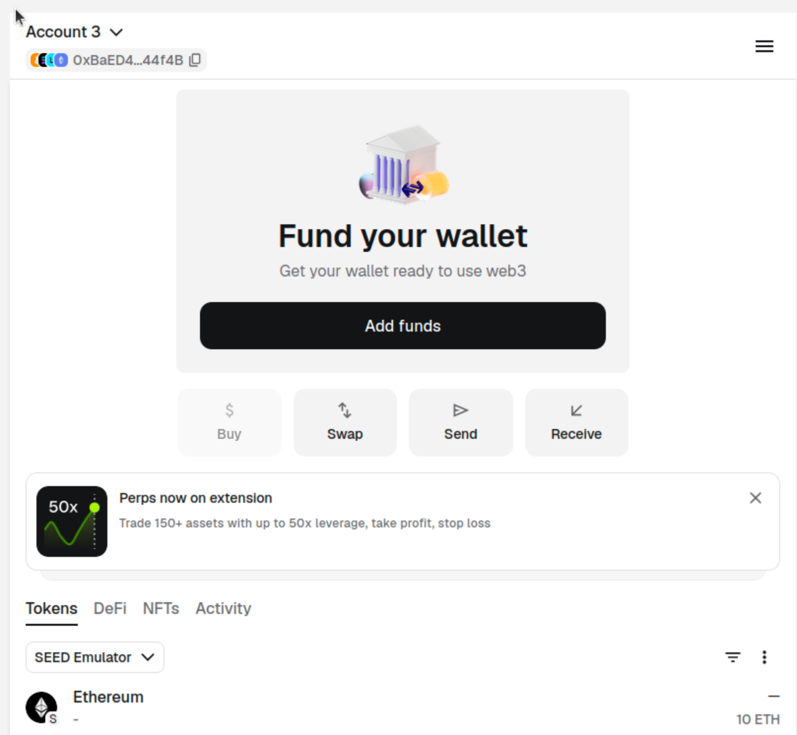

用 Metamask 转给一个账户 1ETH：

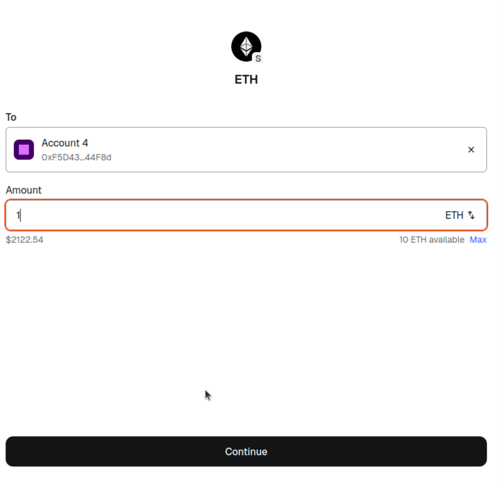

确认后发现转账成功：

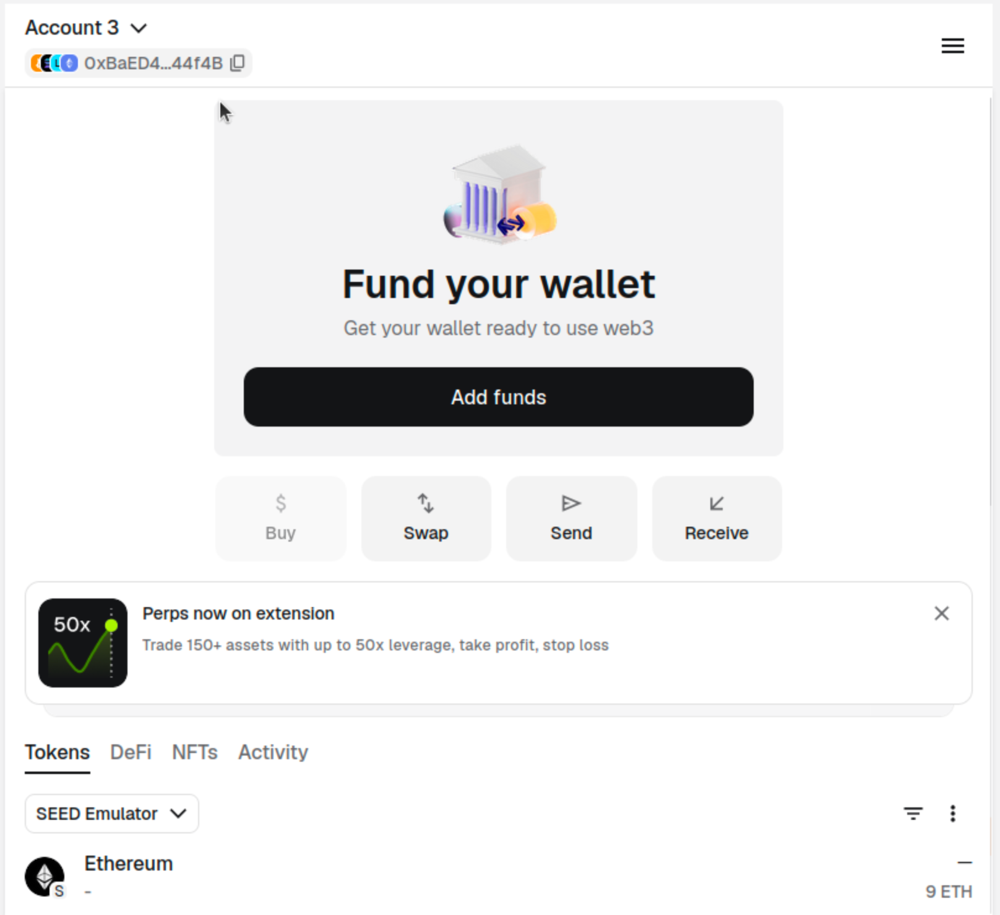

在 Etherview 当中我们也可以看到交易细节：

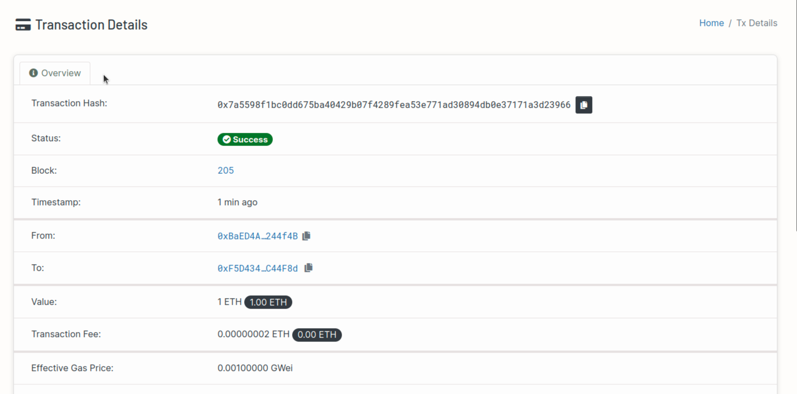

****

## Task2: Interacting with Blockchain Using Python

直接用 `pip install web3 eth-account` 下载相关包，编写程序获取账号的 balance：

```python 
from web3 import Web3

RPC = 'http://10.150.0.71:8545'
w3 = Web3(Web3.HTTPProvider(RPC))

accounts = [
    "0xA2a28c011e281CA0dA0D878A82d854FD789C154c",
    "0x513C434dBA61AE5CFEf4552daC2D2f85450870aA",
    "0xBaED4A4Fffff4e047B8a39F00284732eF6244f4B"
]

print("connected: ", w3.is_connected())
print("chain id: ", w3.eth.chain_id)
print("latest block: ", w3.eth.block_number)

for a in accounts:
    addr = Web3.to_checksum_address(a)
    bal = w3.eth.get_balance(addr)
    print(addr, Web3.from_wei(bal, "ether"), "ETH")
```

运行可以得到：

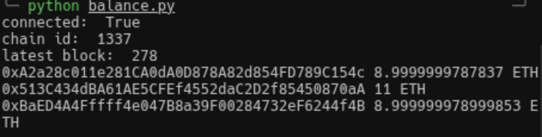

查看其中一个账号的 private key：`Account Details > Private Keys`，编写代码来发送 TX：


运行得到：

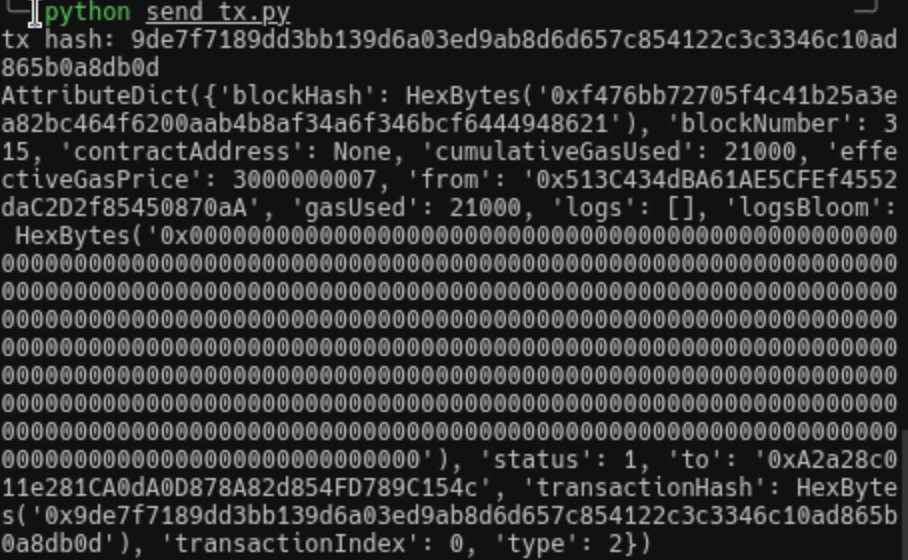

并且在 etherview 当中也能看到：

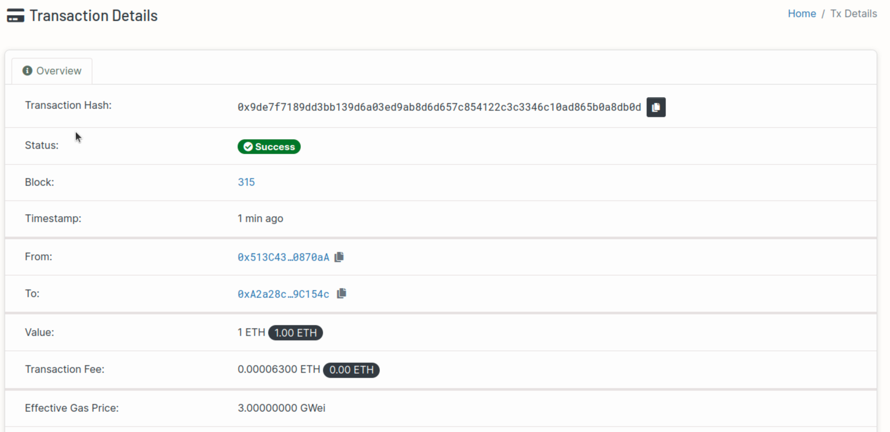

****

## Task 3: Interacting with Blockchain Using Geth

进入一个 Geth 节点的终端，运行 `geth attach /root/.ethereum/geth.ipc` 进入交互界面：

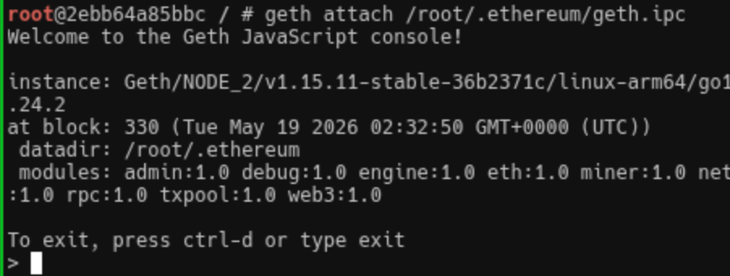

可以通过交互获得信息：

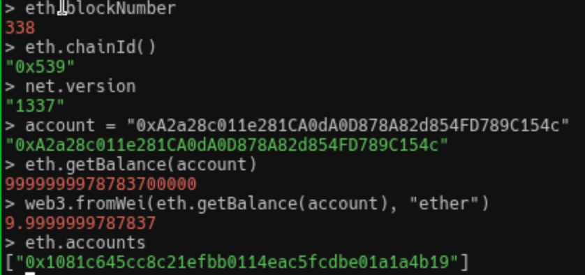、

但是新版 Geth 似乎没有启用 Personal API，可能无法用 Geth 节点发 TX，也无法加入新节点：

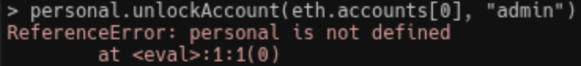
