# Sniffing Spoofing

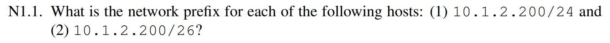

（1）10.1.2.200/24 前缀是 10.1.2.0/24

（2）10.1.2.200/26 前缀是 10.1.2.192/26

***

 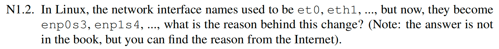

以前的命名 eth0/eth1 基于驱动探测顺序，顺序可能随硬件/驱动加载变化而变化；新命名（如 enp0s3, ens3, eno1）基于物理拓扑/固件信息/PCI 位置，更稳定可预测。

***

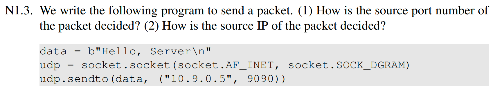

（1）内核会在第一次 sendto() 时自动给该 socket 分配一个临时端口，并把它和这个 socket 绑定起来。

（2）内核查路由表，决定去 10.9.0.5 走哪块网卡（出口接口）；然后选择该接口上的一个本地 IP 作为源 IP

***

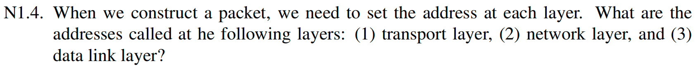

传输层——端口，网络层——IP 地址，数据链路层——MAC 地址

***

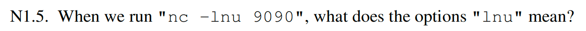

- -l：listen，监听模式
- -n：不做 DNS 解析
- -u：使用 UDP 协议

***

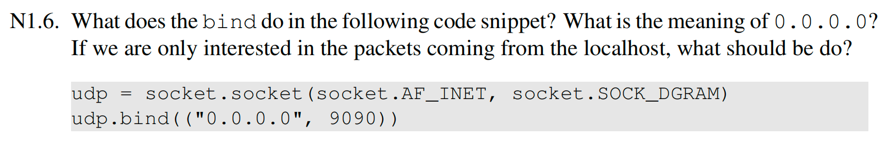

- bind()：把 socket 绑定到本地地址/本地端口，让内核知道“发到本机这个端口”的包交给哪个 socket。
- 0.0.0.0：表示 INADDR_ANY，即“监听本机所有网卡上的 9090 端口”。
- 如果只关心 localhost：绑定到 127.0.0.1

***

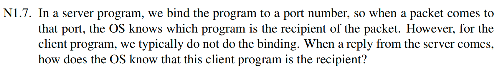

客户端通常不手动 bind()，但当它第一次 sendto() 时，内核会：

- 自动分配一个本地临时端口 + 选择本地源 IP

- 建立 socket 的匹配关系（src ip/port, dst ip/port, protocol）

  因此服务器回包到 (client_ip, client_port) 时，内核能匹配到对应 socket，把数据递交给该客户端进程。

***

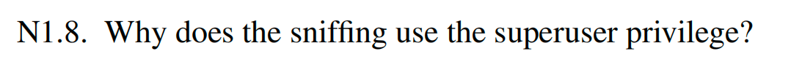

抓包可能会出现：

- 需要打开 **raw packet socket / BPF** 等底层接口
- 可能要启用**混杂模式**，能看到不发给本机 MAC 的帧

这会带来隐私/安全风险，因此这样的操作需要 root 权限

***

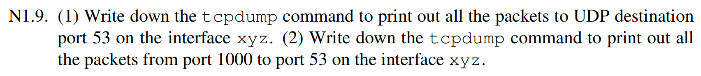

（1）`sudo tcpdump -i xyz -n 'udp and dst port 53'`

（2）`sudo tcpdump -i xyz -n 'src port 1000 and dst port 53'`

***

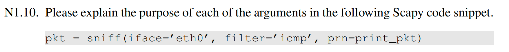

嗅探 eth0 上的 icmp 包，并用 print_pkt 函数处理

***

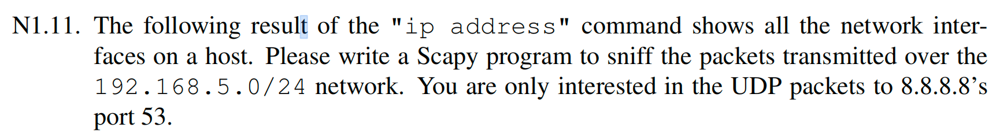

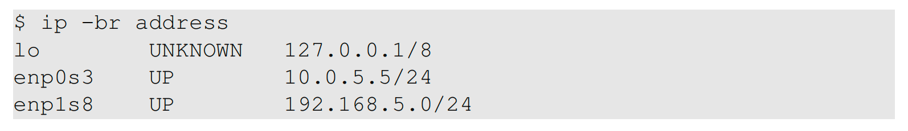

```python
from scapy.all import sniff

def print_pkt(packet):
    packet.show()

sniff(iface = "enp1s8", filter = "udp and dst host 8.8.8.8 and dst port 53", prn = print_pkt)
```

***

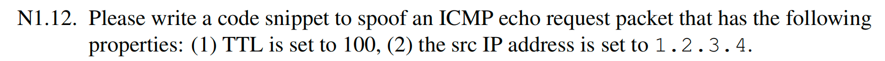

```python
from scapy.all import IP, ICMP, send

ip = IP(src = "1.2.3.4", dst = "10.9.0.5", ttl = 100)
icmp = ICMP(type = 8)
pkt = ip / icmp
send(pkt)
```

***

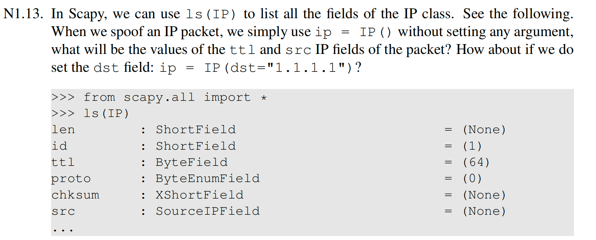

ttl 默认为 64，src 默认为 None，设置 dst 之后在发送时，内核会根据路由为该 dst 选择出口接口，并把 src 自动填成该接口的本地地址

***

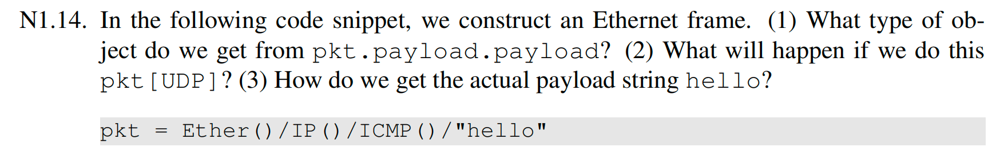

（1）`pkt.payload.payload` 为 ICMP 对象

（2）这个包里没有 UDP 层，会抛异常

（3）`pkt[Raw].load.decode() `
