# TCP Attack

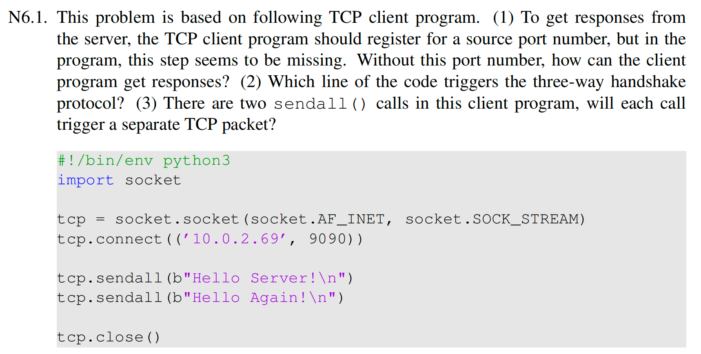

（1）因为操作系统内核会在 `connect()` 时，自动为这个 socket 分配一个临时端口

（2）`tcp.connect(('10.0.2.69', 9090))` 会引发三次握手

（3）不一定，内核可能会把两次 `sendall()` 的数据合并到一个 TCP 段发送，也可能拆成多个段发送

***

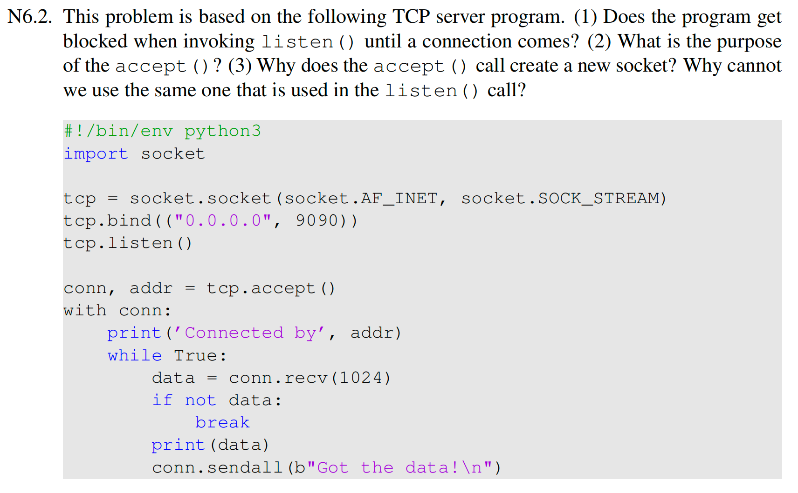

（1）不会。`listen()` 的作用是把 socket 置为监听状态并建立监听队列，它本身通常立即返回

（2）`accept()` 从监听队列中取出一个已经完成三次握手的连接，并返回：一个新的已连接 socket 以及对端地址 addr

（3）因为监听 socket 的职责是持续监听端口、接收新的连接请求；新创建的 conn socket 的职责是和某一个具体客户端收发数据。这样可以使服务器继续在原监听 socket 上接收更多连接，每个客户端的连接都由各自已连接的 socket 单独处理

***

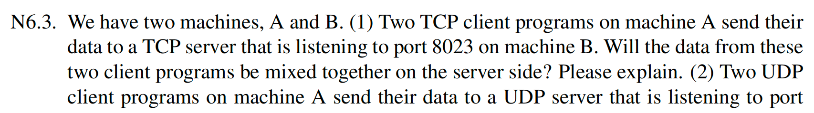

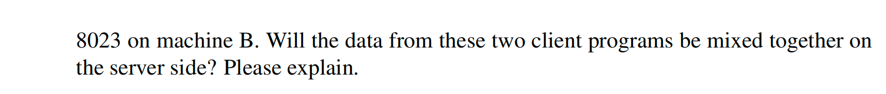

（1）不会，因为 TCP 连接由源 IP、源端口、目的 IP、目的端口四元组唯一标识，两个 TCP 客户端通常使用的源端口不同，因此形成的是两条不同的 TCP 连接，服务器通过 `accept()` 得到的是两个不同的连接 socket

（2）不会混在一起，因为每个报文都有边界，由应用来根据源地址和源端口区分发送者

***

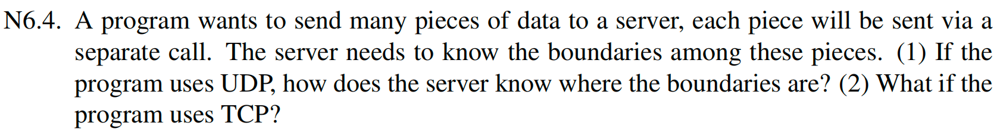

（1）UDP 一次 sendto() 对应一个 UDP 报文，接收方每次 recvfrom() 得到一个完整报文，因此边界天然存在。

（2）使用 TCP 是需要应用层自己来设计边界机制的，例如固定长度、长度字段+数据、分隔符等

***

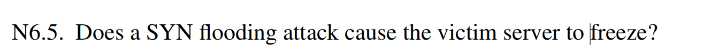

不会使整个服务器死机，只是会导致半连接队列填满，合法的客户端无法建立新连接，连接相关资源被消耗，表现为拒绝服务

***

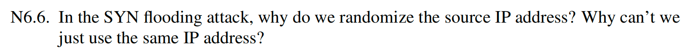

如果一直伪造同一个源 IP，比较容易被检测和过滤，相关状态可能更容易被合并，攻击面变小

***

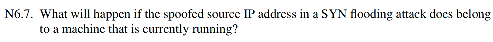

服务器会把 SYN+ACK 发给那台真实主机。真实主机由于并没有主动发起这次连接，通常会认为这是异常包，并回一个 RST。这样会导致服务器收到 RST 后删除半连接，攻击效果下降

***

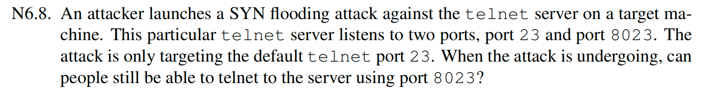

可以，攻击 23 端口但是 8023 端口仍然能够正常服务

***

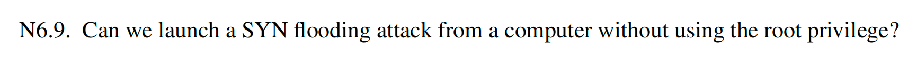

不能，因为没有 root 权限我们无法伪造源 IP 的原始 TCP SYN 包

***

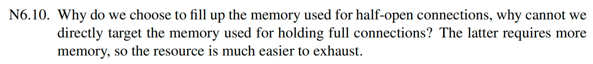

因为要让服务器建立全连接，攻击者必须完成三次握手最后一步 ACK。这意味着攻击者要能接收服务器的 SYN+ACK或至少能正确预测/知道服务器序列号并发回合法 ACK。而在 SYN flood 中，攻击者只需要发大量 SYN，就能让服务器先分配半开连接状态，成本更低、速度更快、伪造更容易。

***

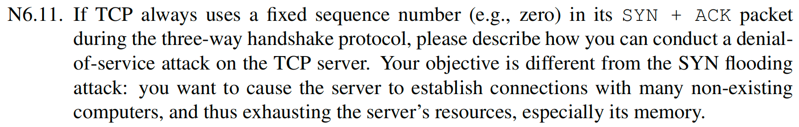

1. 攻击者伪造很多不存在主机的 IP，向服务器发送 SYN；
2. 服务器收到后回复 SYN+ACK，且其初始序列号恒为 0；
3. 因为这个序列号固定可预测，攻击者无需看到 SYN+ACK，就能直接伪造第三步 ACK：
   - 源 IP 仍伪造成那个不存在主机；
   - ACK 号设为 0 + 1 = 1
4. 服务器收到这个 ACK 后，会认为三次握手完成，建立完整连接；
5. 重复上述过程，服务器会保存大量与“根本不存在主机”的全连接状态，从而耗尽内存与连接资源。

***

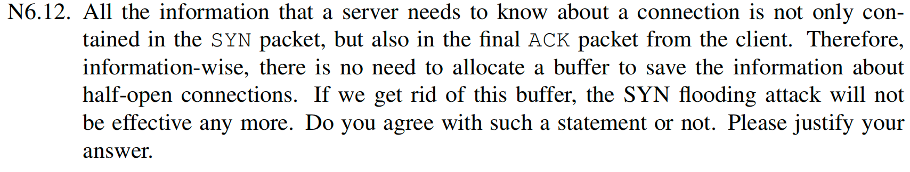

这样的观点有问题，因为：

1. 服务器仍然需要保存某些状态，或者能够重建这些状态。否则它收到最后 ACK 时，无法判断：

   - 这个 ACK 是否对应先前某个 SYN；
   - 对端协商参数是什么；
   - 是否是合法连接建立过程。

2. 完全不保存状态虽然能减少 SYN flood 效果，但会带来新的问题：

   - 无法验证 ACK 合法性；
   - 容易被伪造 ACK 欺骗；
   - TCP 选项、窗口、MSS 等协商信息处理困难。

   ***

   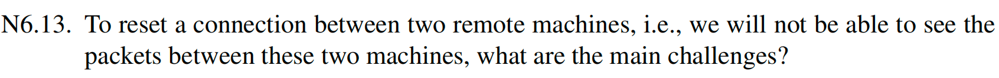

挑战在于我们不知道源 IP、源端口、目标 IP 和目标端口四元组，且不知道当前可接受的序列号窗口

***

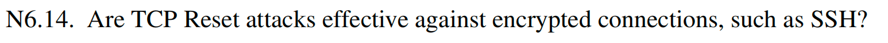

有效。TCP Reset 是作用在传输层的攻击。虽然 SSH 的内容是加密的且有完整性校验，但 SSH 依然运行在 TCP 之上。一旦内核收到一个字段正确（IP、端口、序列号匹配）的 RST 包，它会直接关闭连接，SSH 进程会被迫中断。

***

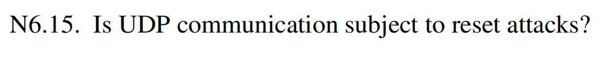

不会，因为 UDP 是无连接协议，没有 RST 状态位

***

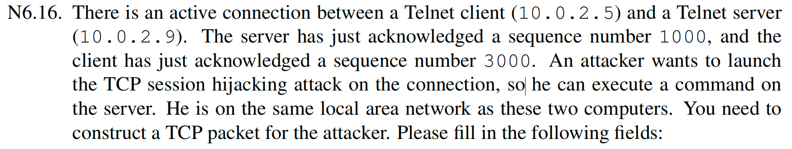

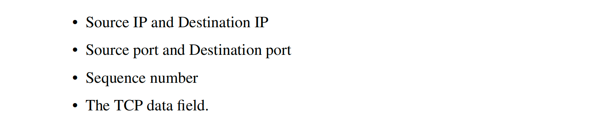

源 IP：10.0.2.5，目标 IP：10.0.2.9，源端口：客户端 telnet 连接使用的客户端端口，目标端口：23，序列号：3000，TCP 数据段：需要执行的命令

***

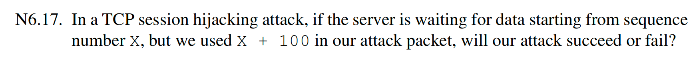

攻击会失败，因为使用 `X + 100` 接收方要么会缓存它，并等待缺失的部分，要么直接丢弃并回复正确的 ACK，攻击者不能劫持执行命令

*** *

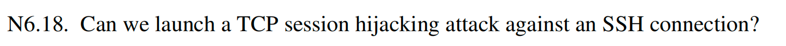

不可以，虽然在 TCP 层可以实现，但是 SSH 有加密和认证，攻击时 SSH 协议会发现解析错误，因此关闭连接，所以劫持不能成功

***

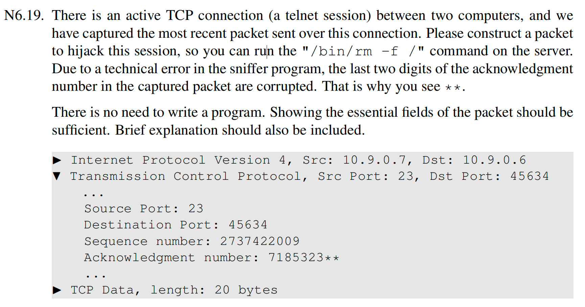

源 IP：10.9.0.6，目标 IP：10.9.0.7，源端口：45634，目标端口：23，序列号：718532300-718532399 枚举（或者猜测），ACK：2737422029，数据段：`/bin/rm -f /\n`

***

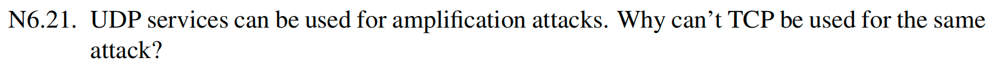

因为 UDP 是无连接的，可以轻易伪造受害者 IP 为源地址，向会返回大响应的小请求服务发包，使得大响应到达受害者身上，TCP 要三次握手，伪造了被害者 IP 发起 SYN，服务器的 SYN+ACK 会发给受害者，受害者不予理会。握手无法完成，服务器也就不会发送大容量的数据负载。

***

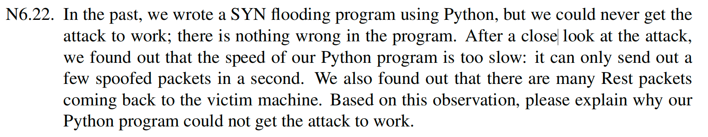

 Python 的执行效率和 Scapy 构造包的速度较慢。并且这些伪造的源 IP 当中，有很多主机在线，当服务器回 SYN+ACK 给这些地址后，真实主机会立刻回 RST，服务器收到 RST 后就将半连接删除，使得服务器清理过期请求的速度比填满队列的速度还快。

****

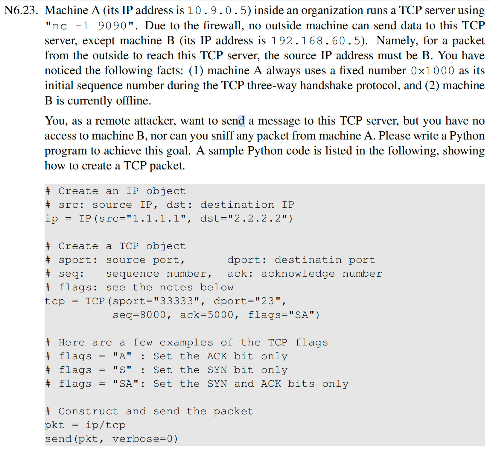

```python
#!/usr/bin/env python3
from scapy.all import *

A_IP = "10.9.0.5"
B_IP = "192.168.60.5"

A_PORT = 9090
B_PORT = 40000

client_isn = 0x2000
server_isn = 0x1000

message = b"Hello\n"

# Step 1: 伪造 SYN（B -> A）
ip1 = IP(src=B_IP, dst=A_IP)
syn = TCP(sport=B_PORT, dport=A_PORT, flags="S", seq=client_isn)
send(ip1/syn, verbose=0)

# Step 2: 伪造 ACK，完成三次握手（B -> A）
# A 的 SYN+ACK 会是 seq=0x1000, ack=client_isn+1
ip2 = IP(src=B_IP, dst=A_IP)
ack = TCP(
    sport=B_PORT,
    dport=A_PORT,
    flags="A",
    seq=client_isn + 1,
    ack=server_isn + 1
)
send(ip2/ack, verbose=0)

# Step 3: 伪造带数据的包（B -> A）
ip3 = IP(src=B_IP, dst=A_IP)
data_pkt = TCP(
    sport=B_PORT,
    dport=A_PORT,
    flags="PA",
    seq=client_isn + 1,
    ack=server_isn + 1
)
send(ip3/data_pkt/message, verbose=0)
```

