# VPN

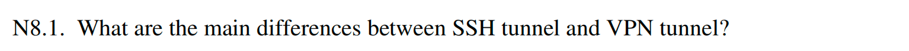

SSH tunnel 主要是应用层/传输层级别的端口转发，通常保护的是某个或某几个 TCP 连接；VPN tunnel 则通常是网络层级别的隧道，把整个 IP 数据包通过 TUN/TAP 接口送入隧道。

****

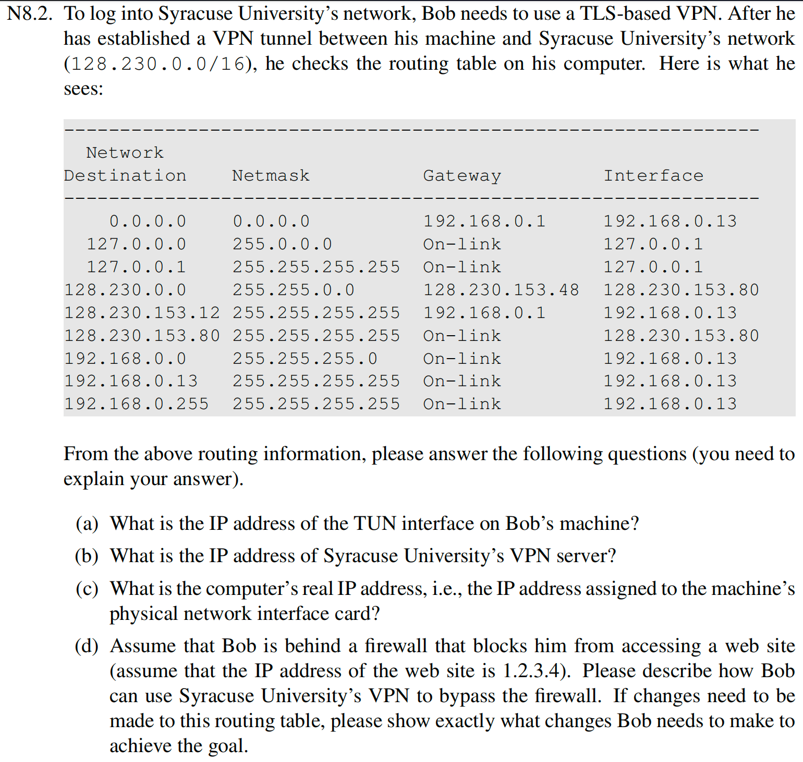

（a）128.230.153.80

（b）128.230.153.12

（c）192.168.0.13

（d）添加一个新的路由，让 1.2.3.4/32 的流量走 128.230.153.80 这个 TUN 接口，网关是 128.230.153.48

***

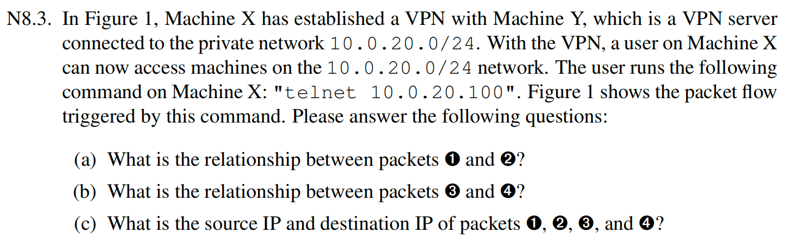

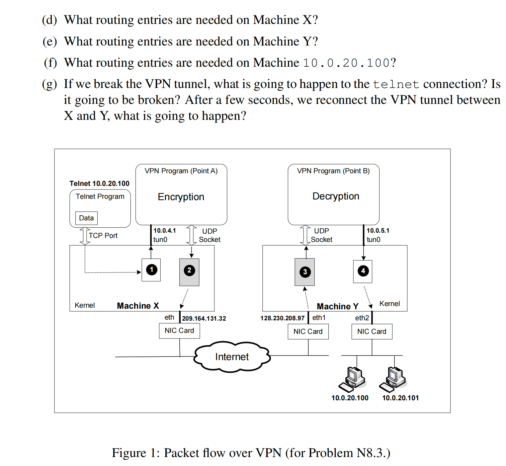

（a）①是内部的原始 IP 包， ②是 VPN 程序把①加密封装后形成的 UDP 包

（b）③是 Y 收到的 UDP 隧道包，VPN 程序通过解密解封装后还原出④

（c）① 的源 IP 为 10.0.4.1，目标 IP 为 10.0.20.100

②的源 IP 为 209.164.131.32，目标 IP 为 128.230.208.97

③的源 IP 为 209.164.131.32，目标 IP 为 128.230.208.97

④的源 IP 为 10.0.4.1，目标 IP 为 10.0.20.100

（d）去向 10.0.20.0/24 的流量，走 tun0 接口，下一跳为 10.0.5.1；去向 128.230.208.97/32 的流量，走 eth 接口

（e）去向 10.0.20.0/24 的流量，走 eth2 接口；去向 209.164.131.32/32 的流量，走 eth1 接口；去向 10.0.4.0/24 的流量，走 tun0 接口

（f）去向 10.0.4.1/32 的流量，下一跳为 Y 在 10.0.20.0/24 上的地址

（g）telnet 无法输入或输出内容，如果短时间连上 VPN，telnet 会恢复

***

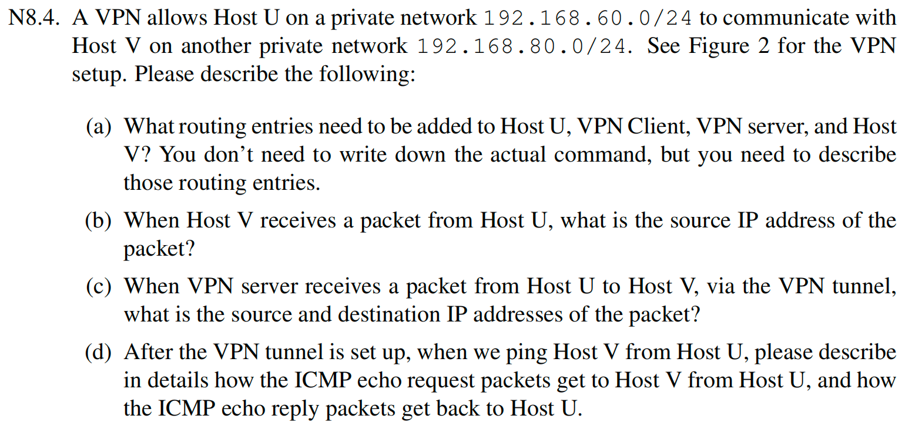

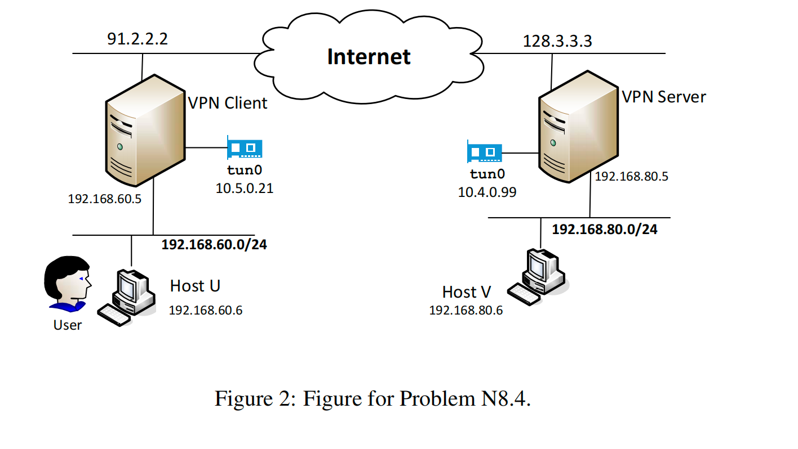

（a）对于主机 U，到 192.168.80.0/24 的流量，下一跳为 192.168.60.5

对于 VPN 客户端，到 192.168.80.0/24 的流量，走 tun0 接口

对于 VPN 服务端，到 192.168.60.0/24 的流量，走 tun0 接口

对于主机 V，到 192.168.60.0/24 的流量，下一跳为 192.168.80.5

（b）192.168.60.6

（c）源 IP 为 192.168.60.6，目标 IP 为 192.168.80.6

（d）

1. Host U 产生一个 ICMP echo request，源 192.168.60.6，目的 192.168.80.6。
2. Host U 查路由，发现 192.168.80.0/24 应交给 192.168.60.5，于是把包发给 VPN Client。
3. VPN Client 查路由，发现去 192.168.80.0/24 要走 tun0，于是把这个内层 IP 包交给 VPN 程序。
4. VPN 程序把该 IP 包加密/封装成外层隧道包，经互联网送到 VPN Server。
5. VPN Server 解封装，恢复出原始 IP 包（192.168.60.6 -> 192.168.80.6），然后根据本地直连路由从右侧网卡转发给 Host V。
6. Host V 收到 echo request，生成 echo reply：源 192.168.80.6，目的 192.168.60.6。
7. Host V 查路由，发现去 192.168.60.0/24 应交给 192.168.80.5，于是把回复发给 VPN Server。
8. VPN Server 查路由，发现去 192.168.60.0/24 要走 tun0，于是把 reply 封装后经隧道送回 VPN Client。
9. VPN Client 解封装后把内层 reply 发给 Host U。
10. Host U 收到 ICMP echo reply。

****

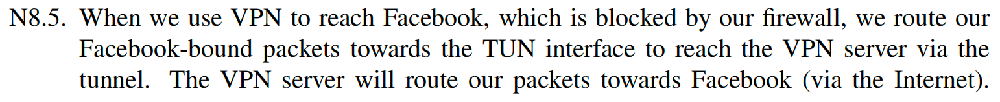

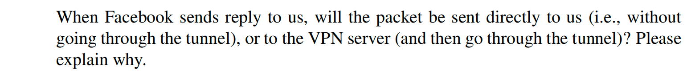

会先发给 VPN server，然后再通过隧道回到我们，而不是直接发给我们本机。因为当我们通过 VPN 访问 Facebook 时，Facebook 看到的源 IP 不是我们本地真实地址，而是 VPN server 出口地址。因此回复包会按正常互联网路由发往 VPN server，再由 VPN server 通过隧道送回客户端。

****

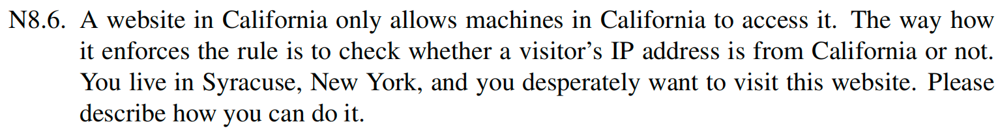

1. 先连接到加州地区的 VPN 服务器；
2. 再通过该 VPN 去访问目标网站；
3. 网站看到的源 IP 就是加州 VPN 服务器的 IP，因此会把我当成 California 访客。

****

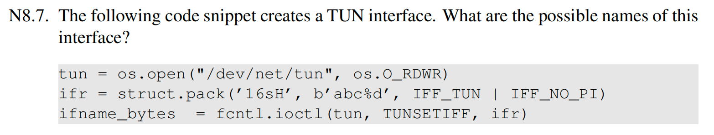

可能会是 abc0, abc1, ...

***

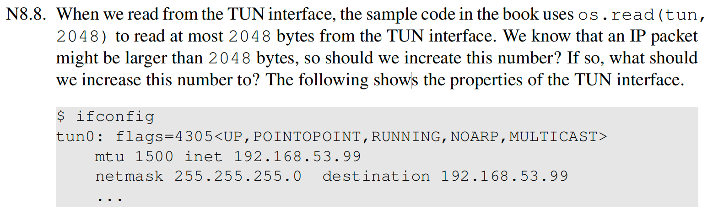

不需要，TUN 接口 MTU 是 1500。TUN 读出来的是三层 IP 包，单个包大小通常不会超过接口 MTU（加上少量头部也远小于 2048）。因此 2048 已经足够容纳一个完整的 IP 包。

****

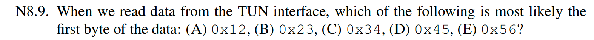

D.0x45，TUN 读到的是 IP 包。IPv4 首字节高 4 位是版本号 4，低 4 位是首部长度 5（表示 20 字节）

****

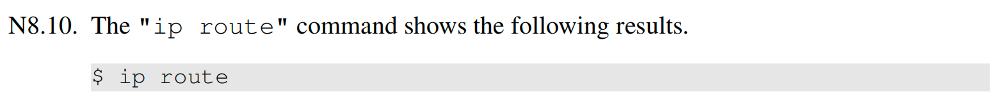

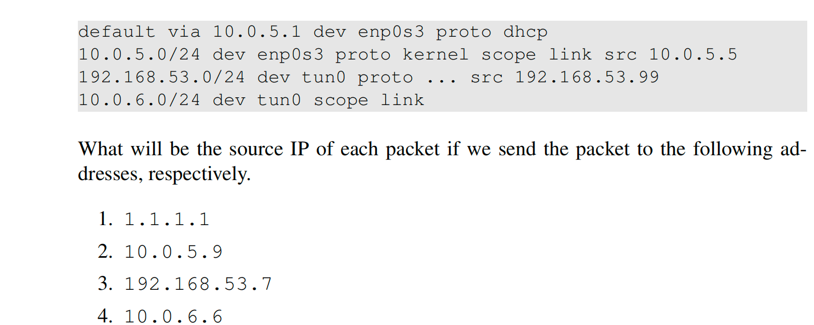

1. 10.0.5.5
2. 10.0.5.5
3. 192.168.53.99
4. 192.168.53.99

****

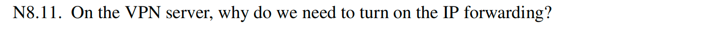

VPN server 还需要把一个接口收到的包转发到另一个接口：

- 从 tun0 收到来自客户端的内层包，再转发到内网或互联网；
- 从内网收到返回包，再转发到 tun0。

如果不开 IP forwarding，内核只会接收“发给自己”的包，不会做转发，VPN 就不能正常把客户端流量送到目标网络

****

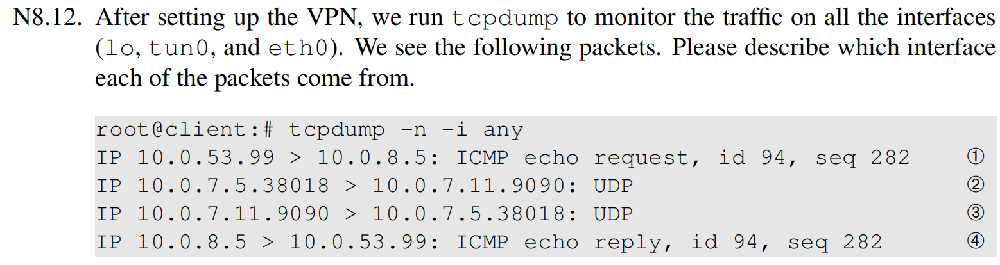

第一第四个数据包是来自 tun0 的，第二第三个数据包是来自 eth0 的

****

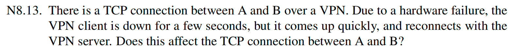

不会影响，只是会短暂地卡住，恢复后传输继续

****

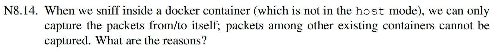

主要原因有两点：

1. 网络命名空间隔离：容器有自己的 network namespace，只能看到属于自己 namespace 的网络接口和流量。其他容器通常在别的 namespace 里。
2. 虚拟交换转发不经过该容器接口：其他容器之间的包通常在 Linux bridge / veth / 虚拟交换层被直接转发，不会经过当前容器自己的网卡接口，因此当前容器抓不到。

****

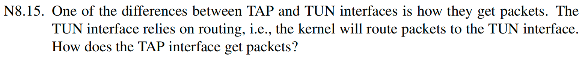

TAP 获取包的方式是：

- 内核把它当成一个二层接口接入 bridge/交换网络；
- 二层转发、ARP、MAC 学习等机制会把相应的以太帧送到 TAP。

****

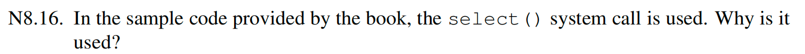

因为 VPN 程序通常同时要处理多个输入源，例如：

- TUN 接口
- UDP socket

select() 的作用是多路复用 I/O*，让程序在单线程里等待“哪个 fd 先有数据”，然后及时处理，而不是一直阻塞在某一个读操作上或者不断轮询浪费 CPU。因此它用于同时监听 TUN 和 socket，两边来数据都能及时转发。

****

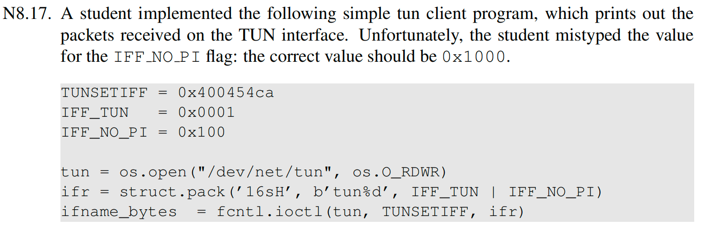

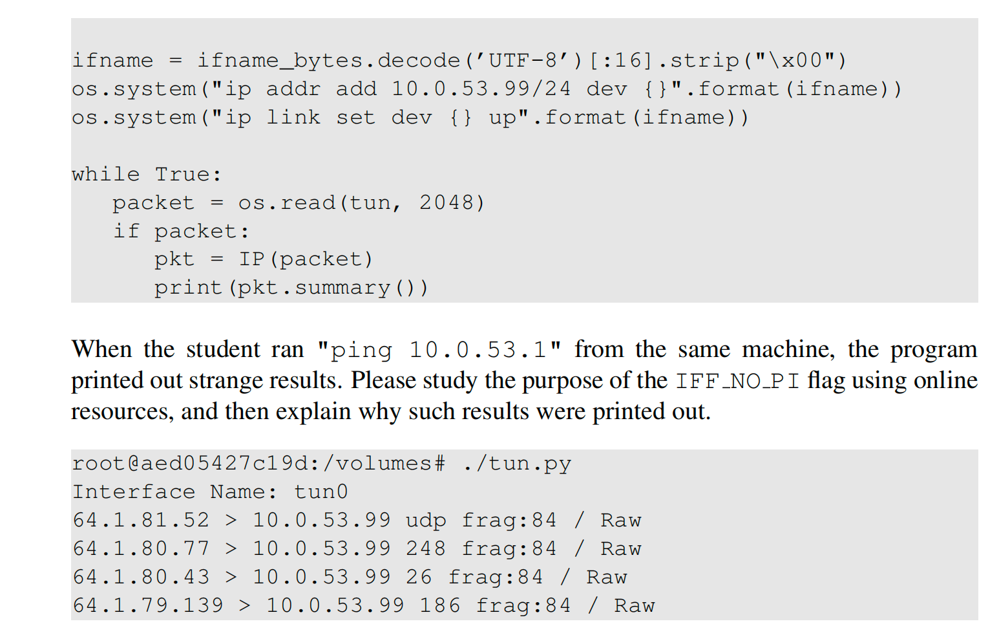

写错 IFF_NO_PI 会导致创建 TUN 时，实际上没有启用 IFF_NO_PI。于是从 TUN 读出的数据前面会多出一个 4 字节的 packet information (PI) 头，而不是直接以 IP 头开头。正常情况下，若启用 IFF_NO_PI，读到的数据应直接是 0x45 开始的 IPv4 包头但现在实际读到的是：先有 4 字节 PI 头，后面才是真正的 IP 包，把包含 PI 头的数据当成“从第 0 字节就开始的 IP 包”去解析。这样 Scapy 会把前 4 字节 PI 头误认成 IP 头的开头，于是版本号、源地址、协议字段等全部错位，最终就打印出那些莫名其妙的源 IP、分片信息和协议号。