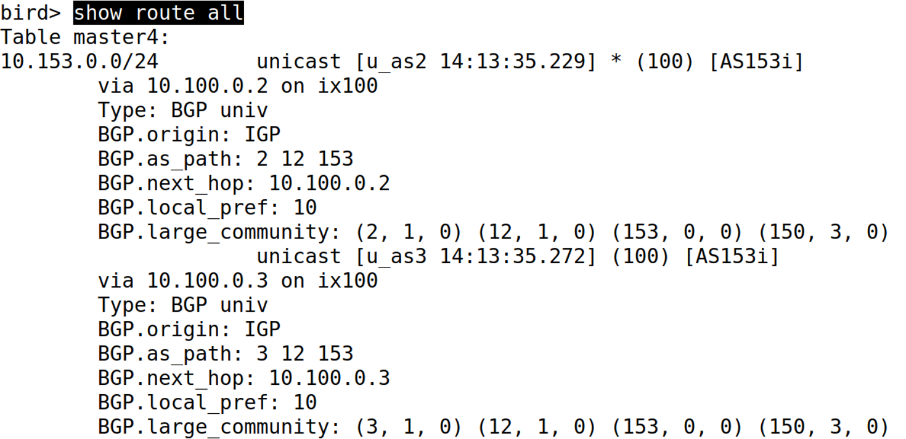

---
hide:
  #- navigation # 显示右
  #- toc #显示左
  - footer
  - feedback
# comments: true
---  

# BGP and Attacks

## 自治系统及自治系统号

自治系统（Autonomous System，简称 AS）一共有四个类别：

- 残桩自治系统（Stub AS）
	- 仅作为客户，不给其他人提供转送服务（可以理解为拓扑图转换成类似树的结构的叶节点）
	- 下面是 AS11872，Syracuse University 残桩自治系统的邻居（即相连自治系统）和拓扑图：
	
	
	
- 专送（过境）自治系统（Transit AS）
	- 为其他自治系统提供转送服务
	- 分为小型（Small）转送/过境自治系统和大型（Large）转送/过境自治系统
	- 下面是 AS3754，Nysernet 小型转送自治系统和 AS174，Cogent 大型转送自治系统的示意图：
	
	
	
	
	
- 互联网交换中心（Internet Exchange/Internet Exchange Point，简称 IX/IXP）

一般情况下，每个自治系统都有自己的编号，我们称其为自治系统号（Autonomous System Number，简称 ASN），起初是以 16 位二进制存储的，后面（应该是装不下了）扩展到 32 位。

!!! tip "ASN 和 IP"

	=== "根据 ASN 找到 IP 前缀"
	
		使用命令行 `whois -h whois.radb.net -- '-i origin ASN'|grep route` 可以通过 ASN 查询到自治系统的 IP 前缀（即路由器信息）
		
		
	
	=== "根据 IP 地址找到 ASN"
	
		使用命令行 `whois -h whois.radb.net IP` 可以通过 IP 地址找到所属 AS 的相关信息
		
		

我们可以通过命令行 `mtr -zb host` 来查看从自己这台机器到 `host` 所经过的各个自治系统

!!! example "Example"

	杜老师在美国的家中使用命令行 `mtr -zb www.ustc.edu.cn` 连接到中科大网站所经过的自治系统如下所示：
	
	
	
	其中以第十行为分界，第 1-2 行是在杜老师家内部传递数据包，第 3-9 行经过了两个美国的自治系统（可以根据域名看出来层层从镇到市最后到纽约市），然后来到中国境内（chinaunicom 即为中国联通，可以看到从这开始需要的时间突然上升），12-17 行再经过两个自治系统来到中科大网站。
	
	出现 `???` 的情况是因为这是一个没有在 `mtr` 数据库的自治系统（在这个例子里面也是正常的，因为这是杜老师家的内网），第 10 行（`waiting for reply`）可能是因为那个自治系统做了一些安全措施使得无法访问。
	
	!!! tip "`mtr` 的机制"
	
		`mtr` 的机制其实在于一个叫 TTL（Time To Live）的字段，它规定了一个包最多能传输经过的节点个数，每经过一个节点 TTL 自减。
		
		当来到一个节点且 TTL 为 0 时，当前节点会给源主机发送回应报文，里面有当前节点的相关信息。主机不断发送 TTL 从 1 开始递增的数据包，并接收回应报文，整理就可以得到整条路径的相关信息。
***
## 对等关系与互联网交换中心

两个自治系统可以通过直接或间接（通过另一个自治系统，其实就是转送自治系统）的方式互联。对于直接连接的方式，即两个网络需要在物理意义上被连接，这被称为<font color="red">对等互连</font>，两个自治系统的关系被称为对等关系（Peer）。全球自治系统连接情况（即每个自治系统与哪些自治系统连接）可以参见 [https://stat.ripe.net/widget/asn-neighbours](https://stat.ripe.net/widget/asn-neighbours)

对等关系在现实中根据身份的不同还细分为多种，分别为：

- 普通对等关系（Peering，即直接互连）：两个 AS 之间协商仅在它们以及他们的客户 AS 之间交换流量，也就是相互通告相应的路由，以改善相互间的可达性以及健硕性，并减少向上游的转送成本（有点像并查集合并成一个大家庭了）。
- 上流供应商对等关系（Upstream Provider Peering，即上级运营商）：当前 AS 可能需要通过大型的 Transit AS 与其他 AS 得到交流，这中间的 Transit AS 可能会对当前 AS 收取一定的费用（比如在现实中的中国御三家联通移动和电信）
- 下流客户对等关系（Downstream Customers Peering，即下级客户）：当前 AS 也可能会作为其他 AS 的 Provider，那么那个 AS 即为当前 AS 的客户

!!! note "不同类对等关系的理解"

	
	
	上图展现了一个大致的对等关系图，对于 AS-150 来说（这里 Unfiltered Peers 是个仿真器当中的特例，在现实似乎没有对应的实际情况）：
	
	- 向 Provider 传递当前 AS 和 Customer 的信息
		- 从现实角度考虑，这是因为当前 AS 支付了费用所以 Provider 理应提供服务，而 Customer 也给当前 AS 支付了费用，所以间接当前 AS 得到的服务也应当与 Customer 共享
		- <font color="red">当前 AS 不需要向 Provider 传递自己的 Peer 的信息</font>，因为 Peer 如果需要 Provider 的服务应当自行支付费用而不是利用当前 AS，那样会破坏互惠互利的对等关系
		- <font color="red">当前 AS 不需要向 Provider 传递自己其他 Provider 的信息</font>，因为这会导致 Providers 反过来利用当前 AS 进行相互通信，这显然是不符合商业规定的
	- 向 Peer 传递当前 AS 和 Customer 的信息
		- 从现实角度考虑，这是因为当前 AS 和 Peer 进行对等的信息交换，所以 AS 自身需要传送给 Peer，而 AS 的 Customer 由于购买了服务所以也需要附带传送
		- <font color="red">当前 AS 不需要向 Peer 传递自己的 Provider 的信息</font>，一样地，如果这样 Peer 就可以利用 AS 不支付费用使用 Provider 的服务，这显然破坏了互惠互利的对等关系
		- <font color="red">当前 AS 不需要向 Peer 传递自己其他 Peer 的信息</font>，因为<font color="red">对待 Peer 的原则是只交换信息，不提供服务</font>，如果交换其他 Peer 的信息，那其他 Peer 又会反过来利用当前 AS 进行信息交换
	- 向下级 Customer 提供自己所知道的所有信息
		- 从现实角度考虑，毕竟 Customer 是支付了费用的，所以理应将所有信息告诉 Customer，让 Customer 能与所有有连接的 AS 进行联系
***
对等互连可以在数据中心（在此两个自治系统相互连接）秘密地完成，也可以在一个公共的地点（该地
点为自治系统提供对等互连的设施）进行对等互连。这种公开的场所称为互联网交换点（IXP）或互联
网交换中心（IX）。全球互联网交换中心地图可以参见 [http://www.datacentermap.com](http://www.datacentermap.com/)


***
从顶层模块来看，整个互联网其实就是不同的主机通过网络组成一个残桩自治系统，自治系统之间有以下几种对等互连联系方式：

- 每个自治系统的 BGP 路由器连接到互联网交换中心完成对等互连
- 在数据中心秘密完成对等互连；
- 当两个不同地理位置的自治系统很难找到一个共同位置进行对等互连时，通过转送自治系统连接到其他互联网交换中心，继而与其他自治系统完成对等互连

这便编织成了整个互联网。
***
## BGP 工作原理

> BGP 有两类，分别为外部 BGP（EBGP，External BGP，不同 AS 使用）和内部 BGP（IBGP，Internal BGP，同一 AS 使用）
***
### IP 前缀宣称

对于一个自治系统来说，它希望能和其他自治系统相互联系，就需要将自己到目标自治系统所要经过的所有自治系统的相关信息，组成一条路径（我们称之为自治系统路径，AS Path）传递给目标自治系统，这样目标自治系统才可以根据 AS Path 反向传输数据包来到我们这里。

!!! example "Example"

	下图展示了 AS150 向图中所有自治系统传递信息的过程：
	
	
	
	其中：
	
	- A,B,D 三者是通过直接互连的方式，所以首先 A 通过 ① 和 ② 分别向 D 和 B 发送自己的 IP 前缀信息，将自己的 ASN 放到 AS Path 当中（即下划线部分）并一起传送（即此时 B 和 D 可以通过直接 $AS150$ 到达 A）
	- 对于 D 来说，有一定可能到达 A 是通过 $D\rightarrow B\rightarrow A$ 的方式，因此 B 作为中间者通过 ③ 向 D 发送信息，将自己的 ASN 放到 AS Path 当中（即此时 D 可以通过 $AS151 \rightarrow AS150$ 的方式到达 A，也可以直接 $AS150$ 到达 A）；同样的，对于 B 来说，有一定可能到达 A 是通过 $B\rightarrow D\rightarrow A$ 的方式，因此 D 作为中间者通过 ④ 向 B 发送信息，将自己的 ASN 放到 AS Path 当中（即此时 B 可以通过 $AS11 \rightarrow AS150$ 的方式到达 A，也可以直接 $AS150$ 到达 A）
	- 对于 E,F 来说，它们和 D 处在同一个 AS 当中，自然和 D 共享同样的信息，D 通过 ⑤ 向 E 和 F 传输自己收到的相同信息（但是在这里 D 其实是收到了两条路径的，D 会<font color="red">根据相关指标判断该选择哪条路径更优，将最优路径发出，其他的路径作为备用</font>，关于如何通过指标判断后面会讲，这里我们默认 $AS150$ 是更优路径）
	- 对于 G 来说，由于它需要经过 F（即 $AS11$）才能到达 A，所以这里 F 通过 ⑥ 向 G 发送信息，将自己的 ASN 放到 AS Path 中
	- 对于 C 来说，由于它需要经过 E（即 $AS11$）才能到达 A，所以这里 E 通过 ⑦ 向 G 发送信息，将自己的 ASN 放到 AS Path 中
***
### BGP 会话

那么不同的 AS 之间到底是如何通过 BGP 互连的呢？我们需要在 AS 的 BGP 路由器进行相关配置。下面展示了一个 AS150 与 AS2 进行互连，在 AS150 的 BGP 路由器的配置文件：

```nginx title="config.conf"
protocol bgp u_as2{
	ipv4 {
		table t_bgp;
		import filter{
			... omitted ...
		};
		export where ... filter omitted ...
		next hop self;
	};
	local 10.100.0.150 as 150;
	neighbor 10.100.0.2 as 2;
}
```

 其中：
 
- `t_bgp` 这个 table 保存了 AS150 的内核路由表；
- `import` 和 `export` 表示从 AS150 的内核路由表导入和导出的相关操作，可以根据需要（比如 Customer 与 Provider 关系）设置过滤器，也可以直接 `import none` 和 `export all`；
- `next hop` 表示下一个跳转的 BGP 路由（有可能一个自治系统不止一个路由，这里设置成自己而已）
- `local` 表示将自己的 IP 地址设置成 AS150 本地；
- `neighbor` 表示将 AS2 的 IP 地址设置成 AS150 的邻居（即 AS150 可以连接到的 AS）
***
### BGP 更新信息

当一个 AS 的连接情况有所更改时，它的 BGP 也会有相关的更新（举个例子，可能不给某个 Provider 支付费用了，或者增加给某个 Customer 提供服务了），为了让全世界所有的 AS 都知道这个信息以便更新 AS Path，当前 AS 会发送出一个 BGP 的更新信息，里面包含了增添和收回路由的相关信息：


***
#### 路由通告

当我们需要加上一个新的路由（即建立一个新的 BGP 连接，这可能是又建立了个普通 Peer 关系，可能是向其他 Provider 支付了费用，还可能是 Customer 向当前 AS 支付了费用）时，我们需要更新 BGP 的相关信息，下图就展现了加入 AS164 后传递的更新数据包：


需要关注的是 `Path attributes` 部分，其中更新了 AS_PATH 以及对应的下一跳，将路径更改了过来，随后对 AS164 进行了连通性测试（NLRI），公布了 AS164 的 IP 前缀。
***
#### 路由收回

当我们断开一个 BGP 连接时（这可能是停止向 Provider 支付费用，也可能是停止普通 Peer 关系，还可能是终止向 Customer 提供服务），我们也需要更新 BGP 相关信息，下图展现了收回 AS164 后传递的更新数据包：


收回数据包相对简单一些，只需要宣告需要收回的路由前缀即可
***
### BGP 实现不同对等关系

对于不同的对等关系，在 BGP 当中会往一个自带的表格（这个表格保存了所有的 Peer 关系，我们称之为 BGP 团体，BGP Large Community）中添加属性，用一个三元组（每个均为 4 字节整数） 来表示。这个三元组称为 BGP 团体属性（BGP Large Community Attribute），其中三个整数分别为 `ASN:Function:Parameter` ，在 SEED 仿真器当中定义如下：


那么有了三元组的定义，我们就可以对不同的对等关系实现相关的过滤，使得对于不同的对等关系传输该传输的 BGP 信息。

!!! note "不同对等关系的信息过滤"

	=== "Provider"
	
		```nginx title="Provider.conf"
		protocol bgp u_as4{
			ipv4 {
				table t_bgp;
				import filter {
					bgp_large_community.add(PROVIDER_COMM);
					bgp_local_pref = 10;
					accept;
				};
				export where bgp_large_community ~ [LOCAL_COMM, CUSTOMER_COMM];
				next hop self;
			};
			local 10.102.0.11 as 11;
			neighbor 10.102.0.4 as 4;
		}
		```
		
		对于 Provider，就像之前我们说的那样，从 Provider 那导入提供的路由信息，并向 Provider 导出自己和自己的 Customer 的路由信息，实现一个双向互通。
	
	=== "Customer"
	
		```nginx title="Customer.conf"
		protocol bgp u_as4{
			ipv4 {
				table t_bgp;
				import filter {
					bgp_large_community.add(CUSTOMER_COMM);
					bgp_local_pref = 30;
					accept;
				};
				export all;
				next hop self;
			};
			local 10.102.0.11 as 11;
			neighbor 10.102.0.154 as 154;
		}
		```
		
		对于 Customer 来说，当前 AS 应当导入 Customer 的相关路由信息，并向 Customer 导出所有自己知道的路由信息，实现双向互通。
	
	=== "Peer"
	
		```nginx title="Peer.conf"
		protocol bgp p_as151 {
			ipv4 {
				table t_bgp;
				import filter {
					# Put the route in the PEER_COMM community
					bgp_large_community.add(PEER_COMM);
					...
				};
				# Only export the routes from the specified communities
				export where bgp_large_community ~ [LOCAL_COMM, CUSTOMER_COMM];
			};
			...
		}
		```
		
		对于 Peer 来说，当前 AS 需要导入 Peer 的路由信息，并向 Peer 导出自己和自己的 Customer 的信息。
***
### 路径选择

对于 SEED 仿真器来说，可以在某个 AS 的 BGP 路由容器中的 `bird` 交互中用命令行 `show route all` 可以查看当前路由连接的其他 AS 情况：


从上面可以看到，存在两条 AS_PATH 可以通向 AS153，我们可以通过 `ip route show 10.153.0.0/24` 来查看：


但是具体 BGP 为什么会选择 `10.102.0.2` 而不是 `10.102.0.11` 呢？对于路径选择来说，优先级依次从上到下为：

- 权重（这个在 SEED 仿真器并未体现）
- 本地偏好（即上面的 `local_pref`）
	- 这个由当前 AS 进行决定，从现实角度来说，一个 AS 会有一条主传输线和副传输线（以防止万一主传输线失效还能正常通信）
	- 举个例子来说，一个 AS 有两个 Provider，由于资金问题只能购买一个 Provider 的顶级套餐，另一个只能购买最低级的套餐，那当前 AS 肯定希望多使用性能更高的高级套餐 Provider 线路，将低级套餐 Provider 当作备用，那么当前 AS 会设置高级套餐的 Provider 线路的本地偏好值相对更高。
- 本地生成（在 SEED 仿真器并未体现）
- AS Path 长度
	- 这个非常好理解，相对来说更短的 AS Path 更好一些，但这并不代表着短的 AS Path 一定更好，有可能中途全是 Transit AS，费用会更高一些，这也是为什么 AS Path 长度优先级并没有那么高的原因。

!!! example "Example"

	对一台 `10.153.0.0/24` 进行 `show route all` 如下：
	
	
	
	此时，如果我们在 AS150 的 BGP 路由中查看，发现对于不同的目的地，AS2 是主要被选择的途径点：
	
	
	
	如果我们将 AS-3 的 Local Preference 提升到 15：
	
	
	
	再重新查看，会发现 AS3 成为了主要被选择的途径点：
	
	

从上面的例子我们能看到，对于一个 AS 来说它的 Local Preference 决定了它如何选择路由，但是这仅仅只是保证了包通过 AS 想要的路径传递出去，但是如何保证包也能大部分从想要的路径传回来呢（即如何让 AS 的 Peer 也去使用这条路径呢）？

在 BGP 当中有一个小技巧，因为 AS Path 传到每个 BGP 路由后都是可随意编辑的，我们通过在不想要的 AS Path 中添加多个自己，使得 AS Path 变得比较长，这样在路径选择时就不太可能选到我们不想要的路径，具体就是更改 Peer 关系的配置文件：


这样就使得 AS Path 变得更长了：


***
## BGP 劫持攻击

根据上述可以看到，在 Announce 过程中，网络的 IP 前缀是由 AS 自行设定的。BGP 劫持攻击正是利用了这点，因为 BGP 并没有一个能验证 IP 前缀属于谁的机制，所以攻击者可以用自己的 BGP 路由器宣称一个假的 IP 前缀，这样就导致会有一些数据包被误传到攻击者手中，从而造成劫持攻击。

BGP 的匹配机制采取“匹配更多位数优先”原则，举个例子：


这里有两个 BGP 路由，分别为 `10.164.0.0/25` 和 `10.164.0.0/24`，而对于一个 `10.164.0.71` 来说，两者理论上都是匹配的，但是 `10.164.0.0/25` 路由会被选择因为它有 25 位匹配而 `10.164.0.0/24` 只有 24 位匹配。

就因为这个特性，攻击者就可以借此发起攻击，通过宣称更多位数的路由使得数据包的路径选择朝攻击者想要的方向流动，从而劫持数据包，举个例子来说，如果我想劫持 `10.164.0.0/24`，根据上面的说法，仅凭 `10.164.0.0/25` 只能劫持一半的数据包（因为匹配关系，只能匹配 `10.164.0.0` 到 `10.164.0.127` 的数据包），所以我们在多加一个宣称 `10.164.0.128/25` 即可匹配剩下 `10.164.0.128` 到 `10.164.0.255` 的数据包，从而劫持所有与 `10.164.0.0/24` 通信的数据包。


在 AS150（即攻击者）的 BGP 路由中，我们设置如下：

```nginx title="Attacker.conf"
protocol static hijacks {
	ipv4 { table t_bgp; };
	route 10.164.0.0/25 blackhole {
		bgp_large_community.add(LOCAL_COMM);
	};
	route 10.164.0.128/25 blackhole {
		bgp_large_community.add(LOCAL_COMM);
	};
}
```

当然，这样的攻击其实也有主动解决方法（Fight Back！），既然 Attacker 比我多宣称一位，那作为 Victim 我再多宣称一位就能把数据包给抢回来了，具体来说如下：


配置文件如下：

```nginx title="Victim.conf"
protocol static {
	ipv4 { table t_bgp; };
	route 10.164.0.0/26 via "net0" {
		bgp_large_community.add(LOCAL_COMM);
	};
	route 10.164.0.64/26 via "net0" {
		bgp_large_community.add(LOCAL_COMM);
	};
	route 10.164.0.128/26 via "net0" {
		bgp_large_community.add(LOCAL_COMM);
	};
	route 10.164.0.192/26 via "net0" {
		bgp_large_community.add(LOCAL_COMM);
	};
}
```

??? question "思考"

	或许有人会问，那我直接把所有的 IP 都宣称个遍，不给 Victim 反击的余地，攻击不就能成功了吗？这样想固然有道理，但是从现实角度来说，不仅一下子搞出 255 个 IP 很麻烦，而且大量的 IP 前缀涌入整个网络系统当中，这也无疑增加了传输的负担，也可能导致攻击的数据包传输速度减慢。
	
	也正因为如此，通过抢位数来回击的方法也只是临时性恢复的一种做法，能让 Victim 在发现时不依赖上层供应商主动解决问题，但是到最后查明原因后还是需要靠上层供应商通过一定的过滤条件来解决这类问题，假设 AS2 是 AS150（Attacker） 的上层供应商，它可以改动配置文件如下：
	
	```nginx title="Provider.conf"
	protocol bgp c_as150 {
		ipv4 {
			table t_bgp;
			import filter {
				bgp_large_community.add(CUSTOMER_COMM);
				bgp_local_pref = 30;
				if (net != 10.150.0.0/24) then reject;
				accept;
			}
		}
	}
	```
	
	通过添加过滤条件强制将 AS150 的 IP 前缀限定死，那就算 AS150 怎么宣称都无法抢夺数据包，从而解决了这次攻击。

!!! example "现实案例"

	2008 年 2 月 24 日，巴基斯坦的通讯公司为了建立自己的防火墙，将 YouTube 的网站隔离在外，却误宣称自己的 IP 前缀，导致反过来劫持了 YouTube 的部分数据包：
	
	
	
	其实，在 20:07（UTC）时 YouTube 方还宣称错了 IP 前缀导致没反击成功，20:18（UTC）宣称的才是正确的反击手段，而 21:01（UTC）则是上层供应商出手解决了这个问题。


