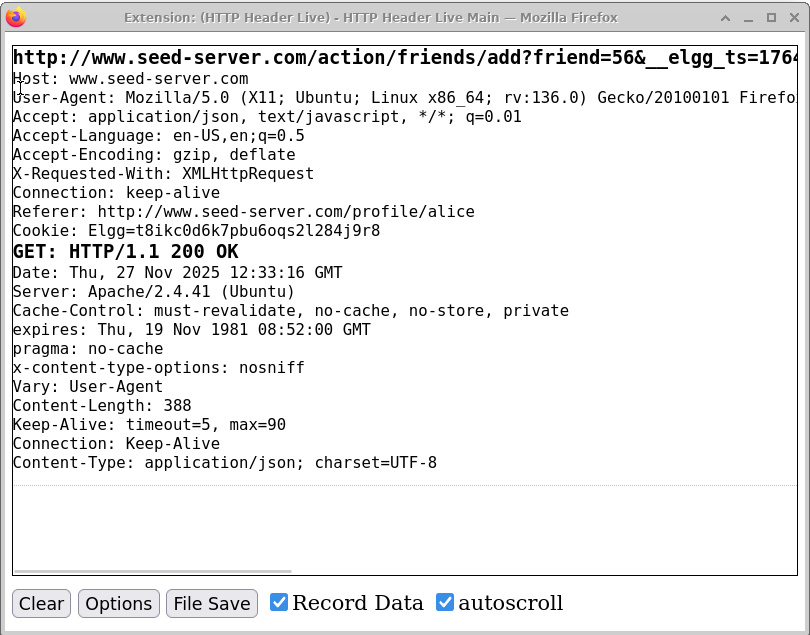
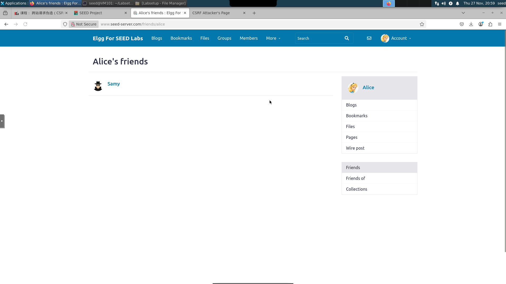
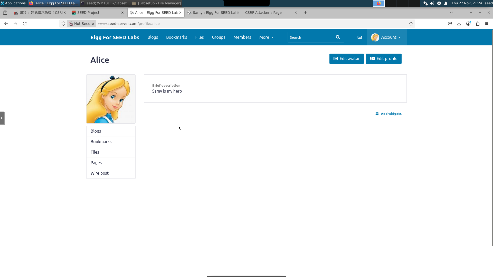
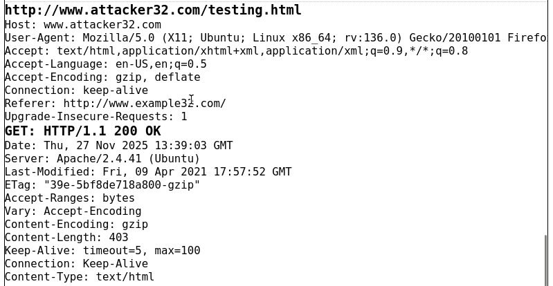
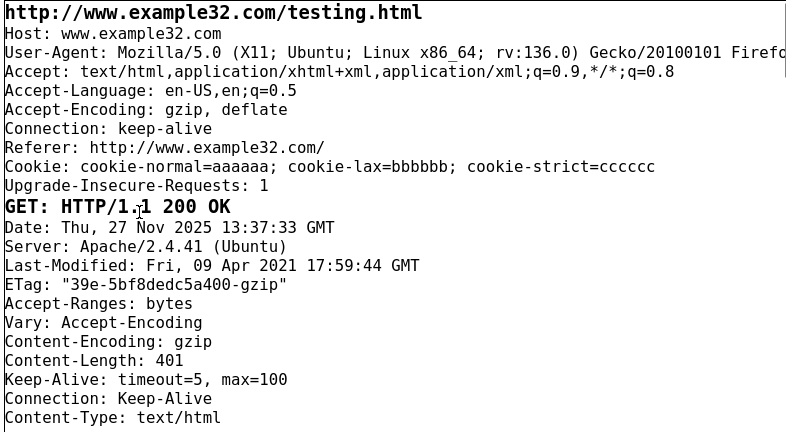
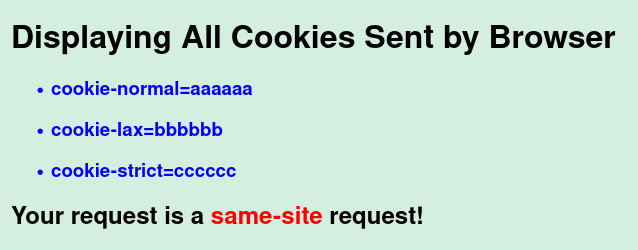

# CSRF Attack

## 任务 1：观察 HTTP 请求

启动容器后，打开 HTTP Header Live 插件，访问 www.seed-server.com，可以抓包：

***

## 任务 2：使用 GET 请求的 CSRF 攻击

首先用 HTTP Header Live 来查看添加好友的 URL：

直接在 Samy 的个人主页注入代码 ``，用 Alice 的账号直接访问 Samy 的个人主页，即可加上好友：

***

## 任务 3：使用 POST 请求的 CSRF 攻击

首先看一下修改 Profile 的数据包：

因此对照着我们修改 editprofile.html 如下：

并修改 Samy 的 Profile 为链接，Alice 点击链接就会变篡改个人主页：

- 问题 1：在 Member 页面查看源代码，发现所有用户的 guid 都显示在前端当中，即可获得 Alice 的 guid
- 问题 2：不可以，因为修改 Profile 是需要用户的 guid 的，因此不能针对所有人发起攻击

***

## 任务 4：启用 Elgg 的防护措施

注释掉 return 语句后，再次启动攻击，让 Alice 访问链接，并没有成功篡改 Alice 的个人主页：

由于验证 Cookie，因此我们没法改动 Alice 的 Profile

***

## 任务 5：实验同源 Cookie 方法

点击两个按钮，发现访问 attacker 无 cookie：

访问 example 有 cookie：

在 attacker 中发送 GET 请求，得到：

发送 POST 请求，得到：

在 example 中发送 GET 请求，得到：

发送 POST 请求，得到：

问题：

- 可以看到，对于同站请求，有 Cookie-strict，而跨站请求没有。在 Cookie 发送的时候，由于 Cookie 写入的域名与请求的接口域名不一致，或者 token 不一致，被浏览器判定为跨域，所以不发送 Cookie
- 服务器收到对方发送的 Cookie，和自己的 Cookie 进行对比，如果不一样的话被服务器判定为跨域
- 在同站请求当中使用 Cookie-strict，完全禁止第三方 Cookie，在跨站请求的情况下不发送 Cookie
