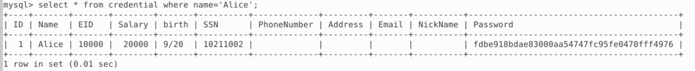
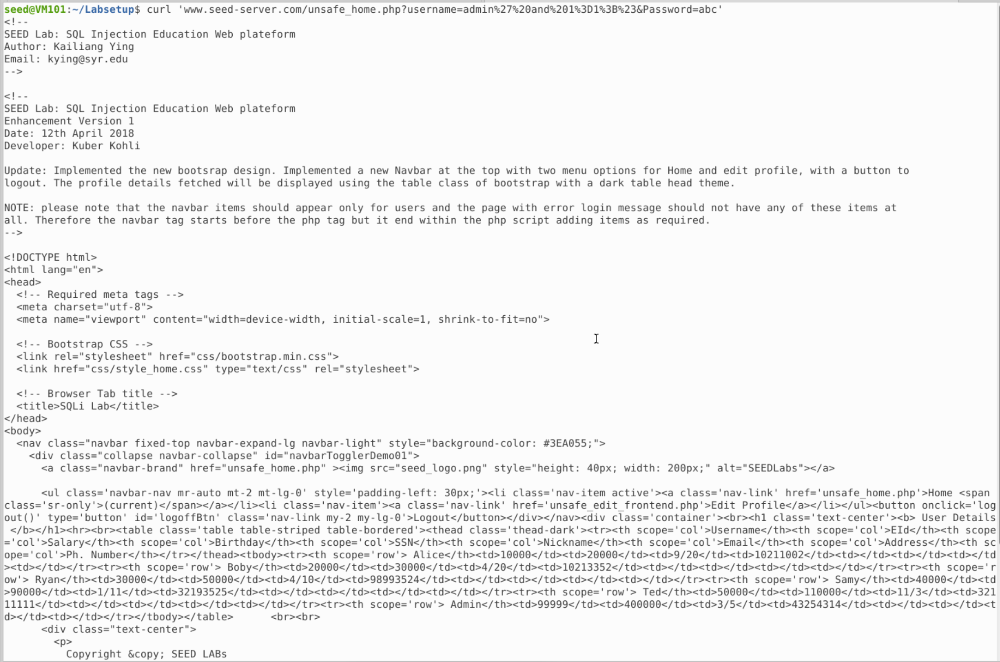
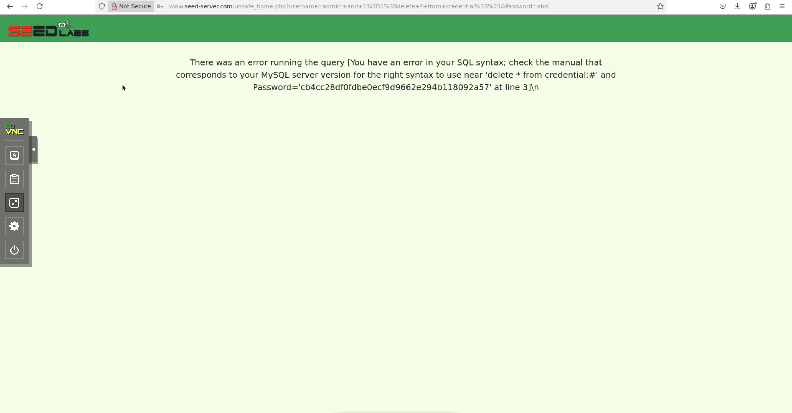
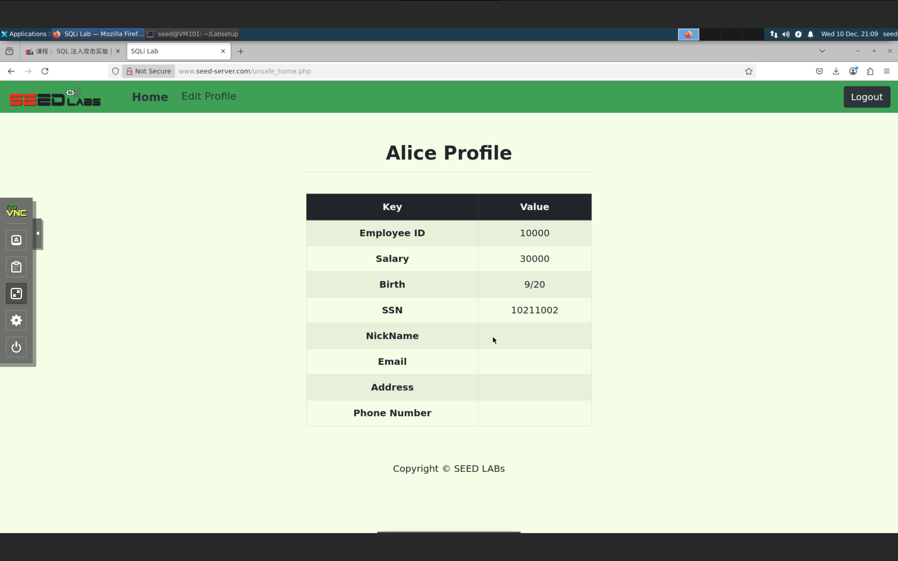
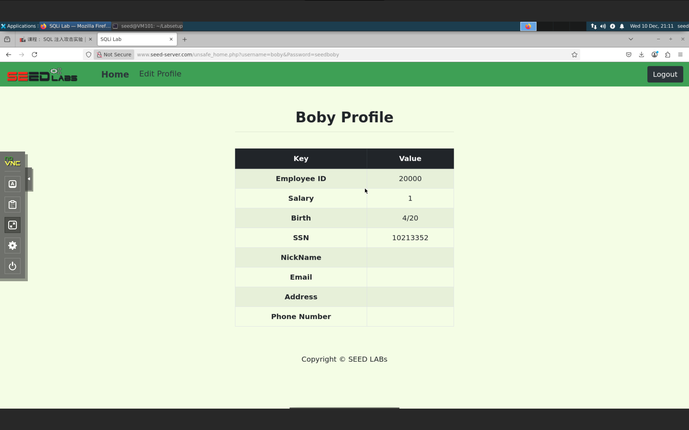
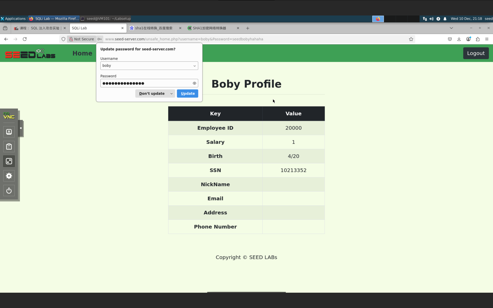
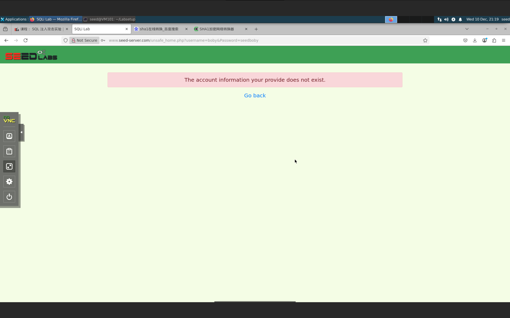

# SQL Injection Attack

## 任务 1：熟悉 SQL 语句

登录 mysql，使用语句 `use sqllab_users;` 来更换数据库，使用语句 `select * from credential where name='Alice'` 可以得到 Alice 用户的所有信息：

***

## 任务 2.1：网页上的 SQL 注入攻击

注入 `admin' and 1=1;#` 即可得到所有用户信息：

***

## 任务 2.2：从命令行进行 SQL 注入攻击

使用与任务 2.1 一样的做法，将空格编码为 `%20`，单引号编码为 `%27`，等号编码为 `%3D`，分号编码为 `%3B`，井号编码为 `%23`即可获得相同页面的 HTML 代码：

***

## 任务 2.3：附加一个新的 SQL 语句

注入语句 `admin' and 1=1;delete * from credential;#` 发现失败：

这是因为代码中使用的是  PHP 中 mysqli 扩展的 `query()` 函数，它禁止执行多条语句，如果需要使用的话需要使用 `multi_query() `函数

***

## 任务 3.1：修改自己的工资

登录 Alice 账号：

在编辑中注入 `',salary=30000 where id=1;#` 即可：

***

## 任务 3.2：修改其他人的工资

同理，注入 `',salary=1 where id=2;#` 即可：

***

## 任务 3.3：修改其他人的密码

我们希望修改密码为 `seedbobyhahaha`，先使用 SHA1 转换成哈希：

 

随后同理注入即可，能用新密码登录：

旧密码不生效了：

***

## 任务 4：防范措施

修改 unsafe.php 如下：

可以看到，注入失败了：

