# VPN Tunnel

## 任务 1：设置网络

`dcbuild` 和 `dcup` 启动容器，并在路由器上运行 tcpdump，测试实验环境：

1. 客户端可以与 VPN 服务器通信：

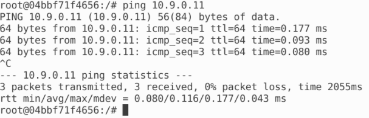

路由器 eth0 接口上能捕捉到包：

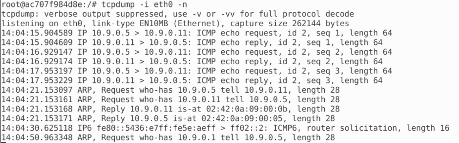

2. VPN 服务器能和内网主机通信：

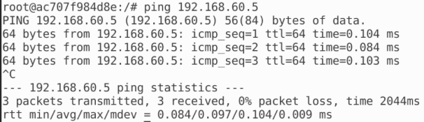

路由器 eth1 接口上能捕捉到包：

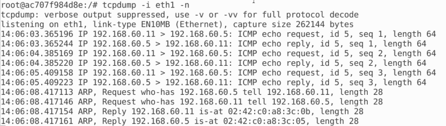

3. 客户端不能与内网主机通信：

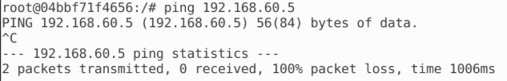

***

## 任务 2：创建和配置 TUN 接口

### 任务 2.A：接口名称

修改 tun.py 如下：

```python
#!/usr/bin/env python3

import fcntl
import struct
import os
import time
from scapy.all import *

TUNSETIFF = 0x400454ca
IFF_TUN   = 0x0001
IFF_TAP   = 0x0002
IFF_NO_PI = 0x1000

# Create the tun interface
tun = os.open("/dev/net/tun", os.O_RDWR)
ifr = struct.pack('16sH', b'Jin%d', IFF_TUN | IFF_NO_PI)
ifname_bytes  = fcntl.ioctl(tun, TUNSETIFF, ifr)

# Get the interface name
ifname = ifname_bytes.decode('UTF-8')[:16].strip("\x00")
print("Interface Name: {}".format(ifname))

while True:
   time.sleep(10)
```


运行得到新接口 Jin0：


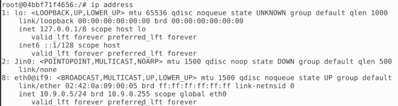

****

### 任务 2.B：设置 TUN 接口

在代码中添加代码：

```python
os.system("ip addr add 192.168.53.99/24 dev {}".format(ifname))
os.system("ip link set dev {} up".format(ifname))
```

重新运行代码，`ip address` 得到：

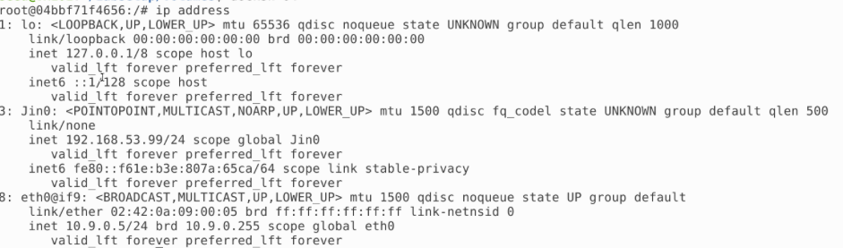

可以看到接口已经启动了

***

### 任务 2.C：从 TUN 接口读取数据包

修改代码程序，将 While 循环改为：

```python
while True:
    # Get a packet from the tun interface
    packet = os.read(tun, 2048)
    if packet:
        ip = IP(packet)
        print(ip.summary())
```

再次运行，从客户端 `ping 192.168.53.1`，可以得到：

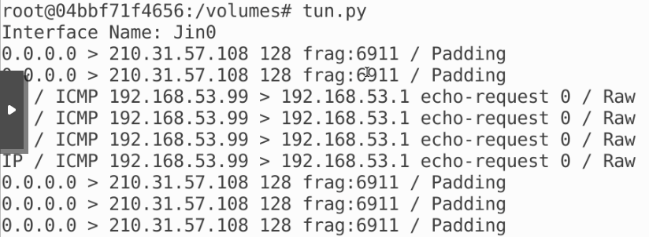

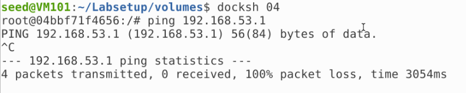

可以看到 tun 接口收到了数据包，说明数据包是从 tun 接口发出去的，但是没有回应，因为主机不存在，如果我们 `ping 192.168.60.1`，可以得到：

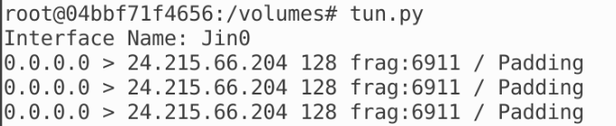

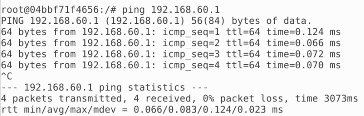

发现能连接，但是 tun 接口没有收到数据包，说明数据包不是从 tun 接口出去的

****

### 任务 2.D：将数据包写入 TUN 接口

修改程序：

```python
#!/usr/bin/env python3

import fcntl
import struct
import os
import time
from scapy.all import *

TUNSETIFF = 0x400454ca
IFF_TUN   = 0x0001
IFF_TAP   = 0x0002
IFF_NO_PI = 0x1000

# Create the tun interface
tun = os.open("/dev/net/tun", os.O_RDWR)
ifr = struct.pack('16sH', b'Jin%d', IFF_TUN | IFF_NO_PI)
ifname_bytes  = fcntl.ioctl(tun, TUNSETIFF, ifr)

# Get the interface name
ifname = ifname_bytes.decode('UTF-8')[:16].strip("\x00")
print("Interface Name: {}".format(ifname))

os.system("ip addr add 192.168.53.99/24 dev {}".format(ifname))
os.system("ip link set dev {} up".format(ifname))

while True:
    # Get a packet from the tun interface
    packet = os.read(tun, 2048)
    if packet:
        ip = IP(packet)
        print(ip.summary())
        
        if ICMP in ip:
            newip = IP(src=ip[IP].dst, dst=ip[IP].src, ihl=ip[IP].ihl)
            newip.ttl = 99
            newicmp = ICMP(type=0, id=ip[ICMP].id, seq=ip[ICMP].seq)
            if ip.haslayer(Raw):
                data = ip[Raw].load
                newpkt = newip/newicmp/data
            else:
                newpkt = newip/newicmp

            os.write(tun, bytes(newpkt))
```

重新 `ping 192.168.53.1`，可以得到：

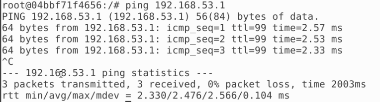

发现成功发送 ICMP echo reply，再次修改，不构造 IP 包，直接写入数据：

```python
#!/usr/bin/env python3

import fcntl
import struct
import os
import time
from scapy.all import *

TUNSETIFF = 0x400454ca
IFF_TUN   = 0x0001
IFF_TAP   = 0x0002
IFF_NO_PI = 0x1000

# Create the tun interface
tun = os.open("/dev/net/tun", os.O_RDWR)
ifr = struct.pack('16sH', b'Jin%d', IFF_TUN | IFF_NO_PI)
ifname_bytes  = fcntl.ioctl(tun, TUNSETIFF, ifr)

# Get the interface name
ifname = ifname_bytes.decode('UTF-8')[:16].strip("\x00")
print("Interface Name: {}".format(ifname))

os.system("ip addr add 192.168.53.99/24 dev {}".format(ifname))
os.system("ip link set dev {} up".format(ifname))

while True:
    # Get a packet from the tun interface
    packet = os.read(tun, 2048)
    if packet:
        ip = IP(packet)
        print(ip.summary())
        
        if ICMP in ip:
            os.write(tun, bytes("Hello,world!", encoding='utf-8'))
```

运行，再次 `ping 192.168.53.1`，得到：

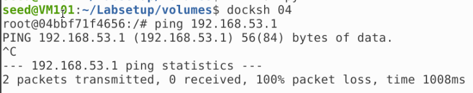

说明 TUN 接口并没有返回正确的内容

****

## 任务 3：通过隧道将 IP 数据包发送到 VPN 服务器

编写 tun_server.py：

```python
#!/usr/bin/env python3

from scapy.all import *

IP_A = "0.0.0.0"
PORT = 9090

sock = socket.socket(socket.AF_INET, socket.SOCK_DGRAM)
sock.bind((IP_A, PORT))

while True:
  	data, (ip, port) = sock.recvfrom(2048)
    print("{}:{} --> {}:{}".format(ip, port, IP_A, PORT))
    pkt = IP(data)
    print("   Inside: {} --> {}".format(pkt.src, pkt.dst))
```

修改 tun.py 为 tun_client.py：

```python
#!/usr/bin/env python3

import fcntl
import struct
import os
import time
from scapy.all import *

sock = socket.socket(socket.AF_INET,socket.SOCK_DGRAM)
SERVER_IP, SERVER_PORT = '10.9.0.11', 9090

TUNSETIFF = 0x400454ca
IFF_TUN   = 0x0001
IFF_TAP   = 0x0002
IFF_NO_PI = 0x1000

# Create the tun interface
tun = os.open("/dev/net/tun", os.O_RDWR)
ifr = struct.pack('16sH', b'Jin%d', IFF_TUN | IFF_NO_PI)
ifname_bytes  = fcntl.ioctl(tun, TUNSETIFF, ifr)

# Get the interface name
ifname = ifname_bytes.decode('UTF-8')[:16].strip("\x00")

os.system("ip addr add 192.168.53.99/24 dev {}".format(ifname))
os.system("ip link set dev {} up".format(ifname))
os.system("ip route add 192.168.60.0/24 dev {}".format(ifname))

while True:
    # Get a packet from the tun interface
    packet = os.read(tun, 2048)
    if packet:
        # Send the packet via the tunnel
        sock.sendto(packet, (SERVER_IP, SERVER_PORT))
```

运行，首先 `ping 192.168.53.1`，得到：

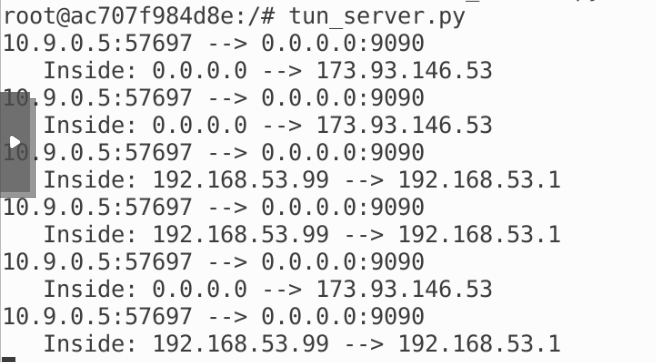

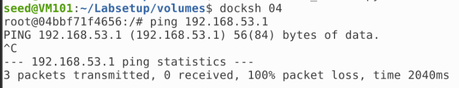

再 `ping 192.168.60.5` 得到：

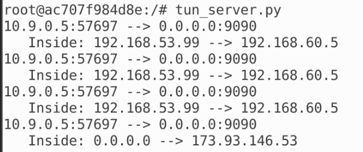

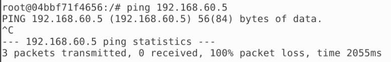

可以看到 VPN Server 成功接收到数据包并准备转发

****

## 任务 4：设置 VPN 服务器

修改 tun_server.py：

```python
#!/usr/bin/env python3

import fcntl
import struct
import os
import time
from scapy.all import *

TUNSETIFF = 0x400454ca
IFF_TUN   = 0x0001
IFF_TAP   = 0x0002
IFF_NO_PI = 0x1000

# Create the tun interface
tun = os.open("/dev/net/tun", os.O_RDWR)
ifr = struct.pack('16sH', b'Jin%d', IFF_TUN | IFF_NO_PI)
ifname_bytes  = fcntl.ioctl(tun, TUNSETIFF, ifr)

# Get the interface name
ifname = ifname_bytes.decode('UTF-8')[:16].strip("\x00")

os.system("ip addr add 192.168.53.11/24 dev {}".format(ifname))
os.system("ip link set dev {} up".format(ifname))

IP_A = "0.0.0.0"
PORT = 9090

sock = socket.socket(socket.AF_INET, socket.SOCK_DGRAM)
sock.bind((IP_A, PORT))

while True:
    data, (ip, port) = sock.recvfrom(2048)
    print("{}:{} --> {}:{}".format(ip, port, IP_A, PORT))
    pkt = IP(data)
    print(" Inside: {} --> {}".format(pkt.src, pkt.dst))
    
    os.write(tun, bytes(pkt))
```

再次尝试，在内网主机的 eth0 接口可以嗅探到：

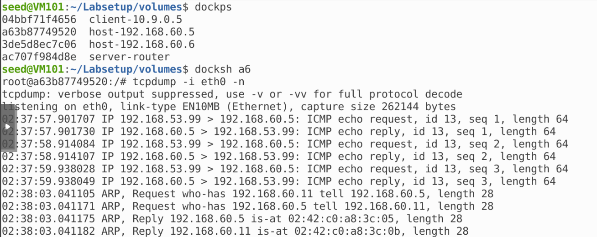

说明数据包被成功转发到内网主机，且内网主机有回复，只是 VPN Server 没有把它转发回去

***

## 任务 5：处理双向流量

修改 tun_server.py：

```python
#!/usr/bin/env python3

import fcntl
import struct
import os
import time
from scapy.all import *

TUNSETIFF = 0x400454ca
IFF_TUN   = 0x0001
IFF_TAP   = 0x0002
IFF_NO_PI = 0x1000

# Create the tun interface
tun = os.open("/dev/net/tun", os.O_RDWR)
ifr = struct.pack('16sH', b'Jin%d', IFF_TUN | IFF_NO_PI)
ifname_bytes  = fcntl.ioctl(tun, TUNSETIFF, ifr)

# Get the interface name
ifname = ifname_bytes.decode('UTF-8')[:16].strip("\x00")

os.system("ip addr add 192.168.53.11/24 dev {}".format(ifname))
os.system("ip link set dev {} up".format(ifname))

IP_A = "0.0.0.0"
PORT = 9090

SERVER_IP, SERVER_PORT = '10.9.0.5', 9090

sock = socket.socket(socket.AF_INET, socket.SOCK_DGRAM)
sock.bind((IP_A, PORT))

while True:
    # this will block until at least one interface is ready
    ready, _, _ = select.select([sock, tun], [], [])
    
    for fd in ready:
        if fd is sock:
            data, (SERVER_IP, SERVER_PORT) = sock.recvfrom(2048)
            pkt = IP(data)
            print("From socket <==: {} --> {}".format(pkt.src, pkt.dst))
            os.write(tun, bytes(pkt))
        if fd is tun:
            packet = os.read(tun, 2048)
            pkt = IP(packet)
            print("From tun ==>: {} --> {}".format(pkt.src, pkt.dst))
            sock.sendto(packet, (SERVER_IP, SERVER_PORT))
```

修改 tun_client.py：

```python
#!/usr/bin/env python3

import fcntl
import struct
import os
import time
from scapy.all import *

sock = socket.socket(socket.AF_INET,socket.SOCK_DGRAM)
SERVER_IP, SERVER_PORT = '10.9.0.11', 9090

TUNSETIFF = 0x400454ca
IFF_TUN   = 0x0001
IFF_TAP   = 0x0002
IFF_NO_PI = 0x1000

# Create the tun interface
tun = os.open("/dev/net/tun", os.O_RDWR)
ifr = struct.pack('16sH', b'Jin%d', IFF_TUN | IFF_NO_PI)
ifname_bytes  = fcntl.ioctl(tun, TUNSETIFF, ifr)

# Get the interface name
ifname = ifname_bytes.decode('UTF-8')[:16].strip("\x00")

os.system("ip addr add 192.168.53.99/24 dev {}".format(ifname))
os.system("ip link set dev {} up".format(ifname))
os.system("ip route add 192.168.60.0/24 dev {}".format(ifname))

while True:
    # this will block until at least one interface is ready
    ready, _, _ = select.select([sock, tun], [], [])
    
    for fd in ready:
        if fd is sock:
            data, (SERVER_IP, SERVER_PORT) = sock.recvfrom(2048)
            pkt = IP(data)
            print("From socket <==: {} --> {}".format(pkt.src, pkt.dst))
            os.write(tun, bytes(pkt))
        if fd is tun:
            packet = os.read(tun, 2048)
            pkt = IP(packet)
            print("From tun ==>: {} --> {}".format(pkt.src, pkt.dst))
            sock.sendto(packet, (SERVER_IP, SERVER_PORT))
```

再次运行，重新尝试，可以看到：

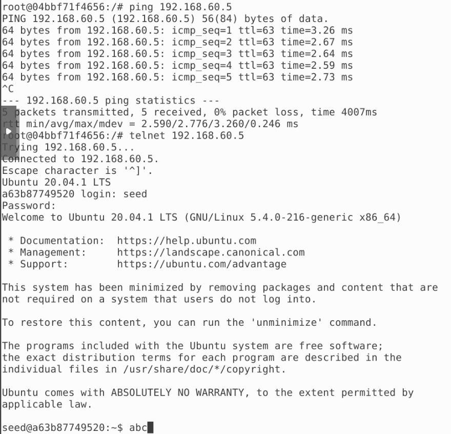

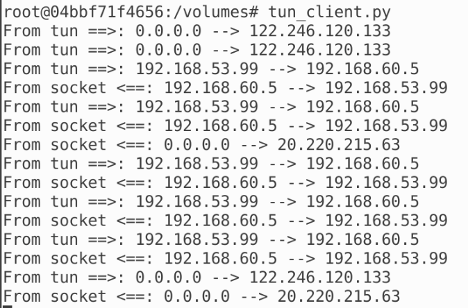

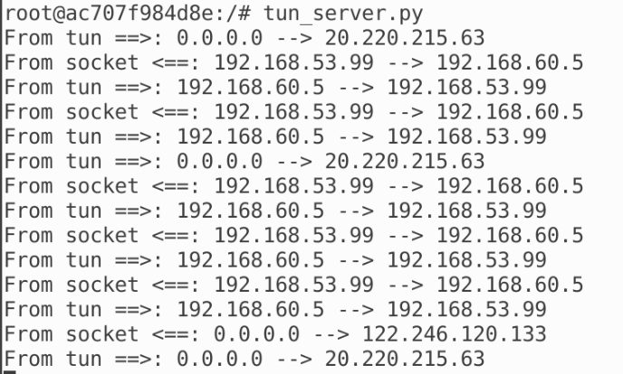

可以看到双向流量建立成功，ping 的大致流程为：

- 客户端发送 ping 请求给 VPN 服务器
- VPN 服务器发送 ping 请求给内网主机
- 内网主机回复 VPN 服务器的 ping 请求
-  VPN 服务器将回复发回给客户端

这四个过程都是通过 tun 传输的。

****

## 任务 6：隧道中断实验

重启 telnet，并中断 tun_server.py，可以看到我们无法输入，再重新打开 tun_server.py，刚刚输入的东西出现了，且又可以输入了：

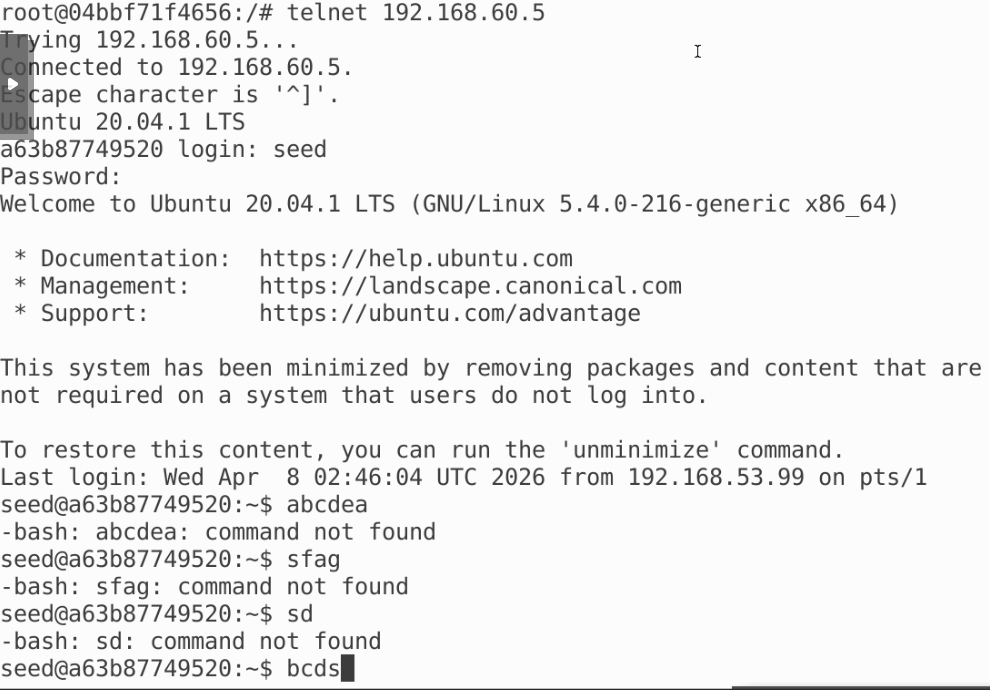

这是由于使用的是 TCP 协议，连接断掉了，但输入并发送的东西还都在缓冲区。再次建立连接后，缓冲区内的内容被发送。

****

## 任务 7：主机 V 上的路由实验

查看内网主机的路由表：

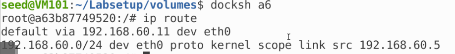

删除默认，采用 `ip route add 192.168.53.0/24 via 192.168.60.11`：

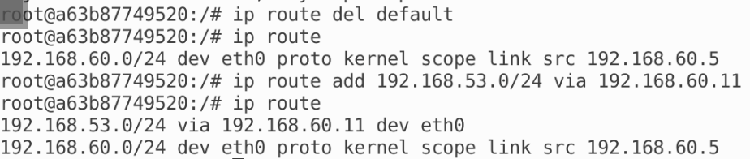

再次实验：

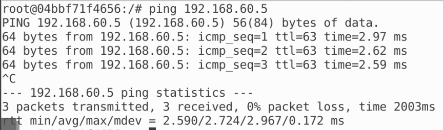

双向流量仍然成功

****

## 任务 8：专用网络之间的 VPN

重新启动网络，修改 tun_server.py：

```python
#!/usr/bin/env python3

import fcntl
import struct
import os
import time
from scapy.all import *

TUNSETIFF = 0x400454ca
IFF_TUN   = 0x0001
IFF_TAP   = 0x0002
IFF_NO_PI = 0x1000

# Create the tun interface
tun = os.open("/dev/net/tun", os.O_RDWR)
ifr = struct.pack('16sH', b'Jin%d', IFF_TUN | IFF_NO_PI)
ifname_bytes  = fcntl.ioctl(tun, TUNSETIFF, ifr)

# Get the interface name
ifname = ifname_bytes.decode('UTF-8')[:16].strip("\x00")

os.system("ip addr add 192.168.53.11/24 dev {}".format(ifname))
os.system("ip link set dev {} up".format(ifname))
os.system("ip route add 192.168.50.0/24 dev {}".format(ifname))

IP_A = "0.0.0.0"
PORT = 9090

SERVER_IP, SERVER_PORT = '10.9.0.5', 9090

sock = socket.socket(socket.AF_INET, socket.SOCK_DGRAM)
sock.bind((IP_A, PORT))

while True:
    # this will block until at least one interface is ready
    ready, _, _ = select.select([sock, tun], [], [])
    
    for fd in ready:
        if fd is sock:
            data, (SERVER_IP, SERVER_PORT) = sock.recvfrom(2048)
            pkt = IP(data)
            print("From socket <==: {} --> {}".format(pkt.src, pkt.dst))
            os.write(tun, bytes(pkt))
        if fd is tun:
            packet = os.read(tun, 2048)
            pkt = IP(packet)
            print("From tun ==>: {} --> {}".format(pkt.src, pkt.dst))
            sock.sendto(packet, (SERVER_IP, SERVER_PORT))
```

重新运行 server 和 client，并在内网 Host U ping 另一个内网 Host V，可以看到：

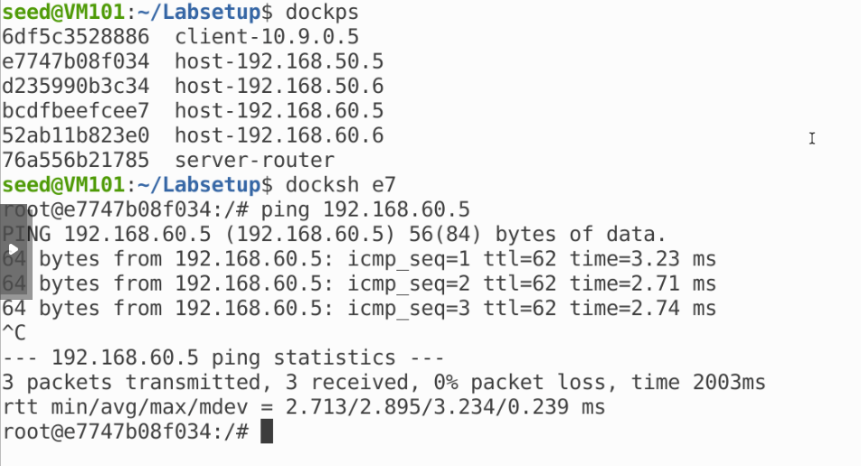

Client 和 server 显示：

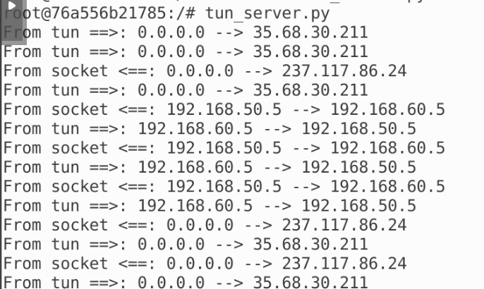

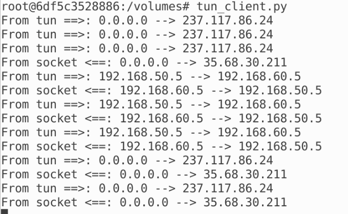

说明流量确实走的隧道，实验成功

****

## 任务 9：用 TAP 接口实验

编写 tap.py：

```python
#!/usr/bin/env python3

import fcntl
import struct
import os
import time
from scapy.all import *

TUNSETIFF = 0x400454ca
IFF_TUN   = 0x0001
IFF_TAP   = 0x0002
IFF_NO_PI = 0x1000

# Create the tun interface
tap = os.open("/dev/net/tun", os.O_RDWR)
ifr = struct.pack('16sH', b'Jin%d', IFF_TAP | IFF_NO_PI)
ifname_bytes  = fcntl.ioctl(tap, TUNSETIFF, ifr)

# Get the interface name
ifname = ifname_bytes.decode('UTF-8')[:16].strip("\x00")
print("Interface Name: {}".format(ifname))

os.system("ip addr add 192.168.53.99/24 dev {}".format(ifname))
os.system("ip link set dev {} up".format(ifname))

# generate a corresponding ARP reply and write it to the TAP interface.
while True:
    packet = os.read(tap, 2048)
    if packet:
        print("-------------------------------")
        ether = Ether(packet)
        print(ether.summary())
        
        # Send a spoofed ARP response
        FAKE_MAC = "aa:bb:cc:dd:ee:ff"
        if ARP in ether and ether[ARP].op == 1:
            arp = ether[ARP]
            newether = Ether(dst=ether.src, src=FAKE_MAC)
            newarp = ARP(psrc=arp.pdst, hwsrc=FAKE_MAC, pdst=arp.psrc,hwdst=ether.src, op=2)
            newpkt = newether/newarp
            
            print("***** Fake response: {}".format(newpkt.summary()))
            os.write(tap, bytes(newpkt))
```

运行并尝试 arping：

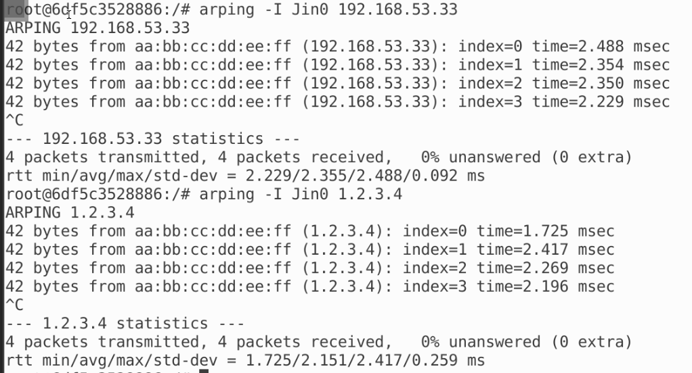

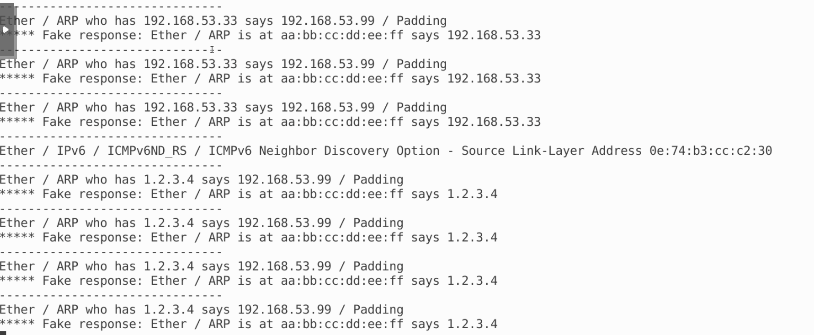

可以看到均收到回复
