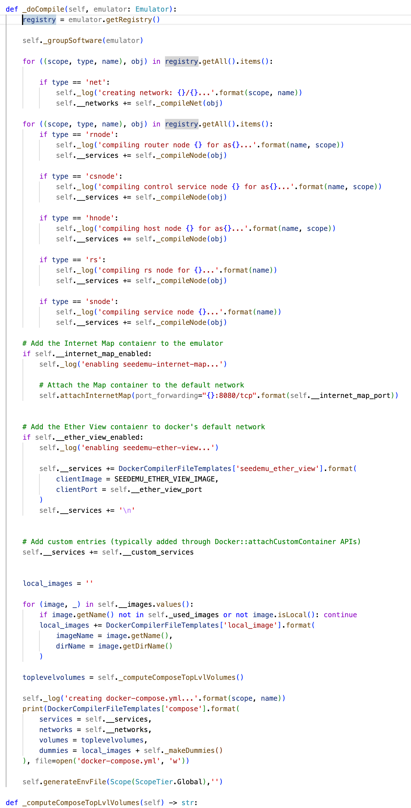

# 大规模仿真方案

## 自动化方案

在 Proxmox 主机中编译生成各个 output ，VM 需要的脚本（net.sh）以及对应的总控脚本（distribute.py, execute.py, build_net.py）

1. 运行脚本 distribute.py，通过 scp 将 net.sh 和 output 分发到各个 VM 上
2. 运行脚本 execute.py，通过 ssh 运行 VM 的 `docker compose build & up`
3. 运行脚本 build_net.py，通过 ssh 运行 net.sh，插卡到网络的 bridge（ix）上：
   1. `ip -br ad` 查看 bridge 网段对应的名字
   2. `sudo apt-get install -y vlan bridge-utils`
   3. `sudo ip link add link ens18 name ens18.{ixp} type vlan id {ixp}`
   4. `sudo ip link set dev ens18.{ixp} up`
   5. `sudo brctl addif br-xxx ens18.{ixp}`


***
## 相关笔记

主要修改 compiler（Docker.py），在 `emu.render()` 函数过后信息可以通过 Emulator-API 来找到，关注求解器需要的数据：

- IXP 号：通过函数 `base.getInternetExchangeIds()` 来实现
- AS 号：通过函数 `base.getAsns()` 来实现
- AS 消耗资源：自动统计，设定一些常数值（比如普通 host 为 1，普通 router 为 2，eth host 为 10），然后遍历 AS 中的所有节点自行计算
- 机器资源：用户提供
- 每一个 IX 的连接情况：这个似乎没有现有函数，编写起来容易（可以考虑添加 Emulator-API）

```python
ixp = base.getInternetExchange(100)
network = ixp.getNetwork()
for __node in network.getAssociations():
    if __node.getRole() == NodeRole.BorderRouter or __node.getRole() == NodeRole.Router:
        if __node.getAsn() != ixp.getId():
            print(__node.getAsn())
```

经过求解器算法过后，就可以得到一个分割方案，输出一个 json（在程序里面以字典返回），大体格式如下：

```json
{
  "0":[
    "AS": [150, 151, 152, 2, 3],
    "IXP": [(100, True), (101, False)]
  ],
  "1":[
  	...
  ]
	...
}
```

其中 IXP 以二元组的方式展现，第二个参数表示 IXP  在这个机器里面是否需要 Router Server

随后采用拆分 Registry 的方法，根据分割的结果从一个大的 Registry 中选取 AS、IXP、Net 等信息，拼接成一个个 Registry，Registry 有一个 API `get(scope, type, name)` 可以获取对象，还有 `getAll()` 获取 `Dict[Tuple[str, str, str], Registrable]`



